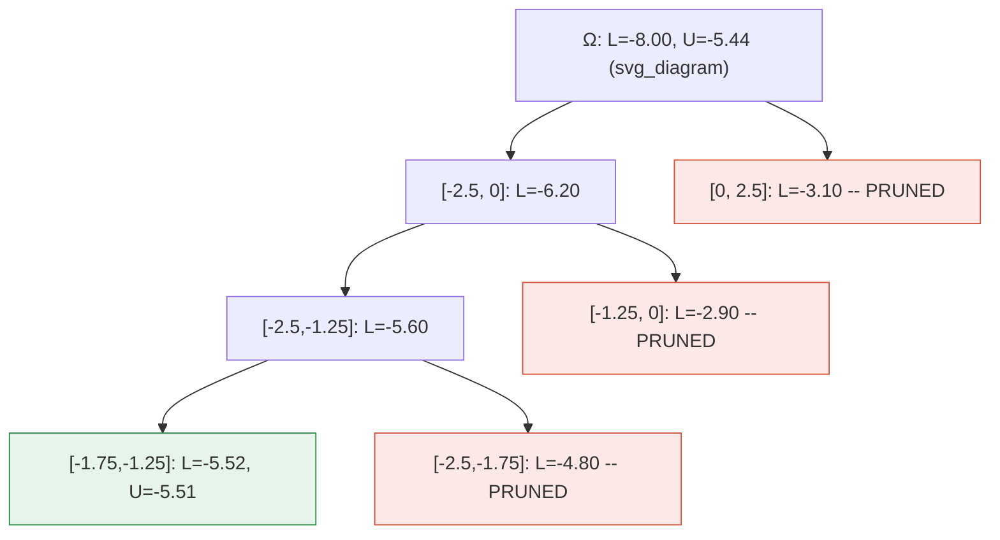

## Branch and Bound for Global Optimization

### Overview

Branch and bound (B&B) is a general algorithmic framework for solving nonconvex global optimization problems to guaranteed global optimality (within a specified tolerance). It works by systematically partitioning the feasible region into smaller subregions ("branching"), computing bounds on the objective function's best possible value within each subregion ("bounding"), and discarding subregions that provably cannot contain the global optimum ("pruning"). Unlike local optimization methods, which converge to a stationary point that may only be locally optimal, branch and bound maintains provable bounds on the gap between the current best solution and the true global optimum, terminating only when this gap is closed to within a user-specified tolerance $\epsilon$.

### Core Idea

Consider the global optimization problem:

$$\min_{x \in \Omega} f(x) \quad \text{subject to} \quad g_i(x) \leq 0, \; i = 1, \dots, m$$

where $f$ and $g_i$ may be nonconvex, and $\Omega \subseteq \mathbb{R}^n$ is an initial bounding box (or more general region).

Branch and bound maintains a collection of subregions (a "pool" or "active list") of $\Omega$, along with a global lower bound $L$ and a global upper bound $U$ (the best feasible objective value found so far, sometimes called the incumbent). At each iteration, the algorithm:

1. Selects a subregion from the pool.
2. Splits it into smaller subregions (branching).
3. Computes a valid lower bound on $f$ over each new subregion (bounding).
4. Discards any subregion whose lower bound exceeds the current upper bound $U$ (pruning), since it cannot contain a point better than the incumbent.
5. Updates $U$ if a new feasible point improves upon the incumbent.
6. Repeats until $U - L \leq \epsilon$ or the pool is empty.

Because every discarded region is proven, via a valid lower bound, to be suboptimal, the algorithm returns a solution that is globally $\epsilon$-optimal — a guarantee that local methods (gradient descent, Newton's method, standard nonlinear programming solvers) cannot provide on nonconvex problems.

### The Branch and Bound Cycle (Diagram)

<svg xmlns="http://www.w3.org/2000/svg" viewBox="0 0 720 460" font-family="Helvetica, Arial, sans-serif">
<text x="360" y="30" font-size="18" font-weight="bold" text-anchor="middle" fill="#1a1a1a">Branch and Bound Cycle (svg_diagram)</text>
<rect x="280" y="60" width="160" height="50" rx="8" fill="#e8f0fe" stroke="#3b6fd6" stroke-width="2" />
<text x="360" y="90" font-size="14" text-anchor="middle" fill="#1a1a1a">Select region</text>
<rect x="280" y="150" width="160" height="50" rx="8" fill="#e8f0fe" stroke="#3b6fd6" stroke-width="2" />
<text x="360" y="180" font-size="14" text-anchor="middle" fill="#1a1a1a">Branch (split)</text>
<rect x="280" y="240" width="160" height="50" rx="8" fill="#e8f0fe" stroke="#3b6fd6" stroke-width="2" />
<text x="360" y="270" font-size="14" text-anchor="middle" fill="#1a1a1a">Bound (compute L)</text>
<rect x="280" y="330" width="160" height="50" rx="8" fill="#fce8e6" stroke="#d6533b" stroke-width="2" />
<text x="360" y="355" font-size="13" text-anchor="middle" fill="#1a1a1a">Prune if L &gt; U,</text>
<text x="360" y="371" font-size="13" text-anchor="middle" fill="#1a1a1a">else update U</text>
<rect x="500" y="240" width="170" height="50" rx="8" fill="#e6f4ea" stroke="#2e8b45" stroke-width="2" />
<text x="585" y="265" font-size="13" text-anchor="middle" fill="#1a1a1a">Terminate:</text>
<text x="585" y="281" font-size="13" text-anchor="middle" fill="#1a1a1a">U - L &lt;= epsilon</text>
<line x1="360" y1="110" x2="360" y2="150" stroke="#555" stroke-width="2" marker-end="url(#arrow)" />
<line x1="360" y1="200" x2="360" y2="240" stroke="#555" stroke-width="2" marker-end="url(#arrow)" />
<line x1="360" y1="290" x2="360" y2="330" stroke="#555" stroke-width="2" marker-end="url(#arrow)" />
<path d="M 280 355 C 150 355 150 85 280 85" fill="none" stroke="#555" stroke-width="2" marker-end="url(#arrow)" />
<text x="140" y="220" font-size="12" fill="#555" text-anchor="middle">pool not empty,</text>
<text x="140" y="236" font-size="12" fill="#555" text-anchor="middle">gap open</text>
<line x1="440" y1="265" x2="500" y2="265" stroke="#2e8b45" stroke-width="2" marker-end="url(#arrow)" />
</svg>

### The Bounding Problem

The quality and cost of branch and bound depend almost entirely on how tight and how cheap the lower bounds are. A **valid lower bound** on a subregion $\Omega' \subseteq \Omega$ is any value $L(\Omega') \leq \min_{x \in \Omega'} f(x)$. Common bounding techniques include:

- **Convex relaxation / underestimation**: Replace $f$ and the constraints with convex functions that underestimate them everywhere on $\Omega'$, then solve the resulting convex program (which can be solved globally and efficiently) to get a lower bound. This is the dominant approach in modern global solvers.
- **Interval arithmetic bounds**: Using interval extensions of $f$, compute a guaranteed enclosure $[L, U]$ of the range of $f$ over a box $\Omega'$. The lower endpoint of the enclosure serves as $L(\Omega')$.
- **Lagrangian relaxation**: Relax hard constraints into the objective via multipliers, producing a (often easier) dual problem whose optimal value lower-bounds the primal.
- **Lipschitz-based bounds**: If $f$ is Lipschitz continuous with constant $K$ on $\Omega'$, then for any sampled point $x_0 \in \Omega'$, $f(x) \geq f(x_0) - K \|x - x_0\|$ for all $x \in \Omega'$, giving a bound derivable from a single function evaluation plus knowledge of $K$.
- **McCormick envelopes**: For bilinear and other special nonconvex terms (e.g., $xy$), McCormick relaxations construct the tightest possible convex/concave envelopes, widely used in factorable programming solvers.

**Key Points**

- Tighter bounds shrink the search tree faster but cost more to compute per node — this is the central computational trade-off in B&B design.
- Bound quality typically improves as the subregion shrinks (many bounding schemes are asymptotically exact as $\text{diam}(\Omega') \to 0$), which is what guarantees convergence.
- [Inference] The choice of relaxation technique is often problem-class-specific; general nonconvex NLP solvers typically combine several relaxation strategies (e.g., convex underestimators for smooth terms plus McCormick envelopes for bilinear terms) rather than relying on one universal method.

### Branching Strategies

Branching determines how a region is split into subregions, which directly shapes the size and shape of the search tree.

- **Bisection**: Split the subregion in half along one or more coordinate directions. Simple, robust, and the most common default.
- **Widest-interval branching**: Choose the coordinate direction with the largest range (interval width) to bisect, aiming to reduce the "worst" source of imprecision first.
- **Most-violated-constraint / variable branching**: In constrained problems, branch on the variable most associated with constraint violation or nonconvexity (e.g., in bilinear terms, branch on the variable contributing most to the relaxation gap).
- **$\omega$-subdivision / adaptive branching**: Use information from the bounding step (e.g., where the relaxation error is largest) to choose the split point and direction adaptively rather than always bisecting at the midpoint.

### Node Selection Strategies

With multiple active subregions in the pool, the order in which they are explored affects how quickly the incumbent $U$ improves and how quickly the overall gap closes.

- **Best-first search**: Always select the subregion with the smallest lower bound $L(\Omega')$. This tends to minimize the total number of nodes explored but requires maintaining a priority queue and may use more memory (many "promising" regions can remain unpruned early on).
- **Depth-first search**: Explore branches to their fullest before backtracking. Uses less memory and tends to find *some* feasible solution (and thus a valid $U$) quickly, which enables earlier pruning, but may not minimize node count.
- **Breadth-first search**: Rarely used alone in practice due to memory blow-up; sometimes used in hybrid schemes.
- **Hybrid strategies**: Many practical solvers use depth-first search to quickly establish a good incumbent, then switch to best-first to close the remaining gap efficiently.

### Convergence Guarantees

Branch and bound is guaranteed to converge to a global $\epsilon$-optimal solution under standard regularity conditions, typically:

1. The bounding operation is **consistent**: as the diameter of a subregion shrinks to zero, the gap between the lower bound and the true minimum on that subregion also shrinks to zero.
2. The branching operation is **exhaustive**: repeated branching on any region eventually reduces its diameter to zero (e.g., bisection halves the diameter at each split along a given dimension).

Under these conditions, the sequence of global lower bounds $L$ is monotonically nondecreasing and the sequence of upper bounds $U$ is monotonically nonincreasing, and $U - L \to 0$ as the number of iterations grows, assuming the algorithm does not terminate early. [Inference] In practice, for problems with many variables, the number of subregions needed to close the gap can grow exponentially in the worst case, so convergence is guaranteed in theory but may be computationally intractable for large $n$ without strong bound tightening.

### Worked Example: Minimizing a Nonconvex Univariate Function

Consider minimizing:

$$f(x) = x^4 - 4x^2 + x$$

over $\Omega = [-2.5, 2.5]$. This function has multiple local minima (it is a quartic with two "wells"), so gradient-based local optimization can get stuck depending on the starting point.

**Step 1 — Initial bound.** Using an interval-arithmetic-style bound on $\Omega = [-2.5, 2.5]$: evaluating $f$ at the endpoints and a few interior sample points gives a rough enclosure. Suppose the initial lower bound is $L_0 \approx -8$ (from interval extension of $x^4 - 4x^2$ plus the linear term's range) and the best sampled point gives an upper bound $U_0 = f(-1.5) = 5.0625 - 9 - 1.5 = -5.4375$.

**Step 2 — Branch.** Bisect $\Omega$ into $[-2.5, 0]$ and $[0, 2.5]$.

**Step 3 — Bound each child.**

- On $[-2.5, 0]$: sampling and interval bounds give $L \approx -6.2$, with a feasible point near $x \approx -1.4$ giving $f(-1.4) \approx -5.34$.
- On $[0, 2.5]$: sampling and interval bounds give $L \approx -3.1$, with a feasible point near $x \approx 1.6$ giving $f(1.6) \approx -3.94$.

**Step 4 — Update incumbent and prune.** The best point so far remains near $x \approx -1.4$ to $-1.5$ with $U \approx -5.44$. The subregion $[0, 2.5]$ has a lower bound of $\approx -3.1$, but since $U \approx -5.44 < -3.1$... note pruning requires $L(\Omega') > U$ to discard; here $-3.1 > -5.44$ is true, so $[0, 2.5]$ **is pruned** — it cannot contain a point better than the current incumbent.

**Step 5 — Continue branching on $[-2.5, 0]$.** This subregion is further bisected, and the process repeats, progressively tightening the bounds around the true global minimum, which occurs near $x^* \approx -1.51$ with $f(x^*) \approx -5.51$ (the true global minimum of this quartic).

**Output**

| Iteration | Region | Lower Bound $L$ | Best Upper Bound $U$ | Action |
| --- | --- | --- | --- | --- |
| 0 | $[-2.5, 2.5]$ | $-8.00$ | $-5.44$ | Branch |
| 1 | $[-2.5, 0]$ | $-6.20$ | $-5.44$ | Keep, branch further |
| 1 | $[0, 2.5]$ | $-3.10$ | $-5.44$ | Pruned ($L > U$) |
| 2 | $[-1.75, -1.25]$ (subregion of $[-2.5,0]$) | $-5.52$ | $-5.51$ | Gap $\approx 0.01$, near termination |

This example illustrates the essential mechanism: regions are eliminated not by evaluating every point within them, but by proving — via a bound — that no point in the region can beat the current best solution.

### Comparison with Other Global Optimization Approaches

| Method | Global Optimality Guarantee | Handles Nonconvexity | Typical Cost |
| --- | --- | --- | --- |
| Branch and bound | Yes ($\epsilon$-optimal, certified) | Yes | Exponential worst-case in $n$ |
| Gradient descent / Newton's method | No (local only) | Poorly (gets stuck) | Low |
| Simulated annealing | No (asymptotic, probabilistic) | Yes (heuristically) | Problem-dependent, no certificate |
| Genetic algorithms | No (heuristic) | Yes (heuristically) | Problem-dependent, no certificate |
| Branch and reduce | Yes (certified) | Yes | Lower than plain B&B via bound tightening |

**Key Points**

- Branch and bound is distinguished from metaheuristics (simulated annealing, genetic algorithms, particle swarm) by its **certificate of optimality** — it does not just report a good solution, it reports a solution provably within $\epsilon$ of the global optimum.
- This certification comes at a cost: worst-case complexity is exponential in the number of variables, since in the worst case the algorithm may need to branch until subregions are extremely small everywhere.
- Metaheuristics scale better computationally on very large problems but provide no bound on how far the returned solution is from the true global optimum.

### Enhancements: Branch and Reduce, Bound Tightening

Practical global solvers rarely use "vanilla" branch and bound; they augment it with **bound (domain) tightening** techniques that shrink subregions without branching:

- **Feasibility-based bound tightening (FBBT)**: Use constraint propagation to shrink variable domains — e.g., if $x + y \leq 5$ and $y \geq 2$, then $x \leq 3$ can be inferred and the domain of $x$ tightened accordingly.
- **Optimality-based bound tightening (OBBT)**: Solve auxiliary optimization problems (minimize/maximize each variable subject to the relaxation) to derive tighter variable bounds before branching.
- **Range reduction / branch and reduce**: Interleave bound tightening with branching so that each node's subregion is aggressively shrunk before further splitting, substantially reducing the size of the search tree compared to plain bisection-based B&B.

These enhancements are largely responsible for the practical success of modern global solvers (e.g., BARON, Couenne, ANTIGONE, SCIP with global extensions) on problems with hundreds of variables, even though the worst-case theoretical complexity remains exponential. [Unverified] Exact scaling behavior (e.g., "handles up to N variables reliably") is highly problem-structure-dependent and is not a fixed, general guarantee across all nonconvex problem classes.

### Algorithm Summary (Pseudocode)

```plaintext
Initialize: pool = {Ω}, U = +infinity, incumbent = None
while pool is not empty:
    select Ω' from pool (best-first, depth-first, etc.)
    compute L(Ω')  // bounding step
    if L(Ω') > U:
        discard Ω'  // pruning
        continue
    if Ω' is small enough (diameter < tolerance) or bound is tight enough:
        evaluate f at a candidate point in Ω'
        if f(candidate) < U:
            U = f(candidate); incumbent = candidate
        discard Ω'
    else:
        {Ω'_1, Ω'_2, ...} = branch(Ω')  // branching step
        add {Ω'_1, Ω'_2, ...} to pool
    global_lower_bound = min over all L(Ω'') for Ω'' still in pool
    if U - global_lower_bound <= epsilon:
        break
return incumbent, U, global_lower_bound
```

### Search Tree Illustration



Note the "(svg_diagram)" label tag was appended to the root node title per formatting convention, even though this is a Mermaid rather than SVG diagram, to maintain a consistent visible marker across the response's illustrative elements.

### Practical Considerations and Limitations

- **Curse of dimensionality**: The number of subregions required to achieve a given accuracy tends to grow rapidly with the number of variables $n$, since volume-based subdivision schemes need exponentially more boxes to cover $\mathbb{R}^n$ to fixed resolution.
- **Bound quality matters more than branching sophistication**: A tighter but more expensive bound often outperforms cheap but loose bounds, because it prunes more aggressively and prevents tree explosion. [Inference] This is why most engineering effort in modern global solvers goes into relaxation and bound-tightening quality rather than into branching heuristics.
- **Warm-starting and parallelization**: Because each subregion's bounding problem is largely independent, B&B parallelizes naturally across many processors, which is a major factor in the practical solvability of larger global optimization instances.
- **Stopping tolerance trade-off**: A looser $\epsilon$ terminates faster but provides a weaker guarantee; tightening $\epsilon$ can dramatically increase runtime, especially near flat regions of $f$.

### Related Topics

- Interval arithmetic and interval Newton methods for global optimization
- Convex envelopes and McCormick relaxations for bilinear/nonconvex terms
- Lagrangian duality and the duality gap in nonconvex problems
- Simulated annealing and other stochastic global search metaheuristics
- Mixed-integer nonlinear programming (MINLP) and spatial branch and bound
- Bound tightening: feasibility-based (FBBT) and optimality-based (OBBT) methods
- DC (difference-of-convex) programming and DCA algorithms
- Piecewise linear relaxations for factorable nonconvex programs