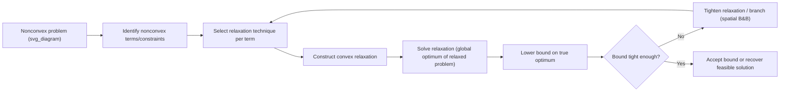

## Convex Relaxation Techniques

### Overview

Convex relaxation is the process of replacing a nonconvex optimization problem with a convex problem that approximates it, typically by enlarging the feasible region and/or replacing the objective with a convex underestimator (for minimization). The relaxed problem is easier to solve globally (convex problems have no spurious local optima), and its optimal value provides a valid bound on the original nonconvex problem's optimal value. Convex relaxations are the primary bounding mechanism inside branch and bound for global optimization, and they are also used standalone to obtain fast, cheap bounds or approximate solutions when exact global solving is intractable.

The central trade-off in relaxation design is **tightness versus cost**: a tighter relaxation gives a bound closer to the true optimum (reducing branching effort) but is usually more expensive to construct and solve.

### Why Relaxations Are Needed

For a nonconvex minimization problem

$$\min_{x \in \Omega} f(x) \quad \text{s.t.} \quad g_i(x) \le 0$$

if $f$ or any $g_i$ is nonconvex, the feasible region or objective epigraph is nonconvex, so local optimization methods (gradient descent, SQP, interior point) can converge to a local minimum that is not global. A convex relaxation

$$\min_{x \in \hat\Omega} \hat f(x) \quad \text{s.t.} \quad \hat g_i(x) \le 0$$

is constructed so that $\hat f(x) \le f(x)$ for all $x \in \Omega$ (an underestimator) and $\Omega \subseteq \hat\Omega$ (a relaxed/enlarged feasible set), guaranteeing

$$\min_{x \in \hat\Omega} \hat f(x) \le \min_{x \in \Omega} f(x)$$

This gives a valid lower bound usable for pruning in branch and bound, or as a standalone estimate of how far a heuristic solution might be from optimal.

### Taxonomy of Relaxation Techniques

#### Linear (LP) Relaxation

The simplest relaxation: replace nonconvex or integer constraints with linear ones.

- **Integer relaxation**: drop integrality constraints ($x \in \{0,1\} \to x \in [0,1]$), turning a MIP into an LP
- **Piecewise-linear underestimation**: approximate a nonconvex univariate function with a lower piecewise-linear envelope, introducing breakpoints
- Cheap to solve (LP is polynomial-time) but often loose for highly nonlinear terms

#### McCormick Envelopes (Bilinear Relaxation)

For a product term $w = xy$ with $x \in [x^L, x^U]$, $y \in [y^L, y^U]$, the convex hull of $\{(x,y,w) : w = xy\}$ over the box is exactly captured by four linear inequalities:

$$w \ge x^L y + x y^L - x^L y^L \quad \text{(underestimator 1)}$$

$$w \ge x^U y + x y^U - x^U y^U \quad \text{(underestimator 2)}$$

$$w \le x^U y + x y^L - x^U y^L \quad \text{(overestimator 1)}$$

$$w \le x^L y + x y^U - x^L y^U \quad \text{(overestimator 2)}$$

This is the **tightest possible linear relaxation** for an isolated bilinear term over a box — a key result underlying much of global optimization for bilinear and polynomial programs. McCormick relaxations extend recursively to multilinear and polynomial terms by introducing auxiliary variables for each product (a **factorable programming** approach).

#### $\alpha$BB (Convex Underestimation of General Nonconvex Functions)

For a general twice-differentiable nonconvex $f$ over a box $[x^L, x^U]$:

$$f^{\alpha BB}(x) = f(x) + \sum_{i=1}^n \alpha_i (x_i - x_i^L)(x_i^U - x_i)$$

Each added term is concave and vanishes at the box boundaries, so it "pulls down" $f$ enough to guarantee convexity while touching $f$ at the corners. The $\alpha_i$ are chosen from bounds on the Hessian's eigenvalues (e.g., via interval Hessian bounds or Gershgorin-circle estimates), using the smallest values that still guarantee $\nabla^2 f^{\alpha BB} \succeq 0$ everywhere in the box. Smaller $\alpha_i$ give tighter (better) underestimators.

#### Semidefinite Programming (SDP) Relaxations

For nonconvex **quadratically constrained quadratic programs (QCQPs)**, including quadratic terms $x^T A x$, the standard **lifting** technique introduces a matrix variable $X = xx^T$:

$$\min \; \text{tr}(A_0 X) + \dots \quad \text{s.t.} \quad \text{tr}(A_i X) + \dots \le 0, \quad X \succeq xx^T \text{ (relaxed to } X \succeq 0\text{)}$$

Dropping the exact rank-1 constraint $X = xx^T$ and keeping only $X \succeq xx^T$ (expressible as a linear matrix inequality via Schur complement) yields a convex SDP whose optimal value lower-bounds the original QCQP. This is the basis of the **Shor relaxation**. SDP relaxations are generally tighter than McCormick/LP relaxations for quadratic problems but more expensive to solve (polynomial but higher-order than LP).

**Semidefinite relaxation of binary quadratic problems** (e.g., Max-Cut) follows the same lifting idea and is well known for its provable approximation guarantees in specific cases [Inference: the strength of the guarantee, e.g., the Goemans–Williamson ratio for Max-Cut, is problem-specific and does not generalize automatically to arbitrary QCQPs].

#### Reformulation-Linearization Technique (RLT)

RLT systematically generates valid linear inequalities for polynomial programs by:

1. Multiplying pairs of existing constraints (or bound constraints $x_i^L \le x_i \le x_i^U$) together to produce valid nonlinear (typically quadratic) inequalities
2. Linearizing the resulting products by substituting a new variable for each nonlinear term (e.g., $w_{ij} = x_i x_j$)

The result is a linear program in the original and auxiliary variables whose feasible region contains the convex hull of the original nonconvex feasible set restricted to the relevant terms. RLT constraints are often combined with McCormick bounds on the same auxiliary variables to further tighten the relaxation.

#### Convex Envelope Construction (General)

For a function $f$ over a convex set $C$, the **convex envelope** $\text{vex}(f)$ is the tightest possible convex underestimator — the pointwise supremum of all convex functions majorized by $f$ on $C$:

$$\text{vex}(f)(x) = \sup \{ h(x) : h \text{ convex}, h \le f \text{ on } C \}$$

Closed-form convex envelopes are known for specific function classes:

- **Bilinear terms over boxes**: the McCormick envelope *is* the convex envelope
- **Concave functions over polytopes**: the convex envelope coincides with the (piecewise-)linear function matching $f$ at the polytope's vertices
- **Fractional terms $x/y$**: envelopes derived via variable substitution and known closed forms over boxes with $y$ bounded away from zero

For most general nonconvex functions, the exact convex envelope has no closed form, which is why $\alpha$BB (an easily computable but generally looser bound) is used as a practical substitute.

#### Lagrangian Relaxation and Duality-Based Bounds

Given

$$\min_x f(x) \quad \text{s.t.} \quad g(x) \le 0$$

the Lagrangian dual

$$\max_{\lambda \ge 0} \; \min_x \; f(x) + \lambda^T g(x)$$

is always a convex optimization problem in $\lambda$ (the dual function is concave, regardless of convexity of the primal), and its optimal value is a valid lower bound on the primal optimum (**weak duality**). This holds even when $f$ and $g$ are nonconvex, making Lagrangian relaxation broadly applicable, though the gap between the Lagrangian bound and the true optimum (the **duality gap**) can be strictly positive for nonconvex problems, unlike in the convex case where strong duality often holds under constraint qualifications.

### Worked Example: Relaxing a Nonconvex QCQP

Consider

$$\min \; x_1 x_2 \quad \text{s.t.} \quad x_1^2 + x_2^2 \le 4, \quad x_1, x_2 \in [-2, 2]$$

The objective $x_1 x_2$ is a bilinear (nonconvex, saddle-shaped) term.

**Step 1 — Introduce an auxiliary variable.** Let $w = x_1 x_2$, so the objective becomes $\min w$.

**Step 2 — Apply McCormick envelopes.** With $x_1, x_2 \in [-2, 2]$:

$$w \ge -2x_2 - 2x_1 - 4, \qquad w \ge 2x_2 + 2x_1 - 4$$

$$w \le 2x_2 - 2x_1 + 4, \qquad w \le -2x_2 + 2x_1 + 4$$

**Step 3 — Relax the quadratic constraint.** $x_1^2 + x_2^2 \le 4$ is already convex (a disk), so it needs no relaxation — it is kept as-is.

**Step 4 — Solve the relaxed problem.** The relaxed problem is now: minimize $w$ subject to the four linear McCormick inequalities and the convex quadratic constraint. This is a convex problem (linear objective, one convex quadratic constraint, linear constraints) solvable by any convex QCQP solver.

**Step 5 — Interpret the bound.** The relaxed optimum lower-bounds the true optimum of $\min x_1 x_2$ over the disk. [Inference: the exact numeric relaxed optimal value depends on solving the specific convex program; by symmetry and inspection, the true global optimum of the original problem here is $-2$ at $(x_1,x_2) = (\sqrt2,-\sqrt2)$ or $(-\sqrt2,\sqrt2)$, and the McCormick relaxation bound would be looser than $-2$ unless the box is tightened via branching.]

**Step 6 — Tighten via branching if needed.** If the gap between the relaxed bound and any known feasible solution is too large, spatial branch and bound would bisect the domain of $x_1$ or $x_2$, recomputing tighter McCormick envelopes on each half.

### Comparison of Relaxation Techniques

| Technique | Applies to | Tightness | Solve cost | Notes |
| --- | --- | --- | --- | --- |
| LP / integer relaxation | Linear + integer problems | Loose–moderate | Very low | Baseline for MIP |
| McCormick envelope | Bilinear terms | Tight (optimal for isolated bilinear term) | Low | Convex hull for single product over a box |
| $\alpha$BB | General nonconvex smooth $f$ | Moderate (depends on $\alpha$) | Low–moderate | Broadly applicable, less tight than problem-specific envelopes |
| RLT | Polynomial programs | Moderate–tight (improves with more products) | Moderate | Grows quickly with problem size |
| SDP (Shor) relaxation | Quadratic (QCQP) | Tight | Moderate–high | Polynomial-time but costlier than LP |
| Lagrangian relaxation | General constrained problems | Variable (can have nonzero duality gap) | Depends on dual subproblem | Always convex in the dual variables |
| Convex envelope (exact) | Special function classes | Tightest possible | Varies | Closed form only for specific structures |

### Tightening Strategies

- **Bound tightening (domain reduction)**: shrinking variable bounds $[x^L, x^U]$ before or during relaxation construction directly tightens McCormick and $\alpha$BB relaxations, since both depend explicitly on box width
- **Piecewise McCormick relaxation**: partition the domain of a bilinear term into subintervals and apply McCormick envelopes on each piece, refining the relaxation without full spatial branching
- **Combining relaxations**: using RLT constraints alongside McCormick bounds on the same auxiliary variables often yields a tighter combined polytope than either technique alone
- **Higher-order lifting**: for polynomial optimization, moving to higher levels of the **Lasserre/moment-SOS hierarchy** yields a sequence of increasingly tight SDP relaxations that converge to the true optimum in the limit, at increasing computational cost

### Practical Considerations

- **Automatic relaxation (factorable programming)**: solvers such as BARON and Couenne decompose a general nonconvex expression into a sequence of elementary operations (sums, products, univariate nonlinear functions) and apply the appropriate relaxation (McCormick, $\alpha$BB, or known envelope) to each elementary term automatically
- **Numerical conditioning**: relaxations built from loose bounds or badly scaled variables can produce numerically weak or ill-conditioned convex programs; scaling and bound tightening are usually applied as preprocessing
- **Relaxation is necessary but not sufficient for efficiency**: even a tight relaxation must be embedded in an effective branching/bounding search (as in branch and bound) to solve the original nonconvex problem to certified global optimality; relaxation alone only gives a bound, not a global solution, unless the relaxed solution happens to be feasible in the original problem

### Related Topics

- Branch and bound for global optimization (bounding step in depth)
- Reformulation-Linearization Technique (RLT) in depth
- Semidefinite programming and the Lasserre/moment-SOS hierarchy
- Lagrangian duality and strong duality conditions
- Factorable programming and automatic reformulation (BARON, Couenne, SCIP)
- Piecewise-linear and piecewise-McCormick relaxation refinement
- Convex envelopes of special function classes (fractional, trigonometric, exponential terms)
- Semidefinite relaxations for combinatorial optimization (Max-Cut, Goemans–Williamson)
- Duality gap analysis in nonconvex optimization
- Optimality-based bound tightening (OBBT)