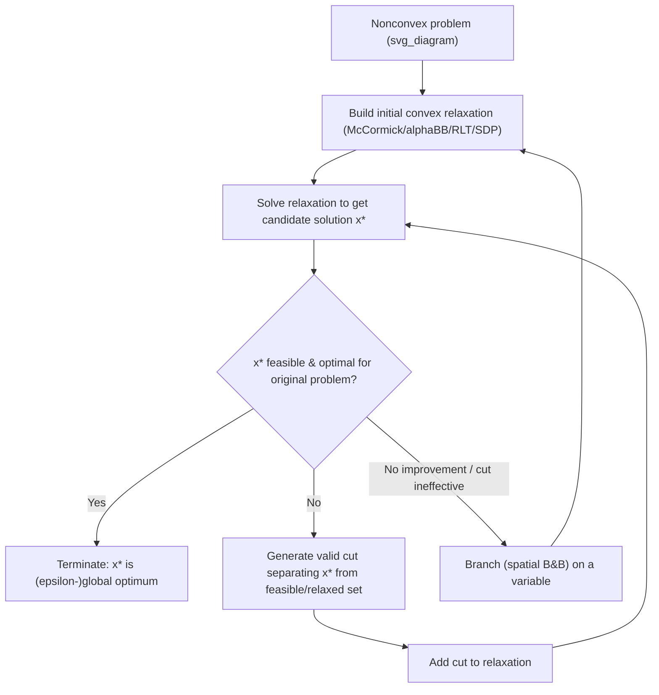

## Cutting Plane Methods for Nonconvex Problems

### Overview

Cutting plane methods solve optimization problems by iteratively refining a relaxation of the feasible region: starting from a tractable outer approximation (often a simple polytope or box), the algorithm solves the relaxation, checks whether the resulting solution is feasible/optimal for the original problem, and if not, adds a linear inequality ("cut") that excludes the infeasible point while retaining all truly feasible points. In convex optimization, cuts are well understood (e.g., Kelley's cutting plane method for convex NLP). In the **nonconvex** setting, cutting planes must be constructed more carefully, since a naive separating hyperplane may cut off part of the true feasible region or true global optimum if the underlying set is nonconvex — cuts must instead separate points from a *convex relaxation* (such as the convex hull) rather than from the nonconvex set directly.

### Role in Nonconvex/Global Optimization

Cutting planes rarely stand alone for nonconvex problems; they are almost always combined with branch and bound, forming **branch-and-cut**, or used to progressively tighten a convex relaxation before/during the search (this is sometimes called **branch-and-reduce** when combined with bound tightening). The purpose is the same as in convex integer programming: reduce the gap between the relaxation's optimal value and the true optimal value without resorting purely to exhaustive spatial branching, which suffers from the curse of dimensionality.

### Types of Cuts Used in Nonconvex Optimization

#### Outer Approximation Cuts

For a convex constraint $g(x) \le 0$ appearing within an otherwise nonconvex problem (e.g., MINLP with convex sub-structure), a **supporting hyperplane** at a point $\bar x$ where $g(\bar x) > 0$ is:

$$g(\bar x) + \nabla g(\bar x)^T (x - \bar x) \le 0$$

Because $g$ is convex, this hyperplane never cuts off any feasible point ($g(x) \le 0 \Rightarrow$ satisfies the inequality) but does exclude $\bar x$. This is the classical **outer approximation (OA)** method, valid whenever the relevant constraint is convex — it does not directly apply to nonconvex constraints without modification.

#### RLT (Reformulation-Linearization Technique) Cuts

As introduced in the relaxation context, RLT generates valid polynomial inequalities by multiplying existing bound/constraint pairs, then linearizes them via substitution. These are literally cutting planes for the lifted (auxiliary-variable) space: each new product-derived inequality is a linear cut in the space of original plus auxiliary variables, progressively tightening the LP relaxation of a polynomial program without branching.

#### McCormick-Based Tightening Cuts

Given the current bounds $[x^L, x^U]$, $[y^L, y^U]$ on variables in a bilinear term $w = xy$, the four McCormick inequalities themselves act as cuts relative to a naive box relaxation of $w \in [\min(\cdot), \max(\cdot)]$. **Piecewise McCormick** refines this further: partitioning $x$'s domain into segments and writing McCormick inequalities per segment (linked by binary/SOS2 selection variables) produces a tighter, piecewise-linear outer approximation — effectively a structured family of cuts.

#### Valid Inequalities from Convex Envelopes

When a closed-form convex envelope $\text{vex}(f)$ is known over the current box (e.g., for concave functions over simplices, or specific bilinear/trilinear terms), any supporting hyperplane of $\text{vex}(f)$ at the current relaxed solution is a valid cut: it underestimates $f$ everywhere in the region while excluding the point where the current relaxation is loosest.

#### Intersection/Disjunctive Cuts

For problems with disjunctive nonconvex structure (e.g., complementarity constraints $x \ge 0, y \ge 0, xy = 0$, or on/off constraints from binary variables), **disjunctive cutting planes** derive valid inequalities from the union of two or more convex pieces. This generalizes Gomory-style / Balas disjunctive cuts from integer programming to the mixed-integer nonconvex setting, and is central to solving complementarity-constrained (MPEC) and bilinear disjunctive programs.

#### Semidefinite (SDP) Cuts

For nonconvex QCQPs, valid linear cuts on the lifted matrix variable $X$ can be derived from the requirement $X \succeq xx^T$ combined with known problem structure (e.g., **RLT-SDP cuts** that combine the lifted quadratic relaxation with linear RLT products). These cuts tighten the SDP relaxation's feasible region without fully re-solving a larger SDP at every iteration.

### Worked Example: Cutting Plane Refinement of a Bilinear Relaxation

Consider minimizing $w = x_1 x_2$ subject to $x_1, x_2 \in [0, 4]$ and $x_1 + x_2 \le 5$, where the true global minimum of $x_1 x_2$ over this region occurs at a corner of the feasible polygon.

**Step 1 — Initial McCormick relaxation.** With $x_1, x_2 \in [0,4]$:

$$w \ge 0, \qquad w \ge 4x_1 + 4x_2 - 16, \qquad w \le 4x_1, \qquad w \le 4x_2$$

**Step 2 — Solve relaxed LP.** Minimizing $w$ subject to these four inequalities plus $x_1 + x_2 \le 5$, $x_1, x_2 \in [0,4]$ yields a relaxed optimum at some vertex, e.g., $x_1 = 0, x_2 = 0, w = 0$ — but this may be far from where the true bilinear surface actually attains its minimum on the polygon boundary, since $w=0$ is only tight when $x_1=0$ or $x_2=0$ exactly. [Inference: for this specific small example, $w=0$ is in fact both relaxed-optimal and true-optimal at $x_1=0$ or $x_2=0$; a more revealing example for illustrating cut *tightening* would use an objective where the McCormick relaxation is loose away from the corners, such as maximizing $w$, where the relaxed bound at interior points can exceed the true achievable bilinear value.]

**Step 3 — Add a piecewise cut.** If the relaxed solution's $w$-value diverges from the true bilinear surface at the candidate point (checked by evaluating $x_1 x_2$ directly and comparing to $w$), split the domain of $x_1$ at its midpoint (e.g., $x_1 \in [0,2]$ and $[2,4]$) and write separate McCormick inequalities on each piece, linked by a binary selector — this is a piecewise-McCormick cut that tightens the relaxation without full spatial bisection of the search tree.

**Step 4 — Iterate.** Re-solve the tightened relaxation; repeat cut generation until the relaxed and true bilinear values agree at the candidate solution (gap $\le \epsilon$), or until cuts stop improving the bound, at which point spatial branching is invoked instead.

### Cutting Planes vs. Spatial Branching

| Aspect | Cutting planes | Spatial branching |
| --- | --- | --- |
| Mechanism | Add inequalities to tighten relaxation in place | Partition domain into subregions |
| Effect on problem size | Same variables, more constraints (or added auxiliary/binary variables for disjunctive/piecewise cuts) | Same constraints, more subproblems (search tree nodes) |
| Convergence | Can stall if no separating cut improves the bound (nonconvex sets may not admit finitely many effective cuts) | Guaranteed convergence under exhaustive branching + consistent bounding |
| Memory | Grows with number of accumulated cuts (may require periodic cut removal) | Grows with number of open tree nodes |
| Best used for | Structured nonconvexity (bilinear, polynomial, complementarity) where valid cut families are known | General nonconvex terms without a good cut family, or as a fallback |

[Inference] In practice, well-designed cuts substantially reduce the number of branch-and-bound nodes needed, but no finite family of linear cuts alone typically suffices to solve a general nonconvex problem to certified global optimality — cuts are best understood as accelerating convergence of B&B, not replacing it, except in special structured cases (e.g., problems with finitely many extreme points where RLT/disjunctive cuts can achieve exactness).

### Practical Considerations

- **Cut management**: accumulated cuts increase relaxation size over iterations; solvers periodically prune "inactive" or weak cuts (those not binding at recent solutions) to control LP/SDP solve time growth
- **Cut selection**: not all valid cuts are equally useful; **violation-based selection** (prioritizing cuts most violated by the current relaxed solution) and **parallel cuts avoidance** (discarding near-duplicate cuts) are standard in mature implementations
- **Interaction with domain reduction**: cuts and optimality-based bound tightening (OBBT) reinforce each other — tighter bounds produce tighter McCormick/RLT cuts, and tighter cuts can, in some formulations, imply further bound reduction
- **Numerical stability**: accumulating many cuts, especially from RLT products of already-tight bounds, can lead to near-parallel or nearly redundant constraints that degrade LP conditioning; periodic relaxation "reset and reintroduce" strategies are sometimes used
- **Problem structure dependency**: the effectiveness of cutting planes is highly dependent on the algebraic structure of the nonconvexity (bilinear, polynomial, complementarity, or general black-box); general smooth nonconvex functions handled via $\alpha$BB have fewer known strong cut families compared to structured bilinear/polynomial terms

### Related Topics

- Branch and cut (integration of cutting planes with spatial branch and bound)
- Reformulation-Linearization Technique (RLT) — deep dive on generating and managing product-derived cuts
- Disjunctive programming and complementarity-constrained optimization (MPECs)
- Optimality-based bound tightening (OBBT) and its interaction with cut generation
- Piecewise McCormick relaxation and binary/SOS2 formulations
- Semidefinite relaxation cuts for nonconvex QCQPs
- Gomory cuts and disjunctive cuts in mixed-integer linear programming (foundational analogy)
- Cut pool management and numerical conditioning in large-scale solvers