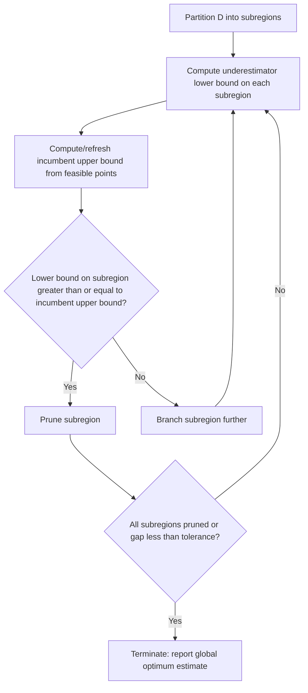

## Underestimation and Overestimation Bounds

### Definition and Role in Global Optimization

Underestimation and overestimation bounds are auxiliary functions used in deterministic global optimization algorithms (particularly branch-and-bound methods) to construct provable enclosures on the optimal value of a nonconvex problem over a given region. Given a nonconvex objective $f(x)$ on a domain $D \subseteq \mathbb{R}^n$, an **underestimator** $\underline{f}(x)$ satisfies $\underline{f}(x) \le f(x)$ for all $x \in D$, while an **overestimator** $\overline{f}(x)$ satisfies $\overline{f}(x) \ge f(x)$ for all $x \in D$. These bounding functions are typically chosen to be convex (for underestimators of a minimization objective) or concave (for overestimators), so that a single tractable convex program can be solved to obtain a valid bound on the true optimum, even though the original problem is not convex.

The core purpose is to convert an intractable nonconvex subproblem into a tractable convex relaxation whose optimal value is guaranteed to bound the true nonconvex optimal value. This is what allows branch-and-bound schemes to prune regions of the search space: if the bound computed on a subregion cannot possibly contain the current best known solution, that subregion is discarded without ever solving the original nonconvex problem on it.

### Underestimation Bounds

For a minimization problem $\min_{x \in D} f(x)$, the underestimator $\underline{f}(x)$ is constructed so that $\underline{f}(x) \le f(x)$ holds pointwise over $D$. Minimizing the (typically convex) underestimator over $D$ gives a **lower bound** on the true minimum:

$$\min_{x \in D} \underline{f}(x) \le \min_{x \in D} f(x)$$

Because $\underline{f}$ is chosen to be convex, this minimization can be solved reliably and efficiently by standard convex solvers, whereas minimizing $f$ directly could get stuck at a local minimum or saddle point that is not globally optimal.

**Key Points**

- A valid lower bound requires $\underline{f}(x) \le f(x)$ to hold over the *entire* region $D$ under consideration, not just at isolated points.
- Tighter underestimators (i.e., ones closer to $f$ pointwise) produce lower bounds closer to the true optimum, which improves pruning efficiency in branch-and-bound.
- As the region $D$ shrinks (through branching/partitioning), most standard underestimators converge to $f$ itself, a property generally required for a branch-and-bound scheme to converge to the global optimum.
- Common construction techniques include convex envelopes, $\alpha$BB (alpha branch-and-bound) quadratic underestimation, and McCormick relaxations for bilinear/factorable terms.

### Overestimation Bounds

For the same minimization problem, an overestimator $\overline{f}(x) \ge f(x)$ is used to bound the objective from above at a *specific feasible point* (rather than being minimized over the region). Evaluating an overestimator at a known feasible point $\hat{x} \in D$ gives a valid **upper bound** on the global minimum:

$$f(\hat{x}) \le \overline{f}(\hat{x})$$

[Inference] In most global optimization literature, the practically useful upper bound is simply $f(\hat{x})$ itself, evaluated at any feasible incumbent point, since $f$ is directly computable; the overestimator $\overline{f}$ is more often used on the *concave* side of the problem (e.g., when maximizing, or when overestimating a concave-relaxed piece of a factorable function) to keep the bounding subproblem tractable. In factorable programming and $\alpha$BB-style relaxations, overestimation typically enters as the concave overestimator paired with a convex underestimator to bound each nonconvex term from both sides.

**Key Points**

- Overestimators are the natural counterpart to underestimators: for a bilinear or nonconvex term appearing inside a larger expression, both a convex underestimator and a concave overestimator are constructed to sandwich the term, since the term may appear with either sign depending on the surrounding structure.
- The tightest possible convex underestimator and concave overestimator over a box region are the **convex** and **concave envelopes**, respectively — the pointwise supremum of all convex functions below $f$, and the pointwise infimum of all concave functions above $f$.
- For bilinear terms $xy$ over a box $[x^L, x^U] \times [y^L, y^U]$, the McCormick envelopes give explicit closed-form convex/concave envelopes, widely used as the canonical example of tight two-sided bounding.

### McCormick Envelopes for a Bilinear Term (Example)

For $w = xy$ over $x \in [x^L, x^U]$, $y \in [y^L, y^U]$, the McCormick relaxation gives the convex underestimator as the pointwise maximum of two linear functions, and the concave overestimator as the pointwise minimum of two linear functions:

$$w \ge x^L y + x y^L - x^L y^L$$

$$w \ge x^U y + x y^U - x^U y^U$$

$$w \le x^U y + x y^L - x^U y^L$$

$$w \le x^L y + x y^U - x^L y^U$$

The first two inequalities together define the convex underestimator $\underline{w}(x,y) = \max\{x^L y + x y^L - x^L y^L,\; x^U y + x y^U - x^U y^U\}$, and the last two define the concave overestimator $\overline{w}(x,y) = \min\{x^U y + x y^L - x^U y^L,\; x^L y + x y^U - x^L y^U\}$.

<svg xmlns="http://www.w3.org/2000/svg" viewBox="0 0 640 420" font-family="sans-serif">
<text x="320" y="28" text-anchor="middle" font-size="17" font-weight="bold">Underestimator vs. Overestimator over a region (svg_diagram)</text>
<line x1="60" y1="360" x2="580" y2="360" stroke="black" stroke-width="2" />
<line x1="60" y1="360" x2="60" y2="60" stroke="black" stroke-width="2" />
<text x="580" y="380" font-size="13">x</text>
<text x="35" y="65" font-size="13">f(x)</text>

<path d="M 80 330 Q 150 140 220 250 T 340 180 Q 420 260 480 150 T 560 260" stroke="`#1f77b4`" stroke-width="3" fill="none" />

<text x="480" y="130" fill="`#1f77b4`" font-size="13" font-weight="bold">f(x) (nonconvex)</text>

<path d="M 80 320 Q 320 60 560 300" stroke="#2ca02c" stroke-width="3" fill="none" stroke-dasharray="2 0" />
<text x="330" y="90" fill="#2ca02c" font-size="13" font-weight="bold">overestimator f̄(x) (concave)</text>
<path d="M 80 340 Q 320 380 560 300" stroke="#d62728" stroke-width="3" fill="none" />
<text x="200" y="400" fill="#d62728" font-size="13" font-weight="bold">underestimator f̲(x) (convex)</text>
<line x1="60" y1="60" x2="60" y2="370" stroke="#888" stroke-width="1" stroke-dasharray="4 3" />
<text x="45" y="55" font-size="12" fill="#555">x_L</text>
<line x1="580" y1="60" x2="580" y2="370" stroke="#888" stroke-width="1" stroke-dasharray="4 3" />
<text x="560" y="55" font-size="12" fill="#555">x_U</text>
<circle cx="80" cy="330" r="4" fill="black" />
<circle cx="80" cy="340" r="4" fill="#d62728" />
<circle cx="80" cy="320" r="4" fill="#2ca02c" />
</svg>

**Example**

Consider $f(x) = x^4 - 3x^2$ on $D = [-2, 2]$. This function is nonconvex on $D$ (it has negative curvature near $x=0$). An $\alpha$BB-style convex underestimator can be constructed as:

$$\underline{f}(x) = f(x) + \alpha (x^L - x)(x^U - x)$$

where $\alpha \ge \max\left(0, -\tfrac{1}{2}\min_{x \in D} f''(x)\right)$ is chosen large enough to guarantee convexity of $\underline{f}$ over $D$. Here $f''(x) = 12x^2 - 6$, which attains its minimum value $-6$ at $x = 0$, so $\alpha \ge 3$ makes $\underline{f}$ convex on $[-2,2]$. [Inference] The exact minimal $\alpha$ that guarantees convexity depends on the specific interval-Hessian bounding technique used (e.g., scaled Gerschgorin, interval Hessian, or eigenvalue bounds), so the numeric value here is illustrative of the standard $\alpha$BB construction rather than a claim about a single universally "correct" $\alpha$.

### Convergence Behavior Across Branching

**Key Points**

- As a branch-and-bound algorithm partitions $D$ into smaller subregions, the gap between $\overline{f}$ and $\underline{f}$ (often called the *underestimation/overestimation gap* or *relaxation gap*) should shrink as region diameter shrinks, for many standard schemes (e.g., $\alpha$BB, McCormick-based relaxations); this is what permits eventual convergence to the global optimum within a specified tolerance.
- [Unverified] The rate at which this gap shrinks (linear vs. quadratic in subregion diameter) depends on the specific bounding technique and the smoothness of $f$; this is a property that should be checked against the specific relaxation method rather than assumed to hold uniformly across all constructions.
- The overall global optimization procedure terminates when the gap between the best found upper bound (from feasible incumbent points) and the best found lower bound (from the underestimator over all remaining active subregions) falls below a prescribed tolerance $\epsilon$.

### Relationship to Branch-and-Bound Pruning

**Conclusion**

Underestimation and overestimation bounds are the mechanism by which nonconvex global optimization problems are made tractable within a rigorous, provably convergent algorithmic framework. By replacing an intractable nonconvex function with a convex underestimator (for lower bounds) and, where needed, a concave overestimator (for upper-bounding auxiliary terms), branch-and-bound methods can certify that no better solution exists in a pruned region — without ever having to solve the original nonconvex problem exactly on that region. The tightness of these bounds, and how quickly the underestimation/overestimation gap closes as regions are subdivided, directly determines the practical efficiency of the resulting global solver.

**Related Topics**

- Convex and concave envelopes
- $\alpha$BB (alpha branch-and-bound) method
- McCormick relaxations for factorable programming
- Branch-and-bound convergence and pruning rules
- Piecewise-linear relaxations for nonconvex terms
- Interval arithmetic bounding techniques
- Lagrangian and semidefinite programming (SDP) relaxations for global bounds