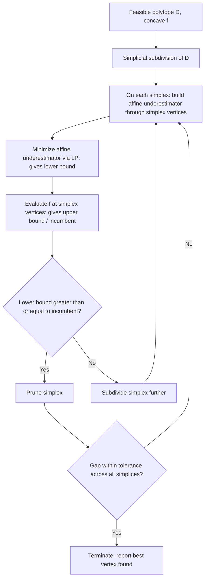

## Concave Minimization Approaches

### Definition and Problem Structure

Concave minimization refers to the problem of minimizing a concave function over a convex feasible region:

$$\min_{x \in D} \; f(x)$$

where $f: \mathbb{R}^n \to \mathbb{R}$ is concave and $D \subseteq \mathbb{R}^n$ is a convex, typically compact (closed and bounded) set, most often a polytope. This problem class is NP-hard in general, despite the feasible region itself being convex, because minimizing a concave function is fundamentally different from minimizing a convex one: whereas convex minimization has the property that any local minimum is global, concave minimization can have exponentially many local minima, and the global minimum of a concave function over a polytope is always attained at an **extreme point (vertex)** of the polytope.

**Key Points**

- Concave minimization is, in a precise sense, "the hardest" convex-feasible-region optimization problem: it subsumes many classical NP-hard combinatorial problems (e.g., certain bilinear and 0-1 integer programs can be reformulated as concave minimization over a polytope).
- The vertex-optimality property (global minimum at an extreme point) is the structural fact exploited by nearly all specialized concave minimization algorithms, distinguishing this problem from general nonconvex optimization where no such simple characterization of the optimum's location exists.
- A concave function being minimized is equivalent to a convex function ($-f$) being maximized over the same region, so concave minimization and convex maximization are the same problem class viewed from opposite signs.

### Why Vertex Enumeration Is Not Practical

Since the global minimum lies at a vertex, a naive approach is to enumerate all vertices of the polytope $D$ and evaluate $f$ at each. This is generally impractical because the number of vertices of a polytope defined by $m$ linear inequalities in $n$ dimensions can grow combinatorially (in the worst case, exponentially in $\min(m,n)$), making exhaustive enumeration intractable except for small instances. This impracticality motivates the specialized algorithmic approaches discussed below, most of which implicitly search the vertex set without full enumeration.

### Cutting Plane Methods

Cutting plane methods for concave minimization iteratively refine an outer polyhedral approximation of the feasible region (or, in dual approaches, of the epigraph structure) by adding valid linear inequalities ("cuts") that exclude previously found non-optimal vertices without excluding any better feasible vertex, progressively tightening the search.

**Key Points**

- A **concavity cut** (or Tuy cut, historically among the earliest cutting-plane devices proposed specifically for concave minimization) is constructed at a vertex where the concave function has been evaluated, using the function's behavior along the edges emanating from that vertex to construct a hyperplane that excludes the neighborhood of that vertex while provably retaining all feasible points with equal or better objective value.
- These methods build a sequence of relaxed polytopes $D = D_0 \supseteq D_1 \supseteq D_2 \supseteq \dots$, converging (under appropriate conditions) toward the true vertex set that could contain the global optimum, though convergence to an exact global optimum in finitely many iterations is not guaranteed in general and can require care regarding degeneracy.
- [Unverified] Practical performance of concavity-cut-based methods is highly sensitive to problem structure (e.g., degeneracy of the polytope, dimension of the concave "core"), and worst-case complexity remains exponential; this should not be read as implying good average-case performance across all problem instances without instance-specific validation.

### Branch-and-Bound for Concave Minimization

Branch-and-bound remains one of the most widely used frameworks for concave minimization, adapted specifically to exploit the vertex-optimality structure.

**Key Points**

- The feasible region is recursively partitioned (branched), typically using **simplicial** or **rectangular** subdivision, since a concave function restricted to a simplex has a particularly simple linear (affine) underestimator: the affine function agreeing with $f$ at the simplex's vertices, which is a valid underestimator everywhere on the simplex precisely because $f$ is concave (a concave function lies above the chord connecting any two of its points, generalized to the simplex).
- On each subregion, minimizing this affine underestimator over the (sub)polytope is a linear program, solvable efficiently, and gives a valid lower bound on the concave minimum over that subregion.
- Subregions are pruned when their lower bound exceeds the current best known incumbent objective value (found by evaluating $f$ at any of the subregion's vertices, since the true optimum over a convex region touches an extreme point).
- Because the affine underestimator becomes exact as the simplex shrinks to a point (a direct consequence of $f$'s continuity), this branch-and-bound scheme is generally convergent to the global optimum as subdivision proceeds indefinitely, subject to standard exhaustiveness conditions on the branching rule.

**Example**

Consider minimizing the concave function $f(x_1, x_2) = -(x_1^2 + x_2^2)$ (equivalently, maximizing $x_1^2 + x_2^2$) over the unit square $D = [0,1]^2$. The four vertices are $(0,0), (1,0), (0,1), (1,1)$, with function values $0, -1, -1, -2$ respectively. Since the global minimum of a concave function over a polytope occurs at a vertex, the minimum here is $f(1,1) = -2$, attained at the vertex $(1,1)$; no interior point can improve on this, since $f$ is strictly concave and its unconstrained minimum direction points away from the origin, driving the optimal solution to the farthest extreme point.

<svg xmlns="http://www.w3.org/2000/svg" viewBox="0 0 500 420" font-family="sans-serif">
<text x="250" y="28" text-anchor="middle" font-size="16" font-weight="bold">Concave minimum at a vertex (svg_diagram)</text>
<polygon points="100,340 380,340 380,80 100,80" fill="#eef4fb" stroke="#1f77b4" stroke-width="2" />
<circle cx="100" cy="340" r="6" fill="black" />
<text x="70" y="365" font-size="13">(0,0), f=0</text>
<circle cx="380" cy="340" r="6" fill="black" />
<text x="350" y="365" font-size="13">(1,0), f=-1</text>
<circle cx="100" cy="80" r="6" fill="black" />
<text x="35" y="70" font-size="13">(0,1), f=-1</text>
<circle cx="380" cy="80" r="7" fill="#d62728" />
<text x="310" y="65" font-size="13" fill="#d62728" font-weight="bold">(1,1), f=-2 (global min)</text>
<path d="M 240 260 Q 280 210 340 140" stroke="#2ca02c" stroke-width="2" fill="none" stroke-dasharray="5 3" marker-end="url(#arrow)" />
<text x="220" y="245" font-size="12" fill="#2ca02c">descent direction</text>
</svg>

### Reformulation-Based Approaches

**Key Points**

- Many bilinear and indefinite quadratic programs can be reformulated as concave minimization problems, allowing specialized concave minimization algorithms (branch-and-bound with affine underestimators, concavity cuts) to be applied indirectly to problems not originally posed in concave-minimization form.
- **Parametric decomposition**: if the concave function $f(x)$ depends on only a small number of variables relative to the total dimension of $D$ (a "low concave rank" or few nonconvex variables), the problem can be decomposed by fixing/parametrizing over those few variables and solving a linear program in the remaining variables for each fixed value, exploiting the fact that the difficulty is entirely concentrated in the low-dimensional concave part.
- [Inference] This low-rank/few-variable exploitation is most impactful in problems arising from applications such as certain facility location, economies-of-scale production planning, and portfolio problems where only a handful of decision variables enter the objective concavely (e.g., through economies-of-scale cost terms) while the remainder of the model is linear; the practical benefit is problem-dependent rather than a guaranteed general-case speedup.

### Relationship to Global Optimization Frameworks

**Key Points**

- Concave minimization is a special case of the general nonconvex global optimization setting discussed via underestimation/overestimation bounds: the affine underestimator used here is precisely a specific, especially tight instance of a convex (in fact, linear) underestimator, made possible by exploiting concavity rather than requiring generic techniques like $\alpha$BB.
- Compared to Difference-of-Convex (DC) programming, concave minimization is the special case where $g(x) = 0$ in the $f = g - h$ decomposition (i.e., $f = -h$ is purely concave), meaning DCA-style algorithms could in principle be applied here too, though the vertex-optimality property is generally considered to give rise to more specialized and often more effective purpose-built algorithms for this narrower structural class.
- Concave minimization also connects closely to SDP relaxation techniques when the concave function is quadratic: an indefinite quadratic form can be related to concave/convex components via its eigenvalue decomposition, linking this problem class back to the lifting-based relaxations discussed for QCQPs.

**Conclusion**

Concave minimization is distinguished among nonconvex optimization problems by the guaranteed structural property that its global optimum lies at a vertex of the (convex) feasible region, a fact that both explains its inherent computational hardness (since implicit vertex search is combinatorial) and enables the specialized algorithms — branch-and-bound with affine simplicial underestimators, concavity-cut methods, and structure-exploiting reformulations — that make practically-sized instances tractable. Its tight connection to the general underestimation/overestimation framework and to DC programming situates it as an important, well-studied special case within the broader landscape of deterministic global optimization.

**Related Topics**

- Vertex enumeration and polytope combinatorics
- Bilinear programming reformulations
- Simplicial subdivision strategies for branch-and-bound
- Facility location and economies-of-scale optimization models
- Concavity cuts (Tuy cuts) in detail
- Connections between concave minimization and 0-1 integer programming
- Reverse convex programming