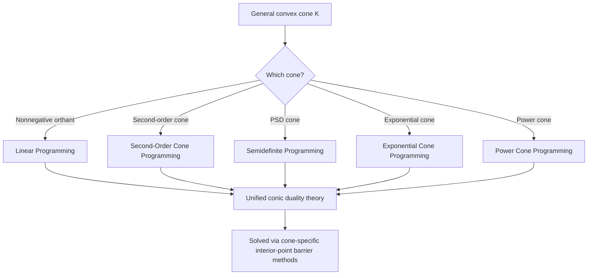

## Cone Programming Generalizations

### Definition and the General Conic Optimization Framework

Cone programming (or conic optimization) is the broad problem class that generalizes linear programming, second-order cone programming (SOCP), and semidefinite programming (SDP) into a single unified framework. The standard form is:

$$\min_{x \in \mathbb{R}^n} \; c^T x \quad \text{subject to} \quad Ax = b, \quad x \in \mathcal{K}$$

where $\mathcal{K} \subseteq \mathbb{R}^n$ is a **closed, convex cone**, $c \in \mathbb{R}^n$, $A \in \mathbb{R}^{m \times n}$, and $b \in \mathbb{R}^m$. A set $\mathcal{K}$ is a cone if $x \in \mathcal{K}$ and $\lambda \ge 0$ imply $\lambda x \in \mathcal{K}$. The entire problem remains convex regardless of the specific cone chosen, as long as $\mathcal{K}$ itself is convex, because the feasible region (intersection of an affine subspace with a convex cone) is convex and the objective is linear.

**Key Points**

- The three classical cones — the nonnegative orthant $\mathbb{R}^n_+$ (giving LP), the second-order (Lorentz/"ice cream") cone $\mathcal{Q}^n = \{(t,z) : \|z\| \le t\}$ (giving SOCP), and the positive semidefinite cone $\mathcal{S}^n_+$ (giving SDP) — form a strict containment hierarchy: LP $\subsetneq$ SOCP $\subsetneq$ SDP, in the sense that every LP can be written as an SOCP, and every SOCP can be written as an SDP, but not conversely.
- The generality of cone programming lies entirely in the choice of $\mathcal{K}$: the algorithmic machinery (duality theory, interior-point methods via cone-specific barrier functions) is developed once, abstractly, and then specialized to whichever cone the application requires.
- A convex cone $\mathcal{K}$ is called **self-dual** if $\mathcal{K}^* = \mathcal{K}$ (where $\mathcal{K}^* = \{y : \langle y, x\rangle \ge 0 \, \forall x \in \mathcal{K}\}$ is the dual cone); all three classical cones (nonnegative orthant, second-order cone, PSD cone) are self-dual, a property that simplifies their duality theory considerably compared to general cones.

### General Conic Duality

The dual of the standard-form conic program is:

$$\max_{y \in \mathbb{R}^m, \, s \in \mathbb{R}^n} \; b^T y \quad \text{subject to} \quad A^T y + s = c, \quad s \in \mathcal{K}^*$$

where $\mathcal{K}^*$ is the dual cone of $\mathcal{K}$.

**Key Points**

- Weak duality ($b^T y \le c^T x$ for any primal/dual feasible pair) holds for **any** closed convex cone $\mathcal{K}$, following directly from $\langle s, x \rangle \ge 0$ whenever $x \in \mathcal{K}$ and $s \in \mathcal{K}^*$.
- As with SDP, **strong duality is not automatic** for general conic programs and requires a constraint qualification such as Slater's condition (existence of a strictly/relatively interior feasible point); this requirement, first emphasized in the SDP formulation context, is in fact a general conic phenomenon rather than an SDP-specific quirk.
- [Inference] The severity of potential duality gaps or non-attainment issues tends to increase for cones that are "less well-behaved" than the self-dual classical cones (e.g., cones that are not facially exposed, or exhibit pathological boundary structure); this is a general theoretical concern documented in the conic programming literature, though whether it manifests in a specific application-derived cone must be checked case by case.

### Beyond the Classical Cones

**Key Points**

- The **exponential cone** $\mathcal{K}_{\exp} = \{(x,y,z) : y e^{x/y} \le z, \, y > 0\} \cup \{(x,0,z) : x \le 0, z \ge 0\}$ enables direct formulation of problems involving exponentials and logarithms (e.g., entropy maximization, logistic regression, geometric programming), which cannot be captured by LP, SOCP, or SDP alone.
- The **power cone** $\mathcal{K}_{\text{pow}}^\alpha = \{(x,y,z) : x^\alpha y^{1-\alpha} \ge |z|, \, x,y \ge 0\}$ for $\alpha \in (0,1)$ generalizes certain $p$-norm and geometric-mean constraints, useful for formulating problems with fractional-power terms without resorting to nonconvex reformulations.
- Modern conic solvers (e.g., those supporting mixed cone types in a single problem) allow a single optimization problem to combine several cone types simultaneously — for instance, some linear constraints (orthant), some norm constraints (second-order cone), and some log-sum-exp terms (exponential cone) — solved jointly via a unified primal-dual interior-point framework, rather than requiring separate solvers per cone type.
- [Unverified] The exact set of cone types supported, and their relative numerical robustness, varies by solver implementation; this is an implementation-dependent detail rather than a property of the conic programming framework itself, and should be checked against the specific solver's documentation for a given application.

### Example: Geometric Programming via the Exponential Cone

A geometric program (GP) in standard convex form (after log-transformation) involves constraints with log-sum-exp terms, such as:

$$\log\left(\sum_k e^{a_k^T x + b_k}\right) \le 0$$

**Output**

This constraint can be reformulated using the exponential cone by introducing auxiliary variables $t_k$ satisfying $(a_k^T x + b_k, 1, t_k) \in \mathcal{K}_{\exp}$ for each $k$ (encoding $t_k \ge e^{a_k^Tx + b_k}$), together with the linear constraint $\sum_k t_k \le 1$. This converts a constraint that is convex but not directly expressible via LP/SOCP/SDP cones into a small system of exponential-cone constraints plus one linear constraint, solvable by any conic solver supporting the exponential cone.

<svg xmlns="http://www.w3.org/2000/svg" viewBox="0 0 640 380" font-family="sans-serif">
<text x="320" y="28" text-anchor="middle" font-size="16" font-weight="bold">Nesting of standard convex cones (svg_diagram)</text>
<circle cx="320" cy="220" r="150" fill="#eef4fb" stroke="#1f77b4" stroke-width="2" />
<text x="320" y="90" text-anchor="middle" font-size="13" fill="#1f77b4" font-weight="bold">General convex cones</text>
<text x="320" y="105" text-anchor="middle" font-size="11" fill="#1f77b4">(exponential, power, ...)</text>
<circle cx="320" cy="240" r="105" fill="#dbe9fb" stroke="#2ca02c" stroke-width="2" />
<text x="320" y="150" text-anchor="middle" font-size="13" fill="#2ca02c" font-weight="bold">Semidefinite cone</text>
<circle cx="320" cy="255" r="65" fill="#c6def9" stroke="#ff7f0e" stroke-width="2" />
<text x="320" y="205" text-anchor="middle" font-size="12" fill="#ff7f0e" font-weight="bold">Second-order cone</text>
<circle cx="320" cy="270" r="30" fill="#a9c9f5" stroke="#d62728" stroke-width="2" />
<text x="320" y="273" text-anchor="middle" font-size="11" fill="#d62728" font-weight="bold">Orthant (LP)</text>
</svg>

### Relationship to Global and Nonconvex Optimization

**Key Points**

- Cone programming generalizations extend the SDP-based relaxation strategy discussed earlier: nonconvex problems with structure beyond pure quadratics (e.g., involving logarithms, exponentials, or fractional powers in their constraints) can sometimes be relaxed or reformulated using exponential-cone or power-cone representations rather than being forced into a purely quadratic/SDP mold.
- The Sum-of-Squares/Lasserre hierarchy for polynomial optimization, previously described as built on SDP, is itself a specific instance of the broader conic programming template — using the PSD cone specifically — and in principle the same "lift into a well-understood convex cone" philosophy underlies proposed extensions of that hierarchy using other cones for problems with non-polynomial structure.
- [Speculation] Active research continues into further cone generalizations (e.g., hyperbolicity cones associated with hyperbolic polynomials, which generalize the PSD cone in a different direction relevant to certain combinatorial and control-theoretic applications); the practical maturity and solver support for such cones is considerably less established than for the classical and exponential/power cone cases described above, and should be treated as a less settled, evolving area rather than production-ready technology.

**Conclusion**

Cone programming generalizations reveal that linear, second-order cone, and semidefinite programming are not three unrelated problem classes but rather three instances of a single template — optimizing a linear objective over the intersection of an affine subspace with a convex cone — differing only in which cone is chosen. Extending beyond the three classical self-dual cones to the exponential and power cones substantially broadens the range of problems (entropy, geometric programming, fractional-power constraints) directly expressible in convex conic form, while the unified duality theory (and its shared dependence on constraint qualifications like Slater's condition) carries over from the SDP case to this fully general setting.

**Related Topics**

- Exponential cone programming and entropy maximization
- Power cone programming and $p$-norm constraints
- Geometric programming and log-convex reformulations
- Hyperbolic programming and hyperbolicity cones
- Facial structure and pathological convex cones
- Unified primal-dual interior-point methods for mixed-cone problems
- Relationship between conic duality and Lagrangian duality