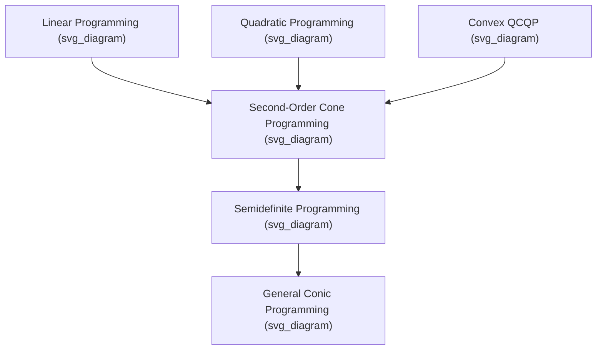

## Second-Order Cone Programming

### Definition and Standard Form

A second-order cone program (SOCP) is a convex optimization problem in which a linear objective is minimized subject to constraints requiring affine functions of the decision variables to lie within second-order (Lorentz, or "ice cream") cones. The standard form is:

$$\min_{x \in \mathbb{R}^n} \; c^T x$$

subject to

$$\|A_i x + b_i\|_2 \le c_i^T x + d_i, \quad i = 1, \dots, m$$

$$Fx = g$$

Here each constraint $i$ involves a matrix $A_i \in \mathbb{R}^{(n_i-1)\times n}$, vectors $b_i \in \mathbb{R}^{n_i-1}$, $c_i \in \mathbb{R}^n$, and scalar $d_i$. The constraint says that the affine mapping $(A_ix+b_i,\, c_i^Tx+d_i)$ must lie in the second-order cone of dimension $n_i$.

### The Second-Order Cone

The second-order cone (also called the Lorentz cone or quadratic cone) of dimension $k$ is defined as:

$$\mathcal{Q}^k = \left\{ (u, t) \in \mathbb{R}^{k-1} \times \mathbb{R} \; : \; \|u\|_2 \le t \right\}$$

This is a convex cone: it is closed under nonnegative scaling and under addition of its elements. Geometrically, in three dimensions it looks like an ice cream cone opening upward along the $t$-axis, which is where the informal name comes from.

**Key Points**

- $\mathcal{Q}^k$ is self-dual: its dual cone equals itself under the standard inner product.
- $\mathcal{Q}^k$ is a proper cone — it is closed, convex, pointed (contains no line), and has nonempty interior.
- SOCP constraints are convex because the cone itself is convex and the mapping into it is affine.

Below is a schematic of the cone in $\mathbb{R}^3$:

<svg xmlns="http://www.w3.org/2000/svg" viewBox="0 0 400 320">
<text x="200" y="24" text-anchor="middle" font-size="14" font-weight="bold" fill="#1a1a1a">Second-Order Cone in R^3 (svg_diagram)</text>
<line x1="200" y1="280" x2="200" y2="50" stroke="#444" stroke-width="1.5" />
<text x="210" y="55" font-size="12" fill="#444">t axis</text>
<line x1="60" y1="250" x2="340" y2="250" stroke="#444" stroke-width="1" />
<text x="345" y="255" font-size="12" fill="#444">u1</text>
<path d="M 200 90 L 110 250 A 90 18 0 0 0 290 250 Z" fill="#a8d0e6" fill-opacity="0.5" stroke="#2a6f97" stroke-width="1.5" />
<ellipse cx="200" cy="250" rx="90" ry="18" fill="#a8d0e6" fill-opacity="0.7" stroke="#2a6f97" stroke-width="1.5" />
<circle cx="200" cy="90" r="2.5" fill="#2a6f97" />
<text x="150" y="150" font-size="12" fill="#1a1a1a" font-style="italic">||u|| ≤ t</text>
</svg>

### Reformulating Common Problems as SOCPs

Many important convex problems can be cast exactly as SOCPs, which is one reason the class is so useful in practice.

**Quadratic Constraints**

A convex quadratic constraint $x^TPx + q^Tx + r \le 0$ with $P \succeq 0$ can be rewritten using the factorization $P = L^TL$:

$$\left\| L x + \tfrac{1}{2} L^{-T} q \right\|_2 \le t, \qquad t^2 \le -r + \tfrac{1}{4} q^TP^{-1}q$$

More directly, a quadratically constrained quadratic program (QCQP) with convex quadratic constraints is a special case of an SOCP, since each constraint $\|Lx\|_2^2 \le t$ (linear in $t$) can be written as $\|Lx\|_2 \le t$ after introducing an auxiliary variable.

**Linear Programming with Robustness**

Robust linear programming, where constraint coefficients are uncertain and lie in an ellipsoid, produces constraints of the form

$$a^Tx + \|\Sigma^{1/2}x\|_2 \le b$$

which is a direct SOCP constraint. This is one of the most common real-world sources of SOCPs.

**Sums and Norms**

- Minimizing a sum of Euclidean norms, $\min \sum_i \|A_ix + b_i\|_2$, is an SOCP via epigraph variables $t_i \ge \|A_ix+b_i\|_2$.
- Constraints on the norm of an affine expression, $\|Ax+b\|_2 \le c^Tx + d$, are SOCP constraints by definition.
- Hyperbolic constraints $w^2 \le xy$ with $x, y \ge 0$ can be written as $\left\| \begin{bmatrix} 2w \\ x-y \end{bmatrix} \right\|_2 \le x + y$, embedding a hyperbola in an SOCP.

### Relationship to Semidefinite Programming

Every SOCP can be expressed as an SDP, since the second-order cone constraint $\|u\|_2 \le t$ is equivalent to the linear matrix inequality

$$\begin{bmatrix} tI & u \\ u^T & t \end{bmatrix} \succeq 0$$

This means SOCP is a special case of SDP. However, SOCPs are typically solved far more efficiently than the equivalent SDP formulation because interior-point methods can exploit the specific structure of the second-order cone directly, rather than working with the larger, denser matrix inequality. In practice, problems that are naturally SOCPs should be solved as SOCPs rather than lifted to SDP form.

**Key Points**

- $\text{LP} \subset \text{SOCP} \subset \text{SDP}$ in terms of expressive power, forming a hierarchy of convex cone programs.
- Linear programs are SOCPs where each cone has dimension 1 (reducing to a simple inequality).
- Convex quadratic programs (QPs) and QCQPs are also subsumed by SOCP.

The hierarchy of cone programs can be visualized as follows:

### Duality in SOCP

The Lagrangian dual of an SOCP is itself an SOCP, owing to the self-duality of the second-order cone. For the standard-form primal above, the dual takes the form:

$$\max_{y_i,\, z_i} \; -\sum_i b_i^Ty_i - \sum_i d_iz_i - g^T\nu$$

subject to

$$c - \sum_i (A_i^Ty_i + z_ic_i) - F^T\nu = 0, \qquad \|y_i\|_2 \le z_i, \quad i=1,\dots,m$$

**Key Points**

- Strong duality holds under Slater's condition (existence of a strictly feasible point, i.e., one where the norm inequality is strict).
- The Karush-Kuhn-Tucker (KKT) conditions for SOCP generalize those of LP and QP, incorporating complementary slackness with respect to the cone: $z_i(c_i^Tx+d_i) = y_i^T(A_ix+b_i)$ along with the primal and dual cone memberships.
- Because both primal and dual are SOCPs, one can solve whichever formulation is computationally more convenient.

### Algorithms for Solving SOCPs

**Primal-Dual Interior-Point Methods**

The dominant approach for solving SOCPs is the primal-dual interior-point method, which generalizes the path-following methods used for LP. It works by:

1. Replacing the cone constraints with a barrier function specific to the second-order cone, commonly $-\log(t^2 - \|u\|_2^2)$.
2. Following a "central path" parameterized by a barrier parameter $\mu$ that is driven to zero.
3. Solving a Newton system at each iteration to update primal and dual variables jointly.

**Key Points**

- The barrier function for $\mathcal{Q}^k$ is self-concordant, which underlies the polynomial-time complexity guarantees of interior-point methods.
- Worst-case iteration complexity is $O(\sqrt{m})$ Newton steps for $m$ second-order cone constraints, each requiring $O(n^3)$ or better arithmetic operations depending on sparsity exploitation. [Inference] Exact per-iteration cost depends heavily on the sparsity structure and the specific linear-algebra implementation used by the solver.
- Popular solvers implementing these methods include SeDuMi, SDPT3, MOSEK, ECOS, and SCS, each with different trade-offs between accuracy, speed, and scalability.

**First-Order Methods**

For very large-scale SOCPs, first-order methods such as the Alternating Direction Method of Multipliers (ADMM) or operator-splitting approaches (as used in the solver SCS) are often preferred over interior-point methods, since they avoid forming and factoring large Newton systems. These methods trade lower per-iteration cost for lower accuracy and slower asymptotic convergence rates. [Inference] The specific convergence rate observed depends on problem conditioning and the chosen splitting scheme, so no single rate applies universally.

### Worked Example

Consider a small robust linear programming problem. Suppose we want to minimize $c^Tx$ subject to a constraint whose coefficient vector $a$ is uncertain but known to lie in an ellipsoid centered at $\bar a$ with shape matrix $\Sigma^{1/2}$:

$$\min c^Tx \quad \text{s.t.} \quad \bar a^Tx + \|\Sigma^{1/2}x\|_2 \le b$$

This single robust constraint is already in SOCP form: it bounds the Euclidean norm of a linear expression in $x$ by an affine function of $x$. If, say, $n=2$, $\bar a = (1,1)$, $\Sigma^{1/2} = 0.1I$, and $b=5$, the constraint becomes:

$$x_1 + x_2 + 0.1\sqrt{x_1^2+x_2^2} \le 5$$

**Output**

This defines a convex feasible region that is a slightly "rounded" version of the halfplane $x_1+x_2\le 5$, shrunk inward to account for worst-case uncertainty in the coefficients. Minimizing a linear objective such as $c=(-1,-1)$ over this region pushes the solution toward the boundary of the rounded constraint rather than the sharp corner an ordinary LP would allow, illustrating how robustness costs some objective value relative to the nominal (non-robust) problem.

### Applications

- **Robust optimization**: handling parameter uncertainty in linear and quadratic programs via ellipsoidal uncertainty sets, as shown above.
- **Portfolio optimization**: constraints bounding portfolio variance (a quadratic form) alongside linear return and budget constraints.
- **Antenna array and filter design**: constraints on signal-to-noise ratios and beam patterns that involve norm bounds.
- **Facility location and Euclidean distance problems**: minimizing sums of distances, which are norm expressions.
- **Truss and structural design**: constraints on stress and compliance that reduce to second-order cone constraints under certain formulations.
- **Support vector machines**: some formulations of large-margin classifiers can be posed as SOCPs.

### Conclusion

Second-order cone programming occupies a useful middle ground in the convex optimization hierarchy: more expressive than linear and quadratic programming, yet more tractable in practice than general semidefinite programming. Its self-dual cone structure yields clean duality theory and efficient specialized interior-point algorithms, while its ability to represent norm bounds, robust constraints, and convex quadratics makes it a natural target formulation for a wide range of engineering and finance problems.

**Related Topics**

- Semidefinite Programming — Interior-Point Methods and the LMI Formulation
- Robust Optimization and Uncertainty Sets
- Conic Duality and Self-Concordant Barrier Functions
- Convex Quadratically Constrained Quadratic Programming (QCQP)
- ADMM and Operator-Splitting Methods for Conic Programs
- Sparse SOCP Solvers and Exploiting Problem Structure (ECOS, SCS, MOSEK)
- Applications in Portfolio Optimization and Financial Risk Constraints