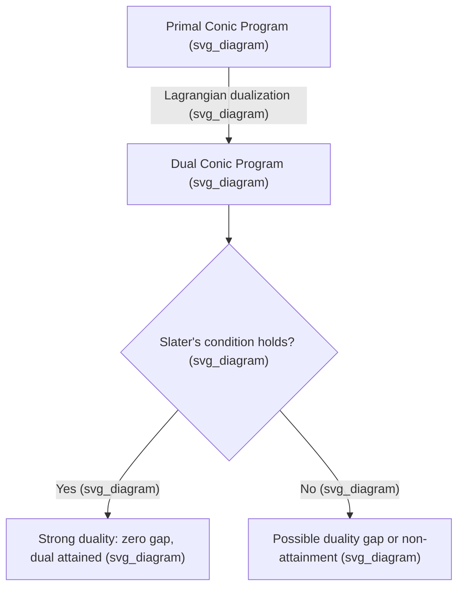

## Duality in Conic Programming

### General Conic Programs

A conic program generalizes linear programming by replacing the nonnegative orthant with an arbitrary proper cone $K$. The standard (primal) form is:

$$\min_{x \in \mathbb{R}^n} \; c^Tx \quad \text{s.t.} \quad Ax = b, \quad x \in K$$

where $K \subseteq \mathbb{R}^n$ is a proper cone: closed, convex, pointed (contains no line through the origin), and with nonempty interior. Linear programming, second-order cone programming, and semidefinite programming are all special cases obtained by choosing $K$ to be the nonnegative orthant $\mathbb{R}^n_+$, a product of second-order cones, or the cone of positive semidefinite matrices, respectively.

**Key Points**

- The choice of $K$ determines the problem class; the algebraic form $\min c^Tx$ s.t. $Ax=b,\, x\in K$ stays the same across LP, SOCP, and SDP.
- Conic programs are convex whenever $K$ is a convex cone, regardless of how complicated $K$ is otherwise.
- The constraint $x \in K$ replaces coordinatewise inequalities in LP with membership in a possibly higher-dimensional geometric object.

### Dual Cones

The dual of a conic program is built from the dual cone of $K$, defined as:

$$K^* = \left\{ y \in \mathbb{R}^n \; : \; y^Tx \ge 0 \; \text{ for all } x \in K \right\}$$

The dual cone consists of all vectors that make a nonnegative inner product with every vector in $K$. Geometrically, $K^*$ collects the normal directions of all supporting hyperplanes of $K$ that keep $K$ on one side.

**Key Points**

- $K^*$ is itself always a closed convex cone, even if $K$ is not self-dual.
- If $K$ is proper, then $K^*$ is also proper, and $(K^*)^* = K$.
- A cone is called self-dual if $K = K^*$. The nonnegative orthant, the second-order cone, and the positive semidefinite cone are all self-dual — a fact that greatly simplifies duality theory for LP, SOCP, and SDP.

Below is a diagram showing a cone and its dual in $\mathbb{R}^2$:

<svg xmlns="http://www.w3.org/2000/svg" viewBox="0 0 420 320">
<text x="210" y="24" text-anchor="middle" font-size="14" font-weight="bold" fill="#1a1a1a">Cone K and Dual Cone K* (svg_diagram)</text>
<line x1="30" y1="270" x2="390" y2="270" stroke="#999" stroke-width="1" />
<line x1="210" y1="290" x2="210" y2="50" stroke="#999" stroke-width="1" />
<path d="M 210 270 L 340 150 L 210 90 Z" fill="#a8d0e6" fill-opacity="0.5" stroke="#2a6f97" stroke-width="1.5" />
<text x="300" y="140" font-size="13" fill="#2a6f97" font-weight="bold">K</text>
<path d="M 210 270 L 150 90 L 340 210 Z" fill="#f4a259" fill-opacity="0.35" stroke="#bc4b17" stroke-width="1.5" />
<text x="255" y="230" font-size="13" fill="#bc4b17" font-weight="bold">K*</text>
<circle cx="210" cy="270" r="3" fill="#1a1a1a" />
</svg>

### The Conic Dual Problem

Given the primal conic program above, its Lagrangian dual is:

$$\max_{y \in \mathbb{R}^m} \; b^Ty \quad \text{s.t.} \quad c - A^Ty \in K^*$$

This is derived by forming the Lagrangian $L(x,y) = c^Tx - y^T(Ax-b)$ and minimizing over $x \in K$; the infimum is $-\infty$ unless $c - A^Ty \in K^*$, in which case it equals $b^Ty$.

**Key Points**

- The dual problem is also a conic program, over the dual cone $K^*$.
- Weak duality always holds: for any primal feasible $x$ and dual feasible $y$, $c^Tx \ge b^Ty$, so the dual objective is a lower bound on the primal.
- The quantity $c^Tx - b^Ty$ is called the duality gap; weak duality states this gap is always nonnegative.

### Strong Duality and Constraint Qualifications

Unlike linear programming, strong duality (equality between primal and dual optimal values) is **not automatic** in general conic programming. It can fail even when both problems are feasible and bounded, because the feasible set of a conic program need not be "nice" (e.g., not closed, or lacking an interior point in the right sense).

**Slater's Condition**

The standard sufficient condition for strong duality is Slater's condition: if there exists a strictly feasible point $x$ (satisfying $Ax=b$ and $x \in \text{int}(K)$, i.e., in the interior of the cone, not merely on its boundary), then strong duality holds and the dual optimum is attained.

**Key Points**

- Slater's condition is sufficient, not necessary; strong duality can hold in its absence, but this must be checked separately.
- For LP, Slater's condition simplifies to ordinary feasibility for polyhedral cones under mild assumptions, which is part of why LP duality is unconditionally strong (no duality gap) under standard assumptions.
- For SDP and SOCP, Slater's condition specifically requires a point strictly inside the cone (e.g., a positive definite matrix, or a strict norm inequality), not merely a boundary point.
- [Inference] In practice, many well-posed engineering SDPs satisfy Slater's condition, but pathological or degenerate problem instances (for example, those arising from certain relaxations) can violate it, producing a nonzero duality gap or an unattained dual optimum.

**Pathologies Unique to Conic Duality**

Conic programming can exhibit several duality failures that never occur in finite-dimensional LP:

- **Nonzero duality gap**: the primal and dual optimal values can differ even when both problems are feasible and bounded.
- **Non-attainment**: the dual (or primal) optimal value may be approached but never achieved by any feasible point — the supremum or infimum is not attained.
- **Infeasibility without a certificate**: unlike LP, where infeasibility of the primal is always certified by a feasible improving ray in the dual (Farkas' lemma), conic infeasibility can occur without such a finite certificate in some degenerate cases. [Inference] This is a known theoretical phenomenon in conic programming; whether it arises in a specific application depends on the structure of the constraint data.

### Complementary Slackness in Conic Form

At a primal-dual optimal pair $(x^\star, y^\star)$ with zero duality gap, complementary slackness generalizes to the conic setting as:

$$(x^\star)^T \left( c - A^Ty^\star \right) = 0$$

Since $x^\star \in K$ and $c - A^Ty^\star \in K^*$, and the dual cone is defined precisely so that this inner product is always nonnegative, the complementary slackness condition forces this inner product to be exactly zero at optimality. This is the conic generalization of the familiar LP condition that a variable and its corresponding dual slack cannot both be strictly positive.

### Duality for the Self-Dual Cones (LP, SOCP, SDP)

Because $K^*=K$ for the nonnegative orthant, second-order cone, and PSD cone, the dual problem takes on a symmetric, recognizable structure in each case:

**Linear Programming**

$$\text{Primal: } \min c^Tx \text{ s.t. } Ax=b,\, x\ge 0 \qquad \text{Dual: } \max b^Ty \text{ s.t. } A^Ty \le c$$

**Semidefinite Programming**

$$\text{Primal: } \min \langle C, X\rangle \text{ s.t. } \langle A_i, X\rangle = b_i,\, X \succeq 0 \qquad \text{Dual: } \max b^Ty \text{ s.t. } C - \sum_i y_iA_i \succeq 0$$

**Second-Order Cone Programming**

As discussed previously, the SOCP dual replaces the PSD constraint with membership in the (self-dual) second-order cone for each dual block variable.

**Key Points**

- Self-duality of $K$ means the dual problem "looks like" the primal, just with the roles of the cone constraint and the equality constraint's right-hand side swapped.
- This symmetry is why SDP duality theory closely parallels LP duality theory, despite SDP being a strict generalization.
- When $K$ is not self-dual, the dual problem's cone $K^*$ can look structurally different from $K$, and deriving it requires explicitly computing the dual cone.

### Worked Example: SDP Duality Gap

Consider an SDP where strong duality fails despite feasibility — a well-known cautionary example in the theory. Let $X = \begin{bmatrix} x_{11} & x_{12} \\ x_{12} & x_{22}\end{bmatrix} \succeq 0$, with primal constraints $x_{11}=0$ and $x_{12}=1$. Since $X \succeq 0$ requires $x_{11}x_{22} \ge x_{12}^2$, and $x_{11}=0$ forces $x_{12}=0$, the constraint $x_{12}=1$ makes this problem **primal infeasible**.

**Output**

This kind of construction — where a boundary point of the cone is required to satisfy an equality that is incompatible with strict interior feasibility — is the archetypal source of Slater's condition failing and duality gaps appearing in more elaborate SDPs built on the same idea. [Unverified] The precise numerical values of the duality gap in extended versions of this classical example vary across textbook presentations, so specific gap magnitudes should be checked against the original source before being cited.

### Practical Implications for Solvers

**Key Points**

- Interior-point solvers for conic programs (SeDuMi, SDPT3, MOSEK, ECOS, SCS) rely on strong duality to construct stopping criteria based on the duality gap; when Slater's condition fails or nearly fails, convergence can be slow or the reported solution can be inaccurate. [Inference] Actual solver behavior in near-degenerate cases depends on the specific implementation and numerical tolerances used.
- Preprocessing techniques such as facial reduction can sometimes restore strong duality for problems that violate Slater's condition, by reformulating the problem over a smaller, better-behaved cone.
- Certificates of infeasibility and unboundedness returned by solvers rely on conic duality theory (generalized Farkas lemmas) and should be interpreted with the caveat that, in degenerate cases, a lack of a certificate does not always imply feasibility.

### Conclusion

Duality in conic programming extends the elegant primal-dual structure of linear programming to a much broader class of convex problems, but it does so at the cost of losing some of LP's automatic guarantees. Strong duality requires an explicit constraint qualification such as Slater's condition, and its failure can produce duality gaps, non-attained optima, or uncertifiable infeasibility — phenomena with no analogue in finite-dimensional LP. Understanding dual cones, self-duality, and the conditions under which strong duality holds is essential for correctly interpreting the output of modern conic solvers.

**Related Topics**

- Semidefinite Programming — Interior-Point Methods and the LMI Formulation
- Second-Order Cone Programming
- Farkas' Lemma and Theorems of the Alternative
- Facial Reduction for Ill-Posed Conic Programs
- KKT Conditions and Complementary Slackness in Convex Optimization
- Self-Concordant Barrier Functions and Path-Following Methods
- Robust Optimization and Uncertainty Sets