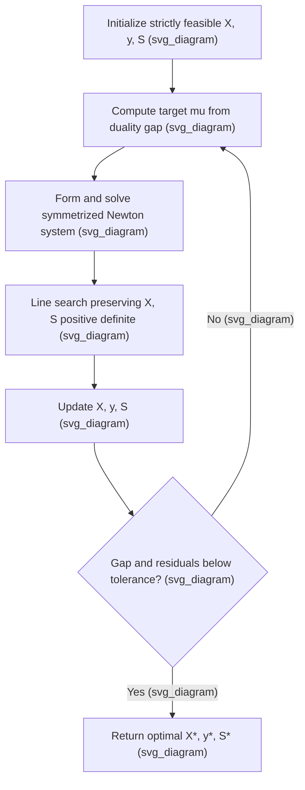

## Interior-Point Methods for Semidefinite Programs

### Overview and Motivation

Interior-point methods (IPMs) are the primary algorithmic engine for solving semidefinite programs (SDPs) to high accuracy. They generalize the barrier-based path-following methods originally developed for linear programming to the cone of positive semidefinite matrices, exploiting the fact that this cone admits a self-concordant barrier function. The core idea is to replace the difficult constraint $X \succeq 0$ with a smooth penalty that blows up near the boundary of the cone, then trace a path of unconstrained minimizers ("the central path") toward the true optimum as the penalty weight is driven to zero.

**Key Points**

- IPMs solve SDPs to a specified accuracy in a number of iterations that grows slowly (polynomially, and in practice often only logarithmically) with problem size, in contrast to methods with no such worst-case guarantee.
- Each iteration requires solving a system of linear equations (a Newton system) whose size depends on the number of decision variables and constraints, making per-iteration cost the main computational bottleneck for large SDPs.
- The two dominant algorithmic families are primal-dual path-following methods and potential-reduction methods; primal-dual methods are the most widely implemented in practice.

### The Log-Determinant Barrier

For the SDP in standard form,

$$\min_{X} \; \langle C, X \rangle \quad \text{s.t.} \quad \langle A_i, X \rangle = b_i,\; i=1,\dots,m, \quad X \succeq 0$$

the constraint $X \succeq 0$ is handled via the log-determinant barrier function:

$$\phi(X) = -\log \det(X)$$

defined on the interior of the PSD cone, $X \succ 0$. This barrier is finite for positive definite $X$ and tends to $+\infty$ as $X$ approaches the boundary of the cone (i.e., as $X$ becomes singular).

**Key Points**

- $\phi(X) = -\log\det(X)$ is a self-concordant barrier for the PSD cone, meaning its derivatives satisfy a specific growth condition that allows Newton's method to converge with strong theoretical guarantees.
- The barrier parameter associated with the PSD cone of $n\times n$ matrices is $n$ itself (sometimes called the "complexity value" of the barrier), which directly controls the iteration complexity of path-following methods.
- Combining the barrier with the objective gives the barrier subproblem: $\min_X \langle C,X\rangle + \mu\,\phi(X)$ subject to the linear equality constraints, for a decreasing sequence of $\mu > 0$.

### The Central Path

For each $\mu > 0$, the barrier subproblem has a unique minimizer $X(\mu)$ (assuming strict feasibility). The set of these minimizers as $\mu$ ranges over $(0,\infty)$ traces out the **central path**, which converges to the optimal solution $X^\star$ as $\mu \to 0$.

The primal-dual formulation tracks both $X(\mu)$ and a corresponding dual pair $(y(\mu), S(\mu))$, where $S = C - \sum_i y_iA_i \succeq 0$ is the dual slack matrix. The defining equations of the central path are:

$$\langle A_i, X\rangle = b_i, \qquad C - \sum_i y_iA_i = S, \qquad XS = \mu I$$

together with $X \succ 0$ and $S \succ 0$.

**Key Points**

- The condition $XS = \mu I$ is the perturbed complementarity condition; as $\mu \to 0$, it converges to $XS = 0$, which is exact complementary slackness at optimality.
- Because $X$ and $S$ are both symmetric matrices but their product $XS$ need not be symmetric, most implementations use a symmetrized version of this equation (see below) to keep Newton's method well-posed.
- The duality gap along the central path is directly proportional to $\mu$: specifically $\langle X(\mu), S(\mu)\rangle = n\mu$, giving a natural stopping criterion.

Below is a schematic of the central path converging to the optimal vertex/face as $\mu \to 0$:

<svg xmlns="http://www.w3.org/2000/svg" viewBox="0 0 420 300">
<text x="210" y="24" text-anchor="middle" font-size="14" font-weight="bold" fill="#1a1a1a">Central Path for an SDP (svg_diagram)</text>
<path d="M 60 250 Q 180 260 220 180 Q 260 100 350 70" fill="none" stroke="#bbb" stroke-width="18" stroke-linecap="round" opacity="0.4" />
<path d="M 60 250 Q 180 260 220 180 Q 260 100 350 70" fill="none" stroke="#2a6f97" stroke-width="2.5" stroke-dasharray="6,4" />
<circle cx="60" cy="250" r="4" fill="#bc4b17" />
<text x="45" y="270" font-size="11" fill="#bc4b17">large mu</text>
<circle cx="220" cy="180" r="4" fill="#2a6f97" />
<circle cx="350" cy="70" r="5" fill="#1a1a1a" />
<text x="300" y="55" font-size="11" fill="#1a1a1a">X* (mu -&gt; 0)</text>
<text x="150" y="140" font-size="12" fill="#2a6f97" font-style="italic">central path</text>
</svg>

### Symmetrization Schemes

Because $XS=\mu I$ generally has a nonsymmetric solution $\Delta X$ when linearized naively, practical implementations symmetrize the Newton equations. The three most common schemes are:

- **AHO (Alizadeh-Haeberly-Overton)**: symmetrizes by averaging $XS$ and $SX$ directly in the residual.
- **HKM (Helmberg-Kojima-Monteiro)**: applies a similarity-type transformation before linearizing, yielding a search direction with favorable theoretical properties.
- **NT (Nesterov-Todd)**: uses a scaling matrix $W$ satisfying $W S W = X$ (or an equivalent relation) so that the primal and dual are treated symmetrically; this is the most widely used direction in production solvers.

**Key Points**

- The NT direction is popular because it treats $X$ and $S$ symmetrically and tends to give good numerical stability and practical performance.
- The choice of symmetrization scheme affects convergence behavior and numerical robustness but does not change the theoretical worst-case complexity class of the algorithm. [Inference] Empirical performance differences between AHO, HKM, and NT are problem-dependent, and no single scheme dominates across all SDP instances.
- All three schemes reduce to the same well-known symmetric Newton system in the special case of linear programming, where $X$ and $S$ are diagonal.

### The Primal-Dual Path-Following Algorithm

The basic algorithmic loop is:

1. **Initialize** with a strictly feasible (or nearly feasible) primal-dual pair $(X^0, y^0, S^0)$ with $X^0 \succ 0$, $S^0 \succ 0$.
2. **Choose a target** $\mu_k$, typically a fraction $\sigma \in (0,1)$ of the current duality gap: $\mu_k = \sigma \, \langle X^k, S^k\rangle / n$.
3. **Solve the Newton system** for the search direction $(\Delta X, \Delta y, \Delta S)$ using the chosen symmetrization scheme.
4. **Line search**: choose a step length $\alpha_k \in (0,1]$ that maintains $X^k + \alpha_k\Delta X \succ 0$ and $S^k + \alpha_k\Delta S \succ 0$ (positive definiteness must be preserved).
5. **Update**: $X^{k+1} = X^k + \alpha_k\Delta X$, and similarly for $y$ and $S$.
6. **Check convergence**: stop when the duality gap $\langle X^k, S^k\rangle$ and the primal/dual feasibility residuals fall below a specified tolerance.

**Key Points**

- Maintaining strict positive definiteness at every iteration is what keeps the algorithm "interior" — hence the name interior-point method.
- The step length computation typically involves a ratio test analogous to LP, but adapted to matrix eigenvalues rather than scalar coordinates.
- Short-step methods (small, conservative reductions in $\mu$) have the best worst-case theoretical complexity bounds, while long-step and predictor-corrector variants (e.g., Mehrotra-type predictor-corrector methods) are used in practice for faster empirical convergence.

### Computational Complexity

**Key Points**

- The worst-case iteration complexity of short-step path-following methods for SDP is $O(\sqrt{n}\log(1/\epsilon))$ iterations to reach accuracy $\epsilon$, where $n$ is the size of the PSD matrix variable.
- Each iteration requires forming and solving a Newton system, which is typically the dominant per-iteration cost. If the SDP has $m$ equality constraints and matrix variable of size $n \times n$, forming the Newton system (the "Schur complement matrix") costs on the order of $O(mn^3 + m^2n^2)$ operations, and solving it costs an additional $O(m^3)$. [Inference] These complexity figures represent standard dense-arithmetic estimates; actual runtime depends heavily on exploiting sparsity, low-rank structure, and problem-specific factorization strategies.
- This per-iteration cost is the primary reason SDPs scale much worse than LPs of comparable size, and why SDPs with $n$ or $m$ in the thousands can already be challenging for general-purpose interior-point solvers.

### Practical Considerations and Solvers

**Initialization**

Most implementations start from an infeasible point and use an infeasible-start primal-dual method, which simultaneously drives both the duality gap and the primal/dual feasibility residuals to zero, rather than requiring an exactly feasible starting point (which can be hard to construct).

**Predictor-Corrector Methods**

Mehrotra-type predictor-corrector schemes, originally developed for LP, are standard in SDP solvers. They compute an affine-scaling ("predictor") direction to estimate a good centering parameter, then compute a "corrector" step that accounts for second-order effects, reducing the number of iterations needed in practice compared to pure short-step methods.

**Exploiting Structure**

- **Sparsity**: many SDPs arising from applications (e.g., control theory, combinatorial relaxations) have sparse constraint matrices $A_i$, which can be exploited via chordal sparsity techniques and clique decompositions to dramatically reduce Schur complement formation cost.
- **Low-rank structure**: some specialized solvers exploit low-rank structure in the optimal $X$ (common in relaxations of rank-constrained problems) using non-interior-point approaches such as Burer-Monteiro factorization, trading convex guarantees for scalability. [Inference] Burer-Monteiro-style methods can introduce spurious local optima in general, though under certain rank and genericity conditions this risk is reduced; whether it matters depends on the specific problem class.

**Common Software**

Widely used interior-point SDP solvers include SeDuMi, SDPT3, MOSEK, and CSDP, most of which implement variants of the primal-dual predictor-corrector method described above with the NT or HKM search direction.

**Key Points**

- MOSEK and SDPT3 are commonly used in academic and applied benchmarking due to their maturity and MATLAB/CVX integration.
- For SDPs where interior-point methods become too slow due to problem size, first-order methods (e.g., ADMM-based solvers like SCS or CDCS) or specialized augmented Lagrangian solvers (e.g., SDPNAL+) are often used instead, trading solution accuracy for scalability.
- [Unverified] Specific performance comparisons between solvers (speed, accuracy, memory usage) are highly dependent on problem structure, hardware, and solver version, so any particular benchmark numbers should be verified against current, problem-specific testing rather than assumed to generalize.

### Worked Example: Iteration Sketch

Consider a small SDP: $\min \langle C, X \rangle$ s.t. $\langle A_1, X\rangle = b_1$, $X \succeq 0$, with $X$ a $2\times2$ symmetric matrix. A typical iteration proceeds as follows:

1. Start with $X^0 = I$, $S^0 = I$ (both trivially positive definite), and some initial $y^0$.
2. Compute duality gap $\langle X^0, S^0\rangle = \text{tr}(X^0 S^0) = 2$, set target $\mu_0 = \sigma \cdot 2/2 = \sigma$.
3. Linearize the perturbed complementarity condition around $(X^0, S^0)$ using, say, the NT scaling, and solve the resulting $3\times3-ish linear system (in this tiny example) for $(\Delta X, \Delta y, \Delta S)
   .
4. Perform a ratio test on the eigenvalues of $X^0 + \alpha \Delta X$ and $S^0 + \alpha \Delta S$ to find the largest $\alpha$ keeping both positive definite, then back off slightly (e.g., $\alpha \leftarrow 0.99\alpha$) for safety.
5. Update and repeat, shrinking $\mu$ geometrically until $\text{tr}(X^kS^k)$ is below tolerance (e.g., $10^{-8}$).

**Output**

In practice, even modestly sized SDPs like this typically converge in well under 20-30 iterations when using a predictor-corrector scheme, though the constant per-iteration cost is dominated by the linear algebra rather than the iteration count itself. [Inference] The exact iteration count observed depends on problem conditioning, initialization, and solver-specific tuning parameters, so this should be treated as a typical order of magnitude rather than a guarantee.

### Conclusion

Interior-point methods extend the self-concordant barrier and central-path framework of linear programming to semidefinite programming through the log-determinant barrier and the matrix inequality $XS = \mu I$. Their polynomial worst-case complexity and strong practical performance on small-to-medium SDPs have made them the default choice in most general-purpose solvers, though their cubic-or-worse per-iteration cost in the matrix dimension motivates first-order and structure-exploiting alternatives for the largest problem instances encountered in modern applications.

**Related Topics**

- Semidefinite Programming — Fundamentals and Applications
- Second-Order Cone Programming
- Duality in Conic Programming
- Self-Concordant Barrier Functions and Path-Following Methods
- First-Order Methods for Large-Scale SDPs (ADMM, SCS)
- Burer-Monteiro Factorization and Non-Convex SDP Solvers
- Chordal Sparsity and Structure Exploitation in Conic Optimization