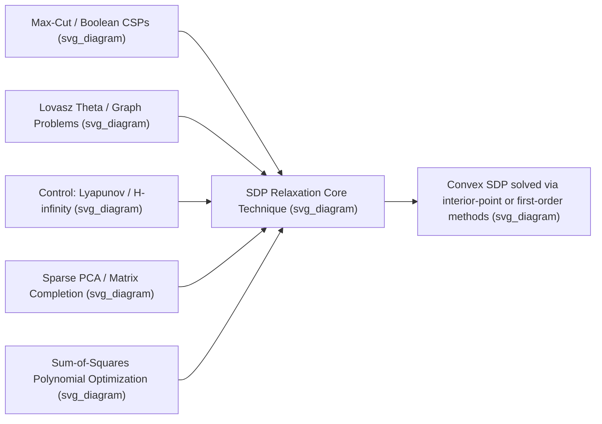

## Applications of SDP Relaxations

### Overview and Motivation

Many important optimization problems are NP-hard in their original, non-convex form, especially those involving discrete variables (such as $\pm1$ or $\{0,1\}$ constraints) or non-convex quadratic constraints (such as rank restrictions). Semidefinite programming (SDP) relaxations replace these intractable formulations with convex problems that can be solved in polynomial time, producing bounds and, often, high-quality approximate solutions. The general recipe is to "lift" a vector variable $x \in \mathbb{R}^n$ into a matrix variable $X = xx^T \in \mathbb{R}^{n \times n}$, relax the rank-one, non-convex constraint $X = xx^T$ to the convex constraint $X \succeq xx^T$ (equivalently $X \succeq 0$ together with an appropriate Schur complement condition), and drop rank restrictions entirely.

**Key Points**

- The lifting trick converts quadratic expressions in $x$ into linear expressions in $X$, since $x^TQx = \langle Q, xx^T\rangle = \langle Q, X\rangle$.
- Dropping the rank-one constraint on $X$ enlarges the feasible set, so the relaxed SDP's optimal value is always a valid bound (upper or lower, depending on the sense of optimization) on the original combinatorial or non-convex problem.
- The quality of an SDP relaxation is typically measured by its integrality gap or approximation ratio: how far the relaxed bound can be from the true combinatorial optimum in the worst case.

### The Max-Cut Problem and the Goemans-Williamson Relaxation

The Max-Cut problem asks for a partition of a graph's vertices into two sets maximizing the number (or total weight) of edges crossing between them. Formulated with $\pm1$ variables $x_i \in \{-1,+1\}$ indicating each vertex's side, the objective becomes:

$$\max_{x \in \{-1,1\}^n} \; \sum_{(i,j)\in E} w_{ij} \frac{1-x_ix_j}{2}$$

This is NP-hard in general. The Goemans-Williamson SDP relaxation replaces the scalar $x_i$ with unit vectors $v_i \in \mathbb{R}^n$ and relaxes the product $x_ix_j$ to the inner product $v_i^Tv_j$, giving the SDP:

$$\max_{X \succeq 0} \; \sum_{(i,j)\in E} w_{ij}\frac{1-X_{ij}}{2} \quad \text{s.t.} \quad X_{ii} = 1 \;\; \forall i$$

After solving this SDP, a random hyperplane through the origin is used to round the vectors $v_i$ back into $\pm1$ labels, producing an actual graph cut.

**Key Points**

- The Goemans-Williamson algorithm guarantees an expected approximation ratio of at least $0.878$ relative to the true maximum cut, a substantial improvement over the $0.5$ ratio achieved by naive random assignment.
- This was historically significant as one of the first demonstrations that SDP relaxations combined with randomized rounding could achieve provably strong approximation guarantees for an NP-hard combinatorial problem.
- The technique of "vector relaxation plus random hyperplane rounding" pioneered by this result has since been generalized to many other combinatorial and constraint-satisfaction problems.

Below is a diagram illustrating the lifting and rounding pipeline:

<svg xmlns="http://www.w3.org/2000/svg" viewBox="0 0 460 260">
<text x="230" y="24" text-anchor="middle" font-size="14" font-weight="bold" fill="#1a1a1a">SDP Relaxation Pipeline (svg_diagram)</text>
<rect x="20" y="60" width="110" height="50" rx="6" fill="#a8d0e6" stroke="#2a6f97" />
<text x="75" y="90" text-anchor="middle" font-size="11" fill="#1a1a1a">Combinatorial problem in x</text>
<rect x="175" y="60" width="110" height="50" rx="6" fill="#f4a259" fill-opacity="0.5" stroke="#bc4b17" />
<text x="230" y="85" text-anchor="middle" font-size="11" fill="#1a1a1a">Lift to X = xx^T,</text>
<text x="230" y="98" text-anchor="middle" font-size="11" fill="#1a1a1a">relax to X ≥ 0</text>
<rect x="330" y="60" width="110" height="50" rx="6" fill="#a8d0e6" stroke="#2a6f97" />
<text x="385" y="90" text-anchor="middle" font-size="11" fill="#1a1a1a">Solve convex SDP</text>
<rect x="175" y="170" width="110" height="50" rx="6" fill="#c9e4ca" stroke="#3a7d44" />
<text x="230" y="195" text-anchor="middle" font-size="11" fill="#1a1a1a">Round to feasible</text>
<text x="230" y="208" text-anchor="middle" font-size="11" fill="#1a1a1a">combinatorial solution</text>
<line x1="130" y1="85" x2="175" y2="85" stroke="#444" stroke-width="1.5" marker-end="url(#arrow1)" />
<line x1="285" y1="85" x2="330" y2="85" stroke="#444" stroke-width="1.5" marker-end="url(#arrow1)" />
<line x1="385" y1="110" x2="285" y2="170" stroke="#444" stroke-width="1.5" marker-end="url(#arrow1)" />
</svg>

### Combinatorial Optimization Beyond Max-Cut

**Graph Coloring and Independent Sets**

The Lovász theta function, $\vartheta(G)$, is an SDP-based quantity that sandwiches the independence number and clique cover number of a graph:

$$\alpha(G) \le \vartheta(G) \le \bar\chi(G)$$

where $\alpha(G)$ is the independence number and $\bar\chi(G)$ is the clique cover number of the complement graph. This makes $\vartheta(G)$ computable in polynomial time via SDP even though $\alpha(G)$ itself is NP-hard to compute exactly.

**Key Points**

- The Lovász theta function is one of the earliest and most celebrated applications of SDP to combinatorial optimization, predating the general popularization of SDP solvers.
- It provides exact values for special graph classes (e.g., perfect graphs), where $\vartheta(G) = \alpha(G) = \bar\chi(G)$.

**Quadratic Assignment and Graph Partitioning**

SDP relaxations are used to obtain strong lower bounds for the quadratic assignment problem (QAP) and for balanced graph partitioning, both of which are notoriously difficult combinatorial problems where even moderately sized instances resist exact solution. These relaxations typically incorporate additional valid inequalities (e.g., from the matrix being doubly stochastic in QAP) to tighten the basic lifting bound.

**Boolean and MAX-SAT Problems**

Similar lifting-and-rounding techniques apply to MAX-2SAT, MAX-3SAT, and related constraint satisfaction problems, often achieving approximation guarantees that match or approach known hardness-of-approximation limits for these problems. [Inference] Whether a specific SDP-based approximation ratio is known to be tight (matching a proven hardness bound) depends on the particular problem variant and should be checked against current results in approximation algorithms literature.

### Control Theory Applications

**Lyapunov Stability Analysis**

Determining whether a linear dynamical system $\dot x = Ax$ is stable reduces to finding a positive definite matrix $P$ satisfying the Lyapunov inequality:

$$A^TP + PA \prec 0, \qquad P \succ 0$$

This is a linear matrix inequality (LMI) feasibility problem — a direct SDP feasibility question — rather than requiring eigenvalue computation of $A$ directly, which becomes especially valuable when extending to uncertain or time-varying systems.

**Robust Control and $H_\infty$ Synthesis**

SDPs are used extensively to synthesize robust controllers under model uncertainty, including:

- $H_\infty$ norm minimization for disturbance rejection, formulated via the Bounded Real Lemma as an LMI.
- Simultaneous stabilization of multiple plant models sharing a common Lyapunov function.
- Linear parameter-varying (LPV) control synthesis, where controller gains are scheduled based on measured parameters subject to LMI constraints.

**Key Points**

- The translation of classical control criteria (stability, $H_2$/$H_\infty$ performance, pole placement regions) into LMI form was a major driver of SDP's adoption in engineering practice during the 1990s.
- Software such as the MATLAB LMI Control Toolbox and later general-purpose SDP solvers made these formulations broadly accessible to control engineers.

### Machine Learning Applications

**Kernel Learning**

SDPs are used to learn an optimal kernel matrix (or combination of kernel matrices) from data, subject to constraints such as positive semidefiniteness of the resulting kernel and alignment with label information, in a framework often called "kernel learning" or "multiple kernel learning."

**Sparse PCA and Sparse Recovery**

Sparse principal component analysis can be relaxed to an SDP by lifting the sparse unit vector $x$ to $X=xx^T$ and adding an $\ell_1$-norm penalty on $X$ to encourage sparsity, since the exact cardinality-constrained problem is NP-hard.

**Matrix Completion and Recommendation Systems**

The nuclear-norm minimization approach to low-rank matrix completion (used in collaborative filtering and recommender systems) can be formulated as an SDP, since the nuclear norm has a well-known SDP characterization:

$$\|X\|_* \le t \iff \exists\, W_1, W_2 \succeq 0 \text{ s.t. } \begin{bmatrix} W_1 & X \\ X^T & W_2\end{bmatrix} \succeq 0, \; \text{tr}(W_1)+\text{tr}(W_2) \le 2t$$

**Key Points**

- Nuclear-norm-based matrix completion via SDP provides theoretical recovery guarantees under incoherence conditions on the underlying low-rank matrix, connecting SDP relaxations to modern compressed sensing theory.
- In practice, large-scale matrix completion problems are often solved with specialized first-order or non-convex methods rather than generic SDP solvers, since the SDP lifting to $\begin{bmatrix}W_1 & X\\ X^T & W_2\end{bmatrix}$ roughly doubles the problem dimension. [Inference] The specific choice between SDP-based and non-convex approaches in practice depends on problem scale and required accuracy.

### Sum-of-Squares (SOS) Programming for Polynomial Optimization

SDP relaxations underlie the sum-of-squares hierarchy for global polynomial optimization. A polynomial $p(x)$ is a sum of squares if $p(x) = \sum_k q_k(x)^2$ for some polynomials $q_k$; checking whether a given polynomial admits such a decomposition (of bounded degree) reduces to an SDP feasibility problem via a quadratic-form representation of the monomials.

**Key Points**

- The Lasserre/Parrilo hierarchy builds a sequence of increasingly large SDP relaxations for polynomial optimization problems, with the property that, under mild conditions, the sequence of bounds converges to the true global optimum as the relaxation order increases.
- SOS programming is widely used to certify global nonnegativity of polynomials, construct Lyapunov functions for nonlinear (not just linear) dynamical systems, and bound the optimal value of polynomial optimization problems that are otherwise intractable.
- [Inference] The practical size of polynomial optimization problems that can be handled by SOS/SDP hierarchies is limited by the rapid growth in SDP matrix dimension with polynomial degree and number of variables, so this approach is most tractable for problems with a moderate number of variables or with exploitable sparsity/symmetry structure.

### Worked Example: SDP Bound for a Small Max-Cut Instance

Consider a triangle graph (3 vertices, all pairwise connected, unit edge weights). The true maximum cut value is 2 (any bipartition separates exactly 2 of the 3 edges, since a triangle cannot be bipartitioned perfectly). The Goemans-Williamson SDP relaxation for this instance solves:

$$\max \; \sum_{(i,j)} \frac{1-X_{ij}}{2} \quad \text{s.t.} \quad X_{ii}=1, \; X\succeq 0$$

**Output**

By symmetry, the SDP-optimal solution places the three unit vectors at mutual angles of $120°, giving $X_{ij} = -\tfrac12
 for all pairs. Substituting into the objective yields $3 \cdot \tfrac{1-(-1/2)}{2} = 3 \cdot 0.75 = 2.25. This SDP bound of $2.25
 exceeds the true integer optimum of $2, illustrating that the relaxation is not tight for this instance, though the Goemans-Williamson rounding procedure applied to this SDP solution will still recover a genuine cut of value $2
 with high probability, consistent with the guaranteed $0.878$ approximation ratio ($2/2.25 \approx 0.889$, comfortably above the worst-case guarantee).

### Conclusion

SDP relaxations form a unifying convex-optimization bridge across combinatorial optimization, control theory, machine learning, and polynomial optimization. By lifting non-convex or discrete problems into a higher-dimensional space and relaxing rank or integrality constraints, SDP provides tractable bounds and often near-optimal solutions with rigorous approximation guarantees, most famously in the Goemans-Williamson Max-Cut algorithm. The same lifting principle extends naturally into the sum-of-squares hierarchy, connecting SDP to global polynomial optimization, and into engineering practice through the ubiquitous linear matrix inequality formulations of control theory.

**Related Topics**

- Semidefinite Programming — Fundamentals and Applications
- Interior-Point Methods for Semidefinite Programs
- Duality in Conic Programming
- Sum-of-Squares and Polynomial Optimization Hierarchies
- Randomized Rounding Techniques for Approximation Algorithms
- Linear Matrix Inequalities in Robust Control Design
- Low-Rank Matrix Recovery and Compressed Sensing