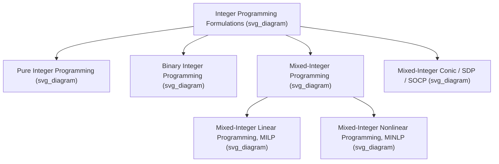

## Integer Programming Formulation Types

### Overview

Integer programming (IP) extends linear and convex optimization by requiring some or all decision variables to take integer values. The way a problem is formulated — which variables are integer, how logical conditions are encoded, and how constraints are structured — has a dramatic effect on solvability in practice, even when two formulations are mathematically equivalent. This topic surveys the major formulation types and modeling patterns used across integer and mixed-integer programming.

**Key Points**

- Formulation quality is typically judged by the tightness of its linear programming (LP) relaxation: tighter relaxations (closer to the integer hull) generally lead to faster branch-and-bound solve times.
- Two formulations can represent the same feasible set of integer points yet have very different LP relaxations, and hence very different practical solvability.
- Choosing the right formulation type is often more consequential for solve time than choosing the solving algorithm itself.

### Pure Integer Programming (IP)

In a pure integer program, all decision variables are required to be integers:

$$\min_{x \in \mathbb{Z}^n} \; c^Tx \quad \text{s.t.} \quad Ax \le b$$

**Key Points**

- Pure IPs are used when every quantity being decided is inherently discrete and none can meaningfully take fractional values, such as counts of indivisible items.
- Solving pure IPs to optimality is NP-hard in general, though special structure (e.g., totally unimodular constraint matrices) can make specific instances polynomially solvable via the LP relaxation alone.

### Binary Integer Programming (BIP) / 0-1 Programming

A special and extremely common case restricts variables to $\{0,1\}$:

$$\min_{x \in \{0,1\}^n} \; c^Tx \quad \text{s.t.} \quad Ax \le b$$

Binary variables are the natural encoding for yes/no decisions: whether to select an item, open a facility, assign a task, or activate an edge in a network.

**Key Points**

- Many classical combinatorial optimization problems (knapsack, set cover, facility location, assignment, graph coloring) are naturally expressed as BIPs.
- Binary variables are also the building block for encoding logical conditions (see the logical modeling section below), even in problems that are not intrinsically 0-1 in nature.

### Mixed-Integer Programming (MIP)

Mixed-integer programs combine integer (or binary) variables with continuous variables:

$$\min_{x \in \mathbb{Z}^{n_1},\, y \in \mathbb{R}^{n_2}} \; c^Tx + d^Ty \quad \text{s.t.} \quad Ax + By \le b$$

**Key Points**

- MIP is the most widely used formulation type in practice because most real applications mix discrete decisions (which machine to use, which route to take) with continuous ones (how much to produce, how much time to allocate).
- Mixed-Integer Linear Programming (MILP) refers specifically to the case where the objective and constraints are linear; Mixed-Integer Nonlinear Programming (MINLP) allows nonlinear (possibly non-convex) terms, and is substantially harder to solve in general.
- Modern commercial and open-source solvers (Gurobi, CPLEX, HiGHS, SCIP) are primarily built around efficient MILP solving, with more limited but growing support for convex and non-convex MINLP.

### Mixed-Integer Conic Programming

Integer restrictions can be layered on top of any convex conic program, giving rise to mixed-integer second-order cone programs (MISOCP) and mixed-integer semidefinite programs (MISDP):

$$\min_{x \in \mathbb{Z}^{n_1},\, z} \; c^Tx + f^Tz \quad \text{s.t.} \quad \|A_iz+b_i\|_2 \le c_i^Tz + d_i, \; \; x \in \mathbb{Z}^{n_1}$$

**Key Points**

- MISOCP arises naturally in portfolio optimization with cardinality constraints (limiting the number of assets held) combined with risk constraints expressed as norm bounds.
- MISDP is used, for example, in sparse PCA with an explicit cardinality constraint, or in certain robust and combinatorial control problems, but remains far less mature in general-purpose solver support than MILP or MISOCP. [Inference] The relative scarcity of production-grade MISDP solvers compared to MILP/MISOCP solvers reflects the current state of solver development rather than a fundamental theoretical barrier alone.

### Logical Modeling with Binary Variables

A major use of integer programming formulations is encoding logical relationships that would otherwise be non-convex or discontinuous.

**Big-M Constraints**

To model an implication such as "if binary variable $z=1$, then constraint $a^Tx \le b$ must hold, otherwise it is unconstrained," a big-$M$ formulation is used:

$$a^Tx \le b + M(1-z)$$

where $M$ is a sufficiently large constant that makes the constraint vacuous when $z=0$.

**Key Points**

- Choosing $M$ too large weakens the LP relaxation (makes it looser, slowing branch-and-bound), while choosing $M$ too small can cut off valid integer solutions, so tight, problem-specific big-M values are important for good performance.
- Big-M formulations are simple to write but are often the weakest (loosest-relaxation) way to encode a logical condition; tighter alternatives exist for many common patterns.

**Indicator Constraints**

Many modern solvers support indicator constraints natively: $z=1 \implies a^Tx \le b$, avoiding the need to choose a big-M value manually. Internally, solvers may still convert these to big-M form or handle them via specialized branching, depending on the solver.

**Disjunctive Constraints**

To model "either constraint $A$ or constraint $B$ must hold" (a logical OR), one common formulation introduces a binary variable $z$ and applies big-M to each side:

$$a_1^Tx \le b_1 + Mz, \qquad a_2^Tx \le b_2 + M(1-z)$$

**Fixed-Charge / Setup Cost Modeling**

A very common pattern ties a continuous variable's activity to a binary "on/off" decision, e.g., production quantity $y$ incurring a fixed setup cost only if $y>0$:

$$y \le M \cdot z, \qquad z \in \{0,1\}$$

with a fixed cost $f \cdot z$ added to the objective.

**Key Points**

- Fixed-charge formulations appear throughout facility location, lot-sizing, and network design problems, where opening a facility or activating a link incurs a setup cost independent of the volume routed through it.
- The tightness of the big-M bound in these formulations (i.e., how close $M$ is to the true maximum possible value of $y$) directly affects how quickly the relaxation approximates the true feasible region.

### Formulation Strength: Compact vs. Extended Formulations

**Compact Formulations**

A compact formulation uses a number of variables and constraints that is polynomial in the natural input size of the problem. These are easy to write down and pass directly to a solver but sometimes have weak LP relaxations.

**Extended Formulations**

An extended formulation introduces additional variables (often exponentially many, or polynomially many but with a different structure) to represent the convex hull of feasible solutions more tightly, sometimes projecting back down to fewer variables. Classic examples include:

- The Miller-Tucker-Zemlin (MTZ) subtour elimination constraints for the Traveling Salesman Problem (TSP), which use $O(n)$ additional continuous variables to forbid subtours without enumerating an exponential number of subtour-elimination inequalities.
- Multi-commodity flow reformulations of network design problems, which introduce flow variables per commodity to tighten the relaxation relative to a single-commodity aggregate formulation.

**Key Points**

- MTZ formulations for TSP are compact but typically give a weaker LP bound than the exponential-size subtour elimination formulation, which is instead handled via cutting-plane (lazy constraint) generation rather than being written out in full.
- The general principle — that a larger, structured formulation can have a strictly tighter LP relaxation than a smaller "natural" one — is a recurring theme across network design, scheduling, and routing formulations. [Inference] Whether the extra size of an extended formulation is worth its tighter bound is problem- and solver-dependent, and is often determined empirically.

### Formulations for Classic Combinatorial Problems

**Assignment and Matching**

The assignment problem uses binary variables $x_{ij} \in \{0,1\}$ indicating whether agent $i$ is assigned to task $j$, with constraints ensuring each agent and each task is matched exactly once. This formulation happens to have an integral LP relaxation (its constraint matrix is totally unimodular), so it can, in fact, be solved as an LP without explicit integer restrictions.

**Set Covering, Packing, and Partitioning**

- **Set covering**: $\min \sum_j c_jx_j$ s.t. $\sum_{j: i \in S_j} x_j \ge 1$ for all elements $i$, $x_j \in \{0,1\}$.
- **Set packing**: same structure with $\le 1$ instead of $\ge 1$.
- **Set partitioning**: same structure with equality $=1$.

These three variants share a common binary-variable structure but differ in constraint sense, and appear across crew scheduling, facility location, and districting applications.

**Traveling Salesman Problem**

Beyond MTZ, the TSP is also formulated using degree constraints (each city has exactly two incident selected edges) plus subtour elimination constraints, either via the exponential Dantzig-Fulkerson-Johnson formulation (solved via lazy cutting planes) or the compact but weaker MTZ formulation described above.

**Key Points**

- The assignment problem's natural integrality is an example of how certain combinatorial structures (bipartite matching, transportation problems, network flow problems) yield formulations that need no explicit integer constraints at all, due to total unimodularity.
- Set covering, packing, and partitioning formulations are template patterns that recur across many application domains once a problem is recognized as fitting one of these structures.

### Symmetry-Breaking Formulations

When a problem has symmetric solutions (e.g., identical facilities that could be numbered in any order), the natural formulation can have many equivalent optimal solutions that are simply relabelings of each other, which can drastically slow branch-and-bound. Symmetry-breaking constraints (e.g., imposing an ordering $z_1 \ge z_2 \ge \dots \ge z_k$ on otherwise interchangeable binary indicator variables) are added purely to eliminate this redundancy without changing the optimal objective value.

**Key Points**

- Symmetry-breaking does not change the optimal value of the problem; it only removes redundant equivalent solutions from the search space to speed up solution.
- Many modern solvers include automatic symmetry detection and breaking, but manually designed symmetry-breaking constraints (tailored to the specific problem structure) can still substantially outperform automatic detection in some cases. [Inference] The relative benefit of manual versus automatic symmetry-breaking is instance-dependent and is typically evaluated empirically for a given application.

### Worked Example: Facility Location Formulation Comparison

Consider a simplified facility location problem: decide which of $m$ candidate facilities to open (binary $y_j$) and how much demand from each of $n$ customers to serve from each facility (continuous $x_{ij} \ge 0$), minimizing fixed opening costs plus transportation costs, subject to each facility only serving customers if it is open.

**Weak (aggregated) formulation:**

$$\sum_i x_{ij} \le M_j y_j \quad \forall j$$

**Strong (disaggregated) formulation:**

$$x_{ij} \le d_i y_j \quad \forall i,j$$

**Output**

The disaggregated formulation, despite having many more constraints (one per customer-facility pair rather than one per facility), produces a strictly tighter LP relaxation because each individual customer's assignment is directly tied to the facility's open/closed status, rather than being bounded only in aggregate. This is a canonical illustration of the general principle that more constraints do not necessarily mean slower solving — a tighter but larger formulation frequently outperforms a smaller but weaker one in overall branch-and-bound time. [Inference] The magnitude of this speedup is instance-dependent, though the qualitative direction (disaggregated dominates aggregated in relaxation tightness) is a well-established structural fact for this class of formulation.

### Conclusion

The choice of integer programming formulation type — pure integer, binary, mixed-integer, or mixed-integer conic — together with the specific modeling patterns used for logical conditions, symmetry, and problem-specific structure, has a first-order impact on solvability that often outweighs the choice of solving algorithm itself. Understanding the trade-offs between compact and extended formulations, and recognizing when a problem's structure yields naturally tight or naturally integral formulations, is a core modeling skill in applied integer programming.

**Related Topics**

- Branch-and-Bound and Branch-and-Cut Algorithms
- Cutting Plane Methods and Valid Inequalities
- Total Unimodularity and Integral Polyhedra
- Column Generation and Dantzig-Wolfe Decomposition
- Applications of SDP Relaxations
- Mixed-Integer Nonlinear Programming (MINLP) Solution Methods
- Lagrangian Relaxation for Integer Programming