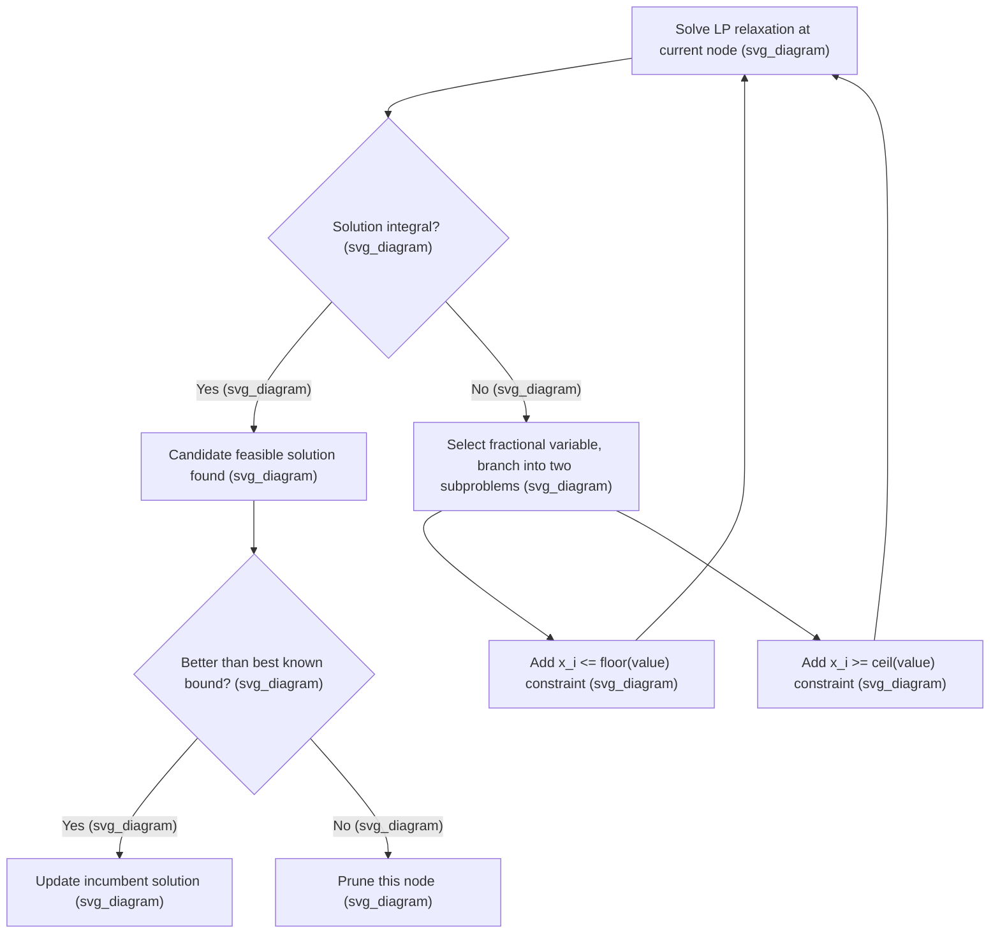

## Linear Relaxation of Integer Programs

### Definition

The linear relaxation of an integer program (IP) or mixed-integer program (MIP) is obtained by dropping the integrality restrictions on the decision variables while keeping every other constraint unchanged. Given the integer program

$$\min_{x \in \mathbb{Z}^n} \; c^Tx \quad \text{s.t.} \quad Ax \le b, \quad x \ge 0$$

its linear relaxation is:

$$\min_{x \in \mathbb{R}^n} \; c^Tx \quad \text{s.t.} \quad Ax \le b, \quad x \ge 0$$

The only change is replacing $x \in \mathbb{Z}^n$ with $x \in \mathbb{R}^n$; the feasible region is enlarged from a discrete set of lattice points to the full continuous polyhedron containing them.

**Key Points**

- The relaxed feasible region always contains every feasible point of the original integer program, since integer points satisfying $Ax \le b$ automatically satisfy the same constraints as real numbers.
- Because the relaxation optimizes the same objective over a superset of the original feasible set, its optimal value is always at least as good as the integer program's optimal value for minimization problems (a valid lower bound), and at most as good for maximization problems (a valid upper bound).
- The relaxation is a linear program and can be solved efficiently (in polynomial time) using the simplex method or interior-point methods, even when the original integer program is NP-hard.

### Geometric Interpretation

The linear relaxation's feasible region is a polyhedron, while the original integer program's feasible region is the set of integer (lattice) points inside that polyhedron. The **integer hull** — the convex hull of all feasible integer points — is itself a polyhedron, generally strictly smaller than the LP relaxation's polyhedron, unless the formulation happens to be "ideal."

<svg xmlns="http://www.w3.org/2000/svg" viewBox="0 0 420 300">
<text x="210" y="24" text-anchor="middle" font-size="14" font-weight="bold" fill="#1a1a1a">LP Relaxation vs Integer Hull (svg_diagram)</text>
<polygon points="60,250 350,240 330,90 130,60" fill="#a8d0e6" fill-opacity="0.5" stroke="#2a6f97" stroke-width="1.5" />
<text x="300" y="110" font-size="11" fill="#2a6f97">LP feasible region</text>
<polygon points="130,220 280,210 260,120 160,110" fill="#f4a259" fill-opacity="0.5" stroke="#bc4b17" stroke-width="1.5" />
<text x="190" y="235" font-size="11" fill="#bc4b17">integer hull</text>
<circle cx="130" cy="220" r="3" fill="#1a1a1a" />
<circle cx="280" cy="210" r="3" fill="#1a1a1a" />
<circle cx="260" cy="120" r="3" fill="#1a1a1a" />
<circle cx="160" cy="110" r="3" fill="#1a1a1a" />
<circle cx="200" cy="165" r="3" fill="#1a1a1a" />
</svg>

**Key Points**

- If the LP relaxation's feasible polyhedron coincides exactly with the integer hull, the formulation is called "ideal," and solving the LP relaxation alone directly yields an optimal integer solution, since every vertex of the polyhedron is already an integer point.
- Total unimodularity of the constraint matrix $A$ is a sufficient condition guaranteeing that every basic feasible solution of the LP relaxation is automatically integral, making the relaxation ideal for that formulation.
- Even when a formulation is not ideal, the tightness (closeness) of the relaxation's polyhedron to the true integer hull strongly influences how quickly branch-and-bound converges to the true optimum.

### Role in Branch-and-Bound

The linear relaxation is the computational core of the branch-and-bound algorithm, the standard method for solving general integer and mixed-integer programs.

**Key Points**

- At each node of the branch-and-bound search tree, the LP relaxation of that node's subproblem is solved to obtain a bound; if this bound is worse than the best known integer solution (the incumbent), the entire node can be pruned without further exploration.
- If the LP relaxation's optimal solution happens to be integral, no branching is needed at that node, and the solution is immediately a candidate for the incumbent.
- If the LP solution has fractional values, branching selects a fractional variable $x_i$ (with value, say, $2.4) and creates two child subproblems by adding $x_i \le 2
   and $x_i \ge 3$ respectively, which together exclude the fractional point without excluding any integer feasible solution.
- The efficiency of branch-and-bound is highly sensitive to the tightness of the LP relaxation: a tighter relaxation produces bounds closer to the true integer optimum, enabling more aggressive pruning and a smaller search tree.

### The Integrality Gap

The **integrality gap** of a formulation measures the worst-case ratio (or difference) between the optimal value of the LP relaxation and the optimal value of the original integer program:

$$\text{gap} = \frac{z_{LP}}{z_{IP}} \quad \text{(for maximization, ratio form)}$$

or, in absolute terms, $z_{IP} - z_{LP}$ for a minimization problem.

**Key Points**

- A small or zero integrality gap indicates the LP relaxation closely approximates or exactly captures the integer program's optimal value, which is highly desirable both for solver performance and for using the LP bound as a proxy for the true answer.
- Integrality gaps are used extensively in the theoretical analysis of approximation algorithms: a formulation with a proven integrality gap of, say, $2$, guarantees that rounding an LP solution can be no worse than twice the true integer optimum in the worst case, for algorithms that achieve that bound.
- Different formulations of the same combinatorial problem can have very different integrality gaps; part of the modeling art in integer programming is finding formulations (or adding valid inequalities) that reduce the gap.

### Improving the Relaxation: Cutting Planes and Valid Inequalities

Since a weak LP relaxation slows branch-and-bound, a major algorithmic strategy is to tighten the relaxation by adding **valid inequalities** — constraints that are satisfied by every integer feasible point but that cut off some fractional (non-integer) points from the current LP relaxation's feasible region.

**Common families of cutting planes include:**

- **Gomory cuts**: derived algebraically from the simplex tableau of the current LP relaxation, valid for any pure integer program.
- **Cover inequalities**: used in knapsack-type constraints to exclude fractional solutions that violate the discrete "cover" structure of the constraint.
- **Clique and odd-cycle inequalities**: used in graph-based formulations (e.g., independent set, coloring) derived from combinatorial substructures of the underlying graph.
- **Flow cover and mixed-integer rounding (MIR) cuts**: widely used in general-purpose MILP solvers as broadly applicable, automatically generated cuts.

**Key Points**

- Cutting planes are added iteratively: after solving the LP relaxation, violated valid inequalities are identified (a step called "separation") and added to the formulation, and the relaxation is re-solved, repeating until no further improving cuts are found or found to be too expensive to search for.
- The combination of cutting planes with branch-and-bound is called branch-and-cut, and is the algorithmic backbone of essentially all modern commercial and open-source MILP solvers (Gurobi, CPLEX, HiGHS, SCIP).
- Some cutting planes (e.g., Gomory cuts) are guaranteed to eventually yield the integer hull in a finite number of rounds in theory, but this convergence can require [Inference] a very large number of rounds in practice, which is why modern solvers rely on a mix of cut families combined with branching rather than pure cutting-plane methods alone.

### LP Relaxation Bounds vs. Other Relaxation Techniques

The LP relaxation is the most common relaxation technique for integer programs, but it is not the only one:

- **Lagrangian relaxation** dualizes a subset of complicating constraints into the objective with multipliers, often producing tighter bounds than the plain LP relaxation for certain structured problems, at the cost of a more complex bounding procedure (typically requiring a subgradient or bundle method to optimize the multipliers).
- **SDP relaxation** lifts the problem into matrix space (as discussed in the context of combinatorial optimization), often producing strictly tighter bounds than the LP relaxation for problems like Max-Cut, at higher per-iteration computational cost.

**Key Points**

- For many structured combinatorial problems, the Lagrangian dual bound is at least as tight as the LP relaxation bound, and can be strictly tighter, though it is generally more expensive to compute.
- The relative tightness ordering LP relaxation $\le$ Lagrangian dual $\le$ SDP relaxation $\le$ true integer optimum (for a minimization problem) often holds for well-studied combinatorial problems, though [Inference] the exact ordering and gap sizes are problem-specific and should not be assumed to hold universally without verification for a given formulation.

### Worked Example: Simple Knapsack Relaxation

Consider a 0-1 knapsack problem: maximize $\sum_i v_ix_i$ subject to $\sum_i w_ix_i \le W$, $x_i \in \{0,1\}$, with three items having values $(v_1,v_2,v_3) = (60, 100, 120)$, weights $(w_1,w_2,w_3) = (10, 20, 30)$, and capacity $W=50$.

**LP relaxation solution**: Sorting by value-to-weight ratio gives ratios $6, 5, 4$ for items 1, 2, 3 respectively. The LP-optimal solution greedily fills capacity by ratio: take all of item 1 ($w=10$) and item 2 ($w=20$), using $30$ of the $50$ capacity, then take a fractional amount of item 3: $x_3 = 20/30 = 2/3$. This gives an LP objective of $60 + 100 + \tfrac{2}{3}\cdot120 = 240$.

**Integer-feasible solutions**: Checking all-or-nothing combinations, taking items 2 and 3 ($w=20+30=50$, exactly at capacity) gives value $100+120=220$, which is the true integer optimum for this instance.

**Output**

The LP relaxation bound of $240$ overestimates the true integer optimum of $220, giving an integrality gap of $20
 (or a ratio of $240/220 \approx 1.09) for this specific instance. This is a classic illustration of why the simple greedy-by-ratio LP solution cannot generally be rounded directly to an optimal (or even always feasible) integer solution — in this case, rounding $x_3
 down to $0$ leaves capacity unused relative to the true optimal pairing of items 2 and 3, showing that the best integer solution is not necessarily "close" to the fractional LP solution in terms of which items are selected. [Inference] The specific 9% gap observed here is instance-specific; knapsack integrality gaps vary with the particular values, weights, and capacity chosen.

### Practical Implications for Solver Performance

**Key Points**

- Presolving techniques (bound tightening, coefficient reduction, redundant constraint removal) are typically applied to the LP relaxation before branch-and-bound begins, often significantly improving the relaxation's tightness at negligible computational cost.
- Warm-starting: because branch-and-bound solves many closely related LP relaxations (one per node, differing only by a single added bound), solvers reuse the previous node's optimal basis via dual simplex warm-starts, making each subsequent LP solve typically much faster than solving from scratch. [Inference] The magnitude of this warm-start speedup depends on how much the added branching bound changes the optimal basis, which varies by instance and node.
- Reporting the LP relaxation bound alongside the best known integer solution (the "optimality gap") is standard practice in commercial and open-source solvers, giving users a real-time measure of solution quality even before the search terminates.

### Conclusion

The linear relaxation is the foundational bounding mechanism that makes practical integer programming possible: by discarding integrality constraints, it yields an efficiently solvable LP whose optimal value bounds the true integer optimum and whose fractional solution guides the branching process in branch-and-bound. The gap between the relaxation and the true integer hull — the integrality gap — governs both theoretical approximation guarantees and practical solver performance, motivating the extensive use of cutting planes, alternative relaxations such as Lagrangian and SDP relaxations, and careful formulation design to keep this gap as small as possible.

**Related Topics**

- Integer Programming Formulation Types
- Branch-and-Bound and Branch-and-Cut Algorithms
- Cutting Plane Methods and Valid Inequalities
- Total Unimodularity and Integral Polyhedra
- Lagrangian Relaxation for Integer Programming
- Applications of SDP Relaxations
- Approximation Algorithms and Integrality Gap Analysis