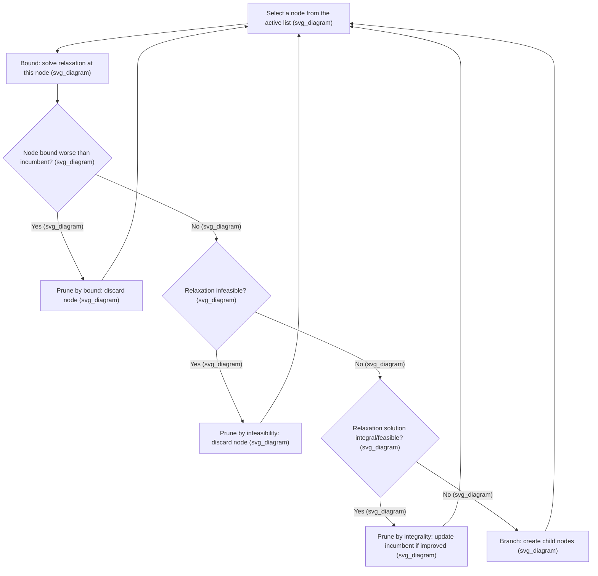
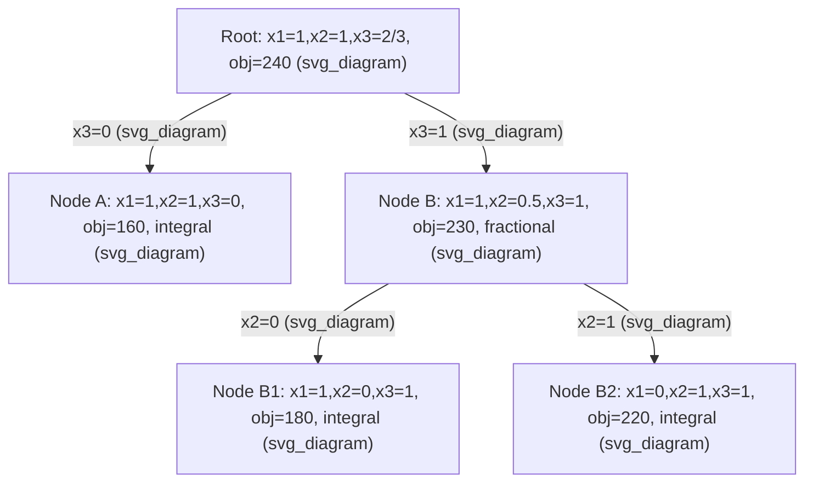

## Branch and Bound Algorithm Mechanics

### Overview

Branch and bound is a general algorithmic framework for solving integer and combinatorial optimization problems to global optimality by systematically exploring the space of candidate solutions, using bounds to prune (discard) large portions of that space without explicitly examining them. It combines a "divide and conquer" search strategy (branching) with an efficiently computable bound (typically from a linear relaxation) that certifies when a region of the search space cannot contain a better solution than one already found.

**Key Points**

- Branch and bound is exact: when run to completion, it returns a provably optimal solution, unlike heuristics that only return approximate answers.
- The algorithm's efficiency comes entirely from pruning; in the worst case it may enumerate every feasible integer solution, but in practice strong bounds allow it to discard the vast majority of the search space.
- The framework is generic and applies beyond linear integer programming, to combinatorial problems such as the traveling salesman problem, knapsack problems, and general mixed-integer nonlinear programs, wherever a valid relaxation bound can be computed at each node.

### Core Components

**The Search Tree**

Branch and bound organizes its exploration as a tree, where the root node represents the original problem (with the relaxation applied), and each child node represents a subproblem with additional restrictions imposed relative to its parent.

**The Relaxation Bound**

At each node, a relaxation of the subproblem (most commonly its LP relaxation) is solved to obtain a bound on the best possible objective value achievable within that node's subtree. For a minimization problem, this bound is a lower bound; branch and bound for maximization problems instead computes upper bounds at each node.

**The Incumbent**

The incumbent is the best complete, feasible integer solution found so far during the search. It is updated whenever a newly discovered feasible solution improves upon it, and it defines the current "best known value" used for pruning.

**Key Points**

- The relationship between global lower bound (best bound across all open nodes) and incumbent value defines the current optimality gap, which shrinks as the search progresses and reaches zero exactly when optimality is proven.
- A node's bound only needs to be valid (never overly optimistic in the wrong direction), not tight, for the algorithm to remain correct; tightness only affects speed, not correctness.

### The Four Fundamental Operations

**1. Branching**

When a node's relaxation solution is fractional (not integer-feasible), the node is split into two or more child subproblems by adding constraints that partition the current feasible region, ensuring no integer feasible point is lost while excluding the fractional relaxation solution.

**2. Bounding**

Each newly created node's relaxation is solved to obtain a bound, which is compared against the current incumbent to decide whether the node warrants further exploration.

**3. Pruning**

A node can be discarded (pruned) from further consideration for any of three reasons:

- **Pruning by bound**: the node's relaxation bound is no better than the current incumbent, so no solution in its subtree can improve upon what is already known.
- **Pruning by infeasibility**: the node's relaxation itself is infeasible, meaning the added branching constraints admit no solutions at all, integer or fractional.
- **Pruning by integrality (optimality within the node)**: the node's relaxation solution happens to already be integer-feasible, so no further branching is needed in that subtree; if it improves the incumbent, it is adopted as the new incumbent.

**4. Selection**

At each iteration, one node is chosen from the list of active (not-yet-processed) nodes to explore next, according to a node selection strategy.

### Branching Variable Selection

When multiple variables are fractional in a relaxation solution, the choice of which one to branch on significantly affects search tree size.

**Key Points**

- **Most fractional branching**: selects the variable whose fractional value is closest to $0.5$, on the intuition that this represents maximum "uncertainty."
- **Pseudocost branching**: uses historical information from earlier branching decisions on each variable (how much the objective bound changed after branching on it previously) to estimate which variable will yield the most effective bound improvement.
- **Strong branching**: explicitly (and expensively) solves the child-node relaxations for several candidate branching variables before committing to a branch, choosing whichever candidate produces the best bound improvement; this is more computationally costly per node but often reduces total tree size enough to be worthwhile.
- [Inference] Modern commercial solvers typically use a hybrid strategy, such as pseudocost branching seeded or periodically refined by strong branching, though the exact default strategy and its tuning varies by solver and version.

### Node Selection Strategies

**Key Points**

- **Depth-first search**: explores as deep into the tree as possible before backtracking; tends to find feasible integer solutions quickly (useful for establishing a good incumbent early) and uses less memory since fewer nodes remain active at once.
- **Best-first search**: always selects the active node with the most promising (best) bound, which tends to minimize the total number of nodes explored to prove optimality, at the cost of potentially higher memory usage since many nodes may remain active simultaneously.
- **Hybrid strategies** (e.g., best-first with periodic diving, or best-estimate search) combine depth-first's quick incumbent discovery with best-first's efficient bound-driven pruning, and are standard in modern MILP solvers. [Inference] The specific hybrid strategy and its parameters differ across solver implementations and are often adaptively tuned during the search itself.

### Worked Example: Small Knapsack Branch-and-Bound Trace

Consider the 0-1 knapsack from the linear relaxation example: values $(60,100,120)$, weights $(10,20,30)$, capacity $W=50$, maximizing total value.

**Root node**: LP relaxation gives $x_1=1, x_2=1, x_3=2/3$, objective $240. Since $x_3
 is fractional, branch on $x_3$.

**Node A ($x_3=0$)**: Relaxation becomes maximize with item 3 excluded; optimal is $x_1=1,x_2=1$ (uses $30$ of $50$ capacity, fully integral), objective $160. This is integer-feasible, so it becomes a candidate incumbent: incumbent $=160
.

**Node B ($x_3=1$)**: Item 3 is forced in, consuming $30$ of $50$ capacity, leaving $20$ for items 1 and 2. Relaxation gives $x_1=1$ ($w=10$, remaining capacity $10) and $x_2=10/20=0.5
 (fractional), objective $60 + 50 + 120 = 230. Since $230 > 160
 (current incumbent), this node is not pruned by bound, and branching continues on $x_2$.

**Node B1 ($x_2=0, x_3=1$)**: With items 2 excluded and 3 included, remaining capacity $20$ fits item 1 fully; $x_1=1$, objective $60+120=180, integer-feasible. Since $180 > 160
, update incumbent to $180$.

**Node B2 ($x_2=1, x_3=1$)**: Items 2 and 3 together already use exactly $50$ capacity ($20+30); $x_1
 must be $0. This gives $x_1=0,x_2=1,x_3=1
, objective $100+120=220, integer-feasible. Since $220>180
, update incumbent to $220$.

**Output**

At this point, all nodes have been either pruned or resolved to integer-feasible solutions, and the best bound among remaining active nodes is no better than $220, so the search terminates with a proven optimal value of $220
, achieved by selecting items 2 and 3 only. This matches the true optimum identified directly in the linear relaxation discussion, and the trace illustrates all three pruning types: Node A was resolved by integrality immediately, Node B required further branching due to its promising bound, and the final comparison across B1 and B2 shows how incumbents are updated as better integer solutions are discovered.

### Termination and Optimality Certification

**Key Points**

- The algorithm terminates when the active node list is empty, meaning every branch of the tree has been either pruned or fully resolved; at that point, the current incumbent is provably the global optimum.
- If the algorithm is stopped early (e.g., due to a time limit), it can still report the incumbent along with the best remaining bound among unexplored active nodes, giving a certified optimality gap even without proving optimality exactly.
- This anytime property — being able to report a feasible solution with a bounded gap at any point during the search — is one of the most practically valuable features of branch and bound for large, real-world instances that cannot be solved to proven optimality within available time.

### Performance Considerations

**Key Points**

- The size of the branch-and-bound tree is highly sensitive to formulation quality (as discussed in linear relaxation and formulation topics): tighter relaxations produce better bounds, leading to more aggressive pruning and smaller trees.
- Combining branch and bound with cutting planes — the branch-and-cut approach — tightens the relaxation bound at each node dynamically, often dramatically reducing tree size compared to branch and bound alone.
- Warm-starting each node's LP relaxation from its parent's optimal basis (via dual simplex) is a standard implementation technique that significantly reduces the per-node computational cost, since consecutive relaxations typically differ by only a single added bound. [Inference] The magnitude of this speedup varies with how much each branching decision perturbs the optimal basis, which is instance-dependent.
- In practice, problem-specific primal heuristics (e.g., rounding heuristics, diving heuristics, or feasibility pumps) are often run at select nodes to find good incumbents earlier, improving pruning power throughout the rest of the search even before optimality is proven.

### Conclusion

Branch and bound systematically searches the space of integer feasible solutions by recursively partitioning the problem (branching) and using efficiently computable relaxation bounds to eliminate entire regions of the search space without explicit enumeration (bounding and pruning). Its correctness relies only on the validity of the bound at each node, while its practical efficiency depends heavily on branching variable selection, node selection strategy, and the tightness of the underlying relaxation — making it the algorithmic foundation on which nearly all modern integer and mixed-integer programming solvers are built, typically in the extended form of branch and cut.

**Related Topics**

- Linear Relaxation of Integer Programs
- Integer Programming Formulation Types
- Cutting Plane Methods and Valid Inequalities
- Branch-and-Cut and Modern MILP Solver Architecture
- Heuristics for Mixed-Integer Programming (Diving, Feasibility Pump, Rounding)
- Column Generation and Branch-and-Price
- Parallel and Distributed Branch-and-Bound Search