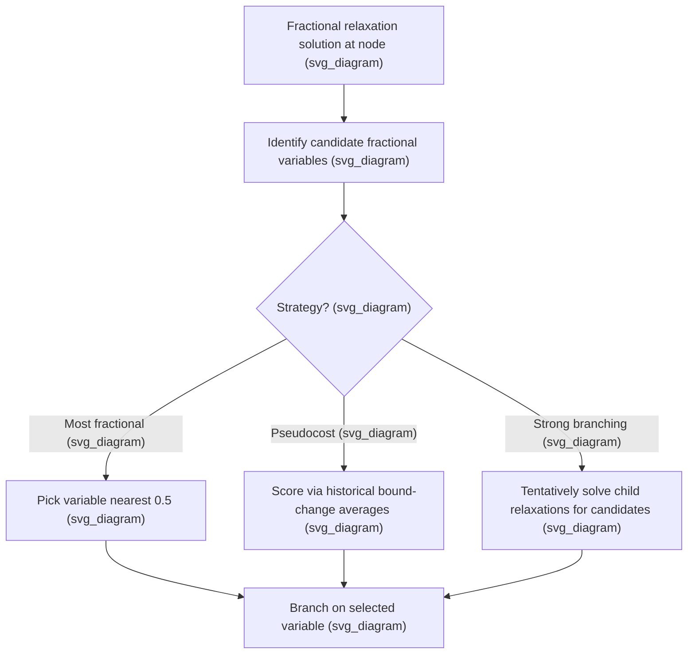

## Branching Strategies and Variable Selection

### Overview

Branching variable selection determines which fractional variable to split on at each node of a branch-and-bound search tree. Although any valid branching rule preserves correctness, the choice of variable can change the size of the resulting search tree by orders of magnitude. This topic examines the major branching strategies used in modern mixed-integer programming solvers, their trade-offs, and the underlying reasoning for why some strategies outperform others in practice.

**Key Points**

- Branching decisions only affect the speed of the search, never its correctness — any sequence of valid branching constraints eventually finds the same proven optimum.
- The two branching decisions at each node are typically: (1) which fractional variable to select, and (2) which child (the floor or ceiling branch) to explore first, though the second choice mainly affects how quickly a good incumbent is found rather than final tree size.
- Good branching rules aim to produce children whose relaxation bounds change as much as possible relative to the parent, since a larger bound change enables earlier pruning.

### Naive Branching Rules

**Most Fractional Branching**

This rule selects the variable whose fractional part is closest to $0.5$:

$$i^\star = \arg\min_i \left| x_i - \lfloor x_i \rfloor - 0.5 \right|$$

The intuition is that a value near $0.5$ represents the greatest "uncertainty" about whether the variable should round up or down.

**First/Last Fractional Branching**

Simpler still, this selects the first (or last) fractional variable encountered when scanning the variable list in index order, requiring no computation of fractional distances at all.

**Key Points**

- Most fractional branching is intuitive but frequently performs poorly in practice, since a fractional value near $0.5$ does not necessarily correlate with how much branching on that variable will change the objective bound.
- First/last fractional branching is essentially arbitrary with respect to problem structure and is rarely competitive on harder instances, though it is sometimes used as a cheap fallback or baseline for comparison.
- [Inference] The relative ranking of naive rules can vary across problem classes; most fractional and first-fractional branching are both generally dominated by pseudocost- and strong-branching-based methods on harder MILP benchmarks, though exceptions exist for specific problem structures.

### Pseudocost Branching

Pseudocost branching estimates, for each variable, how much the objective bound is expected to change per unit of fractional movement, based on the history of previous branching decisions made on that variable earlier in the search.

For variable $x_i$ with fractional value $f_i = x_i - \lfloor x_i \rfloor$, two pseudocosts are tracked:

$$\Psi_i^- = \text{average bound degradation per unit decrease (down-branch)}, \qquad \Psi_i^+ = \text{average bound degradation per unit increase (up-branch)}$$

The estimated bound degradation from branching on $x_i$ is then:

$$\Delta_i^- = f_i \cdot \Psi_i^-, \qquad \Delta_i^+ = (1-f_i)\cdot\Psi_i^+$$

and variables are typically scored by a combination such as $\min(\Delta_i^-, \Delta_i^+)$ or a weighted product, with the highest-scoring variable selected.

**Key Points**

- Pseudocosts are updated online as the search progresses: every time a variable is actually branched on, the true bound change observed is used to refine that variable's pseudocost estimate for future decisions.
- Because a variable may not have been branched on yet early in the search, pseudocost branching requires an initialization strategy for variables with no history — commonly using strong branching results, problem-specific estimates, or global averages across all variables as a placeholder.
- Pseudocost branching is computationally cheap per decision (just an arithmetic lookup and comparison) once pseudocosts are established, making it a practical default for large-scale search.

### Strong Branching

Strong branching directly measures the effect of branching on a candidate variable by actually solving (or partially solving) both child relaxations before committing to a decision.

**Procedure:**

1. Identify a set of candidate fractional variables (often not all of them, to control cost).
2. For each candidate $x_i$, tentatively solve the down-branch relaxation ($x_i \le \lfloor x_i\rfloor$) and the up-branch relaxation ($x_i \ge \lceil x_i \rceil$), typically limiting the number of simplex iterations allowed for speed.
3. Score each candidate based on the actual bound degradation observed in both children (e.g., using the same $\min$ or product combination rule as pseudocost branching, but with exact rather than estimated values).
4. Select the variable with the best score and discard the trial relaxation solves (only the chosen variable's branch is retained).

**Key Points**

- Strong branching produces the most information-rich branching decisions of the strategies discussed here, typically yielding the smallest search trees in terms of node count.
- The computational cost of solving two relaxations per candidate variable, for potentially many candidates, makes strong branching expensive per node — often the dominant cost of the entire node processing time when used exhaustively.
- **Limited or partial strong branching** — restricting the candidate set (e.g., to variables with the most promising pseudocost estimates) and/or capping simplex iterations during the trial solves — is the practical compromise used in production solvers, balancing decision quality against per-node cost.

### Hybrid and Reliability Branching

**Pseudocost Reliability Branching**

This hybrid strategy uses pseudocost estimates by default but falls back to strong branching whenever a variable's pseudocost history is considered "unreliable" — typically meaning it has been branched on fewer than a threshold number of times (e.g., fewer than $8$ prior observations, though [Inference] specific thresholds vary by solver implementation and are often configurable parameters).

**Key Points**

- Reliability branching captures much of strong branching's decision quality early in the search (when pseudocosts are unreliable) while reverting to pseudocost branching's cheap lookup once enough history has accumulated, giving a favorable balance of decision quality and computational cost.
- This strategy, or close variants of it, is the default branching approach in several major commercial and open-source MILP solvers. [Inference] Exact default configurations, thresholds, and further refinements differ across specific solvers and their versions, so practitioners should consult current solver documentation for precise defaults.

### Other Branching Considerations

**Branching Direction (Which Child First)**

After selecting a branching variable, the solver must decide whether to explore the floor branch or the ceiling branch first. Common heuristics include rounding the fractional value to the nearer integer, or using the pseudocost-estimated degradation to guess which side is more likely to contain a good feasible solution, in order to find a strong incumbent sooner.

**Variable Selection for Special Structures**

- **SOS (Special Ordered Set) branching**: for SOS1 (at most one nonzero) or SOS2 (at most two adjacent nonzero) constraints, branching partitions the set of variables directly rather than branching on a single variable's bound, better reflecting the combinatorial structure of the constraint.
- **Branching on general disjunctions**: rather than branching on a single variable's bound, some advanced methods branch on more general linear disjunctions (e.g., splitting on $\pi^Tx \le \pi_0$ vs. $\pi^Tx \ge \pi_0+1$ for some vector $\pi$), which can sometimes produce much tighter child relaxations than single-variable branching, at increased computational and implementation complexity.

**Key Points**

- Exploiting known problem structure (such as SOS constraints, or symmetry among variables) in the branching rule itself, rather than relying only on generic fractional-variable branching, often yields substantially smaller search trees for problems that have such structure.
- General disjunctive branching is more powerful in principle than single-variable branching but is less commonly used in general-purpose solvers due to the added complexity of generating and managing the disjunctions. [Inference] Its practical adoption varies by solver and problem domain, and is more common in specialized solvers built for particular problem classes.

### Worked Example: Comparing Rules on a Small Node

Suppose at some branch-and-bound node the LP relaxation gives three fractional variables: $x_1 = 0.5$, $x_2 = 0.9$, $x_3 = 0.3$. Suppose pseudocost history gives $\Psi_1^-=\Psi_1^+=4$, $\Psi_2^-=10, \Psi_2^+=2$, and $\Psi_3^-=1,\Psi_3^+=8$.

**Most fractional rule**: selects $x_1$, since $|0.5-0.5|=0$ is the smallest distance from $0.5, compared to $|0.9-0.5|=0.4
 and $|0.3-0.5|=0.2$.

**Pseudocost rule**: compute $\min(\Delta_i^-, \Delta_i^+)$ for each:

- $x_1$: $\Delta_1^- = 0.5\cdot4=2.0$, $\Delta_1^+=0.5\cdot4=2.0$, so $\min=2.0$.
- $x_2$: $\Delta_2^-=0.9\cdot10=9.0$, $\Delta_2^+=0.1\cdot2=0.2$, so $\min=0.2$.
- $x_3$: $\Delta_3^-=0.3\cdot1=0.3$, $\Delta_3^+=0.7\cdot8=5.6$, so $\min=0.3$.

Selecting the variable with the *largest* minimum degradation (to guarantee the worst-case child bound improves the most) gives $x_1$ again in this case, since $2.0 > 0.3 > 0.2$.

**Output**

In this particular example, both rules happen to agree on $x_1$, but this is coincidental to the specific pseudocost values chosen; had $\Psi_1^-$ and $\Psi_1^+$ been smaller (say, both equal to $1, giving $\min=0.5
), pseudocost branching would instead have favored $x_3$ over $x_1$ despite $x_1$ being closer to $0.5$, illustrating that fractional value alone is not always predictive of actual bound impact. [Inference] Real branching decisions in a solver also account for additional factors (e.g., reliability thresholds, tie-breaking rules, and problem-specific scaling), so this simplified hand-calculation illustrates the core scoring logic rather than an exact reproduction of any particular solver's internal computation.

### Practical Recommendations

**Key Points**

- For small to medium instances or early prototyping, default solver settings (typically reliability branching or a close variant) are usually a reasonable and effective choice without manual tuning.
- For very large-scale or repeatedly-solved problem classes (e.g., in production scheduling run daily), manually tuning branching priorities on known important variables, or exploiting special-structure branching (like SOS branching), can yield substantial additional speedups beyond generic reliability branching.
- Branching strategy interacts with node selection strategy and cutting plane generation; changes to one often shift the optimal choice for the others, so [Inference] performance tuning is generally most effective when these components are evaluated together rather than independently, though the degree of interaction varies by problem class.

### Conclusion

Branching variable selection sits at the heart of branch-and-bound's practical performance: naive rules like most-fractional branching are simple but often ineffective, strong branching provides the highest-quality decisions at high per-node cost, and pseudocost branching offers a cheap approximation once sufficient history is available. Reliability branching, which blends strong branching early with pseudocost branching later, captures much of the benefit of both and underlies the default behavior of most modern MILP solvers, while specialized rules for structured constraints (SOS sets, disjunctions) can yield further gains when problem structure permits.

**Related Topics**

- Branch and Bound Algorithm Mechanics
- Linear Relaxation of Integer Programs
- Cutting Plane Methods and Valid Inequalities
- Node Selection Strategies in Branch-and-Bound
- Primal Heuristics for Mixed-Integer Programming
- Special Ordered Sets and Structured Branching
- Branch-and-Cut and Modern MILP Solver Architecture