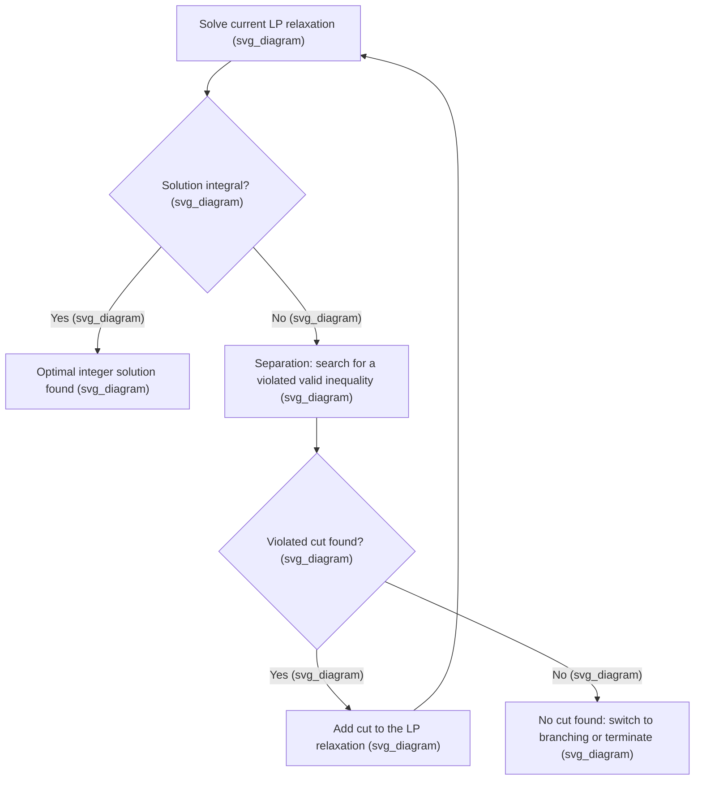

## Cutting Plane Methods for Integer Programming

### Overview

Cutting plane methods strengthen the linear relaxation of an integer program by iteratively adding valid inequalities — constraints satisfied by every integer feasible point but violated by the current fractional relaxation solution. Each added inequality "cuts off" a portion of the relaxation's feasible polyhedron without removing any integer feasible point, progressively tightening the relaxation toward the true integer hull. This topic covers the theoretical foundations, major cut families, and the separation problem that underlies practical cutting plane algorithms.

**Key Points**

- A cutting plane is valid if every feasible integer point satisfies it; it is useful (or "effective") if the current fractional LP solution violates it, since only violated cuts improve the relaxation.
- Cutting plane methods can, in principle, be used alone (pure cutting plane algorithms) or combined with branch and bound, the latter being known as branch-and-cut and the dominant approach in modern solvers.
- The general goal of adding cuts is to move the LP relaxation's feasible region progressively closer to the integer hull, ideally without excessive growth in the number of constraints.

### The General Cutting Plane Algorithm

**Key Points**

- The central computational task at each iteration is the **separation problem**: given a fractional point, either find a valid inequality it violates, or certify that none exists among the family being considered.
- The separation problem's difficulty varies dramatically by cut family: some cuts (e.g., Gomory cuts) can be separated in polynomial time directly from the simplex tableau, while others (e.g., general clique or odd-cycle inequalities) require solving auxiliary combinatorial subproblems.
- A pure cutting plane algorithm (with no branching) can in theory converge to the integer optimum for pure integer programs, but in practice can require an impractically large number of cuts or suffer from numerical instability, which is why virtually all modern solvers combine cutting planes with branching rather than relying on cuts alone.

### Gomory Cuts

Gomory cuts (also called Gomory fractional cuts) are derived directly and algebraically from the simplex tableau of the current LP relaxation, making them applicable to any pure integer program without requiring problem-specific structure.

**Derivation sketch**: given a basic variable $x_i$ with a fractional value in the current simplex tableau, its defining row can be written as:

$$x_i + \sum_{j \in N} a_{ij}x_j = b_i$$

where $N$ is the set of nonbasic variables. Separating the fractional parts of the coefficients and the right-hand side yields the Gomory cut:

$$\sum_{j \in N} f_{ij}x_j \ge f_i$$

where $f_{ij} = a_{ij} - \lfloor a_{ij}\rfloor$ and $f_i = b_i - \lfloor b_i \rfloor$ are the fractional parts.

**Key Points**

- Gomory cuts are guaranteed to cut off the current fractional solution, since the current basic solution has all nonbasic variables at zero, which violates the derived inequality whenever $f_i > 0$.
- A classical theoretical result establishes that repeatedly applying Gomory cuts converges to the integer optimum in a finite number of rounds for pure integer programs, though [Inference] the number of rounds required in the worst case can be very large, which historically limited the practical adoption of pure Gomory cutting until they were combined with branch-and-bound and complemented by other cut families.
- Modern solvers use refined variants such as **Gomory mixed-integer (GMI) cuts**, which extend the derivation to handle mixed-integer programs (where some variables are continuous), and apply numerical safeguards to address the instability that plain Gomory cuts can exhibit in floating-point arithmetic.

### Cover Inequalities

Cover inequalities arise from knapsack-type constraints of the form $\sum_i w_ix_i \le W$ with binary $x_i$. A **cover** is a subset $C$ of items whose total weight exceeds the capacity: $\sum_{i\in C} w_i > W$. Since not all items in a cover can be selected simultaneously, the cover inequality states:

$$\sum_{i \in C} x_i \le |C| - 1$$

**Key Points**

- A cover is **minimal** if removing any single item from $C$ makes it no longer exceed capacity; minimal covers generally produce stronger (tighter) inequalities than non-minimal ones.
- **Lifting** a cover inequality — extending it to include coefficients on variables outside $C$ — can further strengthen the cut without excluding any integer feasible point, and is a standard refinement applied in practice.
- Cover inequalities are especially effective for knapsack constraints and problems built from them, such as capital budgeting, capacitated facility location, and bin packing formulations.

### Clique and Odd-Cycle Inequalities

These cut families arise from graph structure implicit in a formulation's constraints.

**Clique Inequalities**

If a set of binary variables corresponds to vertices of a clique in a "conflict graph" (where an edge indicates that two variables cannot both be $1$ in any feasible solution), the clique inequality states that at most one variable in the clique can equal $1$:

$$\sum_{i \in Q} x_i \le 1$$

for a clique $Q$ in the conflict graph.

**Odd-Cycle Inequalities**

Arising in formulations related to matching, stable sets, or graph coloring, odd-cycle inequalities exploit the fact that an odd cycle in a graph cannot have all its vertices selected as an independent set simultaneously without violating adjacency constraints, yielding cuts of the form $\sum_{i \in C} x_i \le \lfloor |C|/2 \rfloor$ for an odd cycle $C$.

**Key Points**

- Both families require constructing and analyzing an auxiliary graph (the conflict graph, or the constraint graph of the formulation), making their separation more computationally involved than algebraic cuts like Gomory cuts.
- Finding a maximum-weight violated clique or odd cycle is itself NP-hard in general, so practical separation routines use heuristics rather than exact algorithms to find violated inequalities of these types within a reasonable time budget.

### Flow Cover and Mixed-Integer Rounding (MIR) Cuts

**Mixed-Integer Rounding (MIR) Cuts**

MIR cuts are derived from a simple base inequality involving one continuous and one integer variable, and generalize to a broadly applicable class of cuts that can be derived (via aggregation and rounding of existing constraints) for general mixed-integer programs, without requiring the specific structure of a knapsack or clique constraint.

**Flow Cover Inequalities**

Flow cover cuts arise in fixed-charge network flow formulations, where continuous flow variables are linked to binary "arc open" indicators; they generalize the cover inequality concept to this mixed-integer, flow-based setting.

**Key Points**

- MIR cuts are among the most broadly applicable and heavily used cut families in general-purpose MILP solvers, since they can be generated automatically from almost any pair of constraints without requiring the solver to recognize specialized problem structure (such as a knapsack or matching structure).
- Flow cover cuts are particularly effective in supply chain, logistics, and network design models with fixed costs, a very common real-world formulation pattern.
- [Inference] The relative contribution of each cut family to overall solver performance is highly instance-dependent; general-purpose solvers typically generate several cut families simultaneously at each node and select which to add based on measured effectiveness (violation, sparsity, numerical properties) rather than relying on a single family.

<svg xmlns="http://www.w3.org/2000/svg" viewBox="0 0 420 300">
<text x="210" y="24" text-anchor="middle" font-size="14" font-weight="bold" fill="#1a1a1a">Cutting Plane Tightening the Relaxation (svg_diagram)</text>
<polygon points="60,250 350,240 330,90 130,60" fill="#a8d0e6" fill-opacity="0.4" stroke="#2a6f97" stroke-width="1.5" />
<text x="290" y="105" font-size="11" fill="#2a6f97">original LP region</text>
<line x1="90" y1="230" x2="300" y2="100" stroke="#bc4b17" stroke-width="2.5" stroke-dasharray="5,3" />
<text x="230" y="150" font-size="11" fill="#bc4b17">added cut</text>
<polygon points="130,220 280,210 260,120 160,110" fill="#f4a259" fill-opacity="0.5" stroke="#bc4b17" stroke-width="1.5" />
<text x="190" y="235" font-size="11" fill="#bc4b17">integer hull</text>
<circle cx="225" cy="150" r="4" fill="#1a1a1a" />
<text x="235" y="145" font-size="10" fill="#1a1a1a">fractional pt cut off</text>
</svg>

### Lift-and-Project Cuts

Lift-and-project methods generate cuts by temporarily "lifting" the problem into a higher-dimensional space (often by considering a single binary variable's disjunction $x_j=0$ or $x_j=1$), deriving a valid inequality in that higher-dimensional space, and then projecting back down to the original variable space.

**Key Points**

- Lift-and-project cuts (including the disjunctive cuts of Balas, Ceria, and Cornuéjols) are generally stronger than simple algebraic cuts like Gomory cuts, since they exploit the disjunctive structure of integrality directly, but they are also more computationally expensive to generate.
- These methods form a bridge between the pure algebraic cut families and the theoretical hierarchy-based approaches (such as the Lasserre/Sherali-Adams hierarchies), which systematically generate increasingly tight relaxations at increasing computational cost.

### Separation and Practical Cut Management

**Key Points**

- Adding too many cuts can slow down each individual LP solve (since the relaxation grows in size) even as it tightens the bound, so solvers must balance cut quantity against per-iteration solve cost — a phenomenon sometimes called "cut proliferation."
- **Cut pool management**: rather than keeping every generated cut permanently, solvers often maintain a pool of generated cuts and periodically remove those that have become slack (non-binding) for many consecutive iterations, keeping the active relaxation compact.
- Cuts generated at one node of a branch-and-cut tree are often **globally valid** (applicable at every other node, not just the one where they were generated) when derived without using node-specific bound information, allowing them to be shared across the search tree for additional efficiency. [Inference] Whether a specific cut is globally valid versus only locally valid depends on its derivation and the specific bounds used in generating it, and this distinction is tracked internally by solver implementations.

### Worked Example: Cover Inequality on a Knapsack

Consider the knapsack constraint $10x_1 + 20x_2 + 30x_3 + 15x_4 \le 50$ with binary variables. Suppose the current LP relaxation solution is $x_1=1, x_2=1, x_3=2/3, x_4=0$ (as seen previously for the 3-item case, now extended with a fourth item for illustration).

**Identify a cover**: the subset $C=\{1,2,3\}$ has total weight $10+20+30=60 > 50, so it is a cover. Checking minimality: removing item 3 gives weight $30 \le 50
 (no longer exceeds capacity), removing item 2 gives weight $40 \le 50, and removing item 1 gives weight $50 \le 50
 (exactly at capacity, not exceeding); so $C=\{1,2,3\}$ is a minimal cover.

**Cover inequality**: $x_1 + x_2 + x_3 \le 2$.

**Output**

Evaluating the current fractional solution against this cut: $x_1+x_2+x_3 = 1+1+2/3 = 2.667 > 2$, so the cover inequality is violated and can be added to the relaxation. Re-solving the LP with this new constraint forces a reduction in $x_3$ (or a corresponding reduction in $x_1$ or $x_2$) to satisfy the cut, tightening the relaxation's bound below the original $240$ computed earlier and moving the fractional solution closer to an eventual integer-feasible point.

### Conclusion

Cutting plane methods systematically tighten the linear relaxation of an integer program by identifying and adding valid inequalities that separate the current fractional solution from the integer hull. Algebraic cuts like Gomory and MIR cuts apply broadly with modest separation cost, while structure-specific cuts like cover, clique, and flow cover inequalities exploit particular constraint patterns for stronger effect, and lift-and-project methods offer even greater strength at higher computational cost. In modern practice, these families are combined and managed carefully within the branch-and-cut framework, where cutting planes and branching work together to solve large-scale mixed-integer programs efficiently.

**Related Topics**

- Branch and Bound Algorithm Mechanics
- Linear Relaxation of Integer Programs
- Branching Strategies and Variable Selection
- Total Unimodularity and Integral Polyhedra
- Lift-and-Project Methods and Disjunctive Programming
- Sherali-Adams and Lasserre Relaxation Hierarchies
- Branch-and-Cut and Modern MILP Solver Architecture