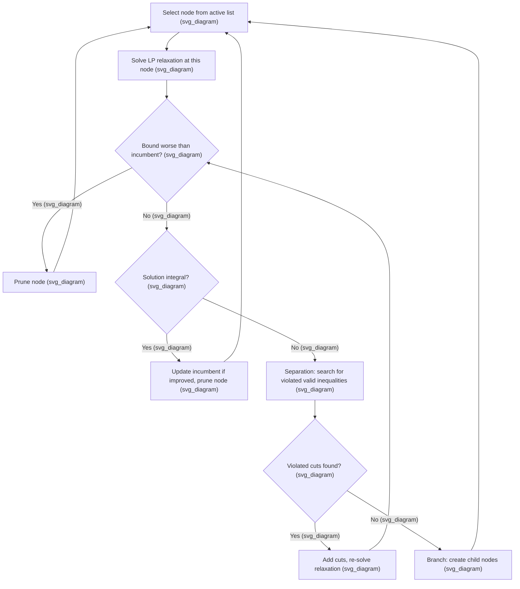

## Branch and Cut Algorithms

### Overview

Branch and cut integrates cutting plane generation directly into the branch-and-bound search tree, tightening the linear relaxation at nodes throughout the search rather than only bounding and branching on the original (weaker) relaxation. By adding valid inequalities at nodes as they are explored, branch and cut typically produces much smaller search trees than branch and bound alone, and is the algorithmic architecture underlying virtually all modern commercial and open-source mixed-integer programming solvers.

**Key Points**

- Branch and cut is not a separate algorithm from branch and bound so much as an enhancement of it: the branching and bounding logic remains the same, but the relaxation solved at each node is dynamically strengthened with cuts before any branching decision is made.
- The technique was central to solving large-scale instances of hard combinatorial problems, most famously the traveling salesman problem, where branch and cut using problem-specific cutting planes enabled solving instances with thousands of cities to proven optimality.
- Because cuts tighten the relaxation bound at every node where they are applied, branch and cut can prune nodes that would remain unresolved (requiring further branching) under branch and bound alone.

### Algorithmic Structure

**Key Points**

- The key structural addition relative to plain branch and bound is the loop between solving the relaxation and searching for violated cuts (separation), which repeats until either the node's solution becomes integral, no more useful cuts are found, or a cut-generation limit is reached.
- Cuts can be generated at every node ("aggressive" cutting), only at the root node, or at a limited subset of nodes (e.g., every $k$-th node, or only near the top of the tree), reflecting a trade-off between relaxation tightness and per-node computational cost.
- Once no further violated cuts can be found economically at a node, the algorithm falls back to standard branching, exactly as in plain branch and bound.

### Root Node Processing

The root node — representing the original problem before any branching — typically receives the most intensive cutting plane treatment, since improvements to the relaxation here benefit the entire remainder of the search tree.

**Key Points**

- Root-node cuts are almost always globally valid (applicable throughout the entire tree), since they are derived without reference to any branching decisions, making the computational investment at the root particularly valuable.
- Solvers commonly perform multiple "rounds" of cut generation and re-optimization at the root node alone before branching begins even once, often generating a substantial fraction of all cuts used during the entire solve at this stage.
- Root-node processing frequently also includes presolving (bound tightening, redundant constraint elimination, coefficient strengthening) alongside cut generation, compounding the tightening effect before the combinatorial branching phase starts.

### Local vs. Global Cuts

**Key Points**

- **Globally valid cuts** are valid across the entire original feasible region and, once generated, can be added to the relaxation at any node in the tree, not just the one where they were found.
- **Locally valid cuts** are only guaranteed valid within the specific branch of the tree where they were derived (for example, cuts that incorporate the specific bound restrictions imposed by branching decisions on the path from the root), and must be discarded or carefully tracked when moving to a different part of the tree.
- Most standard cut families (Gomory/GMI, cover inequalities, clique inequalities) are typically globally valid when derived from the original constraint data, while some specialized cuts exploit node-specific bounds and are inherently local; solver implementations track this distinction internally to decide how broadly a given cut can be reused. [Inference] The precise classification and handling of specific cuts as local versus global depends on solver implementation details.

### Cut Management and Pool Strategies

Because cuts accumulate over the course of the search, and a growing relaxation size increases per-node LP solve cost, careful cut management is essential for good performance.

**Key Points**

- **Cut pools** store generated cuts (particularly globally valid ones) so they can be reused at other nodes without re-deriving them, reducing redundant separation work.
- **Cut aging and removal**: cuts that become slack (non-binding, i.e., not tight at the optimal solution) for many consecutive LP solves are often removed from the active relaxation to keep it compact, though they may remain in the pool for potential future re-addition.
- Solvers typically limit the number of cuts added per round (e.g., only the most-violated cuts up to some cap) rather than adding every violated cut found, since adding too many simultaneously can degrade numerical stability and slow the LP re-solve disproportionately relative to the bound improvement gained.

### Combining Multiple Cut Families

Modern branch-and-cut implementations typically generate several cut families simultaneously at each cutting round, rather than relying on any single family.

**Key Points**

- Common combinations include Gomory/GMI cuts, mixed-integer rounding (MIR) cuts, cover inequalities (for knapsack-like constraints), clique inequalities (for conflict-graph structure), and flow cover cuts (for network flow structure), applied together whenever the relevant constraint patterns are detected in the formulation.
- Solvers use internal heuristics to prioritize which candidate cuts (across all families) to actually add, typically balancing the degree of violation, the sparsity of the resulting inequality (fewer nonzero coefficients tend to be numerically and computationally preferable), and estimated impact on the objective bound. [Inference] The exact prioritization heuristics and their relative weighting are proprietary or implementation-specific details that differ across solvers.
- Problem-specific cuts (e.g., subtour elimination constraints for the traveling salesman problem, discussed further below) can be added on top of these generic families when the modeler or solver recognizes the relevant combinatorial substructure.

### Lazy Constraints and Delayed Cut Generation

For problems with an extremely large (sometimes exponential) number of potential valid inequalities — the canonical example being the exponentially many subtour elimination constraints for the traveling salesman problem — it is computationally infeasible to write out all such constraints up front.

**Lazy constraint callbacks** allow the solver to check, whenever an integer-feasible candidate solution is found during the search, whether that solution actually violates any constraint from the large family (e.g., whether it contains a subtour); if so, the violated constraint is added and the search continues, rather than pre-generating the entire (potentially exponential) constraint set.

**Key Points**

- This delayed, on-demand approach to constraint generation is what makes branch and cut practical for problems like the TSP, where the natural formulation has an exponential number of subtour elimination constraints that cannot be enumerated directly.
- Lazy constraints are checked specifically when a candidate solution is integer-feasible with respect to the constraints already present, distinguishing them from ordinary cutting planes, which are typically separated against fractional relaxation solutions throughout the search.
- Most major solvers (Gurobi, CPLEX, SCIP, and others) provide explicit callback mechanisms for users to implement lazy constraint separation for their own problem-specific constraint families.

<svg xmlns="http://www.w3.org/2000/svg" viewBox="0 0 440 260">
<text x="220" y="24" text-anchor="middle" font-size="14" font-weight="bold" fill="#1a1a1a">Lazy Constraint Workflow for TSP-like Problems (svg_diagram)</text>
<rect x="30" y="60" width="130" height="50" rx="6" fill="#a8d0e6" stroke="#2a6f97" />
<text x="95" y="90" text-anchor="middle" font-size="11" fill="#1a1a1a">Integer-feasible candidate found</text>
<rect x="200" y="60" width="130" height="50" rx="6" fill="#f4a259" fill-opacity="0.5" stroke="#bc4b17" />
<text x="265" y="80" text-anchor="middle" font-size="11" fill="#1a1a1a">Check for</text>
<text x="265" y="93" text-anchor="middle" font-size="11" fill="#1a1a1a">subtours</text>
<rect x="30" y="160" width="130" height="50" rx="6" fill="#c9e4ca" stroke="#3a7d44" />
<text x="95" y="190" text-anchor="middle" font-size="11" fill="#1a1a1a">Accept as valid incumbent</text>
<rect x="200" y="160" width="150" height="50" rx="6" fill="#f4a259" fill-opacity="0.5" stroke="#bc4b17" />
<text x="275" y="180" text-anchor="middle" font-size="11" fill="#1a1a1a">Add subtour elimination</text>
<text x="275" y="193" text-anchor="middle" font-size="11" fill="#1a1a1a">constraint, resume search</text>
<line x1="160" y1="85" x2="200" y2="85" stroke="#444" stroke-width="1.5" marker-end="url(#arrow2)" />
<line x1="245" y1="110" x2="95" y2="160" stroke="#444" stroke-width="1.5" marker-end="url(#arrow2)" />
<line x1="285" y1="110" x2="285" y2="160" stroke="#444" stroke-width="1.5" marker-end="url(#arrow2)" />
</svg>

### Interaction with Branching Strategy

**Key Points**

- Cutting at a node changes the fractional solution the branching rule will see; effective cut generation can sometimes eliminate the need to branch at a node altogether by producing an integral solution directly.
- Reliability and pseudocost branching statistics are typically collected with respect to the post-cut relaxation at each node, so cut generation and branching variable selection interact throughout the search rather than operating independently.
- Excessive cutting at every single node can be counterproductive if it substantially slows down per-node LP solves without proportionate bound improvement; solvers often tune how aggressively to cut at deeper tree levels versus near the root. [Inference] The optimal balance between cutting intensity and branching intensity is instance-dependent and is typically the subject of internal solver heuristics and parameter tuning.

### Worked Example: Branch and Cut Sketch

Consider again the small integer program: maximize $x_1+x_2$ subject to $3x_1+2x_2\le12, $x_1+4x_2\le10
, integer, non-negative.

**Root node**: LP relaxation gives the fractional vertex $x_1=2.8, x_2=1.8$, objective $4.6$ (as in the Gomory cuts example). Rather than branching immediately, a GMI cut is generated from the fractional row, of the form derived previously, and added to the root relaxation.

**Re-solve with cut**: The tightened relaxation is re-solved; suppose this yields a new (still possibly fractional, but improved) bound, say objective $4.3$ at a new vertex closer to integrality.

**Continue cutting or branch**: If further violated cuts are found economically, another round is applied; once cuts are exhausted or judged not worth pursuing further, the algorithm branches on a remaining fractional variable (e.g., $x_2$), creating child nodes $x_2 \le 1$ and $x_2 \ge 2$.

**Output**

Because the root relaxation was tightened by the cut before branching, the resulting child-node relaxations start from a better (lower, for this maximization problem's upper bound) starting bound than they would have under plain branch and bound, meaning fewer additional branching levels are typically needed to close the gap to the eventual integer optimum. [Inference] The specific magnitude of the tree-size reduction from cutting versus plain branching is instance-dependent, though the qualitative direction — cuts generally reduce tree size when they meaningfully tighten the bound — is a well-established practical pattern.

### Practical Impact and Solver Architecture

**Key Points**

- Branch and cut, combined with strong presolving, primal heuristics, and reliability branching, is the standard architecture of essentially all modern general-purpose MILP solvers (Gurobi, CPLEX, HiGHS, SCIP, and others).
- The dramatic improvement in MILP solver capability over recent decades — from solving instances with dozens of integer variables to instances with millions — is attributed substantially to the maturation and combination of branch and cut's constituent techniques (cut generation, presolving, heuristics, and branching) rather than to any single component alone. [Unverified] Specific historical performance improvement figures (e.g., speedup factors over specific time periods) vary by source and benchmark methodology and should be checked against current, specific studies if precise figures are needed.
- Custom branch-and-cut implementations (via solver callback interfaces) remain the standard approach for solving very large or highly structured combinatorial problems (vehicle routing, network design, scheduling) where problem-specific cuts and lazy constraints substantially outperform generic, off-the-shelf formulations.

### Conclusion

Branch and cut combines the systematic search of branch and bound with the relaxation-tightening power of cutting planes, generating valid inequalities dynamically at nodes throughout the search tree rather than relying solely on branching to close the gap between relaxation and integer optimum. Root-node cutting, careful cut pool management, the distinction between globally and locally valid cuts, and lazy constraint generation for exponentially large constraint families together make branch and cut capable of solving large and highly structured combinatorial optimization problems that would be intractable under branch and bound alone, and this architecture underlies essentially every modern general-purpose mixed-integer programming solver.

**Related Topics**

- Branch and Bound Algorithm Mechanics
- Cutting Plane Methods for Integer Programming
- Gomory Cuts
- Branching Strategies and Variable Selection
- Column Generation and Branch-and-Price
- Traveling Salesman Problem Formulations and Subtour Elimination
- Presolving Techniques in Mixed-Integer Programming