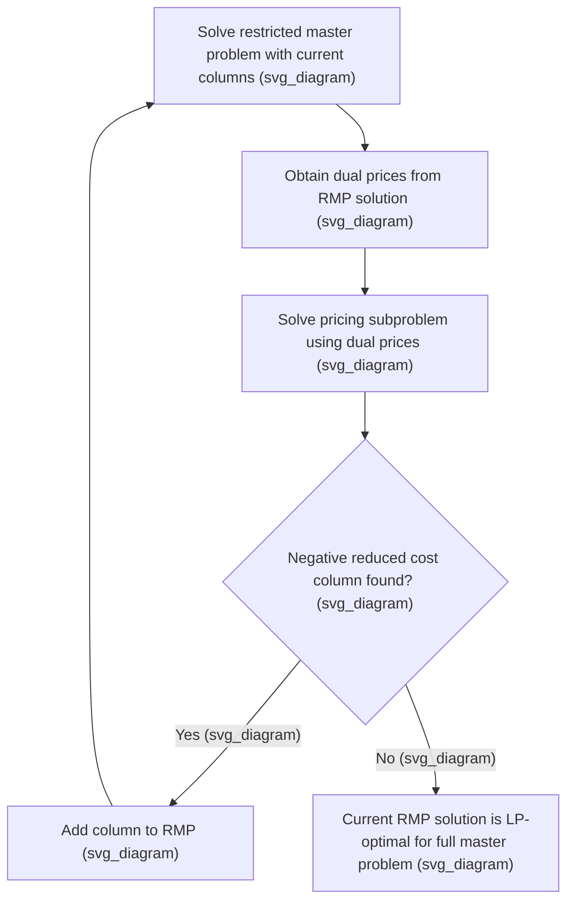

## Branch and Price for Large-Scale Integer Programs

### Overview

Branch and price combines branch and bound with column generation, enabling the solution of integer programs whose formulations contain an extremely large — often exponential — number of variables (columns) that cannot be enumerated explicitly. Rather than writing out every possible column up front, branch and price generates only the columns needed to prove optimality, dynamically pricing them in as the search progresses. This makes it the standard approach for large-scale problems such as crew scheduling, vehicle routing, and cutting stock, where the natural variable set is far too large to handle directly.

**Key Points**

- Branch and price is, in a sense, the "column" analogue of branch and cut's "row" (constraint) generation: cutting planes add constraints on demand, while column generation adds variables on demand, and both integrate into the same branch-and-bound framework.
- The technique is most valuable when a problem's extended (large-variable) formulation has a much tighter LP relaxation than its compact (natural, small-variable) formulation, since the tighter relaxation is only computationally accessible through column generation.
- Classic application domains include airline crew scheduling, vehicle routing problems, cutting stock and bin packing, and graph coloring, all of which admit natural formulations with an enormous number of candidate columns (e.g., one column per feasible crew schedule, vehicle route, or cutting pattern).

### Column Generation Background

**The Master Problem and Subproblem**

Column generation decomposes a large LP into a **restricted master problem** (RMP), containing only a small subset of the full column set, and a **pricing subproblem**, which searches for new columns with negative reduced cost (for minimization) that would improve the master problem's objective if added.

**Key Points**

- The pricing subproblem uses the dual variable values from the current RMP solution to evaluate whether any column outside the current subset could improve the objective; this is directly analogous to the separation problem in cutting plane methods, but applied to columns rather than to rows.
- When the pricing subproblem certifies that no column with negative reduced cost exists, the current RMP solution is proven optimal for the full (unrestricted) LP relaxation, even though only a small fraction of all possible columns were ever explicitly generated.
- The pricing subproblem often has exploitable combinatorial structure of its own (e.g., a shortest-path problem, a knapsack problem, or a bin-packing subproblem), which is what makes generating columns from an exponential set computationally tractable.

### From Column Generation to Branch and Price

Column generation alone solves the LP relaxation of the extended formulation. To obtain an integer-optimal solution, column generation must be embedded within a branch-and-bound search — this combination is branch and price.

**Key Points**

- At each node of the branch-and-bound tree, the LP relaxation is solved via column generation (i.e., the RMP and pricing subproblem loop runs to convergence at that node) rather than via a single direct LP solve.
- Branching decisions in branch and price must be made carefully so that the pricing subproblem remains tractable in child nodes; naive branching directly on individual column variables can destroy the subproblem's exploitable structure and make repricing computationally intractable.
- Because column generation must be re-run at every node, branch and price is generally significantly more implementation-intensive than standard branch and cut, and is typically justified only when the compact formulation's relaxation is too weak or the natural variable set is genuinely too large to enumerate.

### Branching in Branch and Price

The central technical challenge in branch and price is designing a branching rule that both (a) validly partitions the search space and (b) preserves the tractability of the pricing subproblem in each child node.

**Branching on Original Variables (When Possible)**

If the problem has a natural aggregate variable (e.g., total flow on an arc, or a directly meaningful quantity derived from summing over columns), branching on that aggregate quantity can sometimes be done without disturbing the subproblem structure.

**Ryan-Foster Branching**

For set-partitioning-type master problems (common in crew scheduling and similar applications), a widely used technique is Ryan-Foster branching, which branches on pairs of elements: forcing two elements (e.g., two tasks) to either always appear together in the same column, or never appear together in any selected column.

**Key Points**

- Ryan-Foster branching is specifically designed to preserve the combinatorial structure of the pricing subproblem (often a shortest-path or resource-constrained shortest-path problem), since "must be together" or "must be apart" restrictions can typically be enforced directly within the subproblem's own graph structure.
- Naive branching directly on individual column (path or pattern) variables is generally avoided in branch and price, since a single column variable being fixed to zero does not translate into a clean, reusable restriction on the pricing subproblem, and can require re-solving a substantially modified subproblem at every node.
- The specific branching scheme used in a branch-and-price implementation is highly problem-dependent, and designing an effective one requires understanding both the master problem's combinatorial meaning and the pricing subproblem's internal structure.

### The Pricing Subproblem in Practice

**Key Points**

- In vehicle routing problems, the pricing subproblem is typically a resource-constrained shortest path problem (RCSPP) over an underlying network, where "resources" (such as accumulated demand, time, or distance) must respect vehicle capacity and time-window constraints.
- In crew scheduling, the pricing subproblem is often a similar resource-constrained shortest path or path-selection problem over a network representing legal, feasible work schedules subject to labor regulations and rest requirements.
- In cutting stock problems, the pricing subproblem is a knapsack problem: finding the most profitable (with respect to current dual prices) way to cut a single raw material unit into smaller pieces satisfying demand.
- [Inference] The specific algorithm used to solve the pricing subproblem (dynamic programming, labeling algorithms, specialized shortest-path variants) depends heavily on the resource structure and constraints of the particular application, and this remains an active area of applied algorithm design.

<svg xmlns="http://www.w3.org/2000/svg" viewBox="0 0 440 260">
<text x="220" y="24" text-anchor="middle" font-size="14" font-weight="bold" fill="#1a1a1a">Branch and Price Architecture (svg_diagram)</text>
<rect x="30" y="60" width="150" height="60" rx="6" fill="#a8d0e6" stroke="#2a6f97" />
<text x="105" y="85" text-anchor="middle" font-size="11" fill="#1a1a1a">Restricted Master</text>
<text x="105" y="100" text-anchor="middle" font-size="11" fill="#1a1a1a">Problem (RMP)</text>
<rect x="260" y="60" width="150" height="60" rx="6" fill="#f4a259" fill-opacity="0.5" stroke="#bc4b17" />
<text x="335" y="85" text-anchor="middle" font-size="11" fill="#1a1a1a">Pricing Subproblem</text>
<text x="335" y="100" text-anchor="middle" font-size="11" fill="#1a1a1a">(e.g., shortest path)</text>
<line x1="180" y1="80" x2="260" y2="80" stroke="#444" stroke-width="1.5" marker-end="url(#arrow3)" />
<text x="220" y="70" font-size="9" fill="#444">dual prices</text>
<line x1="260" y1="100" x2="180" y2="100" stroke="#444" stroke-width="1.5" marker-end="url(#arrow3)" />
<text x="220" y="115" font-size="9" fill="#444">new columns</text>
<rect x="140" y="170" width="160" height="50" rx="6" fill="#c9e4ca" stroke="#3a7d44" />
<text x="220" y="190" text-anchor="middle" font-size="11" fill="#1a1a1a">Ryan-Foster or structure-</text>
<text x="220" y="203" text-anchor="middle" font-size="11" fill="#1a1a1a">preserving branching</text>
<line x1="180" y1="120" x2="220" y2="170" stroke="#444" stroke-width="1.5" marker-end="url(#arrow3)" />
</svg>

### Comparison with Compact Formulations

**Key Points**

- A compact (polynomially sized) formulation of the same problem may exist and can sometimes be solved directly via standard branch and cut, but its LP relaxation is often substantially weaker than the extended formulation's relaxation, motivating the extra implementation effort of branch and price.
- The classic example is the cutting stock problem: the compact formulation has a weak relaxation, while the pattern-based (column-per-cutting-pattern) formulation, solved via column generation, has a relaxation that is provably very close to the true integer optimum in practice.
- [Inference] The decision to invest in a branch-and-price implementation versus using a compact formulation directly in a general-purpose solver is typically driven by empirical evidence that the extended formulation's tighter bound translates into meaningfully faster or more scalable solving for the specific problem class and instance sizes of interest.

### Stabilization Techniques

Column generation, especially early in the process, is prone to slow convergence and oscillating dual values — a phenomenon often called the "tailing-off effect," where many iterations yield only marginal objective improvement.

**Key Points**

- **Dual stabilization techniques** (e.g., box constraints on dual variables, or smoothing dual values across iterations) are commonly used to reduce oscillation and accelerate convergence of the column generation loop.
- **Multiple column generation per iteration**: rather than adding only the single best-priced column at each pricing step, generating several good columns (from near-optimal solutions of the pricing subproblem) per iteration can reduce the total number of master-problem re-solves needed.
- [Inference] The specific stabilization method and its parameters that work best are problem- and instance-dependent, and this remains an active area of applied research within column generation practice.

### Worked Example: Cutting Stock Sketch

Consider a simplified cutting stock problem: raw material rolls of length $100$ must be cut to satisfy demand for pieces of length $45, $35
, and $25, with demands $10
, $15, and $20
 respectively.

**Compact formulation** would require pre-enumerating a large number of possible cutting patterns (ways to combine pieces within a $100$-length roll) as explicit variables, which grows large even for modest numbers of piece types.

**Master problem**: minimize the number of rolls used, where each column represents one feasible cutting pattern (e.g., one roll cut into two $45s and one $10
-length scrap, or one $45, one $35
, and one $20$, etc.), subject to meeting each piece's demand.

**Pricing subproblem**: given current dual prices $\pi_{45}, \pi_{35}, \pi_{25}$ (shadow prices on each demand constraint from the current RMP solution), solve a knapsack problem — maximize $\pi_{45}a + \pi_{35}b + \pi_{25}c$ subject to $45a+35b+25c \le 100, integer $a,b,c\ge0
 — to find the most valuable new cutting pattern to add.

**Output**

If the knapsack subproblem returns a pattern with reduced cost (value minus the cost of using one roll) that is positive, that pattern's corresponding column is added to the master problem and the process repeats; once no profitable pattern remains, the LP relaxation of the extended (pattern-based) formulation is proven optimal, and branch and price would then proceed to branch (using an appropriate structure-preserving rule) if this LP-optimal solution is fractional, in order to reach an integer-optimal cutting plan. [Inference] This sketch illustrates the mechanics of the master-subproblem interaction; a full worked numerical solution would require explicitly enumerating starting patterns and iterating the pricing step to convergence.

### Practical Software Considerations

**Key Points**

- Implementing branch and price generally requires more custom development than using an off-the-shelf MILP solver directly, since the pricing subproblem, branching rule, and master-subproblem interface are typically problem-specific and not automatically generated by general-purpose solvers.
- Frameworks and libraries exist to support branch-and-price implementation (providing generic infrastructure for the master problem, node management, and branching, while leaving the pricing subproblem to be supplied by the user), reducing but not eliminating the implementation burden relative to a generic MILP model. [Inference] The specific frameworks available and their capabilities change over time, so current options should be checked against up-to-date sources when selecting implementation tools for a specific project.
- Given its implementation complexity, branch and price is typically reserved for large-scale, recurring problem classes (e.g., an airline's daily crew scheduling) where the investment in a custom solution is justified by repeated use and the scale of the instances involved, rather than for one-off or smaller optimization tasks.

### Conclusion

Branch and price extends branch and bound with column generation, enabling exact solution of integer programs whose natural or tightest formulations involve far too many variables to enumerate explicitly. By solving a restricted master problem alongside a combinatorially structured pricing subproblem, and by using branching rules specifically designed to preserve that subproblem's tractability (such as Ryan-Foster branching), branch and price makes problems like vehicle routing, crew scheduling, and cutting stock solvable to proven optimality at scales that would be inaccessible to compact formulations alone, at the cost of substantially greater implementation complexity than standard branch and cut.

**Related Topics**

- Branch and Cut Algorithms
- Branch and Bound Algorithm Mechanics
- Linear Relaxation of Integer Programs
- Dantzig-Wolfe Decomposition
- Vehicle Routing Problem Formulations
- Cutting Stock and Bin Packing Problems
- Resource-Constrained Shortest Path Algorithms