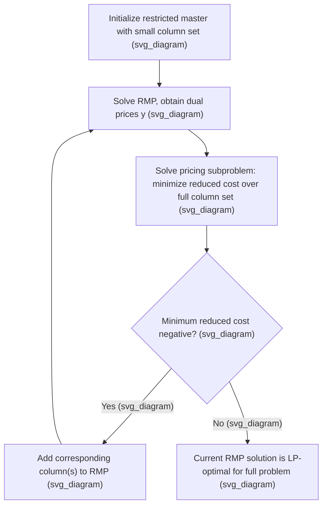

## Column Generation Techniques

### Overview

Column generation is a decomposition technique for solving linear programs with an extremely large — often exponential — number of variables (columns), without ever enumerating them explicitly. Instead of forming the full problem, a small restricted subset of columns is solved, and an auxiliary pricing subproblem is used to identify additional columns that could improve the objective, adding them one (or several) at a time until no further improving column exists. This topic covers the underlying theory, algorithmic mechanics, convergence behavior, and practical stabilization strategies for column generation, independent of its use inside branch and price.

**Key Points**

- Column generation exploits Dantzig-Wolfe-style decomposition: it is mathematically equivalent to applying the Dantzig-Wolfe decomposition principle to reformulate a structured LP into a master problem and one or more subproblems.
- The technique is most valuable when the extended (large-variable) formulation of a problem has a substantially tighter LP relaxation than any compact (small-variable) formulation, since the tighter bound is only accessible by working with the full, otherwise unmanageable, column set.
- Column generation solves a linear program exactly (to LP optimality) despite never listing all its columns, provided the pricing subproblem can certify that no further improving column exists.

### The Master Problem and Restricted Master Problem

Consider a linear program with an extremely large column set $\mathcal{J}$:

$$\min_{x} \; \sum_{j \in \mathcal{J}} c_jx_j \quad \text{s.t.} \quad \sum_{j\in\mathcal{J}} A_jx_j = b, \quad x_j \ge 0 \; \forall j \in \mathcal{J}$$

The **restricted master problem (RMP)** is the same linear program restricted to a small working subset $\mathcal{J}' \subset \mathcal{J}$:

$$\min_x \; \sum_{j\in\mathcal{J}'} c_jx_j \quad \text{s.t.} \quad \sum_{j\in\mathcal{J}'}A_jx_j = b, \quad x_j\ge0 \; \forall j\in\mathcal{J}'$$

**Key Points**

- The RMP is solvable directly by standard LP methods (simplex or interior-point), since $\mathcal{J}'$ is kept small enough to be tractable.
- Any feasible solution to the RMP is also feasible for the full master problem (by setting all columns outside $\mathcal{J}'$ to zero), so the RMP's optimal objective value is always an upper bound on the full master problem's optimal value (for minimization).
- The central question column generation answers at each iteration is whether any column outside the current $\mathcal{J}'$ could improve upon the RMP's current optimal solution.

### Reduced Cost and the Pricing Problem

For a minimization LP, a column $j$ has **reduced cost**:

$$\bar c_j = c_j - y^TA_j$$

where $y$ is the vector of dual variables (simplex multipliers) associated with the current RMP's optimal basis. A standard result from LP duality states that a column with negative reduced cost, if added to the basis, can strictly improve the objective; conversely, if every column in $\mathcal{J}$ has nonnegative reduced cost, the current RMP solution is already optimal for the full (unrestricted) master problem.

The **pricing subproblem** searches, implicitly over the entire (possibly exponential) column set $\mathcal{J}$, for a column with the most negative reduced cost:

$$\min_{j \in \mathcal{J}} \; \bar c_j = c_j - y^TA_j$$

**Key Points**

- The pricing subproblem is solved as an optimization problem in its own right, over whatever combinatorial or algebraic structure defines the set $\mathcal{J}$ (e.g., paths in a graph, cutting patterns, feasible schedules), rather than by explicit enumeration.
- If the pricing subproblem's optimal value is nonnegative, this constitutes a certificate that the RMP's current solution is optimal for the full master problem — no explicit enumeration of $\mathcal{J}$ is required to reach this conclusion.
- If the pricing subproblem finds a column with negative reduced cost, that column (with its actual coefficients $A_j$ and cost $c_j$) is added to $\mathcal{J}'$, and the RMP is re-solved.

### Dantzig-Wolfe Decomposition Connection

Column generation is the computational procedure that implements Dantzig-Wolfe decomposition. Given a linear program with block-angular structure — a set of "linking" constraints shared across all variables plus separate blocks of constraints each involving only a subset of variables — Dantzig-Wolfe reformulates each block's feasible region via its extreme points (and extreme rays, if unbounded), expressing any point in that block as a convex combination of its extreme points.

**Key Points**

- Each column generated during column generation corresponds to an extreme point (or extreme ray) of one of the subproblem's feasible regions in the original Dantzig-Wolfe decomposition framework.
- The master problem's constraints correspond to the original "linking" constraints, while the convexity constraints (ensuring the convex combination weights for each block sum to one) are additional rows automatically included in the reformulated master problem.
- This connection explains why the pricing subproblem often has a clean combinatorial interpretation (shortest path, knapsack, and so on): it is literally the optimization problem defining one block's feasible region under the current dual prices.

### Convergence Behavior and the Tailing-Off Effect

**Key Points**

- Column generation is guaranteed to converge to the LP-optimal solution of the full master problem in a finite number of iterations, since the total number of extreme points (and hence relevant columns) of any bounded polyhedron is finite, even if very large.
- In practice, however, column generation frequently exhibits a **tailing-off effect**: early iterations produce large objective improvements, but later iterations often yield only marginal gains for many rounds before finally converging, making the raw iteration count a poor predictor of wall-clock convergence time.
- This slow tail is largely attributed to instability in the dual variable values across iterations — the dual solution can oscillate significantly between consecutive RMP solves, especially when the RMP is highly degenerate, which in turn causes the pricing subproblem to repeatedly generate columns that only marginally improve the objective. [Inference] The precise causes and severity of tailing-off vary by problem structure and degeneracy level, and remain an active topic of applied algorithmic research.

### Stabilization Techniques

Because of the tailing-off effect, various **stabilization techniques** are used to accelerate and smooth column generation convergence.

**Dual Value Smoothing**

Rather than using the raw dual values from the most recent RMP solve directly in the pricing subproblem, a weighted average (or other smoothed combination) of current and previous dual values is used, reducing oscillation between iterations.

**Box/Interval Stabilization**

Artificial bounds ("boxes") are placed around the dual variables, centered at a stabilized estimate, restricting how far the dual values used in pricing can deviate from recent history; the box is adjusted dynamically as the algorithm progresses.

**Key Points**

- Stabilization techniques generally trade a small amount of per-iteration solution quality (since the pricing subproblem is solved with respect to slightly "wrong," stabilized dual values rather than the RMP's exact current duals) for substantially fewer total iterations to converge.
- These techniques do not change the final answer — column generation with stabilization still converges to the true LP optimum — only the path and speed by which that optimum is reached.
- [Inference] The specific stabilization method that performs best, and its tuning parameters, are generally problem- and instance-dependent, and are often selected empirically for a given application class.

### Generating Multiple Columns per Iteration

Rather than adding only the single most negative reduced-cost column found by the pricing subproblem, many implementations generate and add several good columns (e.g., the $k$ best distinct columns found, or several near-optimal solutions from a subproblem solved via dynamic programming) at each iteration.

**Key Points**

- Adding multiple columns per iteration reduces the total number of RMP re-solves needed, which can substantially reduce overall wall-clock time even though the per-iteration pricing cost may increase slightly.
- This approach is particularly natural when the pricing subproblem is solved via dynamic programming or a labeling algorithm, which often produces many near-optimal (and still negative reduced-cost) solutions as a byproduct of finding the single best one.

### Initialization Strategies

Column generation requires an initial feasible set of columns $\mathcal{J}'$ to start the RMP. Common approaches include:

- **Artificial columns**: introducing high-cost artificial variables (analogous to the Big-M or two-phase methods in standard simplex) to guarantee initial feasibility, which are then priced out of the solution as real columns are generated.
- **Heuristic initial columns**: using a fast constructive heuristic specific to the problem (e.g., a simple greedy routing or scheduling heuristic) to generate a reasonable starting set of columns, often leading to faster practical convergence than starting from artificial columns alone.

**Key Points**

- A poor initialization can lead to many early iterations being spent simply achieving basic feasibility rather than making progress toward optimality, so problem-specific heuristic initialization is often preferred in practice over purely artificial starts.
- The choice of initial columns can also affect degeneracy and dual stability in early iterations, indirectly influencing how severe the tailing-off effect turns out to be for a given instance. [Inference] This interaction between initialization quality and convergence speed is generally observed empirically and is problem-dependent.

### Worked Example: Cutting Stock Pricing

Consider the cutting stock instance introduced previously: rolls of length $100, demand for pieces of length $45
 (demand $10), $35
 (demand $15), and $25
 (demand $20$).

**Initial RMP**: Start with simple "single-piece" patterns as initial columns — a pattern using one roll to produce as many of a single piece length as fit (e.g., two $45s per roll, leaving $10
 of waste; two $35s per roll, leaving $30
 of waste; four $25s per roll, using the full $100
). This RMP is feasible and gives an initial (likely suboptimal) objective value.

**Solve RMP, extract duals**: Suppose the resulting dual prices are $\pi_{45}=0.5, \pi_{35}=0.4, \pi_{25}=0.25$ (illustrative values reflecting each piece type's marginal value in reducing total rolls used).

**Pricing subproblem**: Solve the knapsack problem $\max \, 0.5a + 0.4b + 0.25c$ s.t. $45a+35b+25c\le100, integer $a,b,c\ge0
. Checking candidate patterns: $a=2,b=0,c=0$ gives value $1.0$ (using $90$ of $100); $a=1,b=1,c=0
 gives value $0.9$ (using $80); $a=0,b=2,c=1
 gives value $1.05$ (using $95); $a=0,b=1,c=2
 gives value $0.9$ (using $85). The best found here is $a=0,b=2,c=1
 with value $1.05$.

**Output**

Since the reduced cost of this new pattern is $1$ (the cost of one roll) minus its value $1.05, giving $-0.05 < 0
, this pattern (two $35-length pieces plus one $25
-length piece per roll) has negative reduced cost and is added to the RMP as a new column; the RMP is then re-solved with this pattern available, dual prices are updated, and the pricing subproblem is solved again with the new duals, continuing until the knapsack subproblem's optimal value no longer exceeds $1$ (equivalently, until no pattern has negative reduced cost), at which point the LP relaxation of the full pattern-based cutting stock formulation is proven optimal. [Inference] The specific dual values and resulting patterns shown are illustrative of the mechanics; the true sequence of duals and generated columns for this instance would depend on the actual simplex iterations performed when solving the evolving RMP.

### Relationship to Branch and Price

**Key Points**

- Column generation by itself solves only the LP relaxation of the extended formulation; to obtain integer-optimal solutions, it must be embedded within a branch-and-bound search, yielding branch and price, with branching rules specifically designed to preserve the pricing subproblem's tractability.
- The convergence and stabilization considerations discussed here apply directly at every node of a branch-and-price search tree, since the LP relaxation at each node must itself be solved via column generation, compounding the importance of fast, stable convergence for overall solver performance.

### Conclusion

Column generation makes it possible to solve linear programs with an intractably large number of variables by working with a small restricted master problem and using a combinatorially structured pricing subproblem to certify optimality or identify improving columns on demand. Rooted in Dantzig-Wolfe decomposition, the technique's practical performance depends heavily on managing the tailing-off effect through dual stabilization, careful initialization, and generating multiple columns per iteration, making it a foundational tool not only on its own for large-scale LPs but also as the computational engine inside branch and price for large-scale integer programs.

**Related Topics**

- Branch and Price for Large-Scale Integer Programs
- Dantzig-Wolfe Decomposition
- Cutting Plane Methods for Integer Programming
- Duality in Linear Programming
- Resource-Constrained Shortest Path Algorithms
- Vehicle Routing Problem Formulations
- Cutting Stock and Bin Packing Problems