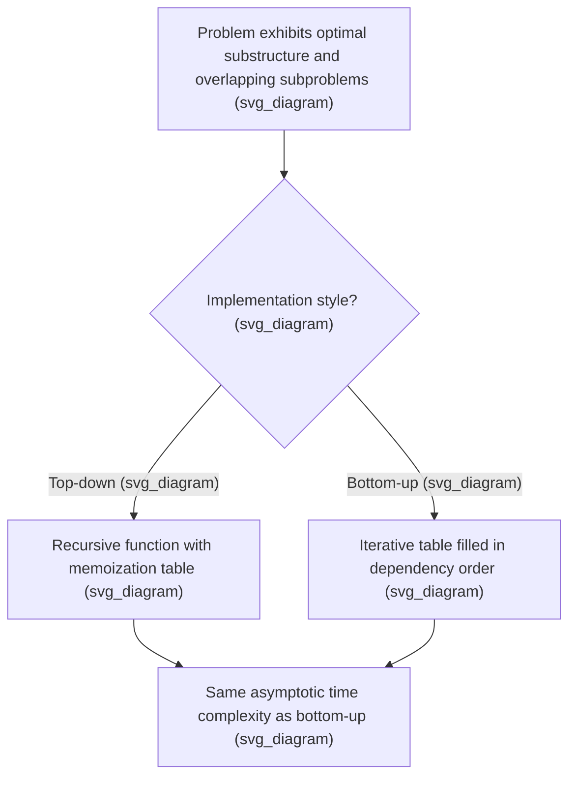

## Dynamic Programming for Combinatorial Problems

### Overview

Dynamic programming (DP) solves combinatorial optimization problems by breaking them into overlapping subproblems, solving each subproblem once, and storing (memoizing) its solution for reuse, rather than recomputing it repeatedly. The technique applies whenever a problem exhibits two key structural properties: optimal substructure (an optimal solution can be built from optimal solutions to subproblems) and overlapping subproblems (the same subproblems recur many times within a naive recursive solution). This topic surveys the core DP paradigm, its application to canonical combinatorial problems, state-space design principles, and its role within broader optimization methods such as column generation pricing.

**Key Points**

- Optimal substructure and overlapping subproblems together are what distinguish problems suited to dynamic programming from those requiring other techniques (e.g., problems with optimal substructure but no overlap are often better suited to plain greedy or divide-and-conquer methods).
- DP guarantees a globally optimal solution (unlike greedy heuristics, which can fail without additional structural guarantees), provided the recursive decomposition correctly captures the problem's optimal substructure.
- The central design task in applying DP is defining an appropriate **state** — a compact summary of the information needed to make optimal decisions going forward, without needing to remember the full history of how that state was reached.

### The Two Pillars: Optimal Substructure and Overlapping Subproblems

**Optimal Substructure**

A problem has optimal substructure if an optimal solution to the whole problem can be constructed from optimal solutions to its subproblems. For example, the shortest path from $A$ to $C$ passing through $B$ must include the shortest path from $A$ to $B$ and the shortest path from $B$ to $C$ as its component pieces.

**Overlapping Subproblems**

A problem has overlapping subproblems if a naive recursive algorithm would solve the same subproblem repeatedly. For example, computing the $n$-th Fibonacci number recursively without memoization recomputes many smaller Fibonacci values exponentially many times.

**Key Points**

- When both properties hold, storing each subproblem's solution the first time it is computed (memoization) or building up solutions from the smallest subproblems first (tabulation) converts what would be exponential-time naive recursion into polynomial-time computation.
- Problems with optimal substructure but without significant subproblem overlap (many divide-and-conquer algorithms, such as standard mergesort) do not benefit from memoization, since each subproblem is genuinely distinct and solved only once regardless.
- Verifying optimal substructure rigorously (rather than assuming it) is essential, since many combinatorial problems that appear DP-amenable at first glance actually violate this property once side constraints are added (a common pitfall being resource or budget constraints that couple otherwise-separable subproblems).

### Two Implementation Styles: Top-Down and Bottom-Up

**Key Points**

- **Top-down (memoization)**: implemented as ordinary recursion, but checking a cache before recomputing any subproblem, and storing the result after computing it for the first time. This naturally computes only the subproblems actually needed for the specific input.
- **Bottom-up (tabulation)**: implemented iteratively, filling in a table of subproblem solutions in an order that guarantees each subproblem's dependencies are already computed before it is needed (e.g., increasing problem size). This avoids recursion overhead and can be more memory-efficient when combined with techniques that discard no-longer-needed table entries.
- Both styles achieve the same asymptotic time complexity for a given DP formulation; the choice between them is generally a matter of implementation convenience, stack depth concerns (top-down recursion can hit stack limits on very large inputs), and whether the full table or only a subset of subproblems is actually needed.

### The Knapsack Problem

The 0-1 knapsack problem (maximize value subject to a weight capacity, with each item either fully included or excluded) is a canonical DP example.

**State definition**: let $V(i, w)$ denote the maximum value achievable using only the first $i$ items with total weight capacity $w$.

**Recurrence**:

$$V(i, w) = \max\left( V(i-1, w), \; V(i-1, w-w_i) + v_i \right) \quad \text{if } w_i \le w$$

$$V(i, w) = V(i-1, w) \quad \text{if } w_i > w$$

with base case $V(0, w) = 0$ for all $w$.

**Key Points**

- This recurrence expresses optimal substructure directly: the best solution using the first $i$ items either excludes item $i$ (reusing the best solution for $i-1$ items) or includes it (reusing the best solution for $i-1$ items with reduced capacity, plus item $i$'s value).
- The table has dimensions $O(n \times W)$ where $n$ is the number of items and $W$ is the capacity, giving a total time complexity of $O(nW)$ — this is a **pseudo-polynomial** time algorithm, since it is polynomial in the numeric value of $W$ but not in the number of bits needed to represent $W$, reflecting the underlying NP-hardness of the general knapsack problem.
- Recovering the actual selected items (not just the optimal value) requires either storing additional backtracking information during table construction or retracing the recurrence from $V(n, W)$ back to the base case.

### Shortest Path and Sequence Alignment Problems

**Bellman-Ford Algorithm**

The Bellman-Ford shortest-path algorithm is a direct DP formulation: let $d_k(v)$ denote the shortest path length from a source to vertex $v$ using at most $k$ edges. The recurrence $d_k(v) = \min(d_{k-1}(v), \min_{u} (d_{k-1}(u) + w(u,v)))$ builds up shortest paths incrementally by allowing one additional edge at each stage.

**Sequence Alignment / Edit Distance**

Computing the edit distance (minimum number of insertions, deletions, or substitutions to transform one sequence into another) uses the state $E(i,j)$ = edit distance between the first $i$ characters of one sequence and the first $j$ characters of the other, with a recurrence comparing the costs of matching, inserting, or deleting the next character.

**Key Points**

- Both problems illustrate a common DP pattern: the state indexes into "how much of the input has been processed so far" (edges used, characters consumed), and the recurrence relates a state to strictly smaller states.
- Bellman-Ford's DP formulation, unlike Dijkstra's greedy approach, correctly handles negative edge weights (though not negative cycles, which it can detect but not resolve to a finite shortest path).
- Sequence alignment DP underlies not only combinatorial optimization but bioinformatics applications (DNA/protein sequence alignment), illustrating how the same DP principles transfer across very different application domains once framed with an appropriate state and recurrence.

### DP Over Subsets: The Traveling Salesman Problem

For small to moderate instance sizes, the Traveling Salesman Problem (TSP) can be solved exactly via the Held-Karp dynamic programming algorithm, which uses subsets of visited cities as part of the state.

**State definition**: let $C(S, j)$ denote the minimum cost of a path that starts at a fixed origin city, visits exactly the set of cities $S$ (including $j$), and ends at city $j \in S$.

**Recurrence**:

$$C(S, j) = \min_{i \in S, \, i \ne j} \; \left( C(S \setminus \{j\}, i) + d(i,j) \right)$$

**Key Points**

- This DP formulation has $O(2^n \cdot n)$ states (one for each subset $S$ of the $n$ cities and each possible endpoint $j$ within that subset), giving a total time complexity of $O(2^n \cdot n^2)$, which is exponential but dramatically better than the $O(n!)$ complexity of naive brute-force enumeration of all tours.
- The exponential dependence on $n$ means Held-Karp is only practical for relatively small instances (commonly cited as useful up to roughly $n \approx 20$-$25$ cities, though [Inference] the exact practical size limit depends on available memory and time budget, since both grow exponentially with $n$).
- This "DP over subsets" pattern (sometimes called a bitmask DP) recurs in many other combinatorial problems involving small-to-moderate sets of items where an exact ordering or partition among items must be optimized, such as certain scheduling and assignment problems with additional side constraints.

<svg xmlns="http://www.w3.org/2000/svg" viewBox="0 0 420 260">
<text x="210" y="24" text-anchor="middle" font-size="14" font-weight="bold" fill="#1a1a1a">DP State Space Growth Patterns (svg_diagram)</text>
<text x="30" y="60" font-size="12" fill="#1a1a1a" font-weight="bold">Knapsack: O(n x W) states</text>
<rect x="30" y="70" width="150" height="40" fill="#a8d0e6" fill-opacity="0.6" stroke="#2a6f97" />
<text x="105" y="94" text-anchor="middle" font-size="10" fill="#1a1a1a">pseudo-polynomial</text>
<text x="230" y="60" font-size="12" fill="#1a1a1a" font-weight="bold">TSP (Held-Karp): O(2^n x n)</text>
<rect x="230" y="70" width="160" height="40" fill="#f4a259" fill-opacity="0.5" stroke="#bc4b17" />
<text x="310" y="94" text-anchor="middle" font-size="10" fill="#1a1a1a">exponential in n</text>
<text x="30" y="150" font-size="12" fill="#1a1a1a" font-weight="bold">Edit distance: O(m x n) states</text>
<rect x="30" y="160" width="150" height="40" fill="#c9e4ca" stroke="#3a7d44" />
<text x="105" y="184" text-anchor="middle" font-size="10" fill="#1a1a1a">polynomial in sequence lengths</text>
</svg>

### Resource-Constrained Shortest Path Problems

As referenced in the discussion of column generation pricing subproblems, many vehicle routing and crew scheduling applications require solving a **resource-constrained shortest path problem (RCSPP)**: finding a minimum-cost path in a network subject to constraints on accumulated resources (time, demand, distance) that must remain within specified bounds along the path.

**Key Points**

- RCSPP is typically solved via a labeling algorithm, a DP-based method where each partial path is represented by a "label" tracking accumulated cost and resource consumption, and labels are extended along network edges while dominated (strictly worse) labels are discarded to control the state space size.
- The presence of resource constraints breaks the simple optimal-substructure argument that applies to unconstrained shortest paths, since the cheapest way to reach an intermediate node might not extend to the cheapest overall resource-feasible path; this is why the state must explicitly track resource consumption, not just location.
- [Inference] The efficiency of labeling algorithms in practice depends heavily on how effectively dominated labels can be identified and pruned, which is problem- and network-structure-dependent, making this an active area of applied algorithmic refinement.

### Worked Example: Rod Cutting

Consider a classic DP problem: given a rod of length $n$ and a price table $p_i$ for pieces of length $i$, determine the maximum revenue obtainable by cutting the rod into pieces and selling them.

**State**: $R(n)$ = maximum revenue from a rod of length $n$.

**Recurrence**: $R(n) = \max_{1 \le i \le n} \left( p_i + R(n-i) \right)$, with $R(0) = 0$.

**Numeric instance**: suppose prices are $p_1=1, p_2=5, p_3=8, p_4=9$ for a rod of length $4$.

- $R(0) = 0$
- $R(1) = \max(p_1 + R(0)) = \max(1+0) = 1$
- $R(2) = \max(p_1+R(1),\, p_2+R(0)) = \max(1+1,\, 5+0) = \max(2,5) = 5$
- $R(3) = \max(p_1+R(2),\, p_2+R(1),\, p_3+R(0)) = \max(1+5,\,5+1,\,8+0) = \max(6,6,8)=8$
- $R(4) = \max(p_1+R(3),\,p_2+R(2),\,p_3+R(1),\,p_4+R(0)) = \max(1+8,\,5+5,\,8+1,\,9+0) = \max(9,10,9,9)=10$

**Output**

The maximum achievable revenue for a rod of length $4$ is $10, obtained by cutting it into two pieces of length $2
 each (since $R(4)=p_2+R(2)=5+5=10$ was the maximizing choice at the top level, and $R(2)$ itself was maximized by taking a single piece of length $2$ directly rather than two pieces of length $1$). This example illustrates the complete DP workflow: defining a state indexed by remaining rod length, building up solutions from the base case, and tracing back through the maximizing choices at each stage to recover not just the optimal value but the optimal cutting plan itself.

### Space Optimization Techniques

**Key Points**

- Many DP recurrences only require the previous one or two "layers" of the table (e.g., knapsack's $V(i,\cdot)$ row depends only on $V(i-1,\cdot)$), allowing the table's memory footprint to be reduced from the full $O(n\times W)$ to $O(W)$ by overwriting rows in place, provided the iteration order respects the dependency structure.
- This space reduction technique, sometimes called "rolling array" optimization, is especially important for problems with large state spaces (such as knapsack with large capacity, or sequence alignment with long sequences), where the full table would otherwise exceed available memory.
- Reconstructing the optimal solution (not just its value) after space optimization typically requires either retaining additional decision information during the forward pass or re-running a portion of the DP in reverse (e.g., Hirschberg's technique for edit distance, which achieves optimal solution recovery in linear space at the cost of a constant-factor increase in time).

### Relationship to Broader Optimization Methods

**Key Points**

- Dynamic programming appears throughout the optimization methods already discussed in this context: it is the standard technique for solving pricing subproblems in column generation (shortest path and knapsack subproblems), and it underlies labeling algorithms used in resource-constrained routing problems within branch and price.
- DP-based subproblems are typically far more tractable than the overall integer program from which they arise, which is precisely why decomposition techniques like column generation are structured to isolate a DP-amenable subproblem from an otherwise intractable combinatorial master problem.
- Some combinatorial optimization problems admit DP formulations that are themselves used as a bounding or relaxation technique (rather than an exact solution method) when the full DP state space is too large to enumerate exactly, an idea related to but distinct from the LP and SDP relaxation techniques discussed elsewhere. [Inference] The specific circumstances under which an approximate or bounded DP formulation is preferred over other relaxation techniques are problem-dependent and are typically determined by empirical comparison for a given application.

### Conclusion

Dynamic programming provides an exact, systematic method for solving combinatorial optimization problems that exhibit optimal substructure and overlapping subproblems, converting naive exponential-time recursive enumeration into polynomial (or, for problems like TSP, dramatically reduced exponential) time algorithms through memoization or tabulation. From the knapsack problem's pseudo-polynomial table to Held-Karp's subset-based state space for TSP and labeling algorithms for resource-constrained shortest paths, the technique's central design challenge is always the same: finding a state representation compact enough to be tractable, yet rich enough to preserve the recursive optimal-substructure relationship needed for correctness — a skill that connects directly to the pricing subproblems at the heart of column generation and branch and price.

**Related Topics**

- Column Generation Techniques
- Branch and Price for Large-Scale Integer Programs
- Resource-Constrained Shortest Path Algorithms
- NP-Hardness and Pseudo-Polynomial Time Algorithms
- Vehicle Routing Problem Formulations
- Bellman Equations and Stochastic Dynamic Programming
- Approximation Algorithms for NP-Hard Combinatorial Problems