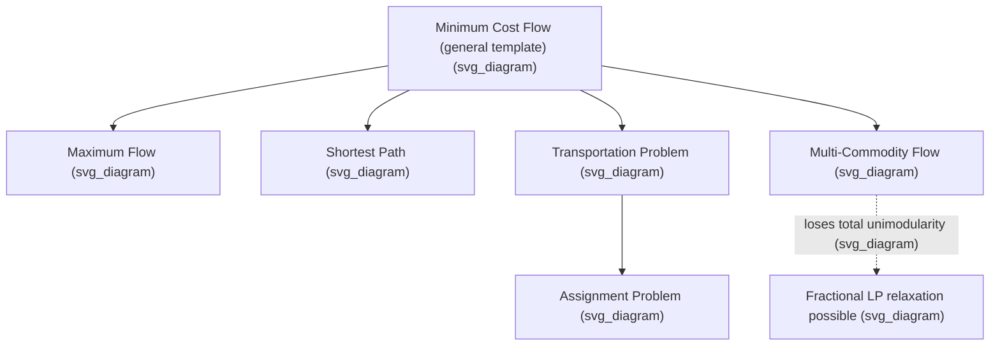

## Network Flow Optimization Formulations

### Overview

Network flow problems model the movement of a commodity — goods, information, current, or an abstract resource — through a network of nodes and directed edges, subject to capacity limits and conservation requirements. Because network flow constraint matrices possess strong structural properties, many of these problems are solvable extremely efficiently and, in the single-commodity case, often admit integral optimal solutions directly from their LP relaxation. This topic surveys the major network flow formulation types, their defining constraints, and their connections to broader optimization methods already discussed.

**Key Points**

- Network flow problems are typically formulated over a directed graph $G=(N,A)$ with node set $N$ and arc set $A$, where each arc $(i,j)$ carries a flow variable $x_{ij}$ subject to capacity bounds.
- Flow conservation constraints (inflow equals outflow, adjusted for any supply or demand at a node) are the defining structural feature distinguishing network flow formulations from general linear or integer programs.
- Many network flow problems have constraint matrices that are totally unimodular, meaning their LP relaxations automatically yield integer optimal solutions whenever the supply, demand, and capacity data are integer — a rare and highly valuable structural property in optimization.

### The Minimum Cost Flow Problem

The minimum cost flow problem is the general template underlying most network flow formulations. Given a directed graph with per-unit arc costs $c_{ij}$, arc capacities $u_{ij}$, and per-node supply/demand values $b_i$ (positive for supply nodes, negative for demand nodes, zero for transshipment nodes), the formulation is:

$$\min \sum_{(i,j)\in A} c_{ij}x_{ij}$$

subject to

$$\sum_{j:(i,j)\in A} x_{ij} - \sum_{j:(j,i)\in A} x_{ji} = b_i \quad \forall i \in N$$

$$0 \le x_{ij} \le u_{ij} \quad \forall (i,j) \in A$$

**Key Points**

- The equality constraint at each node is the flow conservation (or balance) constraint: outgoing flow minus incoming flow must equal the node's net supply or demand.
- For the problem to be feasible, total supply must equal total demand: $\sum_i b_i = 0$, a standard normalization assumption in minimum cost flow formulations.
- The constraint matrix of this formulation is the node-arc incidence matrix of the graph, which is totally unimodular — this is the structural reason minimum cost flow problems solved as LPs automatically yield integer solutions when all data ($b_i$, $u_{ij}$) are integers.

<svg xmlns="http://www.w3.org/2000/svg" viewBox="0 0 440 260">
<text x="220" y="24" text-anchor="middle" font-size="14" font-weight="bold" fill="#1a1a1a">Minimum Cost Flow Network (svg_diagram)</text>
<circle cx="60" cy="130" r="24" fill="#a8d0e6" stroke="#2a6f97" stroke-width="1.5" />
<text x="60" y="135" text-anchor="middle" font-size="11" fill="#1a1a1a">S: +10</text>
<circle cx="220" cy="70" r="24" fill="#f4a259" fill-opacity="0.5" stroke="#bc4b17" stroke-width="1.5" />
<text x="220" y="75" text-anchor="middle" font-size="11" fill="#1a1a1a">A: 0</text>
<circle cx="220" cy="190" r="24" fill="#f4a259" fill-opacity="0.5" stroke="#bc4b17" stroke-width="1.5" />
<text x="220" y="195" text-anchor="middle" font-size="11" fill="#1a1a1a">B: 0</text>
<circle cx="380" cy="130" r="24" fill="#c9e4ca" stroke="#3a7d44" stroke-width="1.5" />
<text x="380" y="135" text-anchor="middle" font-size="11" fill="#1a1a1a">T: -10</text>
<line x1="82" y1="118" x2="198" y2="80" stroke="#444" stroke-width="1.5" marker-end="url(#arrow4)" />
<text x="130" y="90" font-size="10" fill="#444">cap 8, cost 2</text>
<line x1="82" y1="142" x2="198" y2="180" stroke="#444" stroke-width="1.5" marker-end="url(#arrow4)" />
<text x="130" y="180" font-size="10" fill="#444">cap 6, cost 3</text>
<line x1="242" y1="80" x2="358" y2="120" stroke="#444" stroke-width="1.5" marker-end="url(#arrow4)" />
<text x="290" y="90" font-size="10" fill="#444">cap 8, cost 1</text>
<line x1="242" y1="180" x2="358" y2="140" stroke="#444" stroke-width="1.5" marker-end="url(#arrow4)" />
<text x="290" y="185" font-size="10" fill="#444">cap 6, cost 4</text>
</svg>

### Special Cases of Minimum Cost Flow

**Maximum Flow Problem**

The maximum flow problem seeks the largest total flow that can be sent from a single source node $s$ to a single sink node $t$, respecting arc capacities, with no per-unit costs:

$$\max f \quad \text{s.t.} \quad \sum_{j:(i,j)\in A}x_{ij} - \sum_{j:(j,i)\in A}x_{ji} = \begin{cases} f & i=s \\ -f & i=t \\ 0 & \text{otherwise} \end{cases}, \quad 0 \le x_{ij}\le u_{ij}$$

**Shortest Path Problem**

The shortest path problem sends exactly one unit of flow from source to sink at minimum cost, which is equivalent to minimum cost flow with $b_s=1$, $b_t=-1$, all other $b_i=0$, and no capacity restrictions (or capacities of at least $1$).

**Transportation Problem**

The transportation problem is a minimum cost flow problem on a bipartite graph, with supply nodes (e.g., factories) on one side and demand nodes (e.g., warehouses) on the other, and arcs only between the two sides (no arcs within a side).

**Assignment Problem**

The assignment problem is a special case of the transportation problem where every supply and every demand equals exactly $1$, modeling a one-to-one matching between two equal-sized sets (e.g., workers to tasks).

**Key Points**

- All four of these problems are instances of the same minimum cost flow template, differing only in their specific graph structure, costs, and supply/demand pattern, which is why algorithms and structural results for minimum cost flow apply uniformly across all of them.
- The assignment problem's total unimodularity was noted previously in the context of integer programming formulations: it is solvable directly as an LP with no explicit integrality constraints needed, precisely because it is a network flow problem.
- Maximum flow can be recast as a minimum cost flow problem by adding a return arc from $t$ to $s$ with cost $-1$ and infinite (or sufficiently large) capacity, and minimizing total cost — a standard formulation trick connecting the two problem types algebraically.

### The Max-Flow Min-Cut Theorem

A foundational result in network flow theory states that the maximum flow from $s$ to $t$ equals the minimum capacity of an $s$-$t$ cut — a partition of the nodes into two sets, one containing $s$ and the other containing $t$, where the cut's capacity is the sum of capacities of arcs crossing from the source side to the sink side.

**Key Points**

- This theorem provides both an optimality certificate (any feasible flow whose value equals some cut's capacity is proven maximum) and a duality-style interpretation: the max-flow problem's LP dual is precisely the min-cut problem.
- The max-flow min-cut theorem underlies several combinatorial results beyond network routing, including Menger's theorem on vertex/edge connectivity and applications in image segmentation, where the minimum cut corresponds to an optimal partition of image regions.
- Algorithms for computing maximum flow (such as the Ford-Fulkerson method and its refinements) work by repeatedly finding "augmenting paths" from source to sink in a residual graph, terminating when no augmenting path exists — at which point the current flow is proven maximum by the max-flow min-cut theorem.

### Multi-Commodity Flow

When multiple distinct commodities (each with its own source, sink, and demand) share the same underlying network and arc capacities, the problem becomes a **multi-commodity flow problem**:

$$\min \sum_k \sum_{(i,j)} c_{ij}^k x_{ij}^k \quad \text{s.t.} \quad \text{flow conservation for each commodity } k, \quad \sum_k x_{ij}^k \le u_{ij} \; \forall (i,j)$$

**Key Points**

- Unlike single-commodity minimum cost flow, multi-commodity flow generally does **not** have a totally unimodular constraint matrix, so its LP relaxation can yield fractional optimal solutions even with integer data — this is a critical distinction from the single-commodity case.
- Multi-commodity flow formulations are common in telecommunications network design, logistics with multiple product types sharing infrastructure, and traffic routing, where different commodities compete for shared capacity on the same arcs.
- As referenced in the discussion of extended formulations, multi-commodity flow reformulations (splitting a single-commodity problem into multiple related flows) are sometimes used specifically to tighten weaker aggregate formulations in network design problems, illustrating how the same underlying flow structure serves both as a natural problem class and as a modeling tool.

### Network Design Formulations

Network design problems decide which arcs (or facilities) to build or activate, in addition to routing flow, typically combining binary "build" decisions with continuous flow variables — placing these problems in the mixed-integer programming formulation types discussed earlier.

**Key Points**

- Fixed-charge network design formulations tie a binary arc-activation variable $y_{ij}$ to the flow capacity on that arc ($x_{ij} \le u_{ij}y_{ij}$), directly mirroring the fixed-charge modeling pattern discussed in integer programming formulation types.
- As with facility location, disaggregated formulations (where flow is tied to activation on a finer-grained basis, e.g., per-commodity rather than in aggregate) generally produce tighter LP relaxations than aggregated versions, at the cost of additional variables and constraints.
- Network design problems are generally NP-hard once binary activation decisions are introduced, even though the underlying pure flow problem (with all arcs already available) would be efficiently solvable, illustrating how adding discrete structural decisions on top of an otherwise "easy" continuous problem can shift it into a fundamentally harder complexity class.

### Node-Arc vs. Arc-Path Formulations

Minimum cost flow (and its generalizations) can be formulated in two structurally different ways:

- **Node-arc formulation**: uses one variable per arc, with flow conservation constraints written per node (as shown in the standard formulation above). This is compact — the number of variables equals the number of arcs.
- **Arc-path (or path-based) formulation**: uses one variable per possible path from source to sink (or per commodity's path), with constraints ensuring capacity is respected and demand is met by the sum of path flows.

**Key Points**

- The arc-path formulation typically has an exponential number of variables (one per path), making it a natural candidate for solution via column generation, directly connecting network flow modeling to the column generation and branch-and-price techniques discussed earlier.
- Despite having more variables in principle, the arc-path formulation is sometimes preferred because it naturally expresses path-based side constraints (e.g., a maximum number of hops, or specific routing policies) that are awkward to express directly in the node-arc formulation.
- The choice between node-arc and arc-path formulations is a direct instance of the compact-versus-extended formulation trade-off discussed in the context of integer programming formulation types, applied specifically to the network flow setting.

### Worked Example: Small Minimum Cost Flow

Using the network shown in the diagram above: source $S$ (supply $10), sink $T
 (demand $10), and two transshipment nodes $A
, $B$, with arcs $S\to A$ (capacity $8, cost $2
), $S\to B$ (capacity $6, cost $3
), $A\to T$ (capacity $8, cost $1
), $B\to T$ (capacity $6, cost $4
).

**Candidate 1**: send all $10$ units via $A$: but $S\to A$ capacity is only $8, so at most $8
 units can go this route; cost per unit $2+1=3, giving $8\times3=24
 for those $8$ units, needing $2$ more units routed via $B$: cost per unit $3+4=7, giving $2\times7=14
; total $=38$.

**Candidate 2**: split flow more evenly, e.g., $6$ via $A$ and $4$ via $B$: cost $=6\times3 + 4\times7 = 18+28=46$, which is worse than Candidate 1.

**Output**

Candidate 1 (routing as much flow as possible through the cheaper $S$-$A$-$T$ path before using any of the more expensive $S$-$B$-$T$ path) achieves total cost $38, and this greedy-by-cheapest-path pattern is indeed optimal for this small instance, since $S
-$A$-$T$ has strictly lower per-unit cost ($3) than $S
-$B$-$T$ ($7$), so any feasible flow should saturate the cheaper path's capacity before using the more expensive one. This illustrates how minimum cost flow solutions naturally favor cheaper paths up to their capacity limits, a pattern formalized and generalized by network simplex and other specialized flow algorithms. [Inference] This hand-verified conclusion follows from the small size and simple structure of this instance; formal optimality for general instances is established by network flow algorithms and duality (e.g., min-cut or complementary slackness conditions) rather than by exhaustive candidate comparison.

### Specialized Algorithms

**Key Points**

- Because of their special structure, network flow problems are typically solved with specialized algorithms rather than general-purpose LP solvers: the **network simplex method** exploits the spanning-tree structure of basic feasible solutions in flow problems for substantial speed advantages over generic simplex implementations.
- Maximum flow problems are commonly solved via augmenting path methods (Ford-Fulkerson, Edmonds-Karp) or push-relabel algorithms, both of which have polynomial-time complexity guarantees specific to the max-flow structure.
- [Inference] The choice of specialized algorithm in practice depends on problem size, density, and whether the application requires repeated re-solves with incremental changes (favoring algorithms that support efficient warm-starting), and current best practices should be checked against up-to-date algorithmic and software benchmarks for large-scale instances.

### Conclusion

Network flow formulations provide a unifying structural framework for an entire family of optimization problems — minimum cost flow, maximum flow, shortest path, transportation, and assignment — all sharing the same flow conservation and capacity constraint pattern, with total unimodularity guaranteeing integral solutions in the single-commodity case. Extending this framework with multiple commodities or binary design decisions moves problems out of this favorable structural regime and into settings requiring the mixed-integer and column-generation techniques covered elsewhere, while the max-flow min-cut theorem and specialized algorithms like network simplex continue to make even large-scale single-commodity flow problems highly tractable in practice.

**Related Topics**

- Integer Programming Formulation Types
- Column Generation Techniques
- Branch and Price for Large-Scale Integer Programs
- Total Unimodularity and Integral Polyhedra
- Dynamic Programming for Combinatorial Problems
- Vehicle Routing Problem Formulations
- Multi-Commodity Network Design