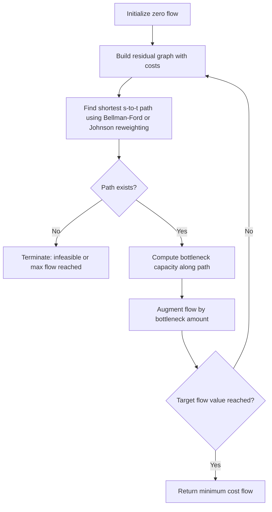

## Shortest Path, Max Flow, and Min Cost Flow Algorithms

### Overview

Shortest path, maximum flow, and minimum cost flow are the three foundational problem classes of network optimization. Each models a distinct question over a directed graph $G = (V, E)$ with edge weights or capacities: shortest path asks for the cheapest route between nodes, max flow asks for the greatest throughput between a source and sink under capacity constraints, and min cost flow generalizes both — finding the cheapest way to route a required amount of flow through a capacitated, costed network. These problems are polynomial-time solvable and underpin routing, scheduling, matching, and resource-allocation applications across combinatorial optimization.

### Shortest Path Algorithms

#### Problem Definition

Given a directed graph $G = (V, E)$ with edge weights $w: E \to \mathbb{R}$, and a source vertex $s$, find the minimum-weight path from $s$ to every other vertex (single-source shortest path), or between a specific pair (point-to-point), or between all pairs (all-pairs shortest path).

#### Dijkstra's Algorithm

Applies when all edge weights are non-negative. Maintains a tentative distance $d[v]$ for each vertex, initialized to $\infty$ except $d[s] = 0$. Repeatedly extracts the unvisited vertex with minimum tentative distance and relaxes its outgoing edges:

$$d[v] = \min(d[v], \, d[u] + w(u,v))$$

**Key Points**

- With a binary heap priority queue: $O((|E| + |V|) \log |V|)$
- With a Fibonacci heap: $O(|E| + |V| \log |V|)$
- Fails on graphs with negative edge weights — a relaxed vertex may need re-relaxation, breaking the greedy finalization invariant

**Example**

Graph: $A \to B$ (weight 4), $A \to C$ (weight 1), $C \to B$ (weight 1), $B \to D$ (weight 1).

Dijkstra from $A$: initialize $d[A]=0$, rest $\infty$. Extract $A$, relax: $d[B]=4$, $d[C]=1$. Extract $C$ (smallest), relax: $d[B] = \min(4, 1+1) = 2$. Extract $B$, relax: $d[D] = 3$. Extract $D$. Final: $d[A]=0, d[C]=1, d[B]=2, d[D]=3$.

#### Bellman-Ford Algorithm

Handles negative edge weights and detects negative cycles. Relaxes all $|E|$ edges, $|V|-1$ times in sequence:

$$\forall (u,v) \in E: \quad d[v] = \min(d[v], \, d[u] + w(u,v))$$

A $|V|$-th pass that still finds a relaxable edge indicates a negative cycle reachable from $s$, in which case no shortest path is well-defined.

**Key Points**

- Time complexity: $O(|V| \cdot |E|)$
- Correctly handles negative weights (absent negative cycles)
- The SPFA (Shortest Path Faster Algorithm) variant uses a queue to skip unnecessary relaxations and performs well in practice, though its worst case remains $O(|V| \cdot |E|)$

#### Floyd-Warshall Algorithm

Solves all-pairs shortest paths via dynamic programming over intermediate vertices. Let $d_k[i][j]$ be the shortest path from $i$ to $j$ using only vertices $\{1, \dots, k\}$ as intermediates:

$$d_k[i][j] = \min\big(d_{k-1}[i][j], \, d_{k-1}[i][k] + d_{k-1}[k][j]\big)$$

**Key Points**

- Time complexity: $O(|V|^3)$, space $O(|V|^2)$
- Handles negative edges; detects negative cycles if any $d[i][i] < 0$ after completion
- Preferable to running Bellman-Ford from every source when $|V|$ is small to moderate and the graph is dense

#### A* Search

Extends Dijkstra with a heuristic $h(v)$ estimating remaining cost to the goal, prioritizing vertices by $f(v) = d[v] + h(v)$. Guarantees optimality when $h$ is admissible (never overestimates true cost) and consistent (satisfies the triangle inequality $h(u) \le w(u,v) + h(v)$).

[Inference] Practical speedup over Dijkstra is heavily dependent on heuristic quality and graph structure; on graphs with poor heuristics, A* degenerates to Dijkstra's performance.

#### Johnson's Algorithm

Computes all-pairs shortest paths on sparse graphs with negative edges (no negative cycles) faster than repeated Bellman-Ford. Adds a virtual vertex connected to all others with zero-weight edges, runs Bellman-Ford once to compute vertex potentials $h(v)$, reweights all edges as $w'(u,v) = w(u,v) + h(u) - h(v)$ (guaranteed non-negative), then runs Dijkstra from every vertex on the reweighted graph.

**Key Points**

- Time complexity: $O(|V|^2 \log |V| + |V||E|)$, better than Floyd-Warshall on sparse graphs
- Reweighting preserves shortest paths because the potential difference telescopes to zero along any path between fixed endpoints

### Diagram: Algorithm Selection (svg_diagram)

<svg xmlns="http://www.w3.org/2000/svg" viewBox="0 0 820 460">
\<style\>
.box { fill: var(--bg-secondary, #f4f4f4); stroke: var(--border-primary, #888); stroke-width: 1.5; rx: 6; }
.decision { fill: var(--bg-tertiary, #e8e8f0); stroke: var(--border-primary, #888); stroke-width: 1.5; }
.label { font-family: sans-serif; font-size: 13px; fill: var(--text-primary, #222); text-anchor: middle; }
.edge { stroke: var(--text-secondary, #666); stroke-width: 1.3; fill: none; marker-end: url(#arrow); }
.edgelabel { font-family: sans-serif; font-size: 11px; fill: var(--text-secondary, #555); text-anchor: middle; }
\</style\>
<text x="410" y="24" class="label" font-size="16" font-weight="bold">Shortest Path Algorithm Selection (svg_diagram)</text>
<polygon points="410,45 480,80 410,115 340,80" class="decision" />
<text x="410" y="84" class="label">Negative edges?</text>
<polygon points="230,150 300,185 230,220 160,185" class="decision" />
<text x="230" y="189" class="label">All-pairs needed?</text>
<polygon points="600,150 670,185 600,220 530,185" class="decision" />
<text x="600" y="189" class="label">All-pairs needed?</text>
<rect x="30" y="280" width="150" height="50" class="box" />
<text x="105" y="310" class="label">Dijkstra (per source)</text>
<rect x="220" y="280" width="150" height="50" class="box" />
<text x="295" y="305" class="label">Dijkstra +</text>
<text x="295" y="320" class="label">min-heap, or A* w/ heuristic</text>
<rect x="440" y="280" width="150" height="50" class="box" />
<text x="515" y="305" class="label">Bellman-Ford</text>
<text x="515" y="320" class="label">(sparse, single source)</text>
<rect x="630" y="280" width="160" height="60" class="box" />
<text x="710" y="300" class="label">Dense: Floyd-Warshall</text>
<text x="710" y="315" class="label">Sparse: Johnson's</text>
<text x="710" y="330" class="label">(negative, no neg. cycle)</text>
<path d="M375,90 L300,155" class="edge" />
<text x="320" y="115" class="edgelabel">no</text>
<path d="M445,90 L560,155" class="edge" />
<text x="530" y="115" class="edgelabel">yes</text>
<path d="M195,210 L120,275" class="edge" />
<text x="140" y="245" class="edgelabel">no</text>
<path d="M255,215 L295,275" class="edge" />
<text x="290" y="245" class="edgelabel">yes</text>
<path d="M565,210 L520,275" class="edge" />
<text x="525" y="245" class="edgelabel">no</text>
<path d="M630,215 L695,275" class="edge" />
<text x="670" y="245" class="edgelabel">yes</text>
</svg>

### Maximum Flow Algorithms

#### Problem Definition

Given a directed graph with edge capacities $c: E \to \mathbb{R}^+$, a source $s$, and a sink $t$, find the maximum total flow that can be routed from $s$ to $t$ such that flow on each edge does not exceed its capacity and flow is conserved at every vertex other than $s$ and $t$.

#### Max-Flow Min-Cut Theorem

The maximum flow from $s$ to $t$ equals the minimum capacity of an $s$-$t$ cut — a partition of $V$ into sets $S \ni s$ and $T \ni t$ minimizing the total capacity of edges crossing from $S$ to $T$:

$$\max |f| = \min_{S, T} \sum_{u \in S, v \in T} c(u,v)$$

This duality is central to combinatorial optimization: it converts a flow maximization problem into an equivalent cut minimization problem, and underlies correctness proofs for nearly every max flow algorithm.

#### Ford-Fulkerson Method

Repeatedly finds an augmenting path from $s$ to $t$ in the residual graph (edges with remaining capacity, plus reverse edges representing the ability to undo flow) and pushes flow equal to the path's bottleneck capacity, until no augmenting path remains.

**Key Points**

- Complexity depends on path-finding strategy and, with irrational capacities, may not terminate
- With integer capacities, terminates in $O(|E| \cdot |f_{\max}|)$ — pseudo-polynomial, since it depends on the value of the max flow, not just graph size

#### Edmonds-Karp Algorithm

Ford-Fulkerson using BFS to find the shortest (fewest-edges) augmenting path each iteration.

**Key Points**

- Time complexity: $O(|V| \cdot |E|^2)$, independent of capacity values — strongly polynomial
- The BFS choice bounds the number of augmentations to $O(|V| \cdot |E|)$, since each edge can be the bottleneck a bounded number of times

#### Dinic's Algorithm

Improves on Edmonds-Karp by building a level graph via BFS (vertices layered by shortest-path distance from $s$), then finding a blocking flow (a flow saturating at least one edge on every $s$-$t$ path in the level graph) via DFS, repeating until no augmenting path exists.

**Key Points**

- Time complexity: $O(|V|^2 \cdot |E|)$ in general graphs
- $O(|E| \sqrt{|V|})$ on unit-capacity graphs, which makes it especially effective for bipartite matching reductions
- Each phase strictly increases the shortest $s$-$t$ distance in the residual graph, bounding the number of phases by $O(|V|)$

#### Push-Relabel Algorithm

Departs from the augmenting-path paradigm. Maintains a preflow (a flow that may exceed conservation, with excess at vertices) and a height function, repeatedly pushing excess flow from higher to lower vertices or relabeling a vertex's height when no valid push exists, until all excess is drained back to $s$ or forward to $t$.

**Key Points**

- Generic version: $O(|V|^2 \cdot |E|)$
- With FIFO vertex selection: $O(|V|^3)$
- With highest-label selection: $O(|V|^2 \sqrt{|E|})$
- [Unverified] Empirically often outperforms Dinic's on dense graphs, though this is workload-dependent and not a general guarantee

### Flow Network Illustration (svg_diagram)

<svg xmlns="http://www.w3.org/2000/svg" viewBox="0 0 700 260">
\<style\>
.node { fill: var(--bg-secondary, #f0f0f0); stroke: var(--border-primary, #333); stroke-width: 1.5; }
.label { font-family: sans-serif; font-size: 14px; fill: var(--text-primary, #222); text-anchor: middle; }
.edgelabel { font-family: sans-serif; font-size: 12px; fill: var(--text-secondary, #444); text-anchor: middle; }
.edge { stroke: var(--text-secondary, #555); stroke-width: 1.5; fill: none; marker-end: url(#arrow2); }
\</style\>
<text x="350" y="24" class="label" font-size="16" font-weight="bold">Flow Network with Capacities (svg_diagram)</text>

<circle cx="60" cy="130" r="26" class="node" /><text x="60" y="135" class="label">s</text>

<circle cx="260" cy="60" r="26" class="node" /><text x="260" y="65" class="label">A</text>

<circle cx="260" cy="200" r="26" class="node" /><text x="260" y="205" class="label">B</text>

<circle cx="460" cy="60" r="26" class="node" /><text x="460" y="65" class="label">C</text>

<circle cx="460" cy="200" r="26" class="node" /><text x="460" y="205" class="label">D</text>

<circle cx="640" cy="130" r="26" class="node" /><text x="640" y="135" class="label">t</text>

<path d="M84,118 L238,68" class="edge" /><text x="160" y="80" class="edgelabel">10</text>

<path d="M84,142 L238,192" class="edge" /><text x="160" y="185" class="edgelabel">8</text>

<path d="M286,60 L434,60" class="edge" /><text x="360" y="48" class="edgelabel">4</text>

<path d="M270,84 L280,176" class="edge" /><text x="240" y="130" class="edgelabel">2</text>

<path d="M286,200 L434,200" class="edge" /><text x="360" y="215" class="edgelabel">9</text>

<path d="M462,86 L462,174" class="edge" /><text x="480" y="130" class="edgelabel">6</text>

<path d="M484,68 L618,122" class="edge" /><text x="560" y="80" class="edgelabel">10</text>

<path d="M484,192 L618,142" class="edge" /><text x="560" y="185" class="edgelabel">10</text>

</svg>

### Minimum Cost Flow Algorithms

#### Problem Definition

Given a network with both capacities $c(u,v)$ and per-unit costs $w(u,v)$, find a flow of a specified value (or the maximum flow) from $s$ to $t$ that minimizes total cost:

$$\min \sum_{(u,v) \in E} w(u,v) \cdot f(u,v)$$

subject to capacity constraints and flow conservation. This generalizes both shortest path (unit flow, minimize cost) and max flow (ignore cost, maximize value).

#### Successive Shortest Path Algorithm

Repeatedly finds the shortest path from $s$ to $t$ in the residual graph (using edge costs as weights, via Bellman-Ford or Johnson's reweighting since residual edges can carry negative cost) and augments flow along it by the bottleneck capacity, until the target flow value is reached or no augmenting path remains.

**Key Points**

- Maintains optimality at each step: since each augmenting path is the shortest given current residual costs, the running solution is always a minimum cost flow for the flow value achieved so far
- Time complexity: $O(F \cdot S(|V|, |E|))$ where $F$ is the flow value and $S$ is shortest-path time — pseudo-polynomial in general

#### Cycle-Canceling Algorithm

Starts from any feasible flow (of the required value) and repeatedly finds a negative-cost cycle in the residual graph, canceling it by pushing flow around the cycle until no negative cycle remains.

**Key Points**

- Correctness follows from the negative cycle optimality condition: a flow is minimum cost if and only if its residual graph contains no negative cost cycle
- Using minimum mean cycle canceling (always canceling the cycle with the most negative mean cost) yields strongly polynomial time, $O(|V|^2 |E|^3 \log |V|)$ [Unverified — specific bound depends on the analysis variant used]

#### Network Simplex Method

Adapts the simplex method to the network flow polytope, exploiting the fact that basic feasible solutions correspond to spanning trees of the network. Moves between adjacent spanning-tree solutions by pivoting, improving cost at each step.

**Key Points**

- No known polynomial worst-case bound for all pivot rules, but consistently fast in practice — the standard choice in commercial and open-source solvers (e.g., LEMON, OR-Tools)
- [Inference] Practical performance advantage over successive shortest path or cycle canceling on large sparse networks is well-documented in solver benchmarks, though exact speedup is instance-dependent

#### Out-of-Kilter Algorithm

An older method that starts from any flow (not necessarily feasible) satisfying reduced-cost optimality conditions and iteratively repairs capacity or flow-conservation violations. Largely superseded by successive shortest path and network simplex in modern implementations but historically significant in the development of flow theory.

### Complexity Comparison

| Problem | Algorithm | Time Complexity | Handles Negative Weights |
| --- | --- | --- | --- |
| Shortest Path | Dijkstra | $O(\|E\| + \|V\|\log\|V\|)$ | No |
| Shortest Path | Bellman-Ford | $O(\|V\|\|E\|)$ | Yes |
| Shortest Path | Floyd-Warshall | $O(\|V\|^3)$ | Yes |
| Shortest Path | Johnson's | $O(\|V\|^2\log\|V\| + \|V\|\|E\|)$ | Yes |
| Max Flow | Edmonds-Karp | $O(\|V\|\|E\|^2)$ | N/A |
| Max Flow | Dinic's | $O(\|V\|^2\|E\|)$ | N/A |
| Max Flow | Push-Relabel | $O(\|V\|^2\sqrt{\|E\|})$ | N/A |
| Min Cost Flow | Successive Shortest Path | $O(F \cdot S(\|V\|,\|E\|))$ | Yes (via reweighting) |
| Min Cost Flow | Network Simplex | No general poly bound | Yes |

### Process Flow: Min Cost Flow via Successive Shortest Paths

### Applications

- **Shortest path**: routing protocols (OSPF, IS-IS), GPS navigation, dependency resolution in build systems
- **Max flow**: bipartite matching (via unit-capacity reduction), image segmentation (min-cut/max-flow), network reliability analysis, project selection problems
- **Min cost flow**: transportation and logistics optimization, assignment problems with costs, airline crew scheduling, supply chain network design

### Related Topics

- Bipartite matching and the Hopcroft-Karp algorithm
- Linear programming duality and its relation to max-flow min-cut
- Minimum spanning tree algorithms (Kruskal's, Prim's, Borůvka's)
- Multi-commodity flow problems
- Assignment problem and the Hungarian algorithm
- Integer programming formulations of network flow problems
- Approximation algorithms for NP-hard combinatorial optimization (e.g., traveling salesman, vertex cover)