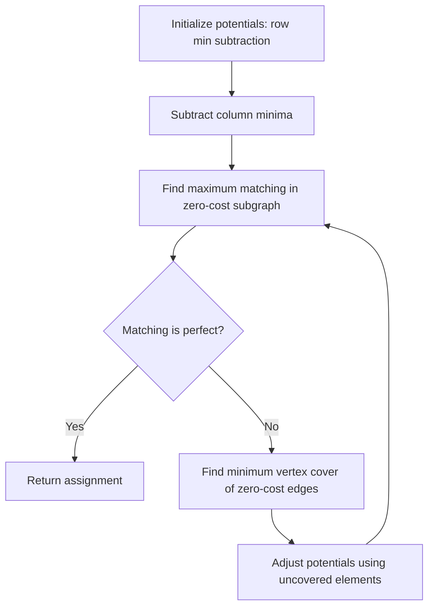

## Matching and Assignment Problems

### Overview

Matching and assignment problems ask how to pair elements of one or more sets optimally under constraints — maximizing the number of pairs, maximizing or minimizing total weight, or satisfying capacity limits. They span bipartite and general graphs, unweighted and weighted variants, and connect directly to network flow: many matching problems are solved by reduction to max flow or min cost flow. This class underlies resource allocation, scheduling, and pairing problems across combinatorial optimization.

### Bipartite Matching

#### Problem Definition

Given a bipartite graph $G = (U \cup V, E)$ with no edges within $U$ or within $V$, a matching $M \subseteq E$ is a set of edges with no shared endpoints. A maximum matching has the largest possible $|M|$. A perfect matching covers every vertex in the smaller (or both) side(s).

#### Augmenting Path Characterization

A matching $M$ is maximum if and only if it admits no augmenting path — a path that alternates between edges not in $M$ and edges in $M$, starting and ending at unmatched vertices. This is the Berge theorem, and it is the basis for nearly every exact matching algorithm: repeatedly find an augmenting path and flip its edges' membership in $M$, increasing $|M|$ by one each time.

#### Hopcroft-Karp Algorithm

Finds maximum bipartite matching by processing augmenting paths in phases. Each phase runs a BFS to find the shortest augmenting-path length, then a DFS to find a maximal set of vertex-disjoint augmenting paths of that length, augmenting along all of them simultaneously.

**Key Points**

- Time complexity: $O(|E|\sqrt{|V|})$
- The number of phases is bounded by $O(\sqrt{|V|})$, since shortest augmenting-path length strictly increases each phase and cannot exceed $O(\sqrt{|V|})$ before the matching is maximum
- Improves on the naive $O(|V||E|)$ approach of finding one augmenting path via DFS/BFS at a time

#### Reduction to Max Flow

Bipartite matching reduces to unit-capacity max flow: add a source $s$ connected to all of $U$, a sink $t$ connected from all of $V$, all capacities set to 1. Maximum flow equals maximum matching size, and Dinic's algorithm on unit-capacity graphs runs in $O(|E|\sqrt{|V|})$ — matching Hopcroft-Karp's bound.

**Example**

$U = \{u_1, u_2, u_3\}$, $V = \{v_1, v_2, v_3\}$, edges $u_1\text{-}v_1$, $u_1\text{-}v_2$, $u_2\text{-}v_2$, $u_3\text{-}v_2$, $u_3\text{-}v_3$.

Start with $M = \emptyset$. Match $u_1\text{-}v_1$. Augmenting path from $u_2$: $u_2 \to v_2$ (unmatched), add it. Augmenting path from $u_3$: $u_3 \to v_2 \to u_2 \to$ (no alternative for $u_2$)... try $u_3 \to v_3$ directly (unmatched), add it. Final matching: $\{u_1\text{-}v_1, u_2\text{-}v_2, u_3\text{-}v_3\}$, size 3, which is perfect.

### Bipartite Matching via Augmenting Paths (svg_diagram)

<svg xmlns="http://www.w3.org/2000/svg" viewBox="0 0 600 320">
\<style\>
.node { fill: var(--bg-secondary, #f0f0f0); stroke: var(--border-primary, #333); stroke-width: 1.5; }
.label { font-family: sans-serif; font-size: 14px; fill: var(--text-primary, #222); text-anchor: middle; }
.matched { stroke: var(--text-primary, #222); stroke-width: 3; }
.unmatched { stroke: var(--text-secondary, #999); stroke-width: 1.3; stroke-dasharray: 5,4; }
\</style\>
<text x="300" y="24" class="label" font-size="16" font-weight="bold">Maximum Bipartite Matching (svg_diagram)</text>

<circle cx="150" cy="80" r="22" class="node" /><text x="150" y="85" class="label">u1</text>

<circle cx="150" cy="160" r="22" class="node" /><text x="150" y="165" class="label">u2</text>

<circle cx="150" cy="240" r="22" class="node" /><text x="150" y="245" class="label">u3</text>

<circle cx="450" cy="80" r="22" class="node" /><text x="450" y="85" class="label">v1</text>

<circle cx="450" cy="160" r="22" class="node" /><text x="450" y="165" class="label">v2</text>

<circle cx="450" cy="240" r="22" class="node" /><text x="450" y="245" class="label">v3</text>

<line x1="172" y1="80" x2="428" y2="80" class="matched" />
<line x1="172" y1="88" x2="428" y2="155" class="unmatched" />
<line x1="172" y1="160" x2="428" y2="160" class="matched" />
<line x1="172" y1="232" x2="428" y2="165" class="unmatched" />
<line x1="172" y1="240" x2="428" y2="240" class="matched" />

<text x="300" y="290" class="label" font-size="12">Solid = matched edges. Dashed = unmatched edges in G.</text>

</svg>

### General (Non-Bipartite) Matching

#### Problem Definition

When both endpoints of every edge can come from the same set (no bipartition), maximum matching is harder: odd-length cycles create "blossoms" that block the simple alternating-path argument used in bipartite matching.

#### Edmonds' Blossom Algorithm

Extends augmenting-path search to general graphs by detecting blossoms — odd cycles formed during alternating-path search — and contracting each into a single super-vertex before continuing the search. After finding an augmenting path in the contracted graph, it is expanded back to a valid augmenting path in the original graph.

**Key Points**

- Time complexity: $O(|V|^3)$ in the original formulation; later implementations (e.g., Micali-Vazirani) achieve $O(|E|\sqrt{|V|})$
- Blossom contraction is necessary because an odd cycle allows a vertex to be reached by both an even-length and odd-length alternating path, which breaks the bipartite alternating-path invariant
- [Unverified] Considered one of the more intricate classical combinatorial algorithms to implement correctly due to blossom bookkeeping and expansion

### Weighted Matching and Assignment

#### Assignment Problem

Given a complete bipartite graph with $|U| = |V| = n$ and a cost $c(u_i, v_j)$ for each pair, find a perfect matching minimizing (or maximizing) total cost:

$$\min \sum_{i} c(u_i, v_{\sigma(i)})$$

over all permutations $\sigma$. This is the weighted counterpart to bipartite matching and models one-to-one resource allocation with costs.

#### Hungarian Algorithm (Kuhn-Munkres)

Solves the assignment problem using dual variables (potentials) $u_i$ for rows and $v_j$ for columns, maintaining the condition $u_i + v_j \le c(i,j)$ for all pairs, with equality on matched pairs at optimality. Iteratively finds augmenting paths in the equality subgraph (edges where $u_i + v_j = c(i,j)$), adjusting potentials when no augmenting path exists to admit new equality edges.

**Key Points**

- Time complexity: $O(n^3)$ in the standard implementation
- Based on LP duality: the algorithm simultaneously constructs a primal feasible matching and a dual feasible potential, terminating when complementary slackness holds — proving optimality without a separate certificate
- Rectangular (unequal $|U|, |V|$) and incomplete-graph cases are handled by padding with zero- or infinite-cost dummy edges

**Example**

Cost matrix for 3 workers × 3 tasks:

|  | T1 | T2 | T3 |
| --- | --- | --- | --- |
| W1 | 9 | 2 | 7 |
| W2 | 6 | 4 | 3 |
| W3 | 5 | 8 | 1 |

Optimal assignment: W1→T2 (2), W2→T1 (6), W3→T3 (1), total cost 9. [Inference] Verifying this is optimal in general requires running the algorithm's dual-feasibility check rather than inspection, though for small matrices exhaustive permutation checking (here, $3! = 6$ options) confirms it directly.

#### Reduction to Min Cost Flow

The assignment problem reduces to min cost max flow: source $s \to$ each $u_i$ (capacity 1, cost 0), each $u_i \to v_j$ (capacity 1, cost $c(i,j)$), each $v_j \to$ sink $t$ (capacity 1, cost 0). The minimum cost flow of value $n$ gives the optimal assignment. This connects assignment directly back to the successive shortest path and network simplex methods used for general min cost flow.

#### General Weighted Matching

For non-bipartite graphs with edge weights, maximum weight matching combines blossom contraction with dual weight adjustments, yielding the weighted blossom algorithm (Edmonds, 1965) — historically significant as one of the first problems shown to be solvable in polynomial time despite an exponential-looking combinatorial structure, an early landmark result for the class P.

### Process Flow: Hungarian Algorithm

### Variants and Generalizations

#### b-Matching and Capacitated Assignment

Generalizes matching by allowing each vertex a capacity $b(v) > 1$ instead of exactly 1, permitting multiple pairings per vertex. Reduces to max flow or min cost flow by setting edge/vertex capacities accordingly rather than unit capacities.

#### Stable Matching

A distinct but related problem: given preference rankings on both sides, find a matching with no "blocking pair" (two unmatched-to-each-other participants who would both prefer each other over their current partners). Solved by the Gale-Shapley deferred acceptance algorithm in $O(n^2)$, guaranteeing a stable matching exists and is found regardless of preference structure — notably, this optimizes for stability rather than total weight, making it a different objective from the assignment problem despite the similar setup.

#### Online and Semi-Matching Problems

[Speculation] In settings where one side of the bipartition arrives sequentially (online bipartite matching), competitive-ratio analysis rather than exact optimization becomes the relevant framework, with algorithms like Ranking achieving a $1 - 1/e$ competitive ratio against the optimal offline matching — this is a substantial departure from the offline algorithms above and belongs more properly to online algorithms than classical combinatorial optimization.

### Complexity Comparison

| Problem | Algorithm | Time Complexity |
| --- | --- | --- |
| Max Bipartite Matching | Hopcroft-Karp | $O(\|E\|\sqrt{\|V\|})$ |
| Max Bipartite Matching | Max Flow reduction | $O(\|E\|\sqrt{\|V\|})$ |
| Max General Matching | Blossom (Edmonds) | $O(\|V\|^3)$ |
| Max General Matching | Micali-Vazirani | $O(\|E\|\sqrt{\|V\|})$ |
| Assignment Problem | Hungarian Algorithm | $O(n^3)$ |
| Assignment Problem | Min Cost Flow reduction | $O(F \cdot S(\|V\|,\|E\|))$ |
| Stable Matching | Gale-Shapley | $O(n^2)$ |

### Applications

- **Bipartite matching**: job scheduling, resource allocation, course/seat assignment
- **General matching**: pairing in tournaments, DNA fragment assembly, network design with pairwise constraints
- **Assignment problem**: task-to-worker assignment, facility location with fixed demand, cost-minimizing logistics pairing
- **Stable matching**: medical residency matching (NRMP), school choice systems, matching markets

### Related Topics

- Max flow and min cost flow algorithms (Ford-Fulkerson, Dinic's, successive shortest path)
- Linear programming duality and complementary slackness
- Vertex cover and König's theorem (bipartite duality between matching and cover)
- The traveling salesman problem and its relation to assignment relaxations
- Auction algorithms for the assignment problem
- Multi-dimensional assignment problems (NP-hard generalizations)