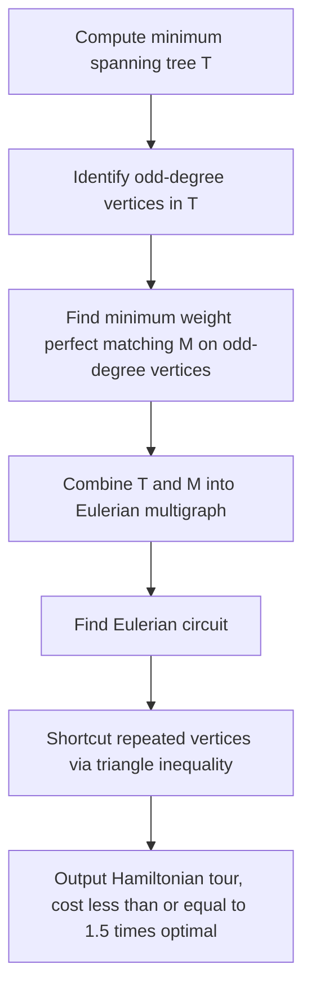

## Traveling Salesman Problem Formulations and Bounds

### Overview

The Traveling Salesman Problem (TSP) asks for the minimum-cost Hamiltonian cycle in a weighted graph — a tour visiting every vertex exactly once and returning to the start. TSP is NP-hard, and its symmetric, asymmetric, and metric variants admit different exact formulations and bound-generating relaxations. Because exact solving is intractable at scale, the practical study of TSP centers on integer programming formulations, lower-bounding techniques, and the gap between them — the core machinery used by branch-and-bound and branch-and-cut solvers.

### Problem Variants

#### Symmetric TSP (STSP)

Cost is symmetric: $c(i,j) = c(j,i)$ for all vertex pairs. The tour is an undirected cycle.

#### Asymmetric TSP (ATSP)

Cost may differ by direction: $c(i,j) \ne c(j,i)$. Models settings like one-way routes or directional travel time. ATSP can be transformed into an STSP instance on a larger graph, though this transformation roughly doubles the vertex count.

#### Metric TSP

Costs satisfy the triangle inequality: $c(i,k) \le c(i,j) + c(j,k)$. This restriction enables constant-factor approximation algorithms unavailable to general TSP, since triangle inequality bounds how much a tour can be "improved" by skipping intermediate stops.

#### Euclidean TSP

A special case of metric TSP where vertices are points in the plane (or higher dimension) and cost is Euclidean distance. Admits a polynomial-time approximation scheme (PTAS) via Arora's algorithm, in contrast to general metric TSP, which does not.

### Integer Programming Formulations

#### Dantzig-Fulkerson-Johnson (DFJ) Formulation

Uses binary variables $x_{ij} \in \{0,1\}$ indicating whether edge $(i,j)$ is in the tour. The objective and degree constraints:

$$\min \sum_{(i,j)} c_{ij} x_{ij}$$

subject to

$$\sum_{j} x_{ij} = 2 \quad \forall i \quad \text{(each vertex has exactly two incident tour edges)}$$

Degree constraints alone permit disconnected subtours, so DFJ adds subtour elimination constraints (SECs) for every proper subset $S \subset V$, $2 \le |S| \le |V|-1$:

$$\sum_{i,j \in S} x_{ij} \le |S| - 1$$

**Key Points**

- The number of SECs grows exponentially in $|V|$ ($2^{|V|} - 2$ subsets), so DFJ is solved in practice via lazy constraint generation — adding violated SECs only when a candidate solution contains a subtour, rather than including all of them upfront
- This "cutting plane" approach is the ancestor of modern branch-and-cut TSP solvers

#### Miller-Tucker-Zemlin (MTZ) Formulation

Avoids the exponential SEC family by introducing auxiliary continuous variables $u_i$ representing the position of vertex $i$ in the tour, with constraints:

$$u_i - u_j + n \cdot x_{ij} \le n - 1 \quad \forall i \ne j, \, i,j \ne 1$$

**Key Points**

- Polynomial-size formulation ($O(|V|^2)$ constraints) at the cost of a substantially weaker LP relaxation than DFJ
- [Unverified] The looseness of the MTZ relaxation compared to DFJ is well established qualitatively in the literature, though the exact quantitative gap depends on instance structure
- Preferred when formulation size matters more than bound tightness, e.g., as a starting model before adding cutting planes

### Formulation Comparison Diagram (svg_diagram)

<svg xmlns="http://www.w3.org/2000/svg" viewBox="0 0 700 300">
\<style\>
.box { fill: var(--bg-secondary, #f2f2f2); stroke: var(--border-primary, #444); stroke-width: 1.5; }
.label { font-family: sans-serif; font-size: 13px; fill: var(--text-primary, #222); text-anchor: middle; }
.axis { stroke: var(--text-secondary, #666); stroke-width: 1.5; }
.arrow { fill: var(--text-secondary, #666); }
\</style\>
<text x="350" y="24" class="label" font-size="16" font-weight="bold">TSP Formulation Trade-offs (svg_diagram)</text>
<line x1="80" y1="240" x2="620" y2="240" class="axis" />
<line x1="80" y1="240" x2="80" y2="60" class="axis" />
<text x="350" y="270" class="label">Formulation size (constraints)</text>
<text x="35" y="150" class="label" transform="rotate(-90 35 150)">LP relaxation tightness</text>
<rect x="110" y="200" width="140" height="34" class="box" rx="4" />
<text x="180" y="222" class="label">MTZ (O(n^2))</text>
<rect x="440" y="80" width="160" height="34" class="box" rx="4" />
<text x="520" y="102" class="label">DFJ (exponential SECs)</text>
<rect x="270" y="140" width="150" height="34" class="box" rx="4" />
<text x="345" y="162" class="label">DFJ + lazy cuts</text>

<text x="350" y="290" class="label" font-size="11">Lazy-cut DFJ approximates full DFJ tightness with practical constraint counts</text>

</svg>

### Lower Bounding Techniques

#### 1-Tree Relaxation (Held-Karp Bound)

Relaxes the Hamiltonian cycle constraint to a 1-tree: a minimum spanning tree on $V \setminus \{1\}$, plus the two cheapest edges incident to vertex 1. Since every Hamiltonian cycle is a 1-tree, the minimum 1-tree cost lower-bounds the optimal tour.

**Key Points**

- The bound is strengthened via Lagrangian relaxation: dualize the degree-2 constraints with multipliers $\lambda_i$ (node penalties), reweighting edges as $c_{ij} + \lambda_i + \lambda_j$, and maximize the resulting 1-tree bound over $\lambda$ using subgradient optimization
- The resulting Held-Karp bound is provably within $3/2$ of the optimal tour value for metric TSP in the worst case, and is typically much tighter in practice — commonly cited as producing bounds within a few percent of optimal on benchmark instances [Unverified — exact quality is instance-dependent and varies by benchmark set]
- Forms the bounding function used inside branch-and-bound TSP solvers, including early implementations that first made large-instance exact TSP solving tractable

#### Linear Programming Relaxation

Relaxing $x_{ij} \in \{0,1\}$ to $x_{ij} \in [0,1]$ in the DFJ formulation gives an LP whose optimal value lower-bounds the integer optimum. Solved via the cutting-plane method: solve the LP, check the fractional solution for violated subtour or comb inequalities, add them, and resolve — iterating toward integrality without enumerating all constraints upfront.

**Key Points**

- Comb inequalities and other more complex valid inequalities (beyond simple SECs) tighten the relaxation further and are the basis of the Concorde solver's cutting-plane engine
- The LP relaxation bound and the Held-Karp bound coincide for the DFJ formulation — both refer to the same underlying polytope relaxation viewed from different derivations (combinatorial 1-tree vs. LP)

### Approximation Algorithms and Bounds

#### Nearest Neighbor Heuristic

Greedily visits the nearest unvisited vertex at each step. Simple but with no constant approximation guarantee in general — worst-case tour cost can grow logarithmically relative to optimal even under the triangle inequality, so it functions as a fast heuristic rather than a bounded approximation.

#### Christofides-Serdyukov Algorithm

For metric TSP: (1) compute a minimum spanning tree $T$; (2) find a minimum weight perfect matching $M$ on the odd-degree vertices of $T$; (3) combine $T$ and $M$ into an Eulerian multigraph; (4) find an Eulerian circuit; (5) shortcut repeated vertices to form a Hamiltonian cycle (valid by the triangle inequality).

**Key Points**

- Guarantees a tour of cost at most $3/2$ times optimal for metric TSP
- Was the best known approximation ratio for general metric TSP for decades; a 2020–2021 result improved this to $3/2 - \epsilon$ for a small constant $\epsilon$ [Unverified — recall of the exact constant and publication specifics may be imprecise; verify against current literature if the precise bound matters]
- The minimum weight perfect matching step uses the same weighted matching machinery as the assignment problem, connecting TSP approximation directly to matching algorithms

#### Christofides Algorithm Flow

#### Arora's PTAS (Euclidean TSP)

For Euclidean TSP, Arora's algorithm achieves a $(1+\epsilon)$-approximation in $n \cdot (\log n)^{O(1/\epsilon)}$ time via recursive spatial partitioning (a randomized quadtree decomposition) that bounds how far an optimal tour can be from one respecting the partition's structure.

**Key Points**

- The running time's dependence on $1/\epsilon$ makes very small $\epsilon$ impractical, but for fixed moderate $\epsilon$ it is polynomial
- Demonstrates that the geometric structure of Euclidean TSP admits approximation quality unreachable for general metric TSP, where no PTAS exists unless P = NP

### Exact Solving in Practice

#### Branch-and-Cut

The dominant exact-solving paradigm (used by Concorde and similar solvers): solve the LP relaxation, add violated valid inequalities (SECs, comb inequalities, and others) as cutting planes, and branch on fractional variables when no further cuts are found, recursing until an integral, feasible, provably optimal tour is certified.

**Key Points**

- [Unverified] Concorde and similar solvers have certified optimal solutions for instances with tens of thousands of vertices, though the largest solved instance changes as computational techniques improve and any specific figure should be checked against current records
- Performance depends heavily on cut-generation quality; weak formulations (e.g., MTZ without added cuts) perform far worse in branch-and-cut than DFJ-based formulations with comb inequalities

#### Dynamic Programming (Held-Karp Exact Algorithm)

Distinct from the Held-Karp *bound* above, the Held-Karp *exact* algorithm solves TSP exactly via DP over subsets: let $D[S][j]$ be the minimum cost path visiting exactly the vertices in $S$, ending at $j$:

$$D[S][j] = \min_{i \in S \setminus \{j\}} \big(D[S \setminus \{j\}][i] + c_{ij}\big)$$

**Key Points**

- Time complexity: $O(2^n \cdot n^2)$, space $O(2^n \cdot n)$ — exponential, but a substantial improvement over the $O(n!)$ of brute-force permutation enumeration
- Practical only for small instances (roughly $n \le 20$–25) due to exponential memory requirements, not just time

### Complexity and Bound Summary

| Method | Type | Guarantee / Complexity |
| --- | --- | --- |
| DFJ + lazy SECs | Exact (IP) | NP-hard; exponential worst case |
| MTZ | Exact (IP) | NP-hard; weaker LP bound than DFJ |
| Held-Karp 1-tree bound | Lower bound | Within factor $3/2$ worst case (metric) |
| Held-Karp DP | Exact | $O(2^n n^2)$ time, $O(2^n n)$ space |
| Nearest Neighbor | Heuristic | No constant-factor guarantee |
| Christofides | Approximation (metric) | $\le 3/2 \times$ optimal |
| Arora's PTAS | Approximation (Euclidean) | $(1+\epsilon) \times$ optimal, quasi-polynomial in $1/\epsilon$ |

### Applications

- Vehicle routing and logistics (as the core subproblem of VRP)
- Circuit board drilling and PCB manufacturing path optimization
- Genome sequencing (fragment ordering reduced to TSP-like tours)
- DNA sequencing and job-shop scheduling with sequence-dependent setup costs

### Related Topics

- Vehicle routing problem (VRP) and its TSP-based subproblems
- Branch-and-bound and branch-and-cut methods in integer programming
- Lagrangian relaxation and subgradient optimization
- Minimum spanning tree algorithms (Kruskal's, Prim's, Borůvka's)
- Weighted matching algorithms (used in Christofides' matching step)
- Cutting-plane methods and polyhedral combinatorics
- Approximation algorithms and hardness of approximation