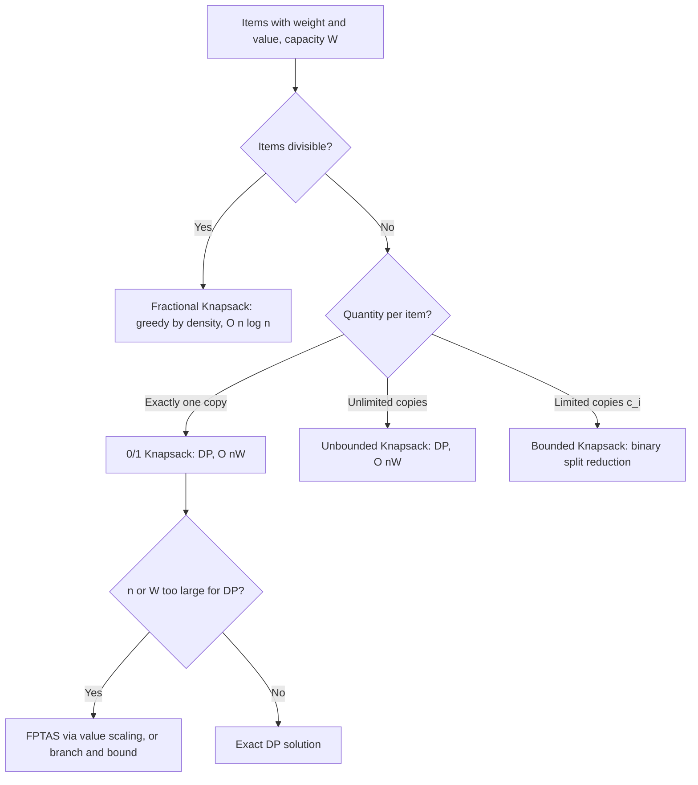

## Knapsack Problem Variants and Algorithms

### Overview

The knapsack problem asks how to select items with given weights and values into a capacity-limited container to maximize total value. Despite its simple statement, it spans a spectrum of computational difficulty depending on the variant: some forms admit exact pseudo-polynomial dynamic programming, others admit fully polynomial-time approximation schemes (FPTAS), and others remain hard to approximate at all. It serves as a canonical example in combinatorial optimization for illustrating the gap between NP-hardness in the strong sense and NP-hardness in the weak (pseudo-polynomial-solvable) sense.

### 0/1 Knapsack Problem

#### Problem Definition

Given $n$ items with weights $w_i$ and values $v_i$, and capacity $W$, choose a subset $S \subseteq \{1, \dots, n\}$ maximizing:

$$\max \sum_{i \in S} v_i \quad \text{subject to} \quad \sum_{i \in S} w_i \le W$$

Each item is either fully included or excluded — no fractional or repeated selection.

#### Dynamic Programming Solution

Define $D[i][c]$ as the maximum value achievable using the first $i$ items with capacity $c$. The recurrence:

$$D[i][c] = \max\big(D[i-1][c], \; D[i-1][c - w_i] + v_i\big) \quad \text{if } w_i \le c$$

$$D[i][c] = D[i-1][c] \quad \text{otherwise}$$

**Key Points**

- Time and space complexity: $O(n \cdot W)$ — pseudo-polynomial, since it depends on the numeric value of $W$, not just $\log W$
- Space can be reduced to $O(W)$ by iterating capacity in decreasing order within a single 1D array, since each item's update only depends on values from the previous item's row
- NP-hard in the weak sense: polynomial in $n$ and $W$, but exponential in the input's bit-length representation of $W$

**Example**

Items: $(w,v) = (2,3), (3,4), (4,5), (5,6)$, capacity $W = 5$.

$D[i][c]$ table (rows = items considered, columns = capacity 0–5):

| Items \ Cap | 0 | 1 | 2 | 3 | 4 | 5 |
| --- | --- | --- | --- | --- | --- | --- |
| none | 0 | 0 | 0 | 0 | 0 | 0 |
| +item1(2,3) | 0 | 0 | 3 | 3 | 3 | 3 |
| +item2(3,4) | 0 | 0 | 3 | 4 | 4 | 7 |
| +item3(4,5) | 0 | 0 | 3 | 4 | 5 | 7 |
| +item4(5,6) | 0 | 0 | 3 | 4 | 5 | 7 |

Optimal value: 7, achieved by items 1 and 2 (weight $2+3=5, value $3+4=7
).

### 0/1 Knapsack DP Table Fill Order (svg_diagram)

<svg xmlns="http://www.w3.org/2000/svg" viewBox="0 0 640 280">
\<style\>
.cell { fill: var(--bg-secondary, #f2f2f2); stroke: var(--border-primary, #555); stroke-width: 1; }
.highlight { fill: var(--bg-tertiary, #ddd); stroke: var(--border-primary, #222); stroke-width: 2; }
.label { font-family: sans-serif; font-size: 12px; fill: var(--text-primary, #222); text-anchor: middle; }
.arrow { stroke: var(--text-secondary, #666); stroke-width: 1.5; fill: none; marker-end: url(#arr3); }
\</style\>
<text x="320" y="24" class="label" font-size="16" font-weight="bold">0/1 Knapsack Recurrence Dependencies (svg_diagram)</text>
<rect x="60" y="70" width="90" height="50" class="cell" />
<text x="105" y="100" class="label">D[i-1][c]</text>
<rect x="60" y="160" width="90" height="50" class="cell" />
<text x="105" y="190" class="label">D[i-1][c-w_i]</text>
<rect x="300" y="115" width="110" height="50" class="highlight" />
<text x="355" y="145" class="label">D[i][c] = max(...)</text>
<path d="M150,95 L300,130" class="arrow" />
<path d="M150,185 L300,150" class="arrow" />

<text x="355" y="200" class="label" font-size="11">Skip item i, or take item i (needs value + prior row)</text>

</svg>

### Fractional Knapsack Problem

#### Problem Definition

Same setup, but items may be split — take any fraction $x_i \in [0,1]$ of item $i$:

$$\max \sum_i x_i v_i \quad \text{subject to} \quad \sum_i x_i w_i \le W, \; x_i \in [0,1]$$

#### Greedy Algorithm

Sort items by value density $v_i / w_i$ in decreasing order. Take items fully in that order until the next item would exceed capacity, then take the fractional remainder of that item and stop.

**Key Points**

- Time complexity: $O(n \log n)$, dominated by the sort
- Provably optimal for the fractional variant — greedy exchange argument: swapping any fraction of a lower-density item for a higher-density one strictly improves the solution while remaining feasible, so no locally improving move exists at the greedy solution
- The fractional relaxation's optimal value upper-bounds the 0/1 optimal value, making it a standard bound used inside branch-and-bound solvers for 0/1 knapsack

### Unbounded Knapsack Problem

#### Problem Definition

Each item type may be selected any number of times (unlimited supply):

$$\max \sum_i x_i v_i \quad \text{subject to} \quad \sum_i x_i w_i \le W, \; x_i \in \mathbb{Z}_{\ge 0}$$

#### Dynamic Programming Solution

Define $D[c]$ as the maximum value achievable with capacity $c$:

$$D[c] = \max_{i : w_i \le c} \big(D[c - w_i] + v_i\big)$$

**Key Points**

- Time complexity: $O(n \cdot W)$, space $O(W)$ — a single 1D array suffices since items can repeat, so iteration proceeds capacity-increasing rather than requiring the reverse order used in 0/1 knapsack
- The reverse-order restriction from 0/1 knapsack is specifically what's relaxed here: repetition is intentional, not an artifact to avoid

### Bounded Knapsack Problem

#### Problem Definition

Each item $i$ has a maximum available quantity $c_i$ (between 0/1's cap of 1 and unbounded's cap of $\infty$):

$$\max \sum_i x_i v_i \quad \text{subject to} \quad \sum_i x_i w_i \le W, \; 0 \le x_i \le c_i, \; x_i \in \mathbb{Z}$$

#### Binary Splitting Reduction

Reduces to 0/1 knapsack by decomposing each item's available quantity $c_i$ into $O(\log c_i)$ groups of sizes $1, 2, 4, \dots$ (powers of two, with a final remainder group), each representing a "bundle" item with combined weight and value scaled accordingly. Any achievable quantity $0$ to $c_i$ can be formed by selecting a subset of these bundles, since binary representation covers the full range.

**Key Points**

- Reduces item count from $n$ items to $O(n \log(\max c_i))$ bundle items, then solves as standard 0/1 knapsack: overall $O(n W \log(\max c_i))$
- A monotone deque-based DP achieves $O(nW)$ directly without the log factor, by exploiting the bounded-quantity structure within the capacity-iteration recurrence [Unverified — the deque-optimization technique's exact formulation is more intricate and worth confirming against a reference implementation before use]

### Multi-Dimensional Knapsack Problem

#### Problem Definition

Generalizes to multiple resource constraints simultaneously — each item consumes $d$ different resources $w_i^{(1)}, \dots, w_i^{(d)}$, each bounded by its own capacity $W^{(1)}, \dots, W^{(d)}$:

$$\max \sum_i x_i v_i \quad \text{subject to} \quad \sum_i x_i w_i^{(k)} \le W^{(k)} \; \forall k, \; x_i \in \{0,1\}$$

**Key Points**

- DP extends naturally but the state space grows to $O(n \cdot \prod_k W^{(k)})$ — exponential in the number of dimensions $d$, making exact DP impractical beyond small $d$
- Commonly solved in practice via integer programming solvers, Lagrangian relaxation on the multiple constraints, or metaheuristics (genetic algorithms, simulated annealing) rather than direct DP when $d$ is more than 2 or 3

### Multiple Knapsack Problem

#### Problem Definition

Given $m$ separate knapsacks each with its own capacity $W_j$, assign items (each usable at most once total, across all knapsacks) to maximize total value packed across all knapsacks.

**Key Points**

- Generalizes both bin packing (feasibility question: can all items fit in $m$ bins) and single knapsack (value maximization in one bin)
- NP-hard even for $m = 2$; typically approached via LP relaxation plus rounding, or greedy assignment by density with knapsack-by-knapsack refinement

### Approximation and Bounds

#### FPTAS for 0/1 Knapsack

Despite NP-hardness, 0/1 knapsack admits a fully polynomial-time approximation scheme: scale and round item values to reduce the DP's value range, trading a controlled $(1-\epsilon)$ factor of optimality for polynomial dependence on $1/\epsilon$ instead of on $W$.

**Key Points**

- Standard construction: let $v_{\max}$ be the largest item value, scale each $v_i$ to $\hat{v}_i = \lfloor v_i \cdot n / (\epsilon \cdot v_{\max}) \rfloor$, and run the DP on values (indexed by value, not weight) instead of on capacity
- Achieves $(1-\epsilon)$-approximation in $O(n^3 / \epsilon)$ time — polynomial in both $n$ and $1/\epsilon$, which is what qualifies it as an FPTAS rather than merely a PTAS
- Existence of an FPTAS is notable because many NP-hard problems (e.g., general TSP) admit no PTAS at all unless P = NP — 0/1 knapsack's weak NP-hardness (pseudo-polynomial DP exists) is precisely what makes the FPTAS constructible

#### Branch-and-Bound with Fractional Relaxation Bound

Exact solvers for large 0/1 knapsack instances often use branch-and-bound with the fractional knapsack's greedy solution as an upper bound at each node, pruning branches whose fractional bound falls below the best integer solution found so far.

**Key Points**

- [Inference] Effective in practice because the fractional bound is both fast to compute ($O(n \log n)$ per node after initial sort) and typically close to the integer optimum, giving strong pruning power — though worst-case behavior can still be exponential

### Knapsack Variant Selection Flow

### Complexity Summary

| Variant | Optimal Approach | Complexity |
| --- | --- | --- |
| Fractional | Greedy by density | $O(n \log n)$, exact |
| 0/1 | Dynamic programming | $O(nW)$, pseudo-polynomial exact |
| 0/1 (large W) | FPTAS | $O(n^3/\epsilon)$, $(1-\epsilon)$-approx |
| Unbounded | Dynamic programming | $O(nW)$, exact |
| Bounded | Binary splitting + 0/1 DP | $O(nW\log(\max c_i))$, exact |
| Multi-dimensional | DP (small $d$) / IP or metaheuristic (large $d$) | $O(n\prod_k W^{(k)})$, exponential in $d$ |
| Multiple knapsacks | LP relaxation + rounding, or greedy | NP-hard, heuristic in practice |

### Applications

- Capital budgeting and project selection under budget constraints
- Cargo loading and cutting stock problems
- Resource allocation in cloud computing (bin-packing-adjacent variants)
- Portfolio selection with discrete asset choices

### Related Topics

- Bin packing problem and its approximation algorithms
- Subset sum problem (knapsack's decision-problem special case)
- Branch-and-bound methods in integer programming
- Dynamic programming over subsets and bitmask DP
- Lagrangian relaxation for multi-constraint optimization
- NP-hardness in the strong vs. weak sense, and pseudo-polynomial algorithms