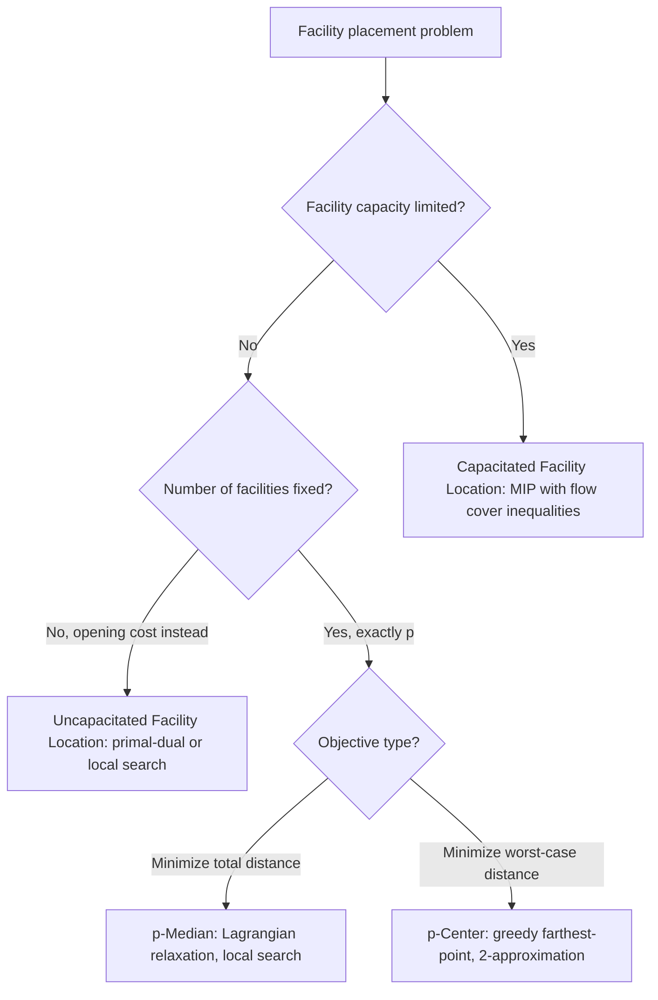

## Facility Location and Set Covering Problems

### Overview

Facility location and set covering problems ask where to place resources or which subsets to select so that a set of demands or elements is served, typically minimizing cost or the number of resources used. They are closely related structurally — many facility location variants reduce to or generalize set covering — and both are foundational in combinatorial optimization for modeling infrastructure planning, service coverage, and resource placement under cost or capacity constraints. Most variants are NP-hard, making integer programming formulations, LP relaxation bounds, and greedy approximation algorithms the standard toolkit.

### Set Covering Problem

#### Problem Definition

Given a universe $U$ of elements, a collection of subsets $S_1, \dots, S_m \subseteq U$ each with cost $c_j$, find a minimum-cost sub-collection whose union equals $U$:

$$\min \sum_j c_j x_j \quad \text{subject to} \quad \sum_{j: e \in S_j} x_j \ge 1 \; \forall e \in U, \; x_j \in \{0,1\}$$

Each constraint ensures every element $e$ is covered by at least one selected subset.

#### Greedy Algorithm

Repeatedly select the subset with the smallest cost-per-newly-covered-element ratio, $c_j / |S_j \setminus \text{covered}|$, until all elements are covered.

**Key Points**

- Achieves an $H_n$-approximation, where $H_n = 1 + 1/2 + \dots + 1/n \approx \ln n$ is the $n$-th harmonic number — this is the best possible approximation ratio for set cover unless P = NP, by a hardness result tied to the PCP theorem
- Time complexity: $O(\sum_j |S_j|)$ per iteration for a naive scan, commonly implemented with a priority queue for efficiency across iterations
- Unweighted set cover (all $c_j = 1$) is the special case minimizing the number of subsets, still $H_n$-hard to approximate

#### LP Relaxation and Randomized Rounding

Relax $x_j \in \{0,1\}$ to $x_j \in [0,1]$, solve the LP, then round: include $S_j$ with probability proportional to $x_j^*$ (repeated across multiple rounds until feasible), or deterministically include any $S_j$ with $x_j^* \ge 1/f$ where $f$ is the maximum number of sets containing any single element (frequency).

**Key Points**

- Deterministic rounding by frequency yields an $f$-approximation, useful when $f$ is small even if $n$ is large (e.g., $f=2$ for vertex cover, discussed below)
- Randomized rounding typically achieves an $O(\log n)$-approximation with high probability, matching the greedy bound asymptotically

### Set Cover Greedy Selection (svg_diagram)

<svg xmlns="http://www.w3.org/2000/svg" viewBox="0 0 640 300">
\<style\>
.u { fill: none; stroke: var(--border-primary, #444); stroke-width: 1.5; }
.s1 { fill: var(--bg-secondary, #ddd); fill-opacity: 0.6; stroke: var(--text-primary, #333); stroke-width: 1.5; }
.s2 { fill: var(--bg-tertiary, #ccc); fill-opacity: 0.6; stroke: var(--text-primary, #333); stroke-width: 1.5; }
.s3 { fill: var(--bg-secondary, #eee); fill-opacity: 0.6; stroke: var(--text-primary, #333); stroke-width: 1.5; }
.dot { fill: var(--text-primary, #222); }
.label { font-family: sans-serif; font-size: 13px; fill: var(--text-primary, #222); text-anchor: middle; }
\</style\>
<text x="320" y="24" class="label" font-size="16" font-weight="bold">Set Cover: Overlapping Subsets over Universe U (svg_diagram)</text>
<rect x="60" y="60" width="520" height="200" class="u" rx="8" />
<text x="100" y="80" class="label">U</text>
<ellipse cx="200" cy="150" rx="110" ry="70" class="s1" />
<text x="120" y="100" class="label">S1 (cost 3)</text>
<ellipse cx="340" cy="120" rx="100" ry="60" class="s2" />
<text x="420" y="80" class="label">S2 (cost 2)</text>
<ellipse cx="380" cy="210" rx="100" ry="60" class="s3" />
<text x="460" y="260" class="label">S3 (cost 4)</text>
<circle cx="150" cy="150" r="4" class="dot" />
<circle cx="220" cy="170" r="4" class="dot" />
<circle cx="280" cy="120" r="4" class="dot" />
<circle cx="340" cy="180" r="4" class="dot" />
<circle cx="420" cy="130" r="4" class="dot" />
<circle cx="400" cy="220" r="4" class="dot" />
<circle cx="460" cy="200" r="4" class="dot" />

<text x="320" y="290" class="label" font-size="11">Greedy picks S1 first (best cost/new-element ratio), then covers remainder</text>

</svg>

### Vertex Cover (Special Case)

#### Problem Definition

Given a graph $G = (V,E)$, find a minimum subset $C \subseteq V$ such that every edge has at least one endpoint in $C$. Equivalent to set cover where the universe is $E$ and each vertex's subset is its incident edges — with frequency $f = 2$, since every edge touches exactly two vertices.

**Key Points**

- The frequency-based LP rounding bound gives a 2-approximation directly, tighter than the general $H_n$ bound because vertex cover's structure bounds $f=2$
- Exactly solvable in polynomial time on bipartite graphs via König's theorem (minimum vertex cover size equals maximum matching size), connecting back to bipartite matching algorithms
- NP-hard on general graphs; the 2-approximation via maximal matching (take both endpoints of every edge in any maximal matching) is simpler than LP rounding and achieves the same ratio

### Uncapacitated Facility Location (UFL)

#### Problem Definition

Given a set of potential facility locations $F$ with opening costs $f_i$, and clients $D$ with cost $c_{ij}$ to serve client $j$ from facility $i$, choose which facilities to open and assign each client to an open facility, minimizing total opening plus service cost:

$$\min \sum_{i \in F} f_i y_i + \sum_{i,j} c_{ij} x_{ij}$$

subject to each client being assigned to exactly one open facility ($x_{ij} \le y_i$, $\sum_i x_{ij} = 1$), with $y_i, x_{ij} \in \{0,1\}$. "Uncapacitated" means each opened facility can serve any number of clients.

**Key Points**

- NP-hard in general; becomes polynomial-time solvable when service costs form a tree metric or under certain submodularity conditions
- The LP relaxation is commonly solved via primal-dual algorithms, which simultaneously build a feasible integer solution and a dual certificate bounding its distance from optimal

#### Approximation Algorithms

Several constant-factor approximations exist for metric UFL (where $c_{ij}$ satisfies the triangle inequality):

**Key Points**

- The JMS (Jain-Mahdian-Saberi) primal-dual algorithm and local search algorithms both achieve constant approximation ratios for metric UFL
- [Unverified] The best known approximation ratio for metric UFL has been improved over time through a sequence of results; citing a specific current-best constant risks being out of date, so treat any numeric ratio as needing verification against recent literature
- Local search algorithms (add, drop, or swap a facility if it improves cost) are simple to implement and perform well in practice despite typically weaker worst-case guarantees than primal-dual methods

### Capacitated Facility Location (CFL)

#### Problem Definition

Extends UFL with a capacity $u_i$ on each facility, limiting how many clients (or how much demand) it can serve:

$$\sum_j d_j x_{ij} \le u_i y_i \quad \forall i$$

where $d_j$ is client $j$'s demand.

**Key Points**

- Substantially harder to approximate than UFL — capacity constraints break the simple exchange arguments used in UFL local search, since opening or closing a facility can now violate feasibility rather than just changing cost
- Common in practice via MIP solvers with valid inequalities (e.g., flow cover inequalities) rather than combinatorial approximation algorithms directly

### p-Median and p-Center Problems

#### p-Median Problem

Fixes the number of facilities to open at exactly $p$ (no opening cost), minimizing total weighted service distance:

$$\min \sum_j d_j \cdot c_{i(j),j} \quad \text{subject to exactly } p \text{ facilities open}$$

where $i(j)$ is the facility assigned to client $j$.

**Key Points**

- NP-hard; commonly solved via Lagrangian relaxation (dualizing the assignment constraints) combined with a p-median-specific local search, or via the same primal-dual/local-search techniques used for UFL adapted to a fixed facility count
- Models scenarios with a hard budget on the number of facilities rather than a per-facility opening cost

#### p-Center Problem

Also fixes $p$ facilities, but minimizes the maximum (rather than total) client-to-facility distance — a min-max rather than min-sum objective:

$$\min \max_j c_{i(j),j} \quad \text{subject to exactly } p \text{ facilities open}$$

**Key Points**

- The min-max objective changes the approximability landscape substantially: a simple greedy farthest-point algorithm achieves a 2-approximation for metric p-center, and this is best possible unless P = NP
- Models worst-case service guarantees (e.g., maximum ambulance response time) rather than average-case cost, making it the natural choice when a service-level guarantee matters more than total cost

### Facility Location Variant Selection

### Complexity and Approximation Summary

| Problem | Approximation | Notes |
| --- | --- | --- |
| Set Cover | $H_n \approx \ln n$ | Best possible unless P = NP |
| Vertex Cover | 2 | Tighter due to frequency $f=2$; poly-time on bipartite graphs |
| Uncapacitated Facility Location | Constant factor (metric) | Best known constant improved over time; verify current value |
| Capacitated Facility Location | Weaker / MIP-based | Harder to approximate than UFL |
| p-Median | Constant factor via local search / Lagrangian | NP-hard |
| p-Center | 2 | Best possible unless P = NP |

### Applications

- **Set cover**: sensor placement, test case selection in software testing, crew scheduling
- **Vertex cover**: network monitoring, conflict-resolution scheduling
- **Facility location**: warehouse and distribution center placement, cell tower siting, public service placement (fire stations, hospitals)
- **p-center**: emergency service placement where worst-case response time is the binding constraint

### Related Topics

- Integer programming formulations and branch-and-bound
- LP relaxation, rounding techniques, and integrality gaps
- Bipartite matching and König's theorem
- Approximation algorithm design (greedy, primal-dual, local search)
- Submodular function optimization
- k-means and k-medoids clustering (geometric relatives of p-median)