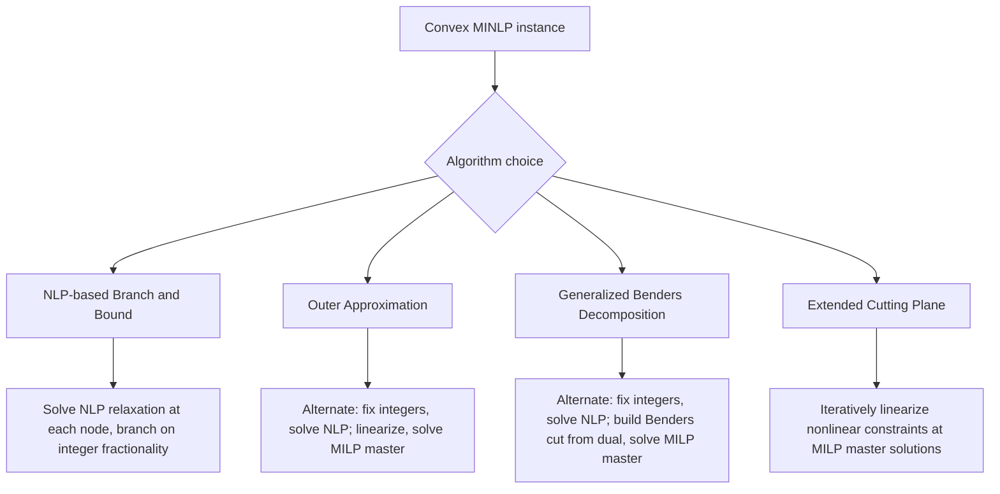

## MINLP Problem Structure

### Overview

Mixed-Integer Nonlinear Programming (MINLP) combines the combinatorial complexity of integer programming with the continuous nonlinearity of nonlinear programming. It optimizes an objective subject to constraints where some decision variables are restricted to integers and the objective or constraints (or both) are nonlinear functions. MINLP subsumes MILP (linear case) and NLP (continuous case) as special structures, and its algorithmic landscape is defined by how it exploits or fails to exploit convexity in the underlying nonlinear functions.

### General Formulation

$$\min_{x,y} f(x,y)$$

$$\text{subject to} \quad g(x,y) \le 0, \quad h(x,y) = 0$$

$$x \in \mathbb{R}^n, \quad y \in \mathbb{Z}^p$$

where $x$ are continuous variables, $y$ are integer (often binary) variables, and $f, g, h$ may be nonlinear in either or both variable groups.

**Key Points**

- When $f, g, h$ are all linear, this reduces to Mixed-Integer Linear Programming (MILP)
- When $y$ is absent (or fixed), this reduces to Nonlinear Programming (NLP)
- The combination is strictly harder than either component alone: even fixing the integer variables to a feasible assignment leaves an NLP subproblem that may itself be hard if nonconvex

### Convex vs. Nonconvex MINLP

#### Convex MINLP

$f$ and the feasible region defined by $g, h$ are convex when $y$ is relaxed to continuous values. This is the tractable regime: the continuous relaxation at any fixed $y$ has no local optima distinct from the global optimum, so local NLP solvers can be trusted for subproblems.

**Key Points**

- Still NP-hard due to the integer requirement on $y$, but algorithmic strategies from convex NLP (duality, cutting planes, outer approximation) extend naturally
- Global optimality is attainable by exact methods within this class, since each convex NLP subproblem solved during search is itself globally solvable

#### Nonconvex MINLP

$f$, $g$, or $h$ are nonconvex — common sources include bilinear terms ($x_1 x_2$), fractional terms, trigonometric functions, or products of integer and continuous variables.

**Key Points**

- [Inference] Nonconvexity means even the continuous relaxation may have multiple local optima, so local NLP solvers embedded in a search procedure can return solutions that are not globally optimal for the subproblem, let alone the full MINLP — this is the central difficulty distinguishing nonconvex from convex MINLP
- Global optimization techniques (spatial branch-and-bound, convex relaxations of nonconvex terms) are required for certified global solutions; local nonconvex MINLP solvers exist but provide no optimality guarantee
- Common in engineering design (e.g., pump/pipe network sizing with bilinear flow-pressure relationships) and process synthesis problems

### MINLP Structure Diagram (svg_diagram)

<svg xmlns="http://www.w3.org/2000/svg" viewBox="0 0 700 340">
\<style\>
.box { fill: var(--bg-secondary, #f2f2f2); stroke: var(--border-primary, #444); stroke-width: 1.5; }
.inner { fill: var(--bg-tertiary, #e0e0e0); stroke: var(--border-primary, #444); stroke-width: 1.3; }
.label { font-family: sans-serif; font-size: 13px; fill: var(--text-primary, #222); text-anchor: middle; }
\</style\>
<text x="350" y="24" class="label" font-size="16" font-weight="bold">MINLP as a Superset of MILP and NLP (svg_diagram)</text>
<rect x="60" y="60" width="580" height="250" rx="10" class="box" />
<text x="350" y="85" class="label" font-weight="bold">MINLP: integer + continuous vars, nonlinear f/g/h</text>
<rect x="100" y="110" width="220" height="90" rx="8" class="inner" />
<text x="210" y="140" class="label">MILP</text>
<text x="210" y="160" class="label">(y integer, all linear)</text>
<text x="210" y="180" class="label">special case: f,g,h linear</text>
<rect x="380" y="110" width="220" height="90" rx="8" class="inner" />
<text x="490" y="140" class="label">NLP</text>
<text x="490" y="160" class="label">(y fixed/absent)</text>
<text x="490" y="180" class="label">special case: no integer vars</text>
<rect x="240" y="230" width="220" height="60" rx="8" class="inner" />
<text x="350" y="255" class="label">Convex MINLP</text>
<text x="350" y="275" class="label">(relaxation convex at fixed y)</text>
</svg>

### Exact Solution Methods for Convex MINLP

#### Branch-and-Bound (NLP-based)

Directly extends MILP branch-and-bound: at each node, solve the continuous NLP relaxation (integer variables relaxed to continuous bounds), branch on a fractional integer variable if the relaxation is infeasible for integrality, and prune using the relaxation's bound.

**Key Points**

- Each node requires solving a full NLP, which is far more expensive per node than the LP solves in MILP branch-and-bound
- Bounding validity relies on convexity: the NLP relaxation's optimal value must genuinely lower-bound all integer-feasible completions, which holds when the relaxation is convex

#### Outer Approximation (OA)

Alternates between solving an NLP subproblem with integer variables fixed (yielding a good continuous solution and constraint linearizations at that point) and an MILP master problem built from accumulated linearizations (outer-approximating the nonlinear feasible region with supporting hyperplanes), using the MILP's integer solution to fix variables for the next NLP.

**Key Points**

- Convergence relies on convexity: linearizing a convex constraint at a feasible point yields a valid outer approximation (an underestimate of the feasible region's boundary) that never cuts off feasible solutions
- Typically converges in far fewer iterations than pure branch-and-bound on convex MINLP because each MILP master problem accumulates global information from all prior NLP solves, not just a single branching path
- Forms the basis of solvers such as Bonmin's OA algorithm

#### Generalized Benders Decomposition (GBD)

Similar alternation to OA, but the master problem uses Benders cuts derived from the dual of the NLP subproblem (rather than direct linearization of constraints), projecting out the continuous variables entirely from the master problem.

**Key Points**

- Produces weaker cuts than OA in general (Benders cuts are typically looser approximations than OA's direct linearizations), so GBD often requires more iterations to converge, though each master problem may be smaller
- Preferred when the continuous subproblem has favorable dual structure (e.g., separable across scenarios), which is common in stochastic programming extensions of MINLP

#### Extended Cutting Plane (ECP)

Avoids solving NLP subproblems altogether: builds the MILP master problem purely from linearizations (cutting planes) of the nonlinear constraints at the master problem's own solution points, iterating without ever fixing integer variables and solving a separate NLP.

**Key Points**

- Simpler implementation since no NLP solver is needed for subproblems, at the cost of typically slower convergence than OA since it lacks the "good" continuous solutions that fixed-integer NLP solves provide
- Requires only constraint function and gradient evaluations, making it applicable when NLP solvers are unavailable or unreliable for the specific problem structure

### Convex MINLP Algorithm Comparison Flow

### Methods for Nonconvex MINLP

#### Spatial Branch-and-Bound

Extends branch-and-bound with spatial partitioning of continuous variable domains (not just branching on integer fractionality), constructing convex relaxations (e.g., McCormick envelopes for bilinear terms) valid over each subregion, and refining the partition until the relaxation gap closes.

**Key Points**

- McCormick envelopes provide valid convex (linear) under- and over-estimators for bilinear terms $x_1 x_2$ given bounds on $x_1, x_2$, forming the standard relaxation technique for this common nonconvexity source
- Convergence to global optimality is guaranteed in the limit as partitions shrink, but practical termination relies on optimality-gap tolerances rather than exact convergence, since the search tree can be very large
- Used by global solvers such as BARON, Couenne, and SCIP's global MINLP mode

#### Piecewise Linear Approximation

Approximates nonlinear (typically nonconvex) functions by piecewise linear segments, introducing auxiliary binary variables to select the active segment, converting the nonconvex MINLP into a (larger) MILP that can be solved to global optimality for the approximated problem.

**Key Points**

- [Inference] Accuracy improves with more segments at the cost of a larger MILP, creating a direct trade-off between approximation fidelity and solve time — the practical segment count depends heavily on the function's curvature and the problem's tolerance for approximation error
- Solves the approximated problem exactly, but only approximately solves the true nonconvex MINLP, since the piecewise linear function is not identical to the original nonlinear one

### Formulation Considerations

#### Big-M Constraints and Disjunctions

Logical conditions ("if binary $y=1$, constraint $g(x) \le 0$ must hold") are commonly encoded via big-M reformulation: $g(x) \le M(1-y)$ for a sufficiently large constant $M$.

**Key Points**

- Choosing $M$ too small excludes feasible solutions; choosing $M$ too large weakens the relaxation bound substantially, since a loose big-M creates a large feasible region for the relaxed (fractional) $y$
- Generalized Disjunctive Programming (GDP) offers an alternative formulation using logical disjunctions directly, which can be converted to big-M or to a convex-hull reformulation (typically tighter than big-M) depending on solver support

#### Reformulation-Linearization Technique (RLT)

Systematically generates valid linear inequalities for polynomial (often bilinear or quadratic) terms by multiplying pairs of existing linear constraints together and linearizing the resulting products via variable substitution, tightening relaxations used inside spatial branch-and-bound.

### Complexity and Solver Landscape

| Problem Class | Solvable Exactly? | Representative Solvers |
| --- | --- | --- |
| Convex MINLP | Yes, to global optimality | Bonmin, SCIP, Knitro |
| Nonconvex MINLP | Yes, via spatial B&B (can be slow) | BARON, Couenne, ANTIGONE, SCIP |
| Nonconvex MINLP (local only) | No global guarantee | Local NLP solvers with integer heuristics |

### Applications

- Chemical process design and synthesis (reactor sizing, separation network design)
- Power systems: unit commitment with nonlinear generator cost curves, optimal power flow
- Engineering design with discrete component selection and nonlinear physical relationships (pipe networks, structural design)
- Portfolio optimization with cardinality constraints and nonlinear risk measures

### Related Topics

- Mixed-integer linear programming (MILP) and branch-and-bound
- Convex optimization and duality theory
- Global optimization and spatial branch-and-bound
- Generalized disjunctive programming (GDP)
- Semidefinite and conic relaxations for nonconvex quadratic problems
- Metaheuristics for nonconvex MINLP (genetic algorithms, simulated annealing) when exact global methods are computationally infeasible