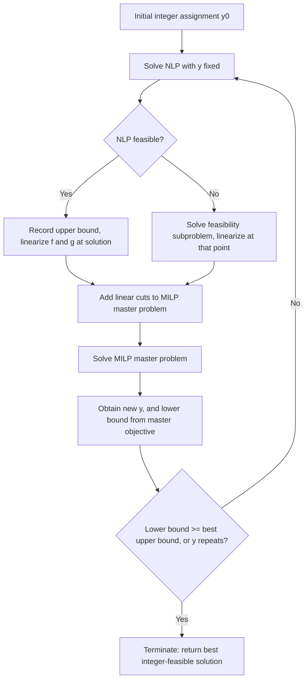

## Outer Approximation Methods

### Overview

Outer approximation (OA) is an exact algorithm for convex MINLP that alternates between solving a nonlinear program with integer variables fixed and a mixed-integer linear program that accumulates linear approximations of the nonlinear constraints. It exploits convexity to guarantee that each accumulated linearization is a valid outer bound on the true feasible region, allowing the MILP master problem to converge to the global MINLP optimum in a finite number of iterations. First introduced by Duran and Grossmann, OA remains one of the most widely implemented algorithms in convex MINLP solvers.

### Core Idea

Given a convex MINLP

$$\min_{x,y} f(x,y) \quad \text{s.t.} \quad g(x,y) \le 0, \quad x \in X, \; y \in Y \cap \mathbb{Z}^p$$

with $f$ and $g$ convex in $x$ for each fixed $y$, OA replaces the nonlinear feasible region with its outer approximation: the intersection of half-spaces tangent to $g$ at a finite set of points $(x^k, y^k)$. Because $g$ is convex, each tangent hyperplane

g(x^k, y^k) + \nabla g(x^k, y^k)^T \begin(x - x^k, \, y - y^k) \le 0

underestimates $g$ everywhere and never excludes a feasible point — the defining property that makes the master problem's feasible region a valid relaxation rather than an approximation that could cut off the optimum.

### Algorithm Structure

#### Step 1: NLP Subproblem

Fix $y = y^k$ (an integer assignment from the previous MILP master solution, or an initial guess) and solve the resulting NLP:

$$\min_x f(x, y^k) \quad \text{s.t.} \quad g(x, y^k) \le 0, \quad x \in X$$

**Key Points**

- If feasible, this yields both an upper bound on the MINLP optimum (a valid integer-feasible solution) and a point $(x^k, y^k)$ at which to linearize
- If infeasible, a feasibility subproblem is solved instead (e.g., minimizing constraint violation) to obtain a point for linearization that still yields a valid cut excluding the infeasible $y^k$

#### Step 2: Linearization and Master Problem Update

At the NLP solution (or feasibility-subproblem solution) $(x^k, y^k)$, linearize $f$ and $g$ and add the resulting linear constraints to the MILP master problem:

$$\min_{x,y,\eta} \eta$$

$$\text{s.t.} \quad \eta \ge f(x^j, y^j) + \nabla f(x^j, y^j)^T(x - x^j, y - y^j) \quad \forall j \le k$$

$$g(x^j, y^j) + \nabla g(x^j, y^j)^T(x - x^j, y - y^j) \le 0 \quad \forall j \le k$$

$$x \in X, \; y \in Y \cap \mathbb{Z}^p$$

**Key Points**

- $\eta$ is an auxiliary variable representing the objective; linearizing $f$ as well as $g$ handles nonlinear objectives by moving nonlinearity into an epigraph-style constraint
- Solving this MILP yields a new candidate $y^{k+1}$ and a valid lower bound on the MINLP optimum, since the master problem's feasible region always contains the true feasible region (outer approximation)

#### Step 3: Convergence Check

Repeat: fix $y^{k+1}$, solve the NLP, add linearizations, re-solve the master. Terminate when the master problem's lower bound meets the best NLP-derived upper bound, or when the master problem re-proposes a previously seen $y$.

### Outer Approximation Iteration Flow

### Outer Approximation Geometry (svg_diagram)

<svg xmlns="http://www.w3.org/2000/svg" viewBox="0 0 640 320">
\<style\>
.region { fill: var(--bg-tertiary, #ddd); fill-opacity: 0.5; stroke: var(--text-primary, #333); stroke-width: 2; }
.tangent { stroke: var(--text-secondary, #555); stroke-width: 1.3; stroke-dasharray: 4,3; }
.point { fill: var(--text-primary, #222); }
.label { font-family: sans-serif; font-size: 13px; fill: var(--text-primary, #222); text-anchor: middle; }
\</style\>
<text x="320" y="24" class="label" font-size="16" font-weight="bold">Outer Approximation of a Convex Feasible Region (svg_diagram)</text>
<path d="M180,260 C140,180 160,100 260,80 C360,60 440,110 440,190 C440,250 340,280 180,260 Z" class="region" />
<text x="310" y="180" class="label">Convex feasible region</text>
<circle cx="260" cy="95" r="5" class="point" />
<line x1="150" y1="60" x2="380" y2="60" class="tangent" transform="rotate(-8 260 95)" />
<text x="260" y="45" class="label" font-size="11">Tangent at (x1,y1)</text>
<circle cx="420" cy="170" r="5" class="point" />
<line x1="480" y1="90" x2="480" y2="260" class="tangent" transform="rotate(15 420 170)" />
<text x="540" y="170" class="label" font-size="11">Tangent at (x2,y2)</text>
<circle cx="200" cy="250" r="5" class="point" />
<line x1="120" y1="300" x2="300" y2="300" class="tangent" transform="rotate(10 200 250)" />
<text x="210" y="300" class="label" font-size="11">Tangent at (x3,y3)</text>

<text x="320" y="20" class="label" font-size="1" />

</svg>

### Convergence Properties

**Key Points**

- Finite convergence: since $y \in Y \cap \mathbb{Z}^p$ ranges over a finite set (assuming $Y$ bounded), and OA never revisits an integer assignment without adding a new cut that excludes it from being re-optimal, the algorithm terminates in a finite number of major iterations
- Each MILP master problem's optimal value is non-decreasing across iterations (more cuts only tighten the relaxation), giving a monotonically improving lower bound sequence that converges to the true optimum from below
- The upper bound sequence (best NLP objective found) is non-increasing by construction, since only improving integer-feasible solutions are retained
- Convexity is essential to both the validity of linearization as an outer approximation and to the NLP subproblem being globally solvable by local methods — losing convexity in either $f$ or $g$ breaks the finite-convergence guarantee

### Variants and Refinements

#### OA with Equality Constraints (Fletcher-Leyffer)

Extends the original OA formulation to handle nonlinear equality constraints $h(x,y) = 0$, which cannot be simply linearized as one-sided inequalities without risking infeasibility of the master problem; requires care in how equality constraints are represented in the linearized master problem (commonly as opposing inequality pairs restricted to particular expressions, or via a reformulation that preserves convexity of the relaxation).

#### Multi-Cut and Single-Cut Variants

**Key Points**

- Multi-cut OA adds a separate linearization for each nonlinear constraint at every iteration (as shown in the standard formulation above)
- Single-cut variants aggregate constraint violations into a single linear cut per iteration, producing a smaller master problem at the cost of potentially weaker cuts and slower convergence — a trade-off between master problem size and cut strength that mirrors the OA-versus-GBD distinction in MINLP more broadly

#### Quesada-Grossmann Integration with Branch-and-Bound

Integrates OA directly into a single branch-and-bound tree (rather than alternating separately solved MILP and NLP problems): the master MILP is solved incrementally via branch-and-bound, and NLP subproblems are solved at integer-feasible nodes discovered during the same tree search, with resulting linearizations added as lazy constraints.

**Key Points**

- Avoids the overhead of re-solving the MILP master problem from scratch at every major iteration, since the branch-and-bound tree can be extended rather than restarted
- [Unverified] Reported to substantially reduce solve time relative to the original alternating OA scheme on many benchmark instances, though the specific magnitude of improvement is instance-dependent and best confirmed against solver-specific benchmarks
- Forms the basis of the LP/NLP-based branch-and-bound algorithm implemented in solvers such as Bonmin's B-OA algorithm

### Comparison with Related Decomposition Methods

| Method | Master Problem Cuts From | Relative Cut Strength | Notes |
| --- | --- | --- | --- |
| Outer Approximation | Direct linearization of $f, g$ at NLP solution | Strong | Requires solving NLP subproblems |
| Generalized Benders Decomposition | Dual multipliers of NLP subproblem | Weaker than OA | Smaller master problem per cut |
| Extended Cutting Plane | Linearization at master's own solution (no NLP solve) | Weakest, but no NLP needed | Useful when NLP solves are expensive/unreliable |
| LP/NLP-based B&B (Quesada-Grossmann) | Same as OA, integrated into one tree | Strong | Avoids repeated master problem restarts |

### Practical Considerations

**Key Points**

- The feasibility subproblem in Step 1 (used when the NLP is infeasible for a given $y^k$) is commonly formulated by minimizing the sum of constraint violations, ensuring a linearization point exists even when no feasible $x$ satisfies $g(x, y^k) \le 0$
- Warm-starting successive NLP subproblems from the previous solution is standard practice and [Inference] typically reduces per-subproblem solve time substantially, since consecutive integer assignments often differ in only a few components
- Numerical conditioning of the master MILP can degrade as cuts accumulate over many iterations; solvers commonly apply cut management (removing inactive or redundant cuts) to control master problem growth

### Applications

- Process synthesis problems in chemical engineering (originating application area for Duran-Grossmann OA)
- Energy system design with discrete equipment selection and nonlinear performance curves
- Any convex MINLP where NLP subproblems are comparatively cheap relative to the combinatorial search over integer assignments

### Related Topics

- MINLP problem structure and convex vs. nonconvex classification
- Generalized Benders decomposition
- Extended cutting plane method
- Branch-and-bound for mixed-integer nonlinear programming
- Generalized disjunctive programming and its relation to MINLP reformulation
- LP/NLP-based branch-and-bound (Quesada-Grossmann algorithm)