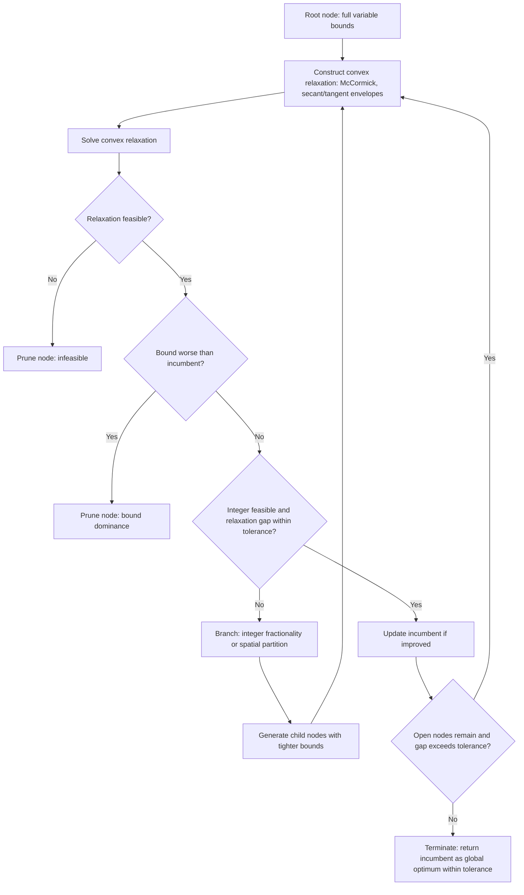

## Branch and Bound for Nonconvex MINLP

### Overview

Branch and bound for nonconvex MINLP — commonly called spatial branch and bound — extends classical branch and bound beyond branching on integer fractionality alone. Because nonconvexity means the continuous relaxation itself can have a gap from the true nonconvex feasible region, the algorithm must also partition (branch on) continuous variable domains and construct valid convex relaxations over each resulting subregion. This is the standard exact method for certifying global optimality in nonconvex MINLP, underlying global solvers such as BARON, Couenne, ANTIGONE, and SCIP's global mode.

### Why Standard Branch and Bound Is Insufficient

In convex MINLP, fixing integer variables leaves a convex NLP whose relaxation bound is valid and tight in the sense that local solvers find its global optimum. In nonconvex MINLP, even after fixing all integer variables, the remaining NLP can have multiple local optima, and its convex relaxation (e.g., dropping nonconvex terms or replacing them with convex under/overestimators) may leave a substantial gap from the true nonconvex feasible region.

**Key Points**

- A relaxation bound computed from a nonconvex NLP solved by a local solver is not guaranteed to be a valid lower bound at all, since the local solver may fail to find the relaxation's true global optimum — this is why spatial branch and bound relies specifically on *convex* relaxations constructed algebraically, not on locally solving the nonconvex relaxation directly
- Common sources of nonconvexity requiring special handling: bilinear terms ($x_1 x_2$), trilinear terms, fractional terms ($x_1/x_2$), general nonlinear univariate functions (exponentials, trigonometric functions), and products of integer and continuous variables

### Core Algorithm Structure

#### Step 1: Convex Relaxation Construction

At each node, construct a convex relaxation of the (possibly still nonconvex) subproblem restricted to the node's variable bounds. This typically involves replacing each nonconvex term with valid convex underestimators and concave overestimators.

**Key Points**

- For bilinear terms $w = x_1 x_2$ with bounds $x_1 \in [x_1^L, x_1^U]$, $x_2 \in [x_2^L, x_2^U]$, the McCormick envelope provides the tightest possible linear relaxation using four inequalities derived from the sign of $(x_1 - x_1^L)(x_2 - x_2^L) \ge 0$ and its three sign-variant counterparts
- For univariate nonlinear terms (e.g., $x^2$, $\log x$, $\sin x$), secant lines and tangent lines over the node's bounded interval provide valid convex/concave envelopes, tightening as the interval narrows

#### Step 2: Relaxation Solve and Bounding

Solve the convex relaxation at the node (a convex NLP or LP, solvable to global optimality by local methods). Its optimal value is a **valid lower bound** on the node's true optimal value, since the relaxation's feasible region contains the true nonconvex feasible region.

**Key Points**

- If the relaxation is infeasible, the node is pruned (the true problem is infeasible there too, since the relaxation's region is a superset)
- If the relaxation's bound is worse than the best known integer- and nonlinear-feasible solution (the incumbent), the node is pruned by bound dominance — the same pruning logic as standard branch and bound, but now applied to both integer and continuous infeasibility gaps

#### Step 3: Branching

If the relaxation solution violates integrality (for integer variables) or the underestimation gap remains too large (for continuous variables involved in nonconvex terms), branch.

**Key Points**

- Integer branching proceeds as in standard MILP/MINLP branch and bound: partition on a fractional integer variable's value
- Spatial branching partitions a continuous variable's domain into two (or more) subintervals, typically at the relaxation solution's value or at the term's most-violated point, generating child nodes with tighter bounds and therefore tighter convex envelopes on each side
- The choice of which variable to spatially branch on significantly affects performance; common strategies select the variable contributing the largest relaxation gap in a violated nonconvex term

#### Step 4: Recursion and Termination

Recurse on child nodes, updating the incumbent whenever a node's relaxation solution happens to be feasible for the original nonconvex problem. Terminate when the tree is exhausted or the gap between the best lower bound (over all open nodes) and the incumbent falls within a specified tolerance.

### Spatial Branch and Bound Flow

### McCormick Envelope Geometry (svg_diagram)

<svg xmlns="http://www.w3.org/2000/svg" viewBox="0 0 660 320">
\<style\>
.surface { fill: var(--bg-tertiary, #ddd); fill-opacity: 0.5; stroke: var(--text-primary, #333); stroke-width: 1.5; }
.true_curve { fill: none; stroke: var(--text-primary, #222); stroke-width: 2.5; }
.under { stroke: var(--text-secondary, #666); stroke-width: 1.5; stroke-dasharray: 5,3; }
.label { font-family: sans-serif; font-size: 13px; fill: var(--text-primary, #222); text-anchor: middle; }
\</style\>
<text x="330" y="24" class="label" font-size="16" font-weight="bold">McCormick Relaxation of Bilinear Term w = x1 x2 (svg_diagram)</text>
<rect x="90" y="60" width="480" height="220" class="surface" rx="6" />
<text x="330" y="90" class="label">Feasible box: x1 in [x1_L, x1_U], x2 in [x2_L, x2_U]</text>
<path d="M120,250 Q330,90 540,250" class="true_curve" />
<text x="330" y="270" class="label" font-size="11">True bilinear surface w = x1*x2 (nonconvex in general context)</text>
<line x1="120" y1="240" x2="540" y2="100" class="under" />
<text x="500" y="100" class="label" font-size="11">Convex underestimator</text>
<line x1="120" y1="120" x2="540" y2="230" class="under" />
<text x="500" y="230" class="label" font-size="11">Concave overestimator</text>
</svg>

### Bound Tightening Techniques

#### Optimality-Based Bound Tightening (OBBT)

At each node, solve auxiliary LPs that minimize and maximize each variable subject to the node's relaxation constraints, using the results to tighten the variable's bounds before further branching.

**Key Points**

- Tighter bounds directly improve the quality of McCormick and secant/tangent envelopes at the node, since these envelopes depend explicitly on the variable bound interval — narrower bounds shrink the relaxation gap
- Computationally expensive per node (requires solving $2n$ LPs for $n$ variables), so typically applied selectively (e.g., only at the root or at intervals) rather than at every node

#### Feasibility-Based Bound Tightening (FBBT)

Propagates constraint bounds directly through the constraint expressions (interval arithmetic) to tighten variable domains, without solving an optimization problem — a cheaper but generally less powerful alternative to OBBT.

**Key Points**

- Commonly interleaved with OBBT: FBBT as a fast pre-processing pass, OBBT applied more selectively due to cost
- [Inference] The combination is standard in production global solvers because FBBT's low cost makes it worth running at every node, while OBBT's stronger tightening is reserved for nodes where the extra cost is justified by the expected pruning benefit

### Practical Considerations

**Key Points**

- Node selection strategy (best-first vs. depth-first) trades off memory usage against how quickly a good incumbent is found; best-first tends to close the optimality gap faster in terms of node count but can require substantially more memory for the open-node list
- Symmetry in the problem (e.g., interchangeable facilities or equipment) can cause severe redundancy in the search tree; symmetry-breaking constraints or specialized branching rules are commonly used to mitigate this
- [Unverified] Convergence in practice can require large numbers of nodes even on moderately sized instances, and problem-specific reformulations (tighter initial relaxations, better variable bounds) often matter more for solve time than the branch and bound framework itself — the extent varies significantly by problem structure
- Termination is generally to a specified optimality gap tolerance (e.g., 0.1%) rather than exact zero gap, since exact convergence may require intractably many nodes

### Relationship to Other MINLP Methods

**Key Points**

- Spatial branch and bound is the nonconvex counterpart to NLP-based branch and bound for convex MINLP: both branch on integer fractionality, but spatial branch and bound additionally branches on continuous domains and requires algebraic (not solver-based) convex relaxation construction
- Outer approximation and generalized Benders decomposition are not directly applicable to nonconvex MINLP without modification, since their finite-convergence guarantees rely on convexity for cut validity — nonconvex extensions of these methods typically embed them as heuristics inside a spatial branch and bound framework rather than using them standalone
- Piecewise linear approximation (converting nonconvex terms to MILP via segment selection) is an alternative to spatial branch and bound that solves an approximated problem exactly rather than the true problem to a numerical tolerance — a different trade-off between exactness and formulation complexity

### Complexity and Solver Landscape

| Aspect | Convex MINLP B&B | Spatial B&B (Nonconvex MINLP) |
| --- | --- | --- |
| Branching variables | Integer only | Integer and continuous (spatial) |
| Relaxation at each node | Convex NLP (solver finds global optimum directly) | Algebraically constructed convex relaxation (McCormick, envelopes) |
| Bound validity | Guaranteed by convexity of original problem | Guaranteed by construction of valid under/overestimators |
| Typical termination | Exact optimality | Optimality gap tolerance |
| Representative solvers | Bonmin, SCIP (convex mode) | BARON, Couenne, ANTIGONE, SCIP (global mode) |

### Applications

- Pooling and blending problems in petrochemical operations (classic bilinear-nonconvex source)
- Water network and pipeline design with nonlinear pressure-flow relationships
- Chemical process design with nonconvex thermodynamic or reaction-rate expressions
- Power flow problems with nonconvex AC power flow equations

### Related Topics

- MINLP problem structure and convex vs. nonconvex classification
- McCormick envelopes and convex relaxation techniques
- Outer approximation methods
- Generalized Benders decomposition
- Piecewise linear approximation for nonconvex terms
- Interval arithmetic and constraint propagation