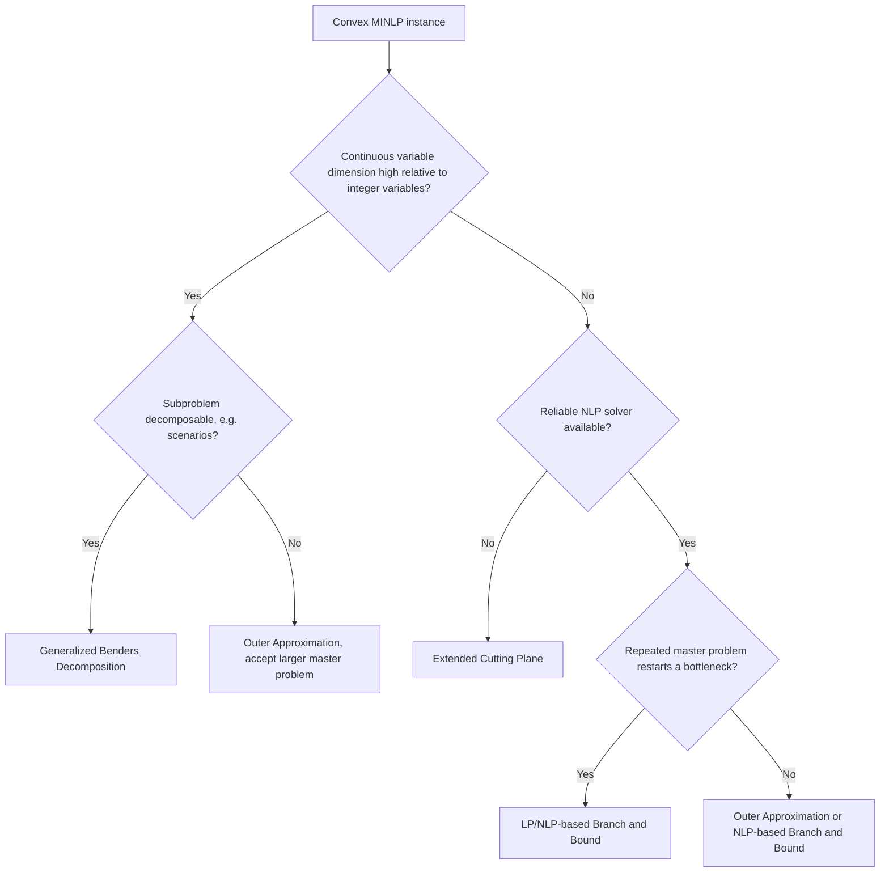

## Convex MINLP Solution Approaches

### Overview

Convex MINLP restricts the general MINLP problem to cases where the objective and constraints are convex whenever the integer variables are relaxed to continuous values. This convexity is what makes the class exactly solvable: any continuous relaxation encountered during search has no spurious local optima, so local NLP solvers can be trusted to certify global optimality of each subproblem. This document surveys the family of exact algorithms for convex MINLP as a group, situating branch and bound, outer approximation, generalized Benders decomposition, and the extended cutting plane method relative to one another.

### Why Convexity Enables Exact Methods

**Key Points**

- At any fixed integer assignment $y$, the resulting NLP is convex, so a local solver's solution is guaranteed globally optimal for that subproblem — this is the property every convex MINLP algorithm below relies on
- The continuous relaxation of the full problem (integer variables relaxed to $Y$) is likewise convex, so its optimal value is a valid, tight lower bound obtainable by any standard convex NLP solver
- Cuts or linearizations built from a convex function's gradient or subgradient at any point are guaranteed to underestimate the function everywhere — the algebraic fact underlying outer approximation, GBD, and ECP cut validity alike

### Family of Algorithms

#### NLP-Based Branch and Bound

Directly generalizes MILP branch and bound: relax integer variables, solve the convex NLP relaxation at each node, branch on integer fractionality, and prune using the relaxation bound.

**Key Points**

- Simplest conceptually, but each node requires a full NLP solve, making it typically the most expensive per-node among convex MINLP methods
- No cut accumulation across nodes (unlike OA/GBD/ECP), so information from one branch does not directly tighten sibling branches beyond the shared bound structure

#### Outer Approximation (OA)

Alternates between an NLP with integers fixed and an MILP master problem built from direct linearizations of $f$ and $g$ at each NLP solution point.

**Key Points**

- Cuts are generally the tightest among the decomposition methods, since they retain full $(x,y)$ information at each linearization point
- Master problem includes both $x$ and $y$ variables, growing with the dimensionality of $x$

#### Generalized Benders Decomposition (GBD)

Alternates similarly to OA, but constructs master-problem cuts from the NLP subproblem's Lagrangian dual multipliers, projecting $x$ out of the master problem entirely.

**Key Points**

- Cuts are generally weaker than OA's (a documented dominance result), but the master problem is smaller — only $y$ and the objective variable $\eta$
- Particularly suited to problems with decomposable or high-dimensional continuous subproblems, e.g., scenario-based stochastic MINLP

#### Extended Cutting Plane (ECP)

Builds the MILP master problem purely from linearizations at the master's own solution points, without ever solving a separate NLP subproblem.

**Key Points**

- Avoids NLP solver dependency entirely, useful when reliable NLP solvers are unavailable or when function/gradient evaluations are cheap relative to full NLP solves
- Typically requires more iterations than OA since it lacks the "good" feasible points that fixing integers and solving an NLP provides

#### LP/NLP-Based Branch and Bound (Quesada-Grossmann)

Integrates OA's alternation into a single branch-and-bound tree: the master MILP is solved incrementally rather than restarted at every major iteration, with NLP subproblems solved and linearized at integer-feasible nodes as they are discovered.

**Key Points**

- Avoids repeatedly re-solving the master problem from scratch, which is the main source of overhead in the original alternating OA scheme
- Forms the basis of several production solver implementations (e.g., Bonmin's B-OA algorithm)

### Convex MINLP Method Comparison (svg_diagram)

<svg viewBox="0 0 700 360" xmlns="http://www.w3.org/2000/svg">
\<style\>
.box { fill: var(--bg-secondary, #f2f2f2); stroke: var(--border-primary, #444); stroke-width: 1.5; }
.label { font-family: sans-serif; font-size: 12px; fill: var(--text-primary, #222); text-anchor: middle; }
.axis { stroke: var(--text-secondary, #666); stroke-width: 1.5; }
\</style\>
<text x="350" y="24" class="label" font-size="16" font-weight="bold">Convex MINLP Methods: Cut Strength vs. Master Problem Size (svg_diagram)</text>
<line x1="90" y1="300" x2="630" y2="300" class="axis"/>
<line x1="90" y1="300" x2="90" y2="60" class="axis"/>
<text x="360" y="330" class="label">Master problem size</text>
<text x="45" y="180" class="label" transform="rotate(-90 45 180)">Cut strength</text>
<rect x="120" y="90" width="130" height="40" class="box" rx="4"/>
<text x="185" y="115" class="label">OA</text>
<rect x="120" y="230" width="130" height="40" class="box" rx="4"/>
<text x="185" y="255" class="label">GBD</text>
<rect x="380" y="150" width="150" height="40" class="box" rx="4"/>
<text x="455" y="175" class="label">ECP (weakest, no NLP)</text>
<rect x="380" y="70" width="180" height="40" class="box" rx="4"/>
<text x="470" y="95" class="label">LP/NLP-based B&B</text>

<text x="350" y="345" class="label" font-size="11">Position is qualitative, not derived from benchmark measurement</text>

</svg>

### Method Selection Flow

### Convergence Guarantees Common to the Family

**Key Points**

- All methods produce a non-decreasing lower bound sequence (from master problem or relaxation solves) and a non-increasing upper bound sequence (from NLP-feasible solutions), converging to the same optimum by convexity
- Finite convergence holds whenever $Y \cap \mathbb{Z}^p$ is a bounded, hence finite, set — each method's cuts or branching eventually exhaust the finite candidate space
- None of these convergence arguments extend to nonconvex $f$ or $g$: losing convexity breaks the validity of cuts (OA, GBD, ECP) and the tightness of relaxation bounds (branch and bound), which is why nonconvex MINLP instead requires spatial branch and bound with algebraically constructed convex relaxations

### Choosing Among Methods in Practice

**Key Points**

- [Inference] OA or LP/NLP-based branch and bound are reasonable general-purpose default choices for convex MINLP given a reliable NLP solver and moderate-dimensional continuous variables, based on their combination of strong cuts and reduced master-problem-restart overhead — though the best choice is ultimately instance-dependent and solver benchmarks should guide any specific implementation decision
- GBD is preferred specifically when subproblem decomposability can be exploited (e.g., stochastic programming with many scenarios), where its smaller, decomposable master problem provides a structural advantage that OA's larger master problem does not
- ECP is a reasonable fallback when NLP solver reliability or availability is a genuine constraint, trading convergence speed for reduced dependency
- Modern solvers (Bonmin, SCIP, Knitro) often implement several of these algorithms and allow switching or hybrid strategies, since no single method dominates across all problem structures

### Summary Table

| Method | Master Problem | Cut/Bound Source | NLP Solves Required | Best Suited For |
| --- | --- | --- | --- | --- |
| NLP-based Branch and Bound | Implicit (tree) | Relaxation at each node | One per node | Simple implementation, small-to-moderate trees |
| Outer Approximation | MILP in $x,y,\eta$ | Direct linearization at NLP solution | One per major iteration | General-purpose, moderate-dimension $x$ |
| Generalized Benders Decomposition | MILP/MINLP in $y,\eta$ | Lagrangian support at NLP solution | One per major iteration | High-dimensional or decomposable $x$ |
| Extended Cutting Plane | MILP in $x,y,\eta$ | Linearization at master's own solution | None | NLP solver unavailable or unreliable |
| LP/NLP-based Branch and Bound | Single incremental tree | Same as OA, added as lazy cuts | One per integer-feasible node | Avoiding repeated master restarts |

### Applications

- Process synthesis and design (the historical origin of OA and GBD development)
- Energy system planning with convex cost and efficiency curves
- Supply chain design with convex transportation and facility cost structures
- Any convex MINLP where problem-specific structure (decomposability, NLP solver reliability, dimensionality) favors one algorithm's trade-offs over another

### Related Topics

- Outer approximation methods
- Generalized Benders decomposition
- Branch and bound for nonconvex MINLP
- MINLP problem structure and convex vs. nonconvex classification
- Extended cutting plane method
- LP/NLP-based branch and bound (Quesada-Grossmann algorithm)