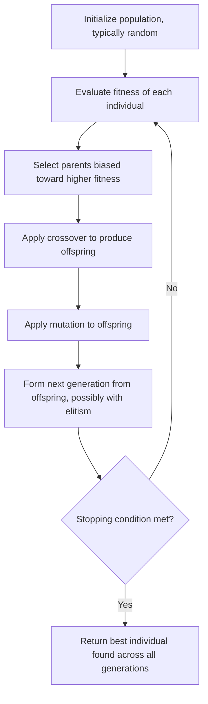

## Genetic Algorithms and Evolutionary Strategies

### Overview

Genetic algorithms (GA) and evolutionary strategies (ES) are population-based metaheuristics inspired by biological evolution: a population of candidate solutions evolves over generations through selection, recombination, and mutation, guided by a fitness function that favors better solutions. Unlike simulated annealing's single-trajectory search, population-based methods maintain and evolve many candidate solutions simultaneously, allowing them to exploit information across the population rather than a single search path. Both are metaheuristics — no optimality guarantee is provided — and both are commonly applied where exact combinatorial or MINLP methods scale poorly or where the objective function is a black box.

### Genetic Algorithms

#### Core Components

**Key Points**

- **Representation (encoding)**: candidate solutions are encoded as chromosomes, commonly bit strings for combinatorial problems, real-valued vectors for continuous problems, or permutations for ordering problems like TSP
- **Fitness function**: evaluates each chromosome's quality, directly analogous to the objective function in exact optimization, but used here to bias selection rather than to certify optimality
- **Population**: a set of chromosomes maintained and evolved simultaneously, with population size a key parameter balancing diversity against computational cost per generation

#### Basic Algorithm Structure

**Key Points**

- Initialize a population of candidate solutions, typically at random or seeded with heuristic solutions
- Evaluate fitness of each individual in the population
- Select parents biased toward higher fitness (selection)
- Apply crossover (recombination) to produce offspring, and mutation to introduce variation
- Form the next generation from offspring (and possibly retained parents), and repeat until a stopping condition is met

### Genetic Algorithm Flow

### Selection Mechanisms

#### Roulette Wheel (Fitness-Proportionate) Selection

Each individual's probability of selection is proportional to its fitness relative to the population total: $P(i) = f(i) / \sum_j f(j)$.

**Key Points**

- Simple to implement, but sensitive to fitness scale: a single dominant individual with disproportionately high fitness can cause premature convergence by monopolizing selection early in the search
- Requires fitness values to be non-negative and comparable in this raw form, which can be problematic for objectives with widely varying scale across generations

#### Tournament Selection

Randomly sample a subset (tournament) of $k$ individuals from the population and select the fittest among them as a parent, repeating to fill the mating pool.

**Key Points**

- Selection pressure is controlled directly by tournament size $k$: larger $k$ increases pressure toward high-fitness individuals (more likely to include the population's best), smaller $k$ preserves more diversity
- Does not require fitness values to be scaled or non-negative, since only relative comparison within each tournament matters — a practical advantage over roulette wheel selection

#### Rank-Based Selection

Individuals are selected based on their fitness rank within the population rather than raw fitness value, avoiding the scale-sensitivity issues of roulette wheel selection.

**Key Points**

- Selection probability is typically a function of rank position (e.g., linear or exponential in rank) rather than of the fitness value itself, decoupling selection pressure from the absolute magnitude of fitness differences

### Crossover (Recombination) Operators

#### Single-Point and Multi-Point Crossover

For bit-string or fixed-length chromosomes: select one (or several) crossover points and exchange the segments between two parents to form offspring.

**Key Points**

- Single-point crossover: offspring inherit one parent's genes before the cut point and the other's genes after
- Multi-point crossover generalizes this with multiple cut points, potentially preserving more diverse gene combinations than a single cut

#### Uniform Crossover

Each gene position is independently inherited from either parent with a fixed probability (commonly 0.5), rather than inheriting contiguous segments.

**Key Points**

- Explores a different combination space than single/multi-point crossover, since it does not preserve contiguous "building blocks" the way point-based crossover does — this trade-off is central to the debate over which operator suits a given problem's structure

#### Order-Based Crossover (Permutation Problems)

For permutation encodings (e.g., TSP tours), standard point-based crossover can produce invalid offspring with repeated or missing elements. Order crossover (OX), partially mapped crossover (PMX), and cycle crossover (CX) are specialized operators that preserve permutation validity.

**Key Points**

- PMX preserves relative positions from both parents where possible, resolving conflicts by following a mapping between the parents' differing segments
- OX preserves the relative order of a selected segment from one parent while filling remaining positions from the other parent's order — the specific mechanism differs from PMX in how conflicts are resolved

### Crossover Mechanism Illustration (svg_diagram)

<svg xmlns="http://www.w3.org/2000/svg" viewBox="0 0 640 260">
\<style\>
.gene { fill: var(--bg-secondary, #eee); stroke: var(--border-primary, #444); stroke-width: 1.2; }
.gene2 { fill: var(--bg-tertiary, #ddd); stroke: var(--border-primary, #444); stroke-width: 1.2; }
.label { font-family: sans-serif; font-size: 13px; fill: var(--text-primary, #222); text-anchor: middle; }
.cut { stroke: var(--text-primary, #222); stroke-width: 2; stroke-dasharray: 4,3; }
\</style\>
<text x="320" y="24" class="label" font-size="16" font-weight="bold">Single-Point Crossover (svg_diagram)</text>

<text x="60" y="80" class="label">Parent 1</text>

<rect x="120" y="60" width="50" height="34" class="gene" /><rect x="170" y="60" width="50" height="34" class="gene" /><rect x="220" y="60" width="50" height="34" class="gene" /><rect x="270" y="60" width="50" height="34" class="gene2" /><rect x="320" y="60" width="50" height="34" class="gene2" />

<text x="60" y="140" class="label">Parent 2</text>

<rect x="120" y="120" width="50" height="34" class="gene2" /><rect x="170" y="120" width="50" height="34" class="gene2" /><rect x="220" y="120" width="50" height="34" class="gene2" /><rect x="270" y="120" width="50" height="34" class="gene" /><rect x="320" y="120" width="50" height="34" class="gene" />

<line x1="270" y1="50" x2="270" y2="164" class="cut" />
<text x="270" y="180" class="label" font-size="11">Crossover point</text>

<text x="60" y="220" class="label">Offspring</text>

<rect x="120" y="200" width="50" height="34" class="gene" /><rect x="170" y="200" width="50" height="34" class="gene" /><rect x="220" y="200" width="50" height="34" class="gene" /><rect x="270" y="200" width="50" height="34" class="gene" /><rect x="320" y="200" width="50" height="34" class="gene" />

</svg>

### Mutation Operators

**Key Points**

- **Bit-flip mutation** (binary encoding): each bit independently flips with a small probability, introducing variation not present in either parent
- **Swap mutation** (permutation encoding): two positions in the chromosome are exchanged, preserving validity for ordering problems like TSP
- **Gaussian mutation** (real-valued encoding): a value is perturbed by adding noise drawn from a normal distribution, commonly used in continuous optimization contexts and evolutionary strategies
- Mutation rate is a key parameter: too low risks premature convergence to a local optimum (insufficient diversity to escape it), too high degrades the search toward undirected random search, losing the benefit of accumulated fitness information

### Elitism and Replacement Strategies

**Key Points**

- Elitism preserves the best individual(s) from the current generation unchanged into the next, preventing loss of the best-found solution to unlucky selection or mutation — without elitism, a GA's best-found solution can regress across generations since evolution optimizes population fitness, not monotonic improvement
- Generational replacement replaces the entire population with offspring each generation; steady-state replacement replaces only a few individuals at a time, which [Inference] tends to preserve diversity longer at the cost of slower overall turnover per unit of computation, though the practical effect is problem-dependent

### Evolutionary Strategies (ES)

#### Distinguishing Features from Genetic Algorithms

**Key Points**

- ES traditionally emphasizes mutation over crossover as the primary variation operator, in contrast to GA's traditional emphasis on crossover, though modern implementations of both often use both operators
- ES traditionally operates on real-valued vectors directly (well-suited to continuous optimization), while classical GA emphasized bit-string encodings — this distinction has substantially blurred in modern practice as GA implementations commonly use real-valued encodings as well
- Selection in ES is often deterministic (e.g., selecting the best $\mu$ individuals from a combined pool), whereas GA selection is typically stochastic and fitness-proportionate or tournament-based

#### (μ, λ) and (μ + λ) Notation

Standard ES notation describes the selection scheme: $\mu$ parents produce $\lambda$ offspring per generation.

**Key Points**

- $(\mu, \lambda)$ selection: the next generation's $\mu$ parents are selected only from the $\lambda$ offspring, discarding all current parents — this allows fitness to temporarily decrease across generations, which can aid escaping local optima
- $(\mu + \lambda)$ selection: the next generation's $\mu$ parents are selected from the combined pool of $\mu$ parents and $\lambda$ offspring, guaranteeing fitness never decreases (a form of elitism built into the selection scheme itself)
- Typically $\lambda > \mu$ (more offspring generated than parents retained), providing selection pressure

#### Self-Adaptive Mutation

A distinguishing ES technique: mutation step sizes (e.g., the standard deviation of Gaussian mutation) are themselves encoded in the chromosome and evolve alongside the solution values, allowing the algorithm to adaptively tune its own exploration scale over the course of the search.

**Key Points**

- [Inference] This self-adaptation is considered one of ES's more distinctive theoretical contributions relative to GA, since it embeds a form of online parameter tuning directly into the evolutionary process rather than requiring external schedule design — though whether this yields a practical advantage depends on the specific problem and is not universal

### Population-Based Method Comparison

| Aspect | Genetic Algorithm | Evolutionary Strategy |
| --- | --- | --- |
| Traditional encoding | Bit strings, permutations | Real-valued vectors |
| Primary variation operator | Crossover (traditionally) | Mutation (traditionally) |
| Selection | Stochastic (roulette, tournament) | Often deterministic (best-$\mu$) |
| Self-adaptation of parameters | Less traditionally emphasized | Central technique (mutation step-size evolution) |
| Typical application domain | Combinatorial and mixed problems | Continuous optimization |

### Comparison with Simulated Annealing

**Key Points**

- Population-based search (GA/ES) exploits diversity across many candidate solutions simultaneously, while simulated annealing explores via a single evolving trajectory — this generally gives population methods better coverage of disconnected regions of the search space at the cost of maintaining and evaluating many candidates per generation
- Both provide no optimality guarantee and are commonly hybridized with local search (e.g., memetic algorithms combining GA with local refinement of each offspring) or used to generate strong initial incumbents for exact methods

### Practical Considerations

**Key Points**

- Premature convergence — the population losing diversity and converging to a suboptimal region before adequately exploring the search space — is a central practical failure mode, commonly mitigated via diversity-preserving selection, higher mutation rates, or niching/speciation techniques that explicitly maintain subpopulations in different regions
- [Unverified] No universal best parameter settings (population size, crossover/mutation rates, selection pressure) exist across problem classes; practical tuning is typically done empirically per problem family, and claims of universally good default settings should be treated cautiously
- Constraint handling for GA/ES applied to constrained combinatorial problems (e.g., TSP, scheduling) typically requires either specialized operators that preserve feasibility (as with permutation crossover operators above) or penalty functions that degrade fitness for constraint violations

### Applications

- Scheduling and timetabling problems with complex, multi-criteria objectives
- Neural architecture search and hyperparameter optimization
- Engineering design optimization, especially continuous parameter tuning (a natural fit for ES)
- Combinatorial problems with custom, problem-specific encodings where exact methods are computationally infeasible (large TSP, vehicle routing, job-shop scheduling)

### Related Topics

- Simulated annealing algorithm and cooling schedules
- Tabu search and other trajectory-based metaheuristics
- Particle swarm optimization and other swarm intelligence methods
- Memetic algorithms (hybrid population-based and local search)
- Multi-objective evolutionary algorithms (e.g., NSGA-II)
- No free lunch theorems and their implications for metaheuristic design