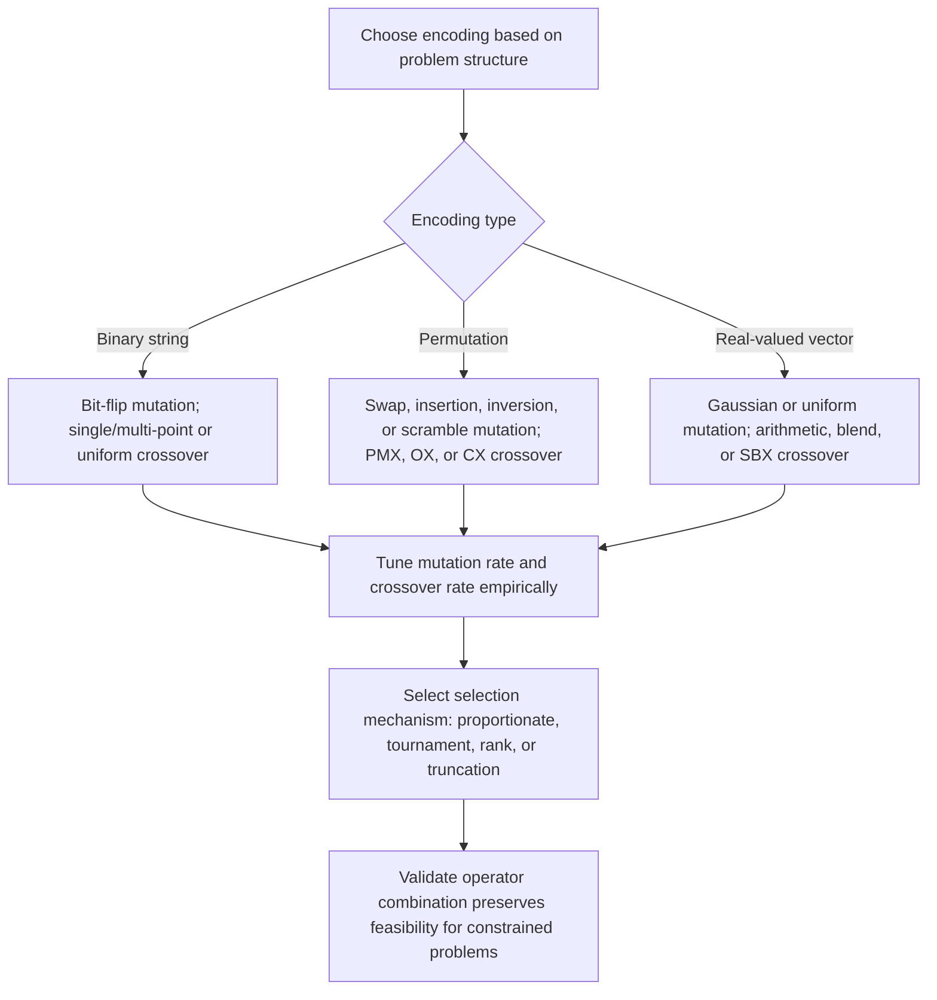

## Crossover, Mutation, and Selection Operators

### Overview

Crossover, mutation, and selection are the three operator classes that drive population-based metaheuristic search. Selection determines which individuals influence the next generation; crossover recombines genetic material from selected parents; mutation introduces variation not present in the parent population. Together they define the exploration-exploitation balance of a genetic algorithm or evolutionary strategy, and operator choice is frequently the dominant factor in practical performance — more so than population size or generation count in many empirical studies.

### Selection Operators

#### Fitness-Proportionate (Roulette Wheel) Selection

Selection probability for individual $i$ is $P(i) = f(i) / \sum_j f(j)$, implemented conceptually as a roulette wheel where each individual's slice size is proportional to fitness.

**Key Points**

- Stochastic Universal Sampling (SUS) is a lower-variance variant: instead of spinning the wheel independently for each selection, a single set of equally spaced pointers is used, guaranteeing selection counts closer to their expected proportional values across one full selection round
- Sigma scaling addresses the premature-convergence risk of raw fitness-proportionate selection by transforming fitness relative to population mean and standard deviation, compressing the effect of a single outlier individual

#### Tournament Selection

$k$ individuals are sampled (with or without replacement) from the population; the fittest of the $k$ is selected.

**Key Points**

- Selection pressure scales with $k$: binary tournament ($k=2$) is among the mildest commonly used forms, while larger $k$ approaches selecting the population maximum on every draw
- Sampling without replacement within a single tournament (but with replacement across tournaments) is standard; some variants also structure tournaments to guarantee each individual participates a bounded number of times per generation

#### Rank-Based Selection

Individuals are sorted by fitness and assigned selection probability based on rank rather than raw fitness value.

**Key Points**

- Linear ranking assigns probability linearly interpolated between a minimum and maximum value across the rank range; exponential ranking assigns probability decaying exponentially with rank, concentrating pressure more heavily on top-ranked individuals
- Decouples selection pressure from the magnitude of fitness differences, which matters when fitness landscapes have highly uneven scale (e.g., a few individuals with vastly higher fitness that would dominate roulette wheel selection)

#### Truncation Selection

Only the top fraction (e.g., top 50%) of the population by fitness is eligible to reproduce, with parents drawn uniformly at random from that truncated set.

**Key Points**

- Common in evolutionary strategies' deterministic $(\mu,\lambda)$ and $(\mu+\lambda)$ schemes, where truncation to the best $\mu$ individuals is the selection mechanism itself rather than a probabilistic bias
- Higher selection pressure than most proportionate or rank-based schemes at equivalent parameter settings, since individuals below the truncation threshold have zero probability of selection rather than reduced probability

### Selection Pressure Comparison (svg_diagram)

<svg xmlns="http://www.w3.org/2000/svg" viewBox="0 0 640 300">
\<style\>
.axis { stroke: var(--text-secondary, #666); stroke-width: 1.5; }
.curve1 { fill: none; stroke: var(--text-primary, #222); stroke-width: 2.3; }
.curve2 { fill: none; stroke: var(--text-secondary, #666); stroke-width: 2.3; stroke-dasharray: 5,3; }
.curve3 { fill: none; stroke: var(--text-secondary, #999); stroke-width: 2.3; stroke-dasharray: 2,2; }
.label { font-family: sans-serif; font-size: 12px; fill: var(--text-primary, #222); text-anchor: middle; }
\</style\>
<text x="320" y="24" class="label" font-size="16" font-weight="bold">Selection Probability by Fitness Rank (svg_diagram)</text>
<line x1="80" y1="250" x2="580" y2="250" class="axis" />
<line x1="80" y1="250" x2="80" y2="60" class="axis" />
<text x="330" y="280" class="label">Fitness rank (best to worst)</text>
<text x="35" y="155" class="label" transform="rotate(-90 35 155)">Selection probability</text>
<path d="M100,80 L560,240" class="curve1" />
<text x="460" y="150" class="label">Linear rank</text>
<path d="M100,80 Q200,90 300,180 Q400,235 560,248" class="curve2" />
<text x="230" y="150" class="label">Exponential rank / large-k tournament</text>
<path d="M100,80 L340,80 L342,250 L560,250" class="curve3" />
<text x="330" y="65" class="label">Truncation (top fraction only)</text>
</svg>

### Crossover Operators

#### Point-Based Crossover (Fixed-Length Encodings)

**Key Points**

- Single-point: one cut point splits each parent; offspring exchange the tail segments
- $k$-point: $k$ cut points alternate segment origin between parents; as $k$ increases, the operator approaches uniform crossover's disruptive behavior on contiguous building blocks
- Uniform crossover: each gene independently drawn from either parent (commonly with probability 0.5), maximizing disruption of contiguous segments in exchange for finer-grained mixing of individual gene values

#### Building Block Disruption

**Key Points**

- The building block hypothesis (Holland) posits that GA performance stems from combining short, low-order, high-fitness schemas ("building blocks") from different parents — point-based crossover with fewer cut points better preserves such contiguous blocks than uniform crossover
- [Unverified] The building block hypothesis's explanatory power for GA performance has been debated in the literature since its original formulation; it remains a useful conceptual frame for operator design rather than an uncontested theoretical foundation
- Encoding design and crossover operator choice interact directly with this hypothesis: an encoding where problem structure aligns with gene locality benefits more from block-preserving crossover than one where relevant interactions are scattered across the chromosome

#### Permutation-Preserving Crossover

Standard point-based crossover applied directly to a permutation encoding produces invalid offspring (repeated or missing elements), so specialized operators are required.

**Key Points**

- **Partially Mapped Crossover (PMX)**: copies a segment from parent 1 directly, then fills remaining positions from parent 2 using a mapping derived from the copied segment to resolve conflicts, preserving absolute position information from both parents where possible
- **Order Crossover (OX)**: copies a segment from parent 1 directly, then fills remaining positions in the order they appear in parent 2 (skipping already-used elements), preserving relative order rather than absolute position
- **Cycle Crossover (CX)**: identifies cycles of position-value mappings between the two parents and assigns each offspring position from whichever parent the cycle structure dictates, guaranteeing each offspring position's value comes from one parent or the other with no positions left unresolved by construction
- Choice among PMX, OX, and CX affects which structural properties (absolute position vs. relative order vs. adjacency) are preserved from the parents, and empirical performance is problem-dependent — no single permutation crossover dominates across all ordering problems

#### Arithmetic and Blend Crossover (Real-Valued Encodings)

**Key Points**

- Arithmetic crossover: offspring gene values are a weighted average of the two parents' values, $\text{child} = \alpha \cdot p_1 + (1-\alpha) \cdot p_2$, producing offspring strictly within the parents' range
- Blend crossover (BLX-$\alpha$): extends the sampling range beyond the parents' interval by a factor $\alpha$, allowing offspring to explore slightly outside the region spanned by the parents rather than being confined to their convex hull
- Simulated Binary Crossover (SBX): designed to mimic the exploration behavior of single-point binary crossover in real-valued space, using a probability distribution parameterized to control how close offspring tend to be to their parents

### Mutation Operators

#### Bit-Flip Mutation (Binary Encoding)

Each bit independently flips with probability $p_m$, typically set inversely proportional to chromosome length (e.g., $p_m \approx 1/L$) so that roughly one bit flips per individual on average.

#### Permutation Mutation Operators

**Key Points**

- **Swap mutation**: two randomly chosen positions exchange values
- **Insertion mutation**: a randomly chosen element is removed and reinserted at a different position, shifting intervening elements
- **Inversion mutation**: a randomly chosen segment is reversed in place — notably the same move as 2-opt in local search for TSP, connecting evolutionary mutation operators directly to trajectory-based local search moves
- **Scramble mutation**: a randomly chosen segment has its elements randomly reordered, more disruptive than a single swap or inversion

#### Real-Valued Mutation

**Key Points**

- **Gaussian (normal) mutation**: adds noise $\mathcal{N}(0, \sigma^2)$ to each gene, with $\sigma$ controlling mutation step size — this is the standard ES mutation operator, and $\sigma$ is frequently self-adaptive (evolved alongside the solution, as noted in ES design)
- **Uniform mutation**: replaces a gene with a value drawn uniformly at random from its allowed range, more disruptive than Gaussian mutation since it discards proximity to the current value entirely
- **Polynomial mutation**: a bounded perturbation distribution commonly used in multi-objective evolutionary algorithms, parameterized to control perturbation magnitude similarly to SBX crossover's parameterization

### Operator Selection Flow

### Rate Tuning and Interaction Effects

**Key Points**

- Crossover rate (probability an individual reproduces via crossover rather than direct copy) is commonly set high (e.g., 0.6–0.9), while mutation rate is commonly set low (e.g., $1/L$ to a few percent) — but [Inference] these are conventional starting points rather than universal optima, and the appropriate values shift substantially with problem structure, encoding, and population size
- Crossover and mutation are not independent in effect: a high mutation rate can destroy building blocks that crossover is trying to preserve and recombine, while a mutation rate too low relative to a highly exploitative selection scheme (e.g., high tournament $k$ or aggressive truncation) risks premature convergence with insufficient counteracting diversity
- Adaptive parameter control — varying crossover and mutation rates over the course of the run, or self-adapting them per-individual as in ES — is a standard mitigation for the difficulty of fixing good rates in advance, though it introduces its own tuning complexity (how aggressively to adapt, and by what feedback signal)

### Constraint Handling Across Operators

**Key Points**

- Feasibility-preserving operators (e.g., permutation crossovers, swap mutation for orderings) guarantee offspring validity by construction, avoiding the need for repair or penalty mechanisms
- When feasibility-preserving operators are unavailable or impractical, two common alternatives are repair (mapping an infeasible offspring to the nearest feasible one via a problem-specific procedure) and penalty functions (degrading fitness proportionally to the degree of constraint violation) — the choice affects how much of the search's effort is spent on infeasible regions versus productive exploration
- [Unverified] Repair mechanisms generally converge faster than penalty-based approaches when a cheap, effective repair procedure exists, but this is not universal — for some problems an effective repair procedure is itself difficult to design, making penalty functions the more practical default despite slower convergence

### Applications

- Selection and crossover operator design for TSP and vehicle routing (permutation-preserving operators)
- Neural network weight and hyperparameter evolution (real-valued operators, ES-style self-adaptation)
- Scheduling and timetabling with feasibility-preserving repair or specialized crossover
- Multi-objective design optimization using SBX crossover and polynomial mutation (standard in NSGA-II and related algorithms)

### Related Topics

- Genetic algorithms and evolutionary strategies
- Simulated annealing algorithm and cooling schedules
- Multi-objective evolutionary algorithms (NSGA-II, SPEA2)
- Building block hypothesis and schema theory
- Adaptive and self-adaptive parameter control in metaheuristics
- Memetic algorithms combining evolutionary search with local refinement