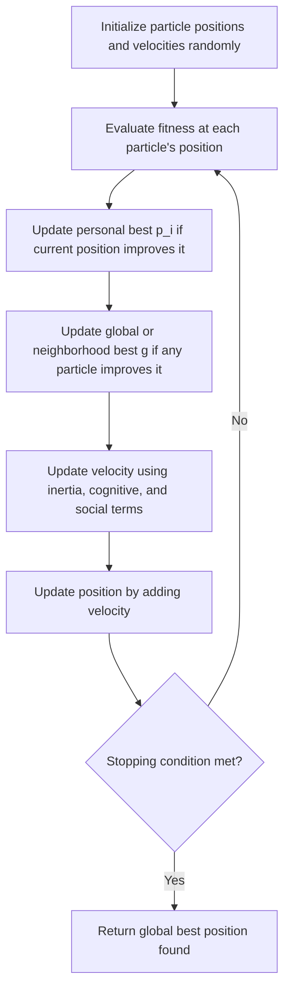

## Particle Swarm Optimization

### Overview

Particle swarm optimization (PSO) is a population-based metaheuristic modeling a swarm of candidate solutions ("particles") that move through the search space, each adjusting its trajectory based on its own best-found position and the swarm's (or a neighborhood's) best-found position. Introduced by Kennedy and Eberhart, PSO is inspired by the collective movement of bird flocks or fish schools rather than by biological evolution, distinguishing it structurally from genetic algorithms and evolutionary strategies despite belonging to the same broad population-based metaheuristic family. It is most naturally suited to continuous optimization, though discrete and combinatorial adaptations exist.

### Core Algorithm

#### Particle State and Update Equations

Each particle $i$ maintains a position $x_i$ and velocity $v_i$ in the search space, along with its personal best position found so far, $p_i$. The swarm (or a defined neighborhood) also tracks a global best position $g$. At each iteration:

$$v_i \leftarrow w \cdot v_i + c_1 r_1 (p_i - x_i) + c_2 r_2 (g - x_i)$$

$$x_i \leftarrow x_i + v_i$$

where $w$ is inertia weight, $c_1, c_2$ are cognitive and social acceleration coefficients, and $r_1, r_2$ are independently drawn random numbers in $[0,1]$, resampled each iteration.

**Key Points**

- The **inertia term** $w \cdot v_i$ preserves the particle's existing momentum, controlling exploration versus exploitation: higher $w$ favors broader exploration, lower $w$ favors convergence toward known good regions
- The **cognitive term** $c_1 r_1 (p_i - x_i)$ pulls the particle toward its own historical best position, representing individual learning
- The **social term** $c_2 r_2 (g - x_i)$ pulls the particle toward the swarm's best-found position, representing information sharing across the population
- Fitness (objective value) is evaluated at each particle's current position each iteration, and $p_i$ and $g$ are updated whenever a new best is found

### PSO Iteration Flow

### Particle Update Geometry (svg_diagram)

<svg xmlns="http://www.w3.org/2000/svg" viewBox="0 0 640 320">
\<style\>
.axis { stroke: var(--text-secondary, #666); stroke-width: 1.3; }
.particle { fill: var(--text-primary, #222); }
.pbest { fill: none; stroke: var(--text-secondary, #666); stroke-width: 1.5; stroke-dasharray: 3,2; }
.gbest { fill: none; stroke: var(--text-primary, #222); stroke-width: 2; }
.vel { stroke: var(--text-primary, #222); stroke-width: 2; marker-end: url(#arr4); }
.label { font-family: sans-serif; font-size: 12px; fill: var(--text-primary, #222); text-anchor: middle; }
\</style\>
<text x="320" y="24" class="label" font-size="16" font-weight="bold">Particle Velocity Update: Inertia + Cognitive + Social (svg_diagram)</text>
<circle cx="200" cy="220" r="6" class="particle" />
<text x="200" y="245" class="label">x_i (current position)</text>
<circle cx="150" cy="140" r="5" class="particle" opacity="0.5" />
<text x="130" y="125" class="label">p_i (personal best)</text>
<circle cx="420" cy="90" r="6" class="particle" />
<text x="440" y="80" class="label">g (global best)</text>
<line x1="200" y1="220" x2="180" y2="180" class="vel" />
<text x="140" y="195" class="label" font-size="11">Inertia</text>
<line x1="200" y1="220" x2="160" y2="160" class="vel" />
<text x="220" y="170" class="label" font-size="11">Cognitive pull to p_i</text>
<line x1="200" y1="220" x2="360" y2="120" class="vel" />
<text x="330" y="160" class="label" font-size="11">Social pull to g</text>
</svg>

### Topology and Information Sharing

#### Global Best (gbest) Topology

Every particle is influenced by the single best position found by the entire swarm.

**Key Points**

- Fastest information propagation across the swarm, since improvements anywhere immediately influence every particle's next update
- More prone to premature convergence than restricted topologies, since a strong early local optimum can rapidly attract the entire swarm before adequate exploration occurs

#### Local Best (lbest) Topology

Particles are influenced only by the best position within a defined neighborhood (e.g., a ring topology where each particle's neighbors are its adjacent indices), rather than the global swarm best.

**Key Points**

- Slower information propagation, since an improvement must "travel" through neighborhood connections to influence distant particles — this generally reduces premature convergence risk relative to gbest topology
- Neighborhood structure (ring, von Neumann grid, random) is itself a design choice affecting the exploration/exploitation trade-off, analogous to how selection pressure functions in genetic algorithms

#### Other Topology Variants

**Key Points**

- Von Neumann topology arranges particles on a grid, each connected to four neighbors, offering a middle ground between gbest's full connectivity and a sparse ring
- Dynamic topologies change neighborhood structure over the course of the run, sometimes starting more restricted (favoring exploration) and becoming more connected over time (favoring exploitation) — a topology-level analogue to simulated annealing's temperature schedule

### Parameter Selection

#### Inertia Weight ($w$)

**Key Points**

- Constant inertia weight is simplest but requires manual tuning to the specific problem's exploration/exploitation needs
- Linearly decreasing inertia weight (from a higher initial value, e.g., 0.9, to a lower final value, e.g., 0.4, over the course of the run) is a common schedule, mirroring the exploration-to-exploitation shift of simulated annealing's cooling schedule
- [Unverified] Specific commonly cited numeric ranges for $w$ (such as 0.4–0.9) appear frequently in the PSO literature as practical starting points, but optimal values are problem-dependent and should be tuned rather than assumed universal

#### Acceleration Coefficients ($c_1, c_2$)

**Key Points**

- $c_1$ (cognitive) and $c_2$ (social) are typically set equal or close to each other (a commonly cited convention is $c_1 = c_2 \approx 2.0$), balancing individual exploration against swarm convergence, though as with inertia weight this is a convention rather than a proven universal optimum
- Asymmetric settings ($c_1 \ne c_2$) can bias the swarm toward more individualistic or more conformist behavior — higher $c_1$ relative to $c_2$ favors exploration around each particle's own history, higher $c_2$ favors faster convergence toward the swarm consensus

#### Velocity Clamping

**Key Points**

- Without bounds, velocity can grow unboundedly across iterations ("velocity explosion"), causing particles to overshoot the search space; velocity clamping restricts $|v_i|$ to a maximum value $V_{\max}$, commonly set relative to the search space's range
- Constriction factor variants (Clerc and Kennedy) replace explicit velocity clamping with a mathematically derived multiplicative constriction coefficient applied to the entire velocity update, providing convergence guarantees under specific parameter relationships between $w$, $c_1$, and $c_2$

### PSO vs. Genetic Algorithms and Evolutionary Strategies

**Key Points**

- PSO has no explicit selection, crossover, or mutation operators — variation arises entirely from the velocity update equation's stochastic weighting of cognitive and social pulls, not from recombining or randomly perturbing discrete chromosome components
- PSO particles retain memory across iterations via velocity (momentum) and personal best, whereas standard GA individuals are typically replaced each generation with no persistent per-individual trajectory information
- [Inference] PSO is often reported as converging faster than GA on smooth, continuous, unimodal or mildly multimodal landscapes, while GA's crossover-driven recombination can be more effective at combining structurally distinct partial solutions in combinatorial problems — this comparison is landscape-dependent and not a general ranking across all problem types

### Convergence Behavior and Premature Convergence

**Key Points**

- PSO is well documented to be prone to premature convergence: once the swarm's global best stabilizes in a local optimum, cognitive and social pulls both reinforce movement toward it, reducing further exploration unless mitigated by topology restriction, inertia scheduling, or explicit diversity-preserving mechanisms
- Common mitigations include reinitializing a fraction of particles periodically, using local best topology instead of global best, or hybridizing with mutation-like random perturbation borrowed from GA/ES design

### Discrete and Combinatorial PSO Variants

**Key Points**

- Binary PSO reinterprets velocity as a probability (via a sigmoid transformation) that a binary variable takes value 1, rather than as a direct positional update, adapting the continuous-native algorithm to binary decision variables
- Permutation-based PSO variants for problems like TSP redefine position, velocity, and the update equations in terms of permutation operations (e.g., swap sequences) rather than vector arithmetic, since standard addition and subtraction are not naturally defined on permutations
- [Inference] These discrete adaptations are generally considered less natural fits than PSO's native continuous formulation, and genetic algorithms or ant colony optimization are often preferred for purely combinatorial problems — though PSO variants remain an active area of application-specific research

### Applications

- Continuous engineering design optimization (antenna design, control system tuning)
- Neural network training and hyperparameter optimization
- Power system optimization (economic dispatch, optimal power flow with continuous controls)
- Image processing and feature selection, often in hybrid combination with other metaheuristics

### Related Topics

- Genetic algorithms and evolutionary strategies
- Simulated annealing algorithm and cooling schedules
- Ant colony optimization and other swarm intelligence methods
- Multi-objective particle swarm optimization
- Constriction factor and convergence analysis in PSO
- Hybrid metaheuristics combining PSO with local search or other population-based methods