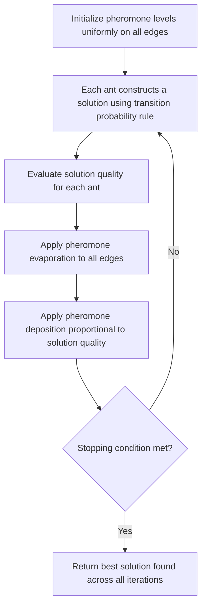

## Ant Colony Optimization

### Overview

Ant colony optimization (ACO) is a population-based metaheuristic inspired by the foraging behavior of real ant colonies, where ants deposit pheromone trails that reinforce shorter or more frequently traveled paths, and the colony collectively converges toward efficient routes through this indirect, stigmergic communication. Introduced by Dorigo, ACO is most naturally suited to combinatorial problems expressible as paths through a graph — most notably TSP, its original demonstration problem — and it is distinguished from GA, ES, and PSO by its use of a shared, persistent pheromone memory structure rather than a population of solutions that directly carries state between iterations.

### Core Concept: Stigmergy

**Key Points**

- Stigmergy refers to indirect coordination through modification of a shared environment — here, the pheromone trail — rather than direct communication between agents; each ant's decisions are influenced by pheromone left by all ants, past and present, without any ant needing to know what any other ant is doing directly
- This shared-memory structure persists across iterations (unlike a GA population, which is largely replaced each generation), giving ACO a form of long-term memory distinct from PSO's per-particle velocity/position memory

### Core Algorithm

#### Construction Graph and Solution Building

For a combinatorial problem like TSP, define a construction graph where nodes represent problem components (e.g., cities) and edges carry both a problem-specific heuristic value $\eta_{ij}$ (e.g., inverse distance) and a pheromone level $\tau_{ij}$. Each ant constructs a solution incrementally by probabilistically choosing the next component to add.

#### Transition Probability Rule

An ant at node $i$ chooses the next node $j$ (among unvisited feasible nodes $N_i$) with probability:

$$P_{ij} = \frac{\tau_{ij}^\alpha \cdot \eta_{ij}^\beta}{\sum_{k \in N_i} \tau_{ik}^\alpha \cdot \eta_{ik}^\beta}$$

where $\alpha$ controls the relative influence of pheromone (learned, colony-level information) and $\beta$ controls the relative influence of the heuristic (problem-specific, immediately available information).

**Key Points**

- $\alpha = 0$ reduces the rule to pure greedy heuristic-following, ignoring accumulated pheromone information entirely
- $\beta = 0$ reduces the rule to pure pheromone-following, ignoring the problem-specific heuristic and relying entirely on colony-accumulated experience
- Balancing $\alpha$ and $\beta$ trades off exploiting known good structure (heuristic) against exploiting colony-learned structure (pheromone), analogous to the cognitive/social balance in PSO but operating through a shared rather than per-particle memory

#### Pheromone Update

After all ants complete their solutions, pheromone is updated in two parts: evaporation (uniform decay) and deposition (reinforcement proportional to solution quality).

$$\tau_{ij} \leftarrow (1-\rho) \cdot \tau_{ij} + \sum_k \Delta\tau_{ij}^k$$

where $\rho \in (0,1]$ is the evaporation rate and $\Delta\tau_{ij}^k$ is the pheromone deposited by ant $k$ on edge $(i,j)$, commonly proportional to $1/L_k$ (inverse of ant $k$'s solution cost) if edge $(i,j)$ was used in ant $k$'s solution, and zero otherwise.

**Key Points**

- Evaporation prevents unbounded pheromone accumulation and provides a mechanism for the colony to "forget" previously reinforced but ultimately suboptimal paths, serving a role analogous to mutation's diversity preservation in GA
- Deposition proportional to solution quality means better solutions reinforce their constituent edges more strongly, biasing future ants toward similar structure — the core mechanism by which the colony's collective search improves over iterations

### ACO Iteration Flow

### Pheromone Trail Reinforcement (svg_diagram)

<svg xmlns="http://www.w3.org/2000/svg" viewBox="0 0 640 300">
\<style\>
.node { fill: var(--bg-secondary, #eee); stroke: var(--border-primary, #333); stroke-width: 1.5; }
.label { font-family: sans-serif; font-size: 13px; fill: var(--text-primary, #222); text-anchor: middle; }
.weak { stroke: var(--text-secondary, #bbb); stroke-width: 1.5; }
.medium { stroke: var(--text-secondary, #888); stroke-width: 3.5; }
.strong { stroke: var(--text-primary, #222); stroke-width: 6; }
\</style\>
<text x="320" y="24" class="label" font-size="16" font-weight="bold">Pheromone Trail Strength After Several Iterations (svg_diagram)</text>

<circle cx="100" cy="150" r="24" class="node" /><text x="100" y="155" class="label">Nest</text>

<circle cx="320" cy="80" r="24" class="node" /><text x="320" y="85" class="label">A</text>

<circle cx="320" cy="220" r="24" class="node" /><text x="320" y="225" class="label">B</text>

<circle cx="540" cy="150" r="24" class="node" /><text x="540" y="155" class="label">Food</text>

<line x1="122" y1="140" x2="298" y2="90" class="weak" />
<line x1="342" y1="85" x2="518" y2="145" class="weak" />
<text x="220" y="95" class="label" font-size="11">Long path (weak trail)</text>
<line x1="122" y1="160" x2="298" y2="210" class="strong" />
<line x1="342" y1="215" x2="518" y2="155" class="strong" />
<text x="220" y="250" class="label" font-size="11">Short path (strong trail, reinforced)</text>
</svg>

### ACO Algorithm Variants

#### Ant System (AS)

The original ACO algorithm as described above: all ants deposit pheromone proportional to solution quality, with uniform evaporation across all edges each iteration.

**Key Points**

- Simplest and historically first ACO variant, but generally outperformed by later refinements on most benchmark problems, making it primarily a baseline/pedagogical reference point rather than a practical default choice today

#### Elitist Ant System

Extends Ant System by adding extra pheromone deposition along the best-so-far solution's edges at every iteration, in addition to the regular deposition from all ants.

**Key Points**

- Accelerates convergence toward the best-found solution's structure, at the cost of increased risk of premature convergence if the elitist weighting is too strong relative to regular deposition

#### Ant Colony System (ACS)

Introduces a pseudorandom proportional transition rule (exploiting the best-known edge with probability $q_0$, otherwise using the standard probabilistic rule) and restricts pheromone deposition to only the best ant per iteration (rather than all ants), combined with local pheromone updates during solution construction (not just after).

**Key Points**

- The local pheromone update (applied to an edge immediately as an ant traverses it, slightly decreasing its pheromone) discourages other ants in the same iteration from following the identical path, promoting within-iteration diversity that global-only updates lack
- Restricting global deposition to the iteration-best (or best-so-far) ant concentrates reinforcement more sharply than Ant System's all-ants deposition, generally yielding faster convergence at increased premature-convergence risk if not balanced by the local update's diversity mechanism

#### Max-Min Ant System (MMAS)

Bounds pheromone values within an explicit range $[\tau_{\min}, \tau_{\max}]$, and restricts global pheromone deposition to a single ant (iteration-best or best-so-far), with periodic pheromone trail reinitialization when the colony shows signs of stagnation.

**Key Points**

- Explicit pheromone bounds directly prevent both unbounded reinforcement of a single dominant path (a common source of premature convergence in unbounded schemes) and pheromone levels from decaying so low that an edge becomes effectively unreachable
- [Unverified] MMAS is commonly reported as one of the stronger-performing ACO variants across TSP and related benchmark problems, though the specific performance ranking among ACO variants depends on problem instance and parameter tuning, and any general performance claim should be checked against current comparative studies

### ACO Variant Comparison

| Variant | Pheromone Deposition Source | Distinguishing Mechanism |
| --- | --- | --- |
| Ant System | All ants | Baseline algorithm, uniform evaporation |
| Elitist Ant System | All ants + extra weight on best-so-far | Accelerated convergence via elitist reinforcement |
| Ant Colony System | Best ant only (global); local update during construction | Pseudorandom proportional rule; local diversity mechanism |
| Max-Min Ant System | Best ant only (global) | Explicit pheromone bounds; stagnation-triggered reinitialization |

### Parameter Considerations

**Key Points**

- Evaporation rate $\rho$ trades off memory persistence against adaptability: low $\rho$ retains historical trail information longer (slower forgetting), high $\rho$ adapts more quickly to newly found good solutions but risks losing useful accumulated structure
- The relative weighting of $\alpha$ (pheromone influence) and $\beta$ (heuristic influence) is problem-dependent; for problems with a strong, reliable heuristic (e.g., inverse distance in Euclidean TSP), higher $\beta$ is common, while problems lacking a strong natural heuristic rely more heavily on pheromone-driven learning (higher relative $\alpha$)
- Number of ants per iteration is a further parameter analogous to population size in GA/PSO, trading exploration breadth per iteration against computational cost per iteration

### ACO vs. Other Population-Based Metaheuristics

**Key Points**

- Unlike GA (population of discrete solutions evolved via selection/crossover/mutation) and PSO (particles with persistent velocity and position memory), ACO's primary state is a shared pheromone matrix rather than individual solution encodings carried between iterations — ants are regenerated fresh each iteration, constructing new solutions guided by the persistent shared memory
- [Inference] This structural difference makes ACO particularly well suited to problems naturally expressed as graph traversal or sequential construction (TSP, vehicle routing, network routing), while GA's flexible encoding and PSO's native continuous formulation extend more naturally to broader problem classes without graph-traversal structure
- Hybridization is common: ACO solutions are frequently refined with local search (e.g., 2-opt for TSP) after construction, combining ACO's global structure-learning with local search's fine-grained refinement — a pattern structurally similar to memetic algorithms combining GA with local search

### Applications

- Traveling salesman problem and vehicle routing problems (original and most extensively studied application domain)
- Network routing protocols, where pheromone-like mechanisms inform adaptive path selection under changing network conditions
- Job-shop and other scheduling problems reformulated as sequential construction over a graph
- Assignment and quadratic assignment problems, where pairwise interaction costs map onto pheromone-weighted construction graphs

### Related Topics

- Traveling salesman problem formulations and bounds
- Genetic algorithms and evolutionary strategies
- Particle swarm optimization
- Simulated annealing algorithm and cooling schedules
- Local search and 2-opt/3-opt refinement for combinatorial problems
- Swarm intelligence and stigmergic coordination in multi-agent systems