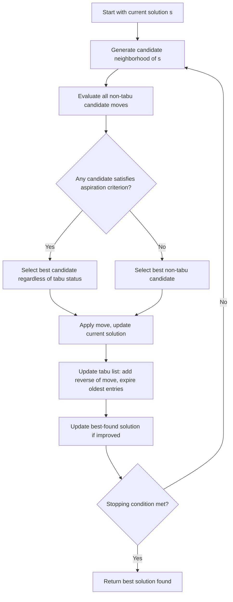

## Tabu Search

### Overview

Tabu search is a trajectory-based metaheuristic that enhances local search with explicit memory structures to escape local optima and avoid cycling back to recently visited solutions. Introduced by Glover, its defining mechanism is the tabu list: a record of recently made moves or visited solutions that are temporarily forbidden ("tabu"), forcing the search to explore new regions even when doing so means accepting a worsening move. Unlike simulated annealing's probabilistic acceptance or population-based methods' parallel exploration, tabu search is deterministic (in its core form) and relies entirely on structured memory to drive diversification.

### Core Algorithm

#### Basic Structure

At each iteration, tabu search examines the neighborhood of the current solution, evaluates all (or a sampled subset of) candidate moves, and selects the best non-tabu move — or a tabu move if it satisfies an aspiration criterion — even if that move worsens the current solution's objective value.

**Key Points**

- Unlike simulated annealing, which accepts a single random neighbor probabilistically, tabu search typically evaluates the entire neighborhood (or a structured sample) and moves to the best available candidate deterministically — this is a fundamentally different mechanism for escaping local optima
- The willingness to accept worsening moves (when no improving non-tabu move exists) is what allows tabu search to escape local optima, with the tabu list preventing the search from simply reversing that move on the next iteration and cycling

### Tabu Search Iteration Flow

### Tabu List Mechanics

#### Tabu List Structure

The tabu list records recently applied moves (or recently visited solution attributes) and forbids their reversal or repetition for a fixed or variable number of iterations, called the tabu tenure.

**Key Points**

- Recording full solutions is memory-intensive and rarely done directly for large problems; more commonly, the tabu list records move attributes (e.g., "swap involving element $x$" or "edge $(i,j)$ removed") — a compact representation that is more efficient but can inadvertently forbid unvisited solutions that happen to share the tabu attribute
- This attribute-based tabu is a deliberate trade-off: it makes the tabu list computationally cheap to check and maintain, but the resulting over-restriction (forbidding legitimate, unvisited solutions along with the intended cycling moves) is precisely what the aspiration criterion exists to correct

#### Tabu Tenure

The number of iterations a move remains forbidden. Short tenure allows the search to revisit recently seen regions sooner (less diversification); long tenure forces more exploration but risks excluding genuinely good moves for longer than necessary.

**Key Points**

- Fixed tenure is simplest but requires manual tuning to the specific problem's neighborhood structure and size
- Dynamic tenure (varying tenure over the search, e.g., randomly within a range, or reactively based on observed cycling behavior) is a common refinement — reactive tabu search explicitly adjusts tenure upward when cycling is detected and downward when the search appears to be over-restricted
- [Inference] Tenure that is well matched to the problem's neighborhood size and structure is often cited as one of the most influential tuning decisions in tabu search performance, though the specific optimal tenure is problem-dependent and typically determined empirically rather than by a general formula

### Tabu List and Aspiration Illustration (svg_diagram)

<svg xmlns="http://www.w3.org/2000/svg" viewBox="0 0 660 300">
\<style\>
.node { fill: var(--bg-secondary, #eee); stroke: var(--border-primary, #333); stroke-width: 1.5; }
.tabu_node { fill: var(--bg-tertiary, #ccc); stroke: var(--text-primary, #222); stroke-width: 2; stroke-dasharray: 4,3; }
.aspire_node { fill: var(--bg-secondary, #eee); stroke: var(--text-primary, #222); stroke-width: 2.5; }
.label { font-family: sans-serif; font-size: 12px; fill: var(--text-primary, #222); text-anchor: middle; }
.edge { stroke: var(--text-secondary, #666); stroke-width: 1.5; fill: none; }
\</style\>
<text x="330" y="24" class="label" font-size="16" font-weight="bold">Neighborhood with Tabu and Aspiration (svg_diagram)</text>

<circle cx="150" cy="160" r="26" class="node" /><text x="150" y="165" class="label">Current s</text>

<circle cx="350" cy="80" r="26" class="tabu_node" /><text x="350" y="60" class="label">Tabu move</text>

<text x="350" y="85" class="label" font-size="11">(forbidden)</text>

<circle cx="350" cy="230" r="26" class="node" /><text x="350" y="235" class="label">Non-tabu</text>

<circle cx="540" cy="160" r="26" class="aspire_node" /><text x="540" y="140" class="label">Tabu but</text>

<text x="540" y="160" class="label" font-size="11">aspiration met</text>

<text x="540" y="178" class="label" font-size="10">(new best overall)</text>

<line x1="176" y1="150" x2="324" y2="95" class="edge" />
<line x1="176" y1="170" x2="324" y2="220" class="edge" />
<line x1="176" y1="160" x2="514" y2="160" class="edge" />

<text x="330" y="270" class="label" font-size="11">Search selects the aspiration-qualifying move despite tabu status</text>

</svg>

#### Aspiration Criteria

Conditions under which a tabu move is permitted despite its forbidden status, most commonly if the move would yield a solution better than the best found so far.

**Key Points**

- This "aspiration by objective" criterion is the most widely used: a tabu move is allowed if it produces a new global best, since forbidding a genuinely record-breaking solution purely due to attribute-based tabu bookkeeping would be counterproductive
- Other aspiration criteria exist (e.g., based on search diversity or elapsed tenure), but aspiration by objective value is the standard default in most implementations

### Diversification and Intensification

#### Intensification

Strategies that focus search effort more heavily around currently promising regions, e.g., restarting the search from an elite previously found solution, or temporarily reducing tabu tenure to allow finer-grained local refinement.

**Key Points**

- Intensification typically draws on a secondary memory structure recording elite solutions found during the search, distinct from the primary short-term tabu list — this is sometimes called medium-term memory in the tabu search literature
- The goal is to exploit known good regions more thoroughly once the search has identified them, complementing the tabu list's primary function of forcing movement away from recently visited states

#### Diversification

Strategies that actively push the search toward unexplored regions of the solution space, typically triggered when the search shows signs of stagnation (repeated cycling near the same region despite tabu restrictions, or long stretches without improvement).

**Key Points**

- Common diversification mechanisms include frequency-based penalties (penalizing moves or attributes that have been used very often across the entire search history, using a long-term memory structure distinct from the short-term tabu list) and periodic random restarts from a substantially different solution
- Frequency-based long-term memory is structurally distinct from the tabu list: rather than a binary forbidden/allowed status with a fixed expiration, it tracks cumulative usage counts over the entire search and applies a graduated penalty, making it a complementary rather than redundant mechanism

### Long-Term vs. Short-Term Memory in Tabu Search

**Key Points**

- Short-term memory (the tabu list itself) prevents immediate cycling by forbidding recently reversed moves for a bounded number of iterations
- Medium-term memory (elite solution pools, intensification triggers) focuses search around historically promising regions once they are identified
- Long-term memory (frequency-based diversification) tracks search history over the full run to detect and correct over-concentration in any particular region, pushing toward genuinely unexplored territory
- [Inference] The combination of these three memory scales is often presented as tabu search's distinguishing conceptual contribution relative to simpler local search metaheuristics, since it structures the exploration/exploitation trade-off across multiple time horizons rather than through a single global parameter (like simulated annealing's temperature)

### Neighborhood Definition and Candidate List Strategies

**Key Points**

- As with simulated annealing and GA/PSO/ACO's move or variation operators, tabu search's performance depends substantially on the neighborhood structure chosen — 2-opt or swap-based neighborhoods for TSP, single-variable flips for binary problems, and so on
- For large neighborhoods where evaluating every candidate move each iteration is computationally expensive, candidate list strategies restrict evaluation to a structured subset (e.g., moves involving only the most promising elements by some heuristic criterion), trading completeness of the neighborhood scan for iteration speed
- [Unverified] The specific candidate list strategy's effectiveness is highly problem-dependent, and general claims about which restriction strategy is "best" should be treated as heuristic guidance rather than an established universal result

### Stopping Criteria

**Key Points**

- Common criteria: fixed iteration count, fixed count of consecutive iterations without improvement to the best-found solution, or a target objective value threshold if one is known
- Because tabu search's core move selection is deterministic given a fixed random tie-breaking rule, some implementations combine it with restarts from randomized initial solutions to further diversify beyond what tabu list and long-term memory alone provide within a single run

### Tabu Search vs. Simulated Annealing

**Key Points**

- Simulated annealing accepts a single randomly generated neighbor probabilistically each iteration; tabu search evaluates a full (or structured) neighborhood deterministically and selects the best available non-tabu candidate — a fundamentally different exploration mechanism (probabilistic single-sample vs. deterministic best-of-neighborhood)
- Simulated annealing's exploration/exploitation balance is controlled by a single temperature parameter following a schedule; tabu search's balance is controlled by the interacting tabu tenure, aspiration criteria, and multi-level memory structures — generally a more complex but more structurally explicit set of controls
- [Inference] Neither method dominates the other in general; relative performance is problem- and neighborhood-structure-dependent, and both are frequently used as components within larger hybrid or matheuristic frameworks rather than as the sole solution method in production settings

### Applications

- Job-shop and flow-shop scheduling with complex sequencing constraints
- Vehicle routing problems, often combined with problem-specific neighborhood structures (e.g., route-exchange moves)
- Graph coloring and frequency assignment problems
- Quadratic assignment problem, a domain where tabu search has been particularly well studied as a benchmark metaheuristic

### Related Topics

- Simulated annealing algorithm and cooling schedules
- Genetic algorithms and evolutionary strategies
- Local search and neighborhood structures in combinatorial optimization
- Variable neighborhood search
- Reactive tabu search and adaptive tenure control
- Matheuristics combining tabu search with exact optimization components