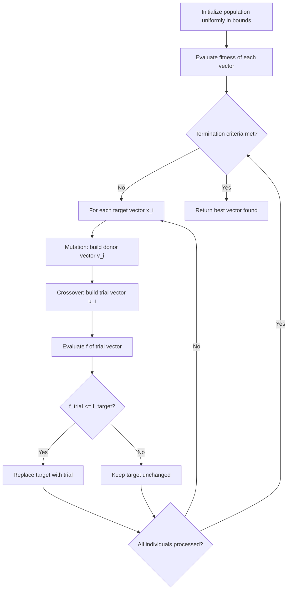

## Differential Evolution

### Overview

Differential evolution (DE) is a population-based stochastic optimizer for continuous, real-parameter search spaces. It was introduced by Storn and Price in the mid-1990s and belongs to the broader family of evolutionary algorithms, but it differs from genetic algorithms in a key way: instead of relying primarily on crossover between arbitrary pairs of parents, DE generates new candidate solutions by adding a scaled difference between two population vectors to a third vector. This "differential" mutation mechanism is self-adaptive to the scale and orientation of the search space, since the step sizes are derived directly from the spread of the current population.

DE is popular for problems where the objective function is non-differentiable, noisy, multimodal, or a black box (no gradient information available), and it requires only a small number of control parameters.

### Problem Setting

DE targets unconstrained or box-constrained continuous optimization problems of the form:

$$\min_{\mathbf{x} \in \mathbb{R}^D} f(\mathbf{x})$$

subject to $\mathbf{x}_{lb} \leq \mathbf{x} \leq \mathbf{x}_{ub}$

where $D$ is the dimensionality of the decision vector and $f$ is the objective (fitness) function. No assumption is made about convexity, continuity of derivatives, or unimodality.

### Core Algorithm Structure

DE maintains a population of $NP$ candidate vectors, each of dimension $D$:

$$\mathbf{x}_{i,G} = [x_{1,i,G}, x_{2,i,G}, \dots, x_{D,i,G}], \quad i = 1, \dots, NP$$

where $G$ denotes the generation index. Each generation applies four steps to every population member: **initialization** (once), **mutation**, **crossover**, and **selection**.

### Initialization

The population is typically initialized by sampling uniformly within the bounds for each dimension:

$$x_{j,i,0} = x_{j,lb} + \text{rand}(0,1) \cdot (x_{j,ub} - x_{j,lb})$$

for $j = 1, \dots, D$. $NP$ is commonly chosen as some multiple of $D$ (a frequently cited heuristic is $NP \approx 10D$, though this is a rule of thumb rather than a guaranteed optimum). [Inference] The exact best population size is problem-dependent and often tuned empirically.

### Mutation

For each target vector $\mathbf{x}_{i,G}$, a mutant (donor) vector $\mathbf{v}_{i,G}$ is created. The classic and most widely cited scheme, denoted **DE/rand/1**, is:

$$\mathbf{v}_{i,G} = \mathbf{x}_{r1,G} + F \cdot (\mathbf{x}_{r2,G} - \mathbf{x}_{r3,G})$$

where $r1, r2, r3$ are distinct indices randomly chosen from $\{1, \dots, NP\}$, all different from $i$, and $F \in (0, 2]$ is the **mutation (scale) factor**, a positive real constant that controls the amplification of the differential variation.

**Common mutation variants** (naming convention: DE/base/num_diffs):

- **DE/rand/1**: $\mathbf{v}_i = \mathbf{x}_{r1} + F(\mathbf{x}_{r2} - \mathbf{x}_{r3})$ — most explorative, good general-purpose default.
- **DE/best/1**: $\mathbf{v}_i = \mathbf{x}_{best} + F(\mathbf{x}_{r1} - \mathbf{x}_{r2})$ — biases search toward the current best, faster convergence but higher risk of premature convergence.
- **DE/rand/2**: $\mathbf{v}_i = \mathbf{x}_{r1} + F(\mathbf{x}_{r2} - \mathbf{x}_{r3}) + F(\mathbf{x}_{r4} - \mathbf{x}_{r5})$ — more perturbation, useful for highly multimodal landscapes.
- **DE/best/2**: $\mathbf{v}_i = \mathbf{x}_{best} + F(\mathbf{x}_{r1} - \mathbf{x}_{r2}) + F(\mathbf{x}_{r3} - \mathbf{x}_{r4})$
- **DE/current-to-best/1**: $\mathbf{v}_i = \mathbf{x}_i + F(\mathbf{x}_{best} - \mathbf{x}_i) + F(\mathbf{x}_{r1} - \mathbf{x}_{r2})$ — blends exploitation of the incumbent best with directed exploration.

[Inference] The relative ranking of these variants' performance is problem-dependent; no single variant dominates across all benchmark suites, which is why adaptive/self-configuring DE variants exist (see Extensions below).

### Crossover

The donor vector $\mathbf{v}_{i,G}$ is combined with the target vector $\mathbf{x}_{i,G}$ to form a **trial vector** $\mathbf{u}_{i,G}$. The standard mechanism is **binomial (uniform) crossover**:

$$u_{j,i,G} = \begin{cases} v_{j,i,G} & \text{if } \text{rand}(0,1) \leq CR \text{ or } j = j_{rand} \\ x_{j,i,G} & \text{otherwise} \end{cases}$$

for $j = 1, \dots, D$, where $CR \in [0,1]$ is the **crossover probability** and $j_{rand}$ is a randomly chosen index guaranteed to take the mutant's value, ensuring the trial vector differs from the target by at least one component.

An alternative is **exponential crossover**, where a contiguous block of dimensions (in circular order starting from a random index) is copied from the donor until a stochastic trial fails, better suited to problems with strong parameter interdependencies along consecutive indices.

### Selection

The trial vector competes directly (one-to-one, greedy selection) against the target vector it was derived from:

$$\mathbf{x}_{i,G+1} = \begin{cases} \mathbf{u}_{i,G} & \text{if } f(\mathbf{u}_{i,G}) \leq f(\mathbf{x}_{i,G}) \\ \mathbf{x}_{i,G} & \text{otherwise} \end{cases}$$

This elitist, per-individual comparison ensures the population's best fitness never degrades from one generation to the next.

### Algorithm Flow (Diagram)

### Control Parameters

- **$NP$ (population size)**: larger populations improve diversity/exploration but raise per-generation cost.
- **$F$ (scale factor)**: typically $F \in [0.4, 1.0]$; larger $F$ increases exploration and helps escape local optima but slows convergence. Values too close to 0 risk premature convergence and population collapse.
- **$CR$ (crossover rate)**: high $CR$ (near 1) favors information from the mutant (more exploration of new directions); low $CR$ preserves more of the target vector's structure, which can help on separable problems.

[Inference] Because DE's three parameters interact non-linearly with problem structure, published "good default" ranges (e.g., $F \approx 0.5$–$0.9, $CR \approx 0.1
–$0.9$ depending on separability) are empirical guidelines from benchmarking studies, not universal guarantees.

### Worked Example

Minimize the 2-D Rastrigin-like function:

$$f(x_1, x_2) = 20 + x_1^2 + x_2^2 - 10(\cos(2\pi x_1) + \cos(2\pi x_2))$$

over $x_1, x_2 \in [-5.12, 5.12]$, a classic multimodal benchmark with many local minima and a global minimum at $(0,0)$ where $f=0$.

**Setup**: $NP = 20$, $F = 0.8$, $CR = 0.9$, scheme DE/rand/1/bin.

1. Initialize 20 random vectors within $[-5.12, 5.12]^2$; evaluate $f$ for each.
2. For target vector $\mathbf{x}_5$, pick three distinct random indices, e.g., $r1=3, r2=11, r3=17$.
3. Mutation: $\mathbf{v}_5 = \mathbf{x}_3 + 0.8 \cdot (\mathbf{x}_{11} - \mathbf{x}_{17})$.
4. Crossover: for each of the 2 dimensions, draw a random number; if $\leq 0.9$ (or it's the forced index), take from $\mathbf{v}_5$, else keep $\mathbf{x}_5$'s component.
5. Evaluate $f(\mathbf{u}_5)$. If it is lower than $f(\mathbf{x}_5)$, replace; otherwise discard the trial.
6. Repeat for all 20 individuals, then advance to generation $G+1$.
7. Iterate until a max generation count or fitness tolerance is reached; the population increasingly concentrates near $(0,0)$ as generations progress, though it may temporarily stall in a secondary basin due to the multimodal landscape. [Inference] Convergence speed and susceptibility to stalling on this benchmark depend heavily on the chosen $F$/$CR$/$NP$ combination and the specific random seed.

### Convergence Behavior (Diagram)

Below: qualitative shape of population diversity vs. best fitness over generations (illustrative, not derived from a specific run).

<svg xmlns="http://www.w3.org/2000/svg" viewBox="0 0 700 420">
<text x="350" y="30" font-size="18" text-anchor="middle" fill="#222" font-weight="bold">Differential Evolution: Convergence Trend (svg_diagram)</text>
<line x1="70" y1="360" x2="650" y2="360" stroke="#333" stroke-width="2" />
<line x1="70" y1="360" x2="70" y2="60" stroke="#333" stroke-width="2" />
<text x="360" y="400" font-size="14" text-anchor="middle" fill="#333">Generation</text>
<text x="30" y="210" font-size="14" text-anchor="middle" fill="#333" transform="rotate(-90 30 210)">Value</text>
<polyline points="70,90 150,120 230,160 310,220 390,270 470,305 550,325 630,335" fill="none" stroke="#1a73e8" stroke-width="3" />
<text x="600" y="345" font-size="12" fill="#1a73e8">Best fitness</text>
<polyline points="70,340 150,320 230,290 310,250 390,215 470,190 550,175 630,168" fill="none" stroke="#e8710a" stroke-width="3" stroke-dasharray="6,4" />
<text x="440" y="205" font-size="12" fill="#e8710a">Population diversity</text>
<circle cx="70" cy="90" r="4" fill="#1a73e8" />
<circle cx="630" cy="335" r="4" fill="#1a73e8" />
<circle cx="70" cy="340" r="4" fill="#e8710a" />
<circle cx="630" cy="168" r="4" fill="#e8710a" />
</svg>

As generations progress, best fitness decreases monotonically (due to greedy selection) while population diversity typically shrinks as individuals converge toward promising regions — though the diversity trend is not strictly monotonic and can plateau or transiently increase if $F$ is large.

### Constraint Handling

DE natively handles box constraints via clipping/reflection/reinitialization of out-of-bound components after mutation. For general (nonlinear) constraints, common approaches include:

- **Penalty functions**: adding a penalty term to $f$ proportional to constraint violation.
- **Feasibility rules** (Deb's rules): (1) between two feasible solutions, prefer the one with better fitness; (2) a feasible solution is always preferred over an infeasible one; (3) between two infeasible solutions, prefer the one with smaller constraint violation.
- **Repair mechanisms**: projecting infeasible trial vectors back onto the feasible region.

### Strengths

- Few control parameters ($NP$, $F$, $CR$) relative to other metaheuristics.
- Does not require gradient or Hessian information.
- Rotation-invariant to a degree, since the differential mutation vector is derived from population geometry rather than fixed coordinate-aligned steps (with binomial crossover, however, full rotation invariance is not guaranteed since crossover operates axis-wise).
- Effective on multimodal, non-convex, and discontinuous landscapes.
- Easily parallelizable, since fitness evaluations of the population are independent within a generation.

### Limitations

- Performance is sensitive to the choice of $F$, $CR$, and $NP$; poor choices can cause premature convergence or slow progress.
- No formal general convergence guarantee to the global optimum in finite time for arbitrary non-convex functions. [Inference] Theoretical convergence results exist under restrictive assumptions (e.g., elitism plus certain mutation/diversity conditions), but practical performance on arbitrary black-box problems is empirically assessed rather than provably guaranteed.
- Struggles somewhat on problems with many equality constraints or highly non-separable, ill-conditioned landscapes compared to specialized methods (e.g., CMA-ES for the latter case).
- Curse of dimensionality: performance and required $NP$ tend to scale unfavorably as $D$ grows very large. [Inference] The exact scaling behavior varies by problem class.

### Extensions and Adaptive Variants

- **jDE**: self-adapts $F$ and $CR$ per individual using probabilistic update rules encoded alongside each vector.
- **SaDE (Self-adaptive DE)**: adapts both the mutation strategy and control parameters based on learning from prior generations' success rates.
- **JADE**: introduces "DE/current-to-pbest" mutation with an optional external archive of recently replaced solutions and adaptively updates $F$, $CR$ using Cauchy/normal distributions fitted to successful parameter values.
- **SHADE / L-SHADE**: success-history based adaptive DE; L-SHADE additionally linearly reduces population size over generations, and has been a strong performer in CEC (Congress on Evolutionary Computation) benchmark competitions. [Inference] Specific competitive rankings depend on the benchmark year and problem suite.
- **Hybrid DE**: combining DE's global search with local refinement methods (e.g., a local gradient-based or pattern-search polish step) to accelerate final convergence.

### Comparison with Related Metaheuristics

| Aspect | Differential Evolution | Genetic Algorithm | Particle Swarm Optimization |
| --- | --- | --- | --- |
| Core operator | Vector differences (mutation) | Crossover + mutation on encoded strings | Velocity update toward personal/global best |
| Encoding | Real-valued vectors natively | Often binary/real, problem-dependent | Real-valued vectors natively |
| Parameter count | Low ($NP$, $F$, $CR$) | Moderate (population, crossover/mutation rates) | Low-moderate (inertia, cognitive/social coefficients) |
| Selection pressure | Greedy, one-to-one per individual | Varies (tournament, roulette, rank) | Implicit via best-position tracking |
| Typical strength | Continuous, multimodal, black-box problems | Broad applicability, combinatorial-friendly with encoding | Fast convergence on smoother continuous landscapes |

### Practical Implementation Notes

- Popular libraries: SciPy's `scipy.optimize.differential_evolution` (Python), pymoo, and DEAP provide ready-to-use implementations with configurable strategies. [Inference] Exact default parameter values and available strategy options can differ across library versions, so consult the specific library's current documentation before relying on defaults.
- Vectorizing fitness evaluation across the whole population (rather than looping per individual) substantially improves runtime on modern hardware, since evaluations are independent within a generation.
- For expensive black-box objectives, combining DE with surrogate models (e.g., Gaussian processes) to pre-screen candidate trial vectors can reduce the number of true objective evaluations needed. [Speculation] The effectiveness of this hybridization depends strongly on how well the surrogate approximates the true landscape.

**Related Topics**

- Particle swarm optimization
- Genetic algorithms and evolutionary strategies
- Covariance matrix adaptation evolution strategy (CMA-ES)
- Simulated annealing
- Self-adaptive and parameter-control mechanisms in metaheuristics
- Multi-objective differential evolution (e.g., generalized differential evolution, MODE)
- Surrogate-assisted optimization for expensive black-box functions
- Constraint-handling techniques in evolutionary computation