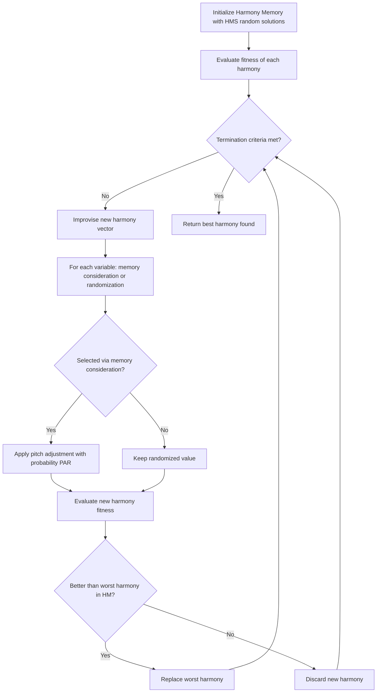

## Harmony Search and Other Nature-Inspired Methods

### Overview

Harmony search (HS) is a metaheuristic optimization algorithm inspired by the improvisational process of musicians seeking a pleasing harmony. Introduced by Geem, Kim, and Loganathan in 2001, HS models optimization as a search for a "harmony" (solution vector) that satisfies an aesthetic (fitness) criterion, analogous to musicians adjusting pitches until an aesthetically pleasing chord emerges. Beyond HS, a wide family of nature-inspired metaheuristics draws on biological, physical, and social phenomena to construct stochastic search strategies for problems where gradient information is unavailable or unreliable.

[Inference] Given the breadth of this topic, coverage here emphasizes the most widely cited and taught methods rather than an exhaustive catalog, since dozens of nature-inspired variants exist in the literature with substantial conceptual overlap.

### Harmony Search: Core Concepts

HS maintains a **Harmony Memory (HM)**, a set of $HMS$ candidate solution vectors (analogous to a population), and generates new candidate harmonies through three operators applied independently to each decision variable:

1. **Memory consideration**: with probability $HMCR$ (Harmony Memory Considering Rate), a new variable value is chosen from existing values in the harmony memory for that dimension; otherwise a random value is chosen from the full feasible range.
2. **Pitch adjustment**: if a value was selected via memory consideration, it is further perturbed with probability $PAR$ (Pitch Adjusting Rate) by a small amount, analogous to a musician fine-tuning a note.
3. **Randomization**: the complementary case to memory consideration, injecting fresh random values to maintain diversity.

### Harmony Search Formalization

For each decision variable $x_j$, $j = 1, \dots, D$:

$$x_j^{new} = \begin{cases} x_j \in \{x_j^1, x_j^2, \dots, x_j^{HMS}\} & \text{with probability } HMCR \\ x_j^{lb} + \text{rand}(0,1) \cdot (x_j^{ub} - x_j^{lb}) & \text{with probability } (1 - HMCR) \end{cases}$$

If memory consideration was used, pitch adjustment is then applied with probability $PAR$:

$$x_j^{new} \leftarrow x_j^{new} \pm \text{rand}(0,1) \cdot BW$$

where $BW$ is the **bandwidth**, controlling the magnitude of local perturbation (analogous to $F$ in differential evolution but applied per-variable rather than via population differences).

After a full new harmony vector is improvised, it is evaluated and replaces the worst harmony in HM if it is better, implementing a greedy, elitist update similar in spirit to DE's selection step.

### Harmony Search Algorithm Flow

### Harmony Search Control Parameters

- **$HMS$ (Harmony Memory Size)**: analogous to population size; larger values increase diversity but raise computational cost per iteration.
- **$HMCR$**: typically set high, around 0.7–0.95, favoring exploitation of memory over pure randomization.
- **$PAR$**: typically lower, around 0.1–0.5, controlling how aggressively selected values are locally fine-tuned.
- **$BW$**: sets the scale of local perturbation; larger values favor exploration, smaller values favor fine local search.

[Inference] As with DE, these parameter ranges are commonly cited defaults from the literature rather than universally optimal settings; performance is problem-dependent, and mis-tuned $PAR$/$BW$ combinations can cause either excessive randomness or premature stagnation.

### Worked Example: Harmony Search

Minimize $f(x_1, x_2) = x_1^2 + x_2^2$ over $x_1, x_2 \in [-10, 10]$ (a simple convex sphere function, used here for clarity of mechanics rather than difficulty).

**Setup**: $HMS = 5$, $HMCR = 0.9$, $PAR = 0.3$, $BW = 0.5$.

1. Initialize 5 random harmony vectors in $[-10,10]^2$; evaluate $f$ for each; store in HM.
2. Improvise a new harmony: for $x_1$, draw rand $= 0.85 \leq 0.9$, so consider memory — pick $x_1$ value from one of the 5 stored harmonies, e.g., $2.3. Then draw rand $=0.2 \leq PAR=0.3
   , so pitch-adjust: $2.3 + \text{rand}(-1,1)\cdot 0.5 = 2.1$ (illustrative).
3. For $x_2$, draw rand $= 0.95 > 0.9$, so randomize: pick a fresh uniform value in $[-10,10]$, e.g., $-4.7$.
4. New harmony: $(2.1, -4.7)$; evaluate $f = 4.41 + 22.09 = 26.5$.
5. Compare against the worst harmony currently in HM; if $26.5$ is better (lower), replace the worst; otherwise discard.
6. Repeat improvisation for many iterations; over time HM converges toward vectors near $(0,0)$.

### Comparison of Nature-Inspired Metaheuristics

| Method | Inspiration | Key Mechanism | Notable Parameters |
| --- | --- | --- | --- |
| Harmony Search | Musical improvisation | Memory consideration + pitch adjustment | $HMS$, $HMCR$, $PAR$, $BW$ |
| Ant Colony Optimization (ACO) | Ant foraging via pheromone trails | Probabilistic path construction reinforced by pheromone deposition and evaporation | Pheromone evaporation rate, heuristic weighting, number of ants |
| Artificial Bee Colony (ABC) | Honeybee foraging | Employed/onlooker/scout bee roles exploring and exploiting food sources | Colony size, limit (abandonment threshold) |
| Firefly Algorithm | Firefly bioluminescent attraction | Fireflies move toward brighter (better) neighbors, attractiveness decays with distance | Light absorption coefficient, attractiveness at zero distance, randomization parameter |
| Cuckoo Search | Brood parasitism of cuckoo birds + Lévy flights | New solutions generated via Lévy flight steps, worst nests abandoned with probability $p_a$ | Discovery probability $p_a$, Lévy flight exponent |
| Grey Wolf Optimizer | Wolf pack hunting hierarchy | Alpha/beta/delta wolves guide the pack toward prey (optimum) | Number of wolves, convergence control parameter |
| Bat Algorithm | Bat echolocation | Frequency-tuned movement combined with loudness/pulse-rate modulation | Frequency range, loudness, pulse emission rate |

### Ant Colony Optimization (Brief Formalization)

ACO, originally designed for combinatorial problems (e.g., traveling salesman), constructs solutions probabilistically based on pheromone trails $\tau_{ij}$ and heuristic desirability $\eta_{ij}$ between nodes $i$ and $j$:

$$P_{ij} = \frac{[\tau_{ij}]^\alpha [\eta_{ij}]^\beta}{\sum_{k \in \text{allowed}} [\tau_{ik}]^\alpha [\eta_{ik}]^\beta}$$

Pheromone is updated after each iteration via evaporation and reinforcement:

$$\tau_{ij} \leftarrow (1-\rho)\tau_{ij} + \sum_k \Delta\tau_{ij}^k$$

where $\rho$ is the evaporation rate and $\Delta\tau_{ij}^k$ is the pheromone deposited by ant $k$, typically proportional to the quality of the solution it constructed.

### Firefly Algorithm (Brief Formalization)

Attractiveness between fireflies $i$ and $j$ decreases with distance $r_{ij}$:

$$\beta(r) = \beta_0 e^{-\gamma r^2}$$

and firefly $i$'s position update toward a brighter firefly $j$ is:

$$x_i \leftarrow x_i + \beta_0 e^{-\gamma r_{ij}^2}(x_j - x_i) + \alpha \left(\text{rand} - \tfrac{1}{2}\right)$$

where $\gamma$ controls light absorption (how sharply attractiveness decays) and $\alpha$ scales a random walk term for exploration.

### Cuckoo Search (Brief Formalization)

New solutions are generated via **Lévy flights**, a random walk with step lengths drawn from a heavy-tailed distribution, enabling occasional large jumps that help escape local optima:

$$x_i^{new} = x_i + \alpha \oplus \text{Lévy}(\lambda)$$

A fraction $p_a$ of the worst nests (solutions) is abandoned and replaced with new random solutions each iteration, balancing exploitation of good nests with exploration.

### Nature-Inspired Method Selection (Diagram)

<svg xmlns="http://www.w3.org/2000/svg" viewBox="0 0 700 380">
<text x="350" y="30" font-size="18" text-anchor="middle" fill="#222" font-weight="bold">Nature-Inspired Methods: Typical Application Fit (svg_diagram)</text>
<rect x="60" y="70" width="280" height="110" rx="8" fill="#e8f0fe" stroke="#1a73e8" stroke-width="2" />
<text x="200" y="95" font-size="14" text-anchor="middle" font-weight="bold" fill="#1a3c8c">Continuous, real-valued</text>
<text x="200" y="120" font-size="12" text-anchor="middle" fill="#333">Harmony Search</text>
<text x="200" y="140" font-size="12" text-anchor="middle" fill="#333">Firefly Algorithm</text>
<text x="200" y="160" font-size="12" text-anchor="middle" fill="#333">Cuckoo Search</text>
<rect x="360" y="70" width="280" height="110" rx="8" fill="#fef7e0" stroke="#e8710a" stroke-width="2" />
<text x="500" y="95" font-size="14" text-anchor="middle" font-weight="bold" fill="#7a4a00">Combinatorial / graph-based</text>
<text x="500" y="120" font-size="12" text-anchor="middle" fill="#333">Ant Colony Optimization</text>
<text x="500" y="140" font-size="12" text-anchor="middle" fill="#333">(routing, scheduling, TSP)</text>
<rect x="60" y="220" width="280" height="110" rx="8" fill="#e6f4ea" stroke="#188038" stroke-width="2" />
<text x="200" y="245" font-size="14" text-anchor="middle" font-weight="bold" fill="#0f5223">Swarm-social dynamics</text>
<text x="200" y="270" font-size="12" text-anchor="middle" fill="#333">Artificial Bee Colony</text>
<text x="200" y="290" font-size="12" text-anchor="middle" fill="#333">Grey Wolf Optimizer</text>
<text x="200" y="310" font-size="12" text-anchor="middle" fill="#333">Bat Algorithm</text>
<rect x="360" y="220" width="280" height="110" rx="8" fill="#fce8e6" stroke="#c5221f" stroke-width="2" />
<text x="500" y="245" font-size="14" text-anchor="middle" font-weight="bold" fill="#7a1a17">Hybrid / engineering design</text>
<text x="500" y="270" font-size="12" text-anchor="middle" fill="#333">HS + local search hybrids</text>
<text x="500" y="290" font-size="12" text-anchor="middle" fill="#333">Multi-operator ensembles</text>
</svg>

[Inference] This categorization reflects common usage patterns reported in the literature; most of these algorithms have been adapted for domains outside their "typical fit" shown here (e.g., ACO has been applied to continuous optimization variants, and HS to combinatorial scheduling problems), so the diagram should be read as indicative rather than a strict boundary.

### Strengths of Nature-Inspired Methods (General)

- Gradient-free: applicable to black-box, noisy, or discontinuous objectives.
- Conceptually simple update rules, often easy to implement and parallelize.
- Many variants (HS, firefly, cuckoo search) have relatively few control parameters compared to more complex optimization frameworks.
- Broad applicability across continuous, discrete, and mixed/combinatorial domains depending on the chosen method.

### Limitations of Nature-Inspired Methods (General)

- No formal general convergence guarantees to global optima on arbitrary non-convex problems. [Inference] Some convergence proofs exist under specific, often restrictive assumptions (e.g., particular parameter schedules or elitist variants).
- Heavy reliance on empirical parameter tuning; performance can be highly sensitive to $HMCR$/$PAR$/$BW$ in HS or analogous parameters in other methods.
- Substantial overlap and reinvention among the many published "nature-inspired" algorithms has drawn academic criticism, with some researchers arguing many variants are metaphor-driven re-parameterizations of existing mechanisms (e.g., mutation/crossover/selection) rather than fundamentally new search principles. [Speculation] The extent to which any given novel-sounding algorithm offers genuine algorithmic novelty versus relabeled existing mechanics is a matter of ongoing debate in the metaheuristics research community.
- Benchmarking claims of superiority are frequently made on limited test suites; robust, standardized comparison across the full space of these methods remains an open methodological challenge. [Unverified] Claims of one method being definitively "better" than another typically depend heavily on the specific benchmark functions, dimensionality, and parameter tuning effort used in the comparison.

### Hybridization Approaches

- **HS + local search**: pairing global HS exploration with a local optimizer (e.g., hill-climbing or gradient-based polishing) once a promising basin is identified.
- **Multi-operator ensembles**: combining mutation-style operators from DE with memory-based improvisation from HS.
- **Adaptive parameter control**: dynamically adjusting $HMCR$, $PAR$, $BW$ (or their ACO/firefly/cuckoo analogues) over the course of the run, often decreasing exploration and increasing exploitation as iterations progress.
- **Chaotic initialization/perturbation**: using chaotic maps (e.g., logistic map) instead of uniform random sampling to improve initial diversity or escape stagnation. [Speculation] Empirical benefit over well-tuned standard randomization is mixed and problem-dependent in the literature.

### Practical Implementation Notes

- Libraries: `pyswarms` (PSO-focused but illustrative of swarm-method APIs), `mealpy` (Python library aggregating many nature-inspired metaheuristics including HS, firefly, cuckoo search, ABC, GWO), and MATLAB's Global Optimization Toolbox provide accessible implementations. [Inference] Feature coverage, default parameters, and maintenance status vary by library and version, so current documentation should be consulted before use.
- For combinatorial problems (e.g., routing, scheduling), ACO-style pheromone-based construction is typically more natural than continuous-domain methods like HS or firefly, which require discretization or specialized encoding to apply to combinatorial spaces.
- When comparing multiple nature-inspired methods on a new problem, controlling for equal computational budget (number of fitness evaluations) rather than equal iteration count is important, since methods differ in per-iteration evaluation cost.

**Related Topics**

- Ant colony optimization for combinatorial problems
- Particle swarm optimization
- Differential evolution
- Simulated annealing
- Genetic algorithms and evolutionary strategies
- No-free-lunch theorem and its implications for metaheuristic comparison
- Adaptive parameter control in metaheuristics
- Hybrid metaheuristic-local search frameworks
- Benchmarking methodology for stochastic optimizers (CEC competition suites)