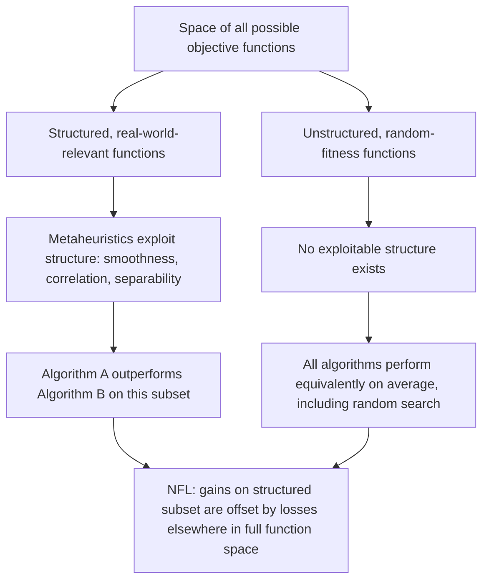

## No Free Lunch Theorem Implications

### Overview

The No Free Lunch (NFL) theorem, formalized by Wolpert and Macready in 1997, is a foundational result in optimization theory stating that no single optimization algorithm can outperform all others across every possible objective function, when performance is averaged over the complete set of problems. In plain terms: an algorithm's superior performance on one class of problems must be offset by inferior performance on another class, when averaged over all possible functions. This result has significant conceptual implications for how optimization methods — including differential evolution, harmony search, and other nature-inspired metaheuristics — should be selected, benchmarked, and discussed.

### Formal Statement

Consider a finite search space $X$ and a finite set of possible objective function values $Y$. Let $f: X \to Y$ be an objective function, and let $a$ be a deterministic, non-repeating search algorithm that generates a sequence of distinct points and observes their fitness values. Define $P(d_m^y \mid f, m, a)$ as the probability of observing a particular sequence of performance outcomes $d_m^y$ after $m$ evaluations, given algorithm $a$ applied to function $f$.

The NFL theorem states that, for any two algorithms $a_1$ and $a_2$:

$$\sum_{f} P(d_m^y \mid f, m, a_1) = \sum_{f} P(d_m^y \mid f, m, a_2)$$

where the sum is taken over **all** possible objective functions $f: X \to Y$. This means that when averaged uniformly over the entire space of possible functions, all algorithms exhibit identical performance distributions.

### Intuition Behind the Result

The core intuition is that "all possible functions" includes an enormous number of functions with no structure or regularity — functions where fitness values are essentially randomly assigned to points in the search space, with no correlation between the fitness of neighboring points. On such unstructured, "needle in a haystack" functions, no search strategy is more effective than any other, including pure random search, because there is no exploitable pattern to guide the search toward better regions.

Algorithms like differential evolution, harmony search, gradient descent, or simulated annealing achieve strong empirical performance specifically because they exploit **structural assumptions** about the objective function — smoothness, separability, correlation between nearby points, or a searchable topology of "basins" leading toward optima. These assumptions hold for the overwhelming majority of *real-world* problems humans actually care about, but not for the space of all conceivable functions, which is dominated by functions with no such structure.

### No Free Lunch Diagram

### Key Implications for Optimization Practice

**No universally best algorithm.** Claims that a particular metaheuristic (e.g., a new nature-inspired variant) is "the best" optimizer in an unqualified, general sense are theoretically unsupportable under NFL, since any performance advantage on a benchmark suite reflects that suite's structural bias, not universal superiority.

**Benchmark suites embed assumptions.** Standard benchmark function sets (e.g., CEC competition suites, Rastrigin, Rosenbrock, Ackley) are not a random sample from the space of all possible functions — they are deliberately chosen to resemble the structural properties of real engineering and scientific problems (continuity, bounded modality, known symmetry properties). Strong performance on these suites indicates suitability for problems with similar structure, not general dominance.

**Algorithm selection should be problem-driven.** Because different algorithms exploit different structural regularities (e.g., DE exploits population-derived scale/orientation information; ACO exploits path-construction and pheromone reinforcement on graph structures; gradient-based methods exploit differentiability), matching the algorithm's implicit assumptions to the problem's actual structure is more principled than searching for a single "best" default.

**Justifies the existence of many methods.** NFL provides a theoretical grounding for why the field maintains a large and growing toolbox of optimization methods rather than converging on one dominant approach — different problem structures genuinely favor different algorithms.

**Tempers claims of novel-algorithm superiority.** In the nature-inspired metaheuristics literature specifically, NFL is frequently invoked as a caution against overgeneralizing from limited benchmark comparisons: a new algorithm outperforming established ones on a chosen test set does not imply general superiority, only suitability to that test set's structural characteristics. [Inference] This caution is widely cited in critical reviews of the metaheuristics literature, though the degree to which individual papers adequately address it varies.

### Scope and Common Misconceptions

**NFL applies to averages over the complete function space, not to practical performance on real-world problem classes.** It is a common misunderstanding to interpret NFL as implying "all algorithms are equally good in practice" — this is not the theorem's claim. In practice, real-world problems are drawn overwhelmingly from the structured subset of function space, so algorithms designed to exploit realistic structure (smoothness, decomposability, statistical regularities) can and do meaningfully outperform naive or random approaches on the problems that actually matter.

**NFL does not prohibit meaningful algorithm comparison on a defined problem class.** Comparing DE, HS, PSO, and other methods on a specific, well-motivated benchmark suite representative of a target application domain remains a valid and informative exercise — NFL simply means the conclusions should be scoped to that domain rather than generalized universally.

**Sharpened/restricted NFL results exist.** Subsequent theoretical work has explored conditions under which NFL does *not* strictly hold — for example, when the function class is restricted to a non-uniform or structured subset, or when performance measures other than the original formulation are used, free-lunch-like results (where some algorithms are provably better on that restricted class) can emerge. [Inference] The precise boundary conditions under which such "free lunches" exist are an active and mathematically technical area, and the applicability of any specific sharpened result depends on matching its formal assumptions to the target problem class.

**Applies most cleanly to black-box optimization.** The original NFL formulation assumes no prior knowledge is used by the algorithm beyond the sequence of queried points and observed fitness values (a black-box setting). Algorithms that incorporate genuine prior knowledge about the problem structure (e.g., known convexity, a validated surrogate model, domain-specific heuristics) are, in effect, using information outside the strict black-box NFL framework, which is part of why domain knowledge integration remains valuable in practice.

### Illustration: Performance Trade-off Across Problem Classes

<svg xmlns="http://www.w3.org/2000/svg" viewBox="0 0 700 400">
<text x="350" y="30" font-size="18" text-anchor="middle" fill="#222" font-weight="bold">Illustrative NFL Trade-off Across Problem Classes (svg_diagram)</text>
<line x1="70" y1="340" x2="650" y2="340" stroke="#333" stroke-width="2" />
<line x1="70" y1="340" x2="70" y2="60" stroke="#333" stroke-width="2" />
<text x="360" y="380" font-size="14" text-anchor="middle" fill="#333">Problem class (structural type)</text>
<text x="30" y="200" font-size="14" text-anchor="middle" fill="#333" transform="rotate(-90 30 200)">Relative performance</text>
<polyline points="100,120 220,160 340,240 460,300 580,150" fill="none" stroke="#1a73e8" stroke-width="3" />
<text x="580" y="135" font-size="12" fill="#1a73e8" text-anchor="middle">Algorithm A</text>
<polyline points="100,300 220,250 340,150 460,110 580,290" fill="none" stroke="#e8710a" stroke-width="3" stroke-dasharray="6,4" />
<text x="460" y="95" font-size="12" fill="#e8710a" text-anchor="middle">Algorithm B</text>
<line x1="70" y1="230" x2="650" y2="230" stroke="#999" stroke-width="1" stroke-dasharray="3,3" />
<text x="600" y="222" font-size="11" fill="#666">Average (equal under NFL)</text>
<text x="100" y="358" font-size="11" text-anchor="middle" fill="#333">Smooth</text>
<text x="220" y="358" font-size="11" text-anchor="middle" fill="#333">Multimodal</text>
<text x="340" y="358" font-size="11" text-anchor="middle" fill="#333">Combinatorial</text>
<text x="460" y="358" font-size="11" text-anchor="middle" fill="#333">Noisy</text>
<text x="580" y="358" font-size="11" text-anchor="middle" fill="#333">Unstructured</text>
</svg>

This illustrates the qualitative NFL pattern: Algorithm A's advantage on smooth, low-multimodality problems is offset by weaker relative performance on combinatorial or noisy problems where Algorithm B does comparatively better, with both converging toward equivalent average performance when the full space of problem structures (including unstructured cases) is considered. [Inference] The specific shape of any real algorithm's performance curve across problem classes is empirical and problem-dependent; this diagram is illustrative of the theorem's qualitative pattern, not a plot of measured benchmark data.

### Related Theoretical Results

- **No Free Lunch for search and optimization (original 1997 result)**: covers static, single-objective optimization as described above.
- **No Free Lunch for supervised learning**: an analogous result exists in machine learning, stating no learning algorithm universally outperforms others across all possible data-generating distributions, reinforcing that inductive bias (assumptions baked into a model) is necessary and unavoidable for generalization.
- **Sharpened No Free Lunch results**: work examining specific restricted problem classes or alternative performance metrics where strict equivalence does not hold. [Unverified] The practical significance of these sharpened results for everyday algorithm selection is debated, since restricting to a "non-uniform" function class requires precisely the kind of prior structural knowledge that is often unavailable in genuine black-box settings.
- **Almost No Free Lunch (ANFL) considerations**: discussions of whether near-equivalence (rather than strict equivalence) holds under relaxed assumptions, relevant to finite-precision, real-world computational settings. [Speculation] The extent to which ANFL-style relaxations meaningfully change practical algorithm-selection guidance remains a topic of ongoing discussion rather than settled consensus.

### Practical Guidance Distilled from NFL

- Avoid unqualified claims that a given optimizer (metaheuristic or otherwise) is "the best" without specifying the problem class.
- Select or design algorithms based on the structural properties actually present in the target problem (smoothness, separability, symmetry, noise characteristics, constraint structure).
- Treat benchmark suite performance as evidence of fit to that suite's structural profile, not as evidence of universal superiority.
- When proposing a new metaheuristic, favor problem-class-scoped performance claims over general "outperforms existing methods" claims, and disclose the structural characteristics of the test problems used.
- Recognize that domain knowledge, when available, is not in tension with NFL — using it to bias the algorithm's assumptions toward the true problem structure is precisely how the "free lunch" is practically obtained for structured, real-world problem classes.

**Related Topics**

- Differential evolution
- Harmony search and other nature-inspired methods
- Benchmarking methodology for stochastic optimizers (CEC competition suites)
- Inductive bias in machine learning (No Free Lunch for supervised learning)
- Algorithm selection and meta-learning for optimization
- Surrogate-assisted and knowledge-informed optimization
- Exploration-exploitation trade-offs in metaheuristics