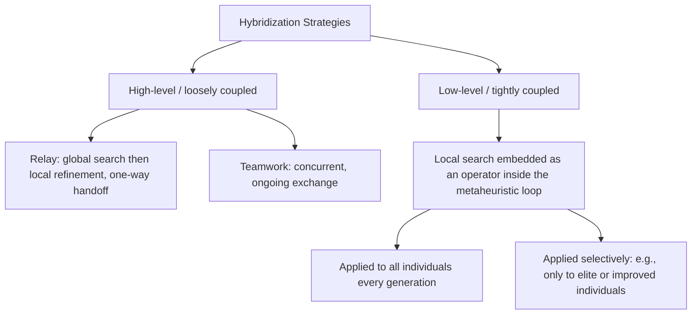
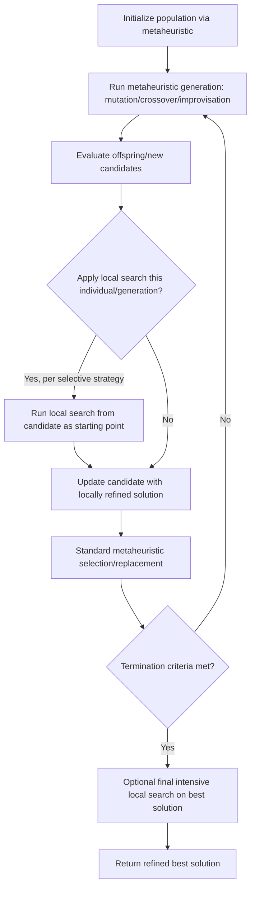

## Hybridizing Metaheuristics with Local Search

### Overview

Hybridizing metaheuristics with local search — often called **memetic algorithms** when the hybridization is systematic and population-based — combines the global exploration capability of population-based or trajectory-based metaheuristics (differential evolution, harmony search, genetic algorithms, PSO, and related nature-inspired methods) with the fast, precise convergence of local search techniques (hill-climbing, gradient descent, pattern search, simulated annealing at low temperature, Nelder-Mead). The motivation is straightforward: metaheuristics are effective at locating promising regions of a search space (global exploration) but often converge slowly or imprecisely once near an optimum, while local search methods converge quickly and precisely but are prone to becoming trapped in the nearest local optimum. Combining the two aims to capture the strengths of each while mitigating their respective weaknesses.

### Motivating Trade-off

$$\text{Total error} \approx \underbrace{\text{Global search error}}_{\text{distance to correct basin}} + \underbrace{\text{Local convergence error}}_{\text{distance to basin's optimum}}$$

Pure metaheuristics reduce the first term effectively but leave the second term nontrivial (slow terminal convergence, oscillation near the optimum). Pure local search reduces the second term to near-zero but only within whatever basin it started in, leaving the first term entirely dependent on a good starting point. Hybridization targets both terms jointly.

### Taxonomy of Hybridization Strategies

**High-level (loosely coupled) hybridization**: the metaheuristic and local search operate as largely independent, self-contained modules, exchanging solutions at defined interfaces (e.g., the metaheuristic's output seeds the local search, or the local search's output re-enters the metaheuristic's population).

**Low-level (tightly coupled) hybridization**: local search is embedded as an operator *within* the metaheuristic's iteration cycle, replacing or supplementing one of its native operators (e.g., using local search as an additional "mutation" step in DE, or as an improvement step applied to each newly improvised harmony in HS).

**Relay hybridization**: methods are applied in strict sequence — a global method runs first to identify promising regions, then hands off entirely to a local method for refinement, with no further alternation.

**Teamwork (co-evolutionary) hybridization**: global and local methods run concurrently and cooperatively, exchanging information throughout the run rather than in a single handoff.

### Hybridization Taxonomy Diagram

### Common Hybridization Patterns by Component

**Memetic algorithms (population-based + local search)**: after standard mutation/crossover/selection produces offspring, a local search procedure (e.g., hill-climbing, Nelder-Mead) is applied to some or all offspring before the next generation begins, effectively performing "individual learning" within a generation. The term derives from Dawkins' concept of the meme, emphasizing that improvements can be transmitted and refined within a generation, unlike pure genetic inheritance.

**DE with local polishing**: after DE's global search converges or stalls (e.g., population diversity falls below a threshold, or after a fixed generation budget), the best individual is passed to a gradient-based method (if the objective is differentiable) or a derivative-free local method (e.g., Nelder-Mead, pattern search) for final refinement.

**HS with embedded local search**: each newly improvised harmony, after pitch adjustment, undergoes a local improvement step before fitness evaluation and harmony memory update, tightening convergence precision per iteration rather than only at the end of the run.

**Simulated annealing as a local refiner**: SA's own trajectory-based structure makes it a natural low-cost local refiner when run with an already-low initial temperature, effectively behaving as a stochastic hill-climb with limited uphill tolerance.

**Lamarckian vs. Baldwinian hybridization**: in **Lamarckian** hybridization, the locally improved solution's genotype (encoding) is updated to reflect the improvement and this modified genotype is passed on to subsequent generations. In **Baldwinian** hybridization, only the improved *fitness value* is used for selection, but the underlying encoding is left unchanged, so the improvement influences selection pressure without permanently altering the genetic material. [Inference] Empirical comparisons between Lamarckian and Baldwinian variants show mixed results depending on problem structure; Lamarckian hybridization tends to converge faster but risks reduced diversity, while Baldwinian hybridization can preserve more exploratory diversity at the cost of slower convergence, though the magnitude of this trade-off is problem-dependent.

### Worked Example: DE Hybridized with Nelder-Mead

Minimize the 2-D Rosenbrock function, a classic narrow-curved-valley benchmark that is notoriously slow for gradient-free population methods to fully converge on precisely:

$$f(x_1, x_2) = 100(x_2 - x_1^2)^2 + (1 - x_1)^2$$

global minimum at $(1,1)$ where $f=0$.

**Stage 1 — Global search with DE**: run DE/rand/1/bin with $NP=30$, $F=0.7$, $CR=0.9$ for, say, 100 generations. DE will typically locate the curved valley and bring the best individual close to $(1,1)$ (e.g., within $f < 0.01$) but may converge slowly along the valley floor due to its narrow, curved shape.

**Stage 2 — Local refinement with Nelder-Mead**: take DE's best individual as the initial simplex seed for Nelder-Mead, a derivative-free local simplex method well suited to narrow valleys. Run Nelder-Mead until a tight convergence tolerance (e.g., $f < 10^{-8}$) is reached.

**Result**: the hybrid typically reaches machine-precision-level convergence in far fewer total function evaluations than running DE alone to the same precision, since Nelder-Mead's local convergence rate near a smooth optimum is substantially faster than DE's population-based stochastic refinement. [Inference] The exact evaluation-count savings depend on the specific problem, DE parameter settings, and Nelder-Mead's convergence tolerance; this pattern is a general, widely observed tendency rather than a guaranteed ratio.

### Selective Application of Local Search

Because local search steps (particularly gradient-based or iterative methods) can be computationally expensive relative to a single metaheuristic evaluation, indiscriminately applying local search to every individual every generation is often wasteful. Common selective strategies include:

- **Elitist application**: apply local search only to the current best individual(s).
- **Probabilistic application**: apply local search to a randomly chosen fraction of the population each generation, controlled by a local search probability parameter.
- **Frequency-based application**: apply local search every $k$ generations rather than every generation.
- **Adaptive/triggered application**: apply local search only when a stagnation condition is detected (e.g., no improvement in best fitness over several generations, or population diversity falling below a threshold).

[Inference] The choice among these strategies involves a computational budget trade-off that is problem- and implementation-specific; there is no single strategy that is empirically dominant across all reported studies.

### Local Search Method Selection by Objective Properties

| Objective property | Suitable local search method |
| --- | --- |
| Differentiable, smooth | Gradient descent, conjugate gradient, quasi-Newton (e.g., BFGS) |
| Non-differentiable but continuous | Nelder-Mead simplex, pattern search, Powell's method |
| Discrete/combinatorial neighborhood | Hill-climbing, tabu search, 2-opt/3-opt (for routing-type problems) |
| Noisy or stochastic evaluations | Stochastic approximation methods, low-temperature simulated annealing |
| Constrained | Sequential quadratic programming (SQP), interior-point methods (if smooth), penalty-augmented local search (if not) |

### Benefits of Hybridization

- Substantially improved terminal convergence precision compared to running the metaheuristic alone.
- Often reduces total function evaluations needed to reach a target precision, since local search exploits smooth structure far more efficiently than population-level stochastic operators once near a basin. [Inference] This benefit assumes the objective has some locally exploitable structure (e.g., continuity); on genuinely rugged or discontinuous landscapes near the optimum, the efficiency gain may be smaller or absent.
- Mitigates the "slow final approach" behavior common to purely population-based metaheuristics near an optimum.
- Can help escape shallow local optima that a pure local search would get stuck in immediately, by relying on the metaheuristic's global exploration to first identify a good basin.

### Risks and Limitations

- **Premature convergence risk**: aggressive or frequent local search application can rapidly homogenize the population around a single basin, reducing diversity and increasing the risk of prematurely converging to a local (rather than global) optimum — reintroducing, at the population level, the very weakness local search was meant to complement.
- **Increased computational cost per iteration**: local search steps, especially gradient-based or iterative ones, can be markedly more expensive per call than a single metaheuristic fitness evaluation, so naive full-population application may increase wall-clock time despite reducing generation count.
- **Local search method mismatch**: applying a local method unsuited to the objective's actual properties (e.g., gradient-based local search on a non-differentiable or noisy objective) can degrade rather than improve performance.
- **Additional parameter burden**: hybrid schemes introduce further control parameters (local search probability/frequency, stagnation trigger thresholds, Lamarckian vs. Baldwinian choice) on top of the base metaheuristic's own parameters, increasing tuning complexity. [Inference] This added tuning burden is a commonly cited practical drawback in the memetic algorithm literature, though its severity depends on how sensitive final performance is to these additional settings for the specific problem at hand.
- **No free lunch still applies**: hybridization does not exempt a method from the No Free Lunch theorem's implications — a hybrid scheme tuned for strong performance on one problem class is not guaranteed to generalize to unrelated problem classes.

### Hybridization Workflow (General Pattern)

### Practical Implementation Notes

- When the objective is differentiable, pairing a population metaheuristic with a quasi-Newton method (e.g., L-BFGS) for the final polish stage is common practice, since quasi-Newton methods offer fast superlinear local convergence.
- For expensive black-box objectives, restricting local search to only the single best-found solution at the very end of the run (rather than throughout) is a conservative choice that limits added computational cost while still capturing most of the precision benefit.
- Libraries such as SciPy (`scipy.optimize.minimize` with methods like `Nelder-Mead`, `BFGS`, `Powell`) are commonly combined manually with population-metaheuristic libraries (e.g., feeding a DE or PSO result as `x0` to a subsequent local minimize call) to construct simple relay hybrids. [Inference] Specific API details and available method options can change across library versions, so current documentation should be checked.
- Diversity-preserving safeguards (e.g., only applying local search to a capped fraction of the population, or maintaining a separate "exploration" sub-population untouched by local search) are commonly recommended to offset premature convergence risk. [Speculation] The optimal balance between exploration-preserving safeguards and local-search intensity likely varies enough by problem that general-purpose default settings should be treated as starting points for tuning rather than fixed prescriptions.

**Related Topics**

- Differential evolution
- Harmony search and other nature-inspired methods
- No free lunch theorem implications
- Memetic algorithms and Lamarckian versus Baldwinian learning
- Gradient-based local optimization methods (BFGS, conjugate gradient)
- Derivative-free local search (Nelder-Mead, pattern search)
- Exploration-exploitation trade-offs in metaheuristics
- Simulated annealing as a standalone and hybrid method