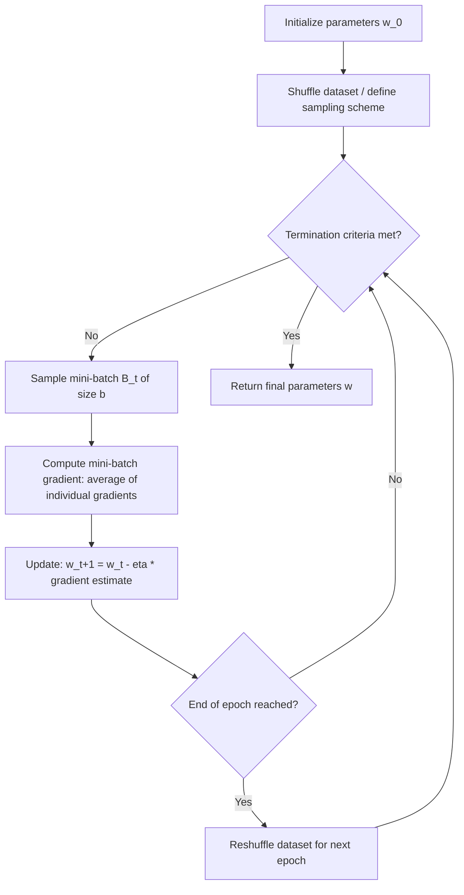

## Stochastic Gradient Descent Fundamentals

### Overview

Stochastic gradient descent (SGD) is an iterative first-order optimization method for minimizing an objective function that is expressed as a sum (or expectation) over many individual terms, most commonly a loss function averaged over training examples. Rather than computing the exact gradient using the full dataset at every step, as in standard (batch) gradient descent, SGD approximates the gradient using a single randomly sampled data point (or a small mini-batch), trading gradient accuracy per step for a dramatic reduction in per-step computational cost. This trade-off makes SGD the foundational optimization workhorse for large-scale machine learning, where computing a full-batch gradient may be prohibitively expensive.

### Problem Setting

Consider an objective function expressed as an average over $n$ individual loss terms:

$$f(\mathbf{w}) = \frac{1}{n} \sum_{i=1}^{n} f_i(\mathbf{w})$$

where $\mathbf{w}$ is the parameter vector being optimized and $f_i(\mathbf{w})$ is the loss contributed by the $i$-th data point. The full (batch) gradient is:

$$\nabla f(\mathbf{w}) = \frac{1}{n} \sum_{i=1}^{n} \nabla f_i(\mathbf{w})$$

Computing this exactly requires touching all $n$ data points at every iteration, which becomes impractical as $n$ grows large.

### Batch Gradient Descent vs. Stochastic Gradient Descent

**Batch gradient descent** update rule:

$$\mathbf{w}_{t+1} = \mathbf{w}_t - \eta \nabla f(\mathbf{w}_t) = \mathbf{w}_t - \eta \cdot \frac{1}{n}\sum_{i=1}^n \nabla f_i(\mathbf{w}_t)$$

**Stochastic gradient descent** update rule, using a single randomly sampled index $i_t$ at step $t$:

$$\mathbf{w}_{t+1} = \mathbf{w}_t - \eta \nabla f_{i_t}(\mathbf{w}_t)$$

where $\eta$ is the **learning rate** (step size). The key property is that $\nabla f_{i_t}(\mathbf{w}_t)$ is an **unbiased estimator** of the true full-batch gradient when $i_t$ is sampled uniformly at random:

$$\mathbb{E}_{i_t}[\nabla f_{i_t}(\mathbf{w}_t)] = \nabla f(\mathbf{w}_t)$$

This unbiasedness is the theoretical foundation that justifies SGD's convergence behavior despite each individual step using a noisy gradient estimate.

### Mini-Batch Gradient Descent

In practice, pure single-sample SGD is rarely used directly; **mini-batch SGD** is the standard approach, averaging the gradient over a small randomly sampled subset $B_t$ of size $b$ (the batch size):

$$\mathbf{w}_{t+1} = \mathbf{w}_t - \eta \cdot \frac{1}{b}\sum_{i \in B_t} \nabla f_i(\mathbf{w}_t)$$

Mini-batching reduces gradient estimate variance relative to single-sample SGD (variance scales roughly as $1/b$) while remaining far cheaper per step than full-batch gradient descent, and it is well suited to parallel hardware (GPUs/TPUs) that process batched computations efficiently. The term "SGD" is commonly used in practice to refer to mini-batch gradient descent as well as the strict single-sample variant. [Inference] This terminology overlap is a common source of ambiguity in casual usage; precise technical writing typically specifies batch size explicitly.

### SGD Algorithm Flow

### Convergence Behavior

Unlike batch gradient descent, which follows a smooth, monotonically decreasing trajectory (for a sufficiently small learning rate on a convex, smooth objective), SGD's per-step trajectory is noisy due to gradient estimation variance, even though the expected direction of movement is correct. For convex objectives with an appropriately decaying learning rate, SGD converges in expectation, though individual sample paths oscillate around the optimum rather than approaching it smoothly.

**Convergence rate (convex, smooth case)**: with a suitably decaying step size (e.g., $\eta_t = O(1/\sqrt{t})$), SGD achieves an expected sub-optimality of $O(1/\sqrt{t})$ for general convex objectives, and $O(1/t)$ for strongly convex objectives — both slower than batch gradient descent's rate on the same objective classes, reflecting the cost of noisy gradient estimates. [Inference] These are standard textbook convergence-rate results under specific technical assumptions (bounded gradient variance, appropriate step-size schedules, convexity); rates for non-convex objectives (the typical regime for deep learning) are generally weaker and stated in terms of convergence to a stationary point (where the gradient norm is small) rather than to a global optimum, since global optimality guarantees generally do not hold in non-convex settings.

**Noise as a feature, not only a bug**: the stochastic noise in SGD's updates is sometimes credited with helping the optimizer escape shallow local minima or saddle points in non-convex landscapes (relevant to deep neural network training), functioning similarly in spirit to the exploratory noise in simulated annealing. [Inference] The precise mechanism and extent of this benefit is an active area of research in deep learning optimization theory; empirical results support that noise can aid escaping certain saddle regions, but the relationship between batch size, noise magnitude, and generalization performance is not fully settled.

### Learning Rate Schedules

Because a constant learning rate causes SGD to oscillate around (rather than converge precisely to) an optimum due to persistent gradient noise, decaying schedules are commonly used:

- **Step decay**: $\eta_t = \eta_0 \cdot \gamma^{\lfloor t/s \rfloor}$, reducing the learning rate by a factor $\gamma$ every $s$ steps.
- **Exponential decay**: $\eta_t = \eta_0 \cdot e^{-\lambda t}$
- **1/t decay**: $\eta_t = \eta_0 / (1 + \lambda t)$, matching the theoretical rate needed for convergence guarantees in the convex case.
- **Cosine annealing**: $\eta_t = \eta_{min} + \frac{1}{2}(\eta_0 - \eta_{min})\left(1 + \cos\left(\frac{t\pi}{T}\right)\right)$, smoothly decaying over a fixed horizon $T$, commonly used in deep learning training schedules.
- **Warm-up schedules**: gradually increasing $\eta$ from a small value at the start of training before applying a decay schedule, used to stabilize early training when gradient estimates or parameter initialization may cause large, destabilizing steps.

### Worked Example

Minimize a simple least-squares objective over a small synthetic dataset:

$$f(\mathbf{w}) = \frac{1}{n}\sum_{i=1}^n (\mathbf{w}^\top \mathbf{x}_i - y_i)^2$$

with $n = 1000$ data points, $\mathbf{w} \in \mathbb{R}^5$, batch size $b = 32$, initial learning rate $\eta_0 = 0.01$ with step decay ($\gamma = 0.5$ every 200 steps).

1. Initialize $\mathbf{w}_0$ (e.g., small random values or zeros).
2. Shuffle the 1000 data points; partition into mini-batches of 32 (approximately 31 batches per epoch, with one smaller final batch).
3. For mini-batch $B_1$ (first 32 points): compute $\nabla f_{B_1}(\mathbf{w}_0) = \frac{2}{32}\sum_{i \in B_1} (\mathbf{w}_0^\top \mathbf{x}_i - y_i)\mathbf{x}_i$.
4. Update: $\mathbf{w}_1 = \mathbf{w}_0 - 0.01 \cdot \nabla f_{B_1}(\mathbf{w}_0)$.
5. Repeat for each subsequent mini-batch through the epoch; at step 200, apply decay: $\eta \leftarrow 0.01 \times 0.5 = 0.005$.
6. Reshuffle data and continue for further epochs; track $f(\mathbf{w}_t)$ on a held-out validation set (rather than only the noisy per-batch training loss) to monitor genuine convergence progress, since per-batch loss values fluctuate due to sampling noise. [Inference] The number of epochs needed to reach a target validation loss depends on the dataset, model class, and chosen hyperparameters; this is illustrative of the procedural steps rather than a claim about a specific convergence timeline.

### Comparison: Batch vs. Mini-Batch vs. Single-Sample SGD

| Aspect | Batch GD | Mini-Batch SGD | Single-sample SGD |
| --- | --- | --- | --- |
| Gradient estimate variance | None (exact) | Moderate (scales ~$1/b$) | High |
| Per-step computational cost | High (full dataset) | Low-moderate | Lowest |
| Hardware parallelism utilization | Good (large matrix ops) | Good (typical deep learning default) | Poor (small ops, high overhead) |
| Convergence trajectory smoothness | Smooth | Noisy but averaged | Very noisy |
| Memory requirement | High (full dataset per step, or streaming) | Moderate | Low |
| Typical use case | Small/medium datasets, convex problems | Deep learning, large-scale ML (standard default) | Online/streaming learning, extremely constrained memory |

### Extensions and Variants

- **Momentum**: accumulates an exponentially decaying moving average of past gradients to smooth the noisy trajectory and accelerate convergence along consistent directions: $\mathbf{v}_{t+1} = \mu \mathbf{v}_t + \nabla f_{i_t}(\mathbf{w}_t)$, $\mathbf{w}_{t+1} = \mathbf{w}_t - \eta \mathbf{v}_{t+1}$, where $\mu$ is the momentum coefficient (commonly $\approx 0.9$).
- **Nesterov accelerated gradient**: a look-ahead variant of momentum that evaluates the gradient at an extrapolated future position rather than the current position, often improving convergence in practice.
- **AdaGrad**: adapts the learning rate per parameter based on the accumulated sum of squared past gradients, giving infrequently updated parameters relatively larger steps — useful for sparse features but prone to overly aggressive learning-rate decay over long training runs.
- **RMSProp**: addresses AdaGrad's aggressive decay by using an exponentially decaying average of squared gradients rather than a cumulative sum.
- **Adam**: combines momentum (first-moment estimate) with RMSProp-style adaptive per-parameter scaling (second-moment estimate), and is one of the most widely used optimizers in deep learning practice due to generally robust performance across a broad range of architectures. [Inference] "Widely used" reflects common practice reported across the deep learning literature; whether Adam or a specific variant is optimal for any given architecture and dataset remains an empirical, problem-dependent question, consistent with No Free Lunch considerations.
- **Variance reduction methods (SVRG, SAGA)**: techniques that periodically incorporate full or partial batch-gradient information to reduce the variance of the stochastic gradient estimator, improving convergence rate guarantees relative to plain SGD in certain convex settings. [Inference] These methods carry additional memory and computational overhead (e.g., storing past gradients or periodically computing a full-batch gradient), so their practical benefit over plain mini-batch SGD depends on the specific problem scale and computational budget.

### SGD Variance Illustration

<svg xmlns="http://www.w3.org/2000/svg" viewBox="0 0 700 400">
<text x="350" y="30" font-size="18" text-anchor="middle" fill="#222" font-weight="bold">Batch vs. Stochastic Gradient Descent Trajectories (svg_diagram)</text>
<line x1="70" y1="350" x2="650" y2="350" stroke="#333" stroke-width="2" />
<line x1="70" y1="350" x2="70" y2="60" stroke="#333" stroke-width="2" />
<text x="360" y="385" font-size="14" text-anchor="middle" fill="#333">Iteration</text>
<text x="30" y="205" font-size="14" text-anchor="middle" fill="#333" transform="rotate(-90 30 205)">Objective value</text>
<polyline points="90,90 180,140 270,175 360,205 450,225 540,240 610,250" fill="none" stroke="#1a73e8" stroke-width="3" />
<text x="610" y="270" font-size="12" fill="#1a73e8" text-anchor="middle">Batch GD</text>
<polyline points="90,90 120,160 150,110 180,190 210,150 240,220 270,175 300,235 330,195 360,245 390,210 420,255 450,225 480,260 510,235 540,265 570,245 600,270 610,260" fill="none" stroke="#e8710a" stroke-width="2" />
<text x="610" y="290" font-size="12" fill="#e8710a" text-anchor="middle">SGD</text>
</svg>

The batch gradient descent trajectory decreases smoothly, while SGD's trajectory oscillates around a similar downward trend due to per-step gradient noise, generally requiring a decaying learning rate schedule for the oscillation amplitude to shrink over time. [Inference] The relative smoothness gap and convergence speed shown are illustrative of the qualitative pattern; actual trajectories depend heavily on batch size, learning rate schedule, and the specific objective's curvature.

### Practical Implementation Notes

- Deep learning frameworks (PyTorch's `torch.optim.SGD`, TensorFlow/Keras's `SGD` optimizer) provide built-in mini-batch SGD implementations, typically with optional momentum and weight decay (L2 regularization) parameters. [Inference] Specific default hyperparameters and available options can differ across framework versions, so current documentation should be consulted.
- Shuffling the dataset each epoch (rather than fixed sequential ordering) is standard practice to ensure the sampling process behind the unbiased gradient estimator assumption is approximately satisfied.
- Gradient clipping (capping the norm of the gradient before the update) is commonly used alongside SGD in deep learning to prevent destabilizing large updates, particularly in recurrent architectures or early training phases.
- Batch size selection involves a trade-off: larger batches reduce gradient variance and better utilize parallel hardware but require more memory and, per some empirical studies, can affect generalization performance differently than smaller batches. [Speculation] The relationship between batch size and generalization ("large-batch generalization gap") is an area of ongoing empirical and theoretical investigation in the deep learning literature, without full consensus on the underlying mechanism.

**Related Topics**

- Momentum, Nesterov acceleration, and adaptive learning-rate methods (AdaGrad, RMSProp, Adam)
- Convex optimization fundamentals
- Non-convex optimization and saddle-point escape in deep learning
- Learning rate scheduling strategies
- Variance reduction methods (SVRG, SAGA)
- Batch normalization and its interaction with optimization dynamics
- No free lunch theorem implications
- Hybridizing metaheuristics with local search