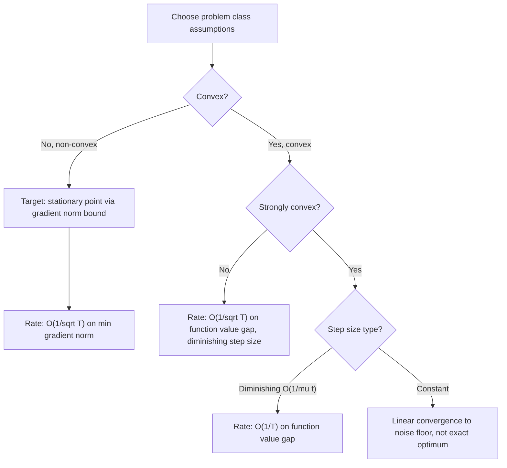

## Convergence Analysis of Stochastic Gradient Methods

### Overview

Convergence analysis of stochastic gradient methods is the theoretical study of how, and how fast, iterative stochastic optimization algorithms approach an optimum (or a stationary point) as a function of the number of iterations, the properties of the objective function, and the algorithm's hyperparameters. This body of theory provides the formal guarantees — or the absence of formal guarantees — that justify practical choices like learning rate schedules, batch size, and momentum coefficients. The analysis differs substantially depending on whether the objective function is convex, strongly convex, or non-convex, since each setting requires different proof techniques and yields qualitatively different guarantees.

### Key Assumptions Used in Convergence Proofs

Most classical convergence results rely on some combination of the following technical assumptions on the objective $f$ and the stochastic gradient oracle:

- **L-smoothness**: the gradient is Lipschitz continuous, $\|\nabla f(\mathbf{x}) - \nabla f(\mathbf{y})\| \leq L\|\mathbf{x} - \mathbf{y}\|$, bounding how quickly the gradient can change.
- **Convexity**: $f(\mathbf{y}) \geq f(\mathbf{x}) + \nabla f(\mathbf{x})^\top(\mathbf{y}-\mathbf{x})$ for all $\mathbf{x}, \mathbf{y}$, ensuring any stationary point is a global minimum.
- **$\mu$-strong convexity**: $f(\mathbf{y}) \geq f(\mathbf{x}) + \nabla f(\mathbf{x})^\top(\mathbf{y}-\mathbf{x}) + \frac{\mu}{2}\|\mathbf{y}-\mathbf{x}\|^2$, a stronger curvature condition that yields faster guaranteed rates.
- **Unbiased gradient estimator**: $\mathbb{E}[\mathbf{g}_t \mid \mathbf{x}_t] = \nabla f(\mathbf{x}_t)$, where $\mathbf{g}_t$ is the stochastic gradient used at step $t$.
- **Bounded variance**: $\mathbb{E}[\|\mathbf{g}_t - \nabla f(\mathbf{x}_t)\|^2 \mid \mathbf{x}_t] \leq \sigma^2$, capping how noisy the gradient estimate can be.

[Inference] These are the standard assumptions found across most classical SGD convergence proofs; relaxed or alternative assumption sets (e.g., weaker smoothness notions, heavy-tailed noise models) exist in more specialized theoretical literature and can change which rates are provable.

### Convergence Rate Results by Problem Class

**Convex, smooth objectives.** With a diminishing step size schedule (commonly $\eta_t = O(1/\sqrt{t})$), SGD achieves:

$$\mathbb{E}[f(\bar{\mathbf{x}}_T)] - f(\mathbf{x}^*) = O\left(\frac{1}{\sqrt{T}}\right)$$

where $\bar{\mathbf{x}}_T$ is typically an average of iterates (e.g., Polyak-Ruppert averaging) rather than the final iterate, and $\mathbf{x}^*$ denotes a global minimizer. This matches known lower bounds for stochastic first-order methods on general convex problems, meaning the rate cannot generally be improved without additional structural assumptions. [Inference] The precise averaging scheme and constant factors involved vary by the specific proof technique used in a given reference.

**Strongly convex, smooth objectives.** With step size $\eta_t = O(1/(\mu t))$, the rate improves to:

$$\mathbb{E}[f(\mathbf{x}_T)] - f(\mathbf{x}^*) = O\left(\frac{1}{T}\right)$$

a faster rate than the general convex case, reflecting the additional curvature information strong convexity provides. Under strong convexity, a constant (non-decaying) step size instead yields **linear convergence to a noise floor**: the iterates converge geometrically fast toward a neighborhood of the optimum whose size is proportional to the step size and gradient noise variance, but do not converge exactly to $\mathbf{x}^*$ without further step-size decay.

**Non-convex, smooth objectives.** Since global optimality generally cannot be guaranteed for non-convex problems, convergence results instead bound the expected squared gradient norm, targeting convergence to a **stationary point** (where $\nabla f(\mathbf{x}) \approx 0$, which may be a local minimum, local maximum, or saddle point):

$$\min_{t \leq T} \mathbb{E}\left[\|\nabla f(\mathbf{x}_t)\|^2\right] = O\left(\frac{1}{\sqrt{T}}\right)$$

This is the standard guarantee for SGD applied to deep neural network training, and notably it says nothing about the quality (global vs. local) of the stationary point reached. [Inference] Additional assumptions (e.g., the Polyak-Łojasiewicz condition, a relaxation of strong convexity that some non-convex objectives satisfy) can yield stronger rates approaching those of the strongly convex case, but whether a given practical objective satisfies such conditions is often unverifiable in advance.

### Convergence Rate Comparison Table

| Problem class | Step size schedule | Convergence metric | Rate |
| --- | --- | --- | --- |
| Convex, smooth | $O(1/\sqrt{t})$ | $\mathbb{E}[f(\bar{\mathbf{x}}_T)] - f(\mathbf{x}^*)$ | $O(1/\sqrt{T})$ |
| Strongly convex, smooth | $O(1/(\mu t))$ | $\mathbb{E}[f(\mathbf{x}_T)] - f(\mathbf{x}^*)$ | $O(1/T)$ |
| Strongly convex, smooth | Constant $\eta$ | $\mathbb{E}[f(\mathbf{x}_T)] - f(\mathbf{x}^*)$ | Linear to a noise floor $O(\eta \sigma^2/\mu)$ |
| Non-convex, smooth | $O(1/\sqrt{T})$ | $\min_t \mathbb{E}[\|\nabla f(\mathbf{x}_t)\|^2]$ | $O(1/\sqrt{T})$ |
| Batch (deterministic) GD, convex | Constant $\eta \leq 1/L$ | $f(\mathbf{x}_T) - f(\mathbf{x}^*)$ | $O(1/T)$ |
| Batch GD, strongly convex | Constant $\eta \leq 1/L$ | $f(\mathbf{x}_T) - f(\mathbf{x}^*)$ | Linear (geometric) |

Note the consistent pattern: at each problem-class level, stochastic methods have strictly slower worst-case guaranteed rates than their deterministic (batch) counterparts, reflecting the fundamental cost of gradient noise. [Inference] This comparison reflects standard worst-case theoretical rates; empirical wall-clock performance can favor SGD despite the slower per-iteration-count rate, since each SGD iteration is far cheaper than a full-batch iteration.

### The Bias-Variance-Style Decomposition in SGD Convergence

A common proof technique decomposes the expected progress of a single SGD step into components resembling a bias-variance trade-off:

$$\mathbb{E}[f(\mathbf{x}_{t+1})] \leq f(\mathbf{x}_t) - \eta\|\nabla f(\mathbf{x}_t)\|^2 + \frac{L\eta^2}{2}\mathbb{E}[\|\mathbf{g}_t\|^2]$$

The first correction term ($-\eta\|\nabla f(\mathbf{x}_t)\|^2$) represents genuine descent from following the true gradient direction in expectation. The second term ($\frac{L\eta^2}{2}\mathbb{E}[\|\mathbf{g}_t\|^2]$) represents the cost incurred from gradient noise and the curvature of $f$, growing with the square of the step size. This decomposition is the core mechanism explaining why sufficiently small, appropriately decaying step sizes are necessary: a step size too large lets the noise-driven term dominate and prevent convergence, while a step size that decays appropriately allows the descent term to dominate over time.

### Convergence Behavior Diagram

### Effect of Batch Size on Convergence

Increasing the mini-batch size $b$ reduces the variance of the gradient estimator roughly proportionally to $1/b$ (assuming independent sampling), which tightens the noise-related terms in convergence bounds and can allow a proportionally larger step size to be used while maintaining stability. This creates a practical trade-off: larger batches yield lower-variance, more reliable gradient steps per iteration (approaching batch gradient descent's smoother behavior as $b \to n$) at the cost of higher per-iteration computation, while smaller batches allow cheaper, more frequent updates at the cost of noisier steps requiring more careful step-size control. [Inference] The precise practical trade-off point (in terms of wall-clock time to reach a target accuracy) depends on hardware parallelism characteristics and the specific problem, and is not fully determined by the variance-reduction theory alone.

### Role of Momentum in Convergence Analysis

Momentum-based methods (heavy-ball momentum, Nesterov acceleration) can provably improve convergence rates in specific settings — most notably, Nesterov's accelerated gradient method achieves an improved $O(1/T^2)$ rate over standard gradient descent's $O(1/T)$ rate for smooth convex deterministic objectives. However, translating this acceleration benefit cleanly into the stochastic setting is more theoretically delicate: the presence of persistent gradient noise can offset or eliminate the acceleration advantage in some analyses, since accumulated momentum can also amplify accumulated noise. [Inference] The precise conditions under which stochastic accelerated methods provably outperform plain SGD are an active and technically nuanced area of optimization theory; practical empirical benefits of momentum in deep learning training are well documented, but the degree to which observed practical gains are best explained by the classical acceleration theory versus other effects (e.g., implicit regularization, escaping saddle points) is not fully settled.

### Saddle Points and Non-Convex Landscape Considerations

In high-dimensional non-convex settings (characteristic of deep neural network loss landscapes), a substantial theoretical and empirical literature has focused on the relative prevalence of saddle points versus poor local minima. Some analyses suggest that in high dimensions, most critical points encountered are saddle points rather than local minima, and that SGD's inherent gradient noise can help iterates escape strict saddle points (where at least one negative curvature direction exists) more effectively than deterministic gradient descent, which can stall near saddle points due to vanishing gradients. [Inference] The generality and practical significance of these saddle-point-prevalence findings across different neural network architectures and datasets remains an active research question, and results derived from specific theoretical models (e.g., random matrix theory approximations) do not automatically transfer with the same strength to all practical training regimes.

### Practical Diagnostics Related to Convergence Theory

- **Monitoring gradient norm**: since non-convex convergence guarantees target gradient norm reduction rather than function value, tracking $\|\nabla f(\mathbf{x}_t)\|$ (or a proxy) directly reflects the theoretical convergence metric, though this is more commonly done in research/diagnostic settings than routine practical training.
- **Loss curve smoothing**: because raw per-step training loss is noisy, practitioners typically monitor a moving average or per-epoch average loss to assess convergence trends, consistent with the theoretical emphasis on expected (rather than per-step) progress.
- **Learning rate range tests**: empirically sweeping learning rates to identify a stable range is a common practical heuristic that indirectly probes the noise-versus-descent balance formalized in the theoretical step-size analysis above.
- **Validation vs. training loss divergence**: while not itself a convergence-theory concept, this diagnostic is often examined alongside convergence monitoring to distinguish optimization progress (approaching a stationary point of the training objective) from generalization behavior, which convergence analysis in the strict optimization sense does not address.

### Distinguishing Optimization Convergence from Generalization

A frequently emphasized theoretical point is that convergence analysis, as covered here, concerns only the **optimization** question — how close the iterates get to minimizing the training objective $f$ — and says nothing directly about **generalization**, the separate question of how well the resulting model performs on unseen data. A method can converge well by optimization-theoretic standards to a point that generalizes poorly, or vice versa. [Inference] The relationship between optimization trajectory characteristics (e.g., flat versus sharp minima, choice of batch size) and generalization performance is a substantial and only partially resolved area of separate theoretical and empirical study, distinct from the convergence-rate theory summarized here.

### Practical Implementation Notes

- Convergence theory is most directly useful for guiding step-size schedule design (e.g., choosing decay rates consistent with theoretical requirements for guaranteed convergence) rather than for predicting exact wall-clock training time on a specific practical deep learning task.
- When strong theoretical guarantees are required (e.g., in convex machine learning problems such as logistic regression or SVMs), matching the step-size schedule and averaging scheme to the specific proof's assumptions is necessary to actually realize the stated rate; deviating from those assumptions (e.g., using a schedule not matched to the proof) forfeits the formal guarantee, though the algorithm may still perform reasonably in practice. [Inference] Practical deep learning training rarely satisfies the convexity assumptions underlying the strongest classical guarantees, so theoretical rates in that context should be understood as suggestive of qualitative behavior (e.g., diminishing step sizes generally help stabilize late-stage training) rather than as precise predictive tools.
- Software libraries generally do not automatically enforce theoretically-justified step size schedules by default; practitioners commonly rely on empirical tuning (e.g., learning rate schedulers, warm-up, cosine annealing) that are only loosely connected to the specific rate proofs summarized above. [Speculation] The gap between widely used practical scheduling heuristics and formally proven optimal schedules for non-convex deep learning objectives remains a topic where theory and practice are not fully unified.

**Related Topics**

- Stochastic gradient descent fundamentals
- Momentum, Nesterov acceleration, and adaptive learning-rate methods
- Convex optimization fundamentals
- Non-convex optimization and saddle-point escape in deep learning
- Learning rate scheduling strategies
- Variance reduction methods (SVRG, SAGA)
- No free lunch theorem implications
- Generalization theory in machine learning optimization