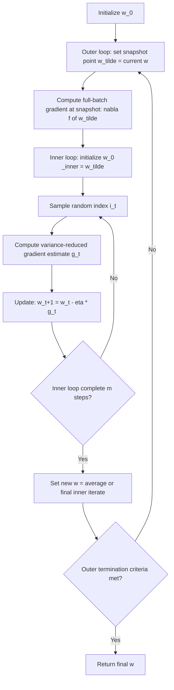

## Variance Reduction Techniques

### Overview

Variance reduction techniques are a class of methods designed to reduce the noise inherent in stochastic gradient estimates without reverting to the full computational cost of batch gradient descent. Because plain stochastic gradient descent's convergence rate is fundamentally limited by gradient estimator variance (as formalized in convergence analysis), a substantial line of optimization research has focused on constructing lower-variance gradient estimators that still require only a fraction of the computation of a full-batch gradient per step, thereby achieving faster convergence guarantees — in some cases matching batch gradient descent's linear convergence rate for strongly convex objectives, at stochastic-per-step cost.

### Motivation

Plain SGD's convergence rate on strongly convex, smooth objectives with a constant step size converges only to a noise floor rather than the exact optimum, because the gradient variance $\sigma^2$ does not vanish as the iterate approaches $\mathbf{x}^*$ — even near the optimum, individual sample gradients $\nabla f_i(\mathbf{x}^*)$ generally remain nonzero and different from each other, so their average variance persists. Variance reduction methods address this directly by constructing gradient estimators whose variance provably shrinks to zero as the iterates converge, restoring the possibility of exact (or geometrically fast) convergence with a constant step size.

### Core Idea: Control Variates

Most variance reduction methods for finite-sum optimization are built on the statistical technique of **control variates**. Given a noisy estimator $\mathbf{g}_t$ of a target quantity, if a correlated auxiliary quantity $\mathbf{c}_t$ with known expectation $\mathbb{E}[\mathbf{c}_t]$ is available, a lower-variance estimator can be constructed as:

$$\tilde{\mathbf{g}}_t = \mathbf{g}_t - \mathbf{c}_t + \mathbb{E}[\mathbf{c}_t]$$

This remains unbiased ($\mathbb{E}[\tilde{\mathbf{g}}_t] = \mathbb{E}[\mathbf{g}_t]$) but has reduced variance when $\mathbf{c}_t$ is well correlated with $\mathbf{g}_t$, since the subtraction cancels shared noise components. In finite-sum optimization, the control variate is typically constructed from a previously computed (and thus "stale" but known) gradient snapshot.

### SVRG (Stochastic Variance Reduced Gradient)

SVRG, introduced by Johnson and Zhang, periodically computes a full-batch gradient at a fixed "snapshot" point $\tilde{\mathbf{w}}$ and uses it as a control variate for subsequent stochastic updates within an inner loop:

$$\mathbf{g}_t = \nabla f_{i_t}(\mathbf{w}_t) - \nabla f_{i_t}(\tilde{\mathbf{w}}) + \nabla f(\tilde{\mathbf{w}})$$

where $\nabla f(\tilde{\mathbf{w}}) = \frac{1}{n}\sum_i \nabla f_i(\tilde{\mathbf{w}})$ is the full-batch gradient computed once at the snapshot point, and $i_t$ is a randomly sampled index at each inner-loop step. As $\mathbf{w}_t \to \tilde{\mathbf{w}}$, both $\nabla f_{i_t}(\mathbf{w}_t) - \nabla f_{i_t}(\tilde{\mathbf{w}}) \to 0$ and the estimator's variance vanishes accordingly.

**SVRG structure**: an outer loop periodically recomputes the full-batch snapshot gradient (cost: $O(n)$), followed by an inner loop of $m$ stochastic updates using the cheap variance-reduced estimator (cost: $O(1)$ per step), repeated until convergence.

### SVRG Algorithm Flow

### SAGA

SAGA (Defazio, Bach, Lacoste-Julien) takes a related but distinct approach: instead of periodically recomputing a full snapshot gradient, it maintains a table of the most recently computed gradient for *each* individual data point, $\phi_1, \dots, \phi_n$, updating only the relevant entry each step:

$$\mathbf{g}_t = \nabla f_{i_t}(\mathbf{w}_t) - \phi_{i_t} + \frac{1}{n}\sum_{j=1}^n \phi_j$$

After each update, the table entry is refreshed: $\phi_{i_t} \leftarrow \nabla f_{i_t}(\mathbf{w}_t)$. Unlike SVRG, SAGA has no separate outer/inner loop structure — it is a single continuous loop — but it requires $O(n)$ memory to store the gradient table (or a compressed representation thereof, depending on the model structure), whereas SVRG requires only $O(d)$ memory (where $d$ is the parameter dimension) beyond the current iterate, since it does not store per-sample gradients.

### SVRG vs. SAGA Comparison

| Aspect | SVRG | SAGA |
| --- | --- | --- |
| Structure | Outer/inner loop (periodic full-batch snapshot) | Single loop with gradient memory table |
| Memory requirement | $O(d)$ (parameter dimension only) | $O(nd)$ or $O(n)$ with structure exploitation |
| Full-batch gradient computations | Periodic (once per outer iteration) | Never (amortized via table) |
| Convergence rate (strongly convex, smooth) | Linear | Linear |
| Practical tuning consideration | Inner loop length $m$ is an added hyperparameter | Memory cost can be prohibitive for very large $n$ or high-dimensional models |

[Inference] Both methods achieve linear (geometric) convergence rates under strongly convex, smooth assumptions in their original theoretical analyses, with broadly comparable rates; which performs better in wall-clock terms on a specific practical problem depends on the relative cost of the periodic full-batch computation (SVRG) versus the memory overhead and table-lookup cost (SAGA), and is generally problem-and-implementation-dependent.

### Worked Example: SVRG on a Logistic Regression Objective

Consider a logistic regression problem with $n = 10{,}000$ samples, minimizing average log-loss with L2 regularization, using SVRG with inner loop length $m = 2n$.

1. Initialize $\mathbf{w}_0$; set snapshot $\tilde{\mathbf{w}} = \mathbf{w}_0$.
2. Compute the full-batch gradient $\nabla f(\tilde{\mathbf{w}})$ using all 10,000 samples (one full pass).
3. Begin inner loop: sample a random index $i_1$, compute the variance-reduced estimate $\mathbf{g}_1 = \nabla f_{i_1}(\mathbf{w}_0) - \nabla f_{i_1}(\tilde{\mathbf{w}}) + \nabla f(\tilde{\mathbf{w}})$ (note that at the very first inner step, $\mathbf{w}_0 = \tilde{\mathbf{w}}$, so $\mathbf{g}_1$ exactly equals the full-batch gradient).
4. Update $\mathbf{w}_1 = \mathbf{w}_0 - \eta \mathbf{g}_1$; repeat sampling and updating for $m = 20{,}000$ inner steps, with $\mathbf{w}_t$ gradually diverging from $\tilde{\mathbf{w}}$ as the inner loop progresses, and the variance-reduction benefit gradually diminishing accordingly within each inner loop (since the benefit is largest when $\mathbf{w}_t$ is close to $\tilde{\mathbf{w}}$).
5. After the inner loop completes, set the new snapshot $\tilde{\mathbf{w}} \leftarrow \mathbf{w}_m$ (or an average of inner iterates, depending on the specific variant), and recompute a fresh full-batch gradient at this new snapshot to begin the next outer iteration.
6. Repeat until a convergence criterion (e.g., gradient norm or function value change below a threshold) is met. [Inference] The number of outer iterations needed for a target accuracy is problem-dependent; this example illustrates procedural mechanics rather than a specific convergence timeline claim.

### Other Variance Reduction Approaches

- **SAG (Stochastic Average Gradient)**: a precursor to SAGA using a similar gradient-table approach but with a biased estimator (the update averages stored gradients differently), achieving similar linear convergence under strong convexity with a more delicate original convergence analysis.
- **SARAH (StochAstic Recursive grAdient algoritHm)**: uses a recursive gradient update across the inner loop (rather than always referencing the fixed snapshot), which some analyses show yields improved variance reduction properties, particularly relevant in non-convex settings.
- **Katyusha**: incorporates Nesterov-style momentum acceleration on top of an SVRG-style variance-reduced gradient estimator, achieving further improved theoretical rates for strongly convex finite-sum problems by combining acceleration and variance reduction benefits.
- **Control-variate methods beyond finite-sum ERM**: variance reduction ideas have also been adapted for reinforcement learning policy gradient estimation (e.g., baseline subtraction in REINFORCE-style estimators) and for Monte Carlo gradient estimation in variational inference, though the specific constructions differ from the finite-sum SVRG/SAGA setting described above. [Inference] These adaptations to other domains involve distinct technical formulations tailored to their respective settings, and the degree of variance reduction achieved is problem-specific.

### Convergence Rate Comparison: Plain SGD vs. Variance-Reduced Methods

| Method | Setting | Rate (strongly convex, smooth) |
| --- | --- | --- |
| Plain SGD, constant step size | Finite-sum, $n$ terms | Linear convergence to noise floor (not exact) |
| Plain SGD, decaying step size | Finite-sum, $n$ terms | $O(1/T)$ to exact optimum |
| SVRG | Finite-sum, $n$ terms | Linear (geometric) to exact optimum |
| SAGA | Finite-sum, $n$ terms | Linear (geometric) to exact optimum |
| Batch gradient descent | Finite-sum, $n$ terms | Linear (geometric), but $O(n)$ cost per step |

The practical appeal of SVRG/SAGA-style methods is achieving batch gradient descent's linear convergence rate character while paying only $O(1)$ (SAGA) or amortized-low (SVRG) per-step cost rather than $O(n)$ per step. [Inference] "Amortized-low" for SVRG reflects that the $O(n)$ snapshot cost is incurred only once per (typically long) inner loop rather than every step; the effective amortized per-step cost depends on the chosen inner loop length $m$, which is itself a tunable hyperparameter with its own trade-offs.

### Variance Reduction Effect Illustration

<svg xmlns="http://www.w3.org/2000/svg" viewBox="0 0 700 400">
<text x="350" y="30" font-size="18" text-anchor="middle" fill="#222" font-weight="bold">Plain SGD vs. Variance-Reduced Convergence (svg_diagram)</text>
<line x1="70" y1="350" x2="650" y2="350" stroke="#333" stroke-width="2" />
<line x1="70" y1="350" x2="70" y2="60" stroke="#333" stroke-width="2" />
<text x="360" y="385" font-size="14" text-anchor="middle" fill="#333">Iteration</text>
<text x="30" y="205" font-size="14" text-anchor="middle" fill="#333" transform="rotate(-90 30 205)">log(Optimality gap)</text>
<polyline points="90,90 150,150 210,190 270,215 330,232 390,244 450,252 510,258 570,262 610,264" fill="none" stroke="#e8710a" stroke-width="2.5" />
<text x="610" y="280" font-size="12" fill="#e8710a" text-anchor="middle">Plain SGD (noise floor)</text>
<polyline points="90,90 150,140 210,175 270,205 330,230 390,252 450,272 510,290 570,306 610,318" fill="none" stroke="#1a73e8" stroke-width="3" />
<text x="610" y="335" font-size="12" fill="#1a73e8" text-anchor="middle">SVRG / SAGA (linear)</text>
</svg>

Plain SGD's optimality gap decreases initially but plateaus near a noise floor, while variance-reduced methods continue decreasing at a geometric (linear on a log scale) rate toward the true optimum. [Inference] This is a qualitative illustration of the theoretically predicted pattern; actual curves depend on the specific problem, condition number, and hyperparameter choices (step size, inner loop length).

### Limitations and Practical Considerations

- **Applicability primarily to finite-sum, ERM-style problems**: SVRG and SAGA's theoretical guarantees are derived for the finite-sum empirical risk minimization setting; their extension to genuinely online or streaming settings (where $n$ effectively grows or data is not revisited) is less direct. [Inference] Adaptations exist but generally require additional assumptions or modified analyses relative to the finite-sum case.
- **Reduced benefit in highly non-convex deep learning settings**: while variance reduction methods have been studied for non-convex objectives (e.g., SVRG-style analyses targeting stationary points), empirical adoption in mainstream deep neural network training has been limited relative to plain minibatch SGD variants (SGD with momentum, Adam), partly due to the added implementation complexity (snapshot computation, gradient tables) and partly due to mixed empirical results in that specific regime. [Speculation] The degree to which variance reduction techniques underperform or match adaptive minibatch methods specifically in large-scale deep learning is not fully settled and may depend on architecture and problem scale in ways not yet comprehensively characterized in the literature.
- **Memory overhead (SAGA)**: for very high-dimensional models or very large $n$, storing a full gradient table can be memory-prohibitive, limiting SAGA's direct applicability without structural modifications (e.g., exploiting sparsity).
- **Snapshot cost (SVRG)**: the periodic full-batch gradient computation, while amortized, still requires a complete pass over the dataset, which can be a practical bottleneck in distributed or streaming environments where full-dataset passes are costly to synchronize.
- **Additional hyperparameters**: inner loop length (SVRG) and other implementation-specific settings add tuning complexity beyond what plain SGD requires. [Inference] This added complexity is a commonly cited practical adoption barrier in surveys of variance-reduced optimization methods, though its real-world severity depends on the specific deployment context and available tuning resources.

### Practical Implementation Notes

- Variance reduction methods are more commonly found in specialized optimization research libraries and convex optimization toolkits than in mainstream deep learning framework defaults (e.g., PyTorch's and TensorFlow's built-in optimizers primarily emphasize plain SGD with momentum and adaptive methods like Adam). [Inference] Third-party or research-oriented implementations of SVRG/SAGA exist, but their availability, maintenance status, and API stability vary and should be checked directly against current package documentation.
- These methods are most directly beneficial for well-conditioned or moderately ill-conditioned convex finite-sum problems (e.g., regularized linear/logistic regression, certain convex machine learning models) where the linear convergence guarantee is most clearly realizable in practice.
- Combining variance reduction with minibatching (using minibatches rather than single samples within the inner-loop update) is a common practical extension that further reduces per-step variance at proportionally increased per-step cost, though this shifts the trade-off along a spectrum rather than eliminating it.

**Related Topics**

- Stochastic gradient descent fundamentals
- Convergence analysis of stochastic gradient methods
- Minibatch stochastic gradient methods
- Momentum, Nesterov acceleration, and adaptive learning-rate methods
- Convex optimization fundamentals
- Non-convex optimization and saddle-point escape in deep learning
- Distributed and parallel training strategies