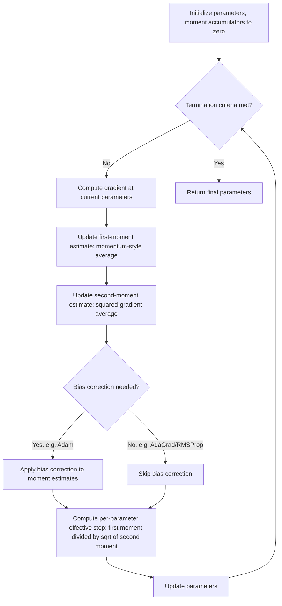

## Adaptive Learning Rate Methods

### Overview

Adaptive learning rate methods adjust the effective step size for each parameter individually and dynamically over the course of training, based on statistics accumulated from past gradients, rather than applying a single global learning rate uniformly to all parameters as in plain SGD. This addresses a practical limitation of plain SGD: different parameters (or different directions in parameter space) often require different effective step sizes due to varying gradient magnitudes, sparsity, or curvature, and a single global rate is frequently a poor compromise across all of them. Adaptive methods — AdaGrad, RMSProp, Adam, and their variants — have become the dominant default optimizers in much of modern deep learning practice.

### Motivation

Plain SGD applies the same scalar learning rate $\eta$ to every parameter:

$$\mathbf{w}_{t+1} = \mathbf{w}_t - \eta \nabla f(\mathbf{w}_t)$$

This is suboptimal when the loss landscape has very different curvature or gradient scale along different parameter dimensions — a single $\eta$ that is appropriately sized for one dimension may be far too large (causing divergence or oscillation) or far too small (causing slow progress) for another. Adaptive methods instead maintain a per-parameter scaling factor derived from the history of gradients observed for that parameter, effectively giving each parameter its own implicit learning rate.

### AdaGrad

AdaGrad (Duchi, Hazan, Singer) accumulates the sum of squared gradients for each parameter and scales the learning rate inversely with the square root of this accumulated sum:

$$G_t = G_{t-1} + \nabla f(\mathbf{w}_t)^2 \quad \text{(element-wise square)}$$

$$\mathbf{w}_{t+1} = \mathbf{w}_t - \frac{\eta}{\sqrt{G_t + \epsilon}} \odot \nabla f(\mathbf{w}_t)$$

where $\odot$ denotes element-wise multiplication, $G_t$ accumulates squared gradients coordinate-wise from the start of training, and $\epsilon$ is a small constant (e.g., $10^{-8}$) preventing division by zero. Parameters with historically large gradients receive proportionally smaller effective steps, while parameters with historically small (e.g., sparse) gradients receive proportionally larger effective steps — a property that makes AdaGrad particularly well suited to sparse-feature settings such as certain natural language processing or recommendation tasks, where some parameters are updated only rarely.

**Key limitation**: because $G_t$ accumulates monotonically over all of training, the effective learning rate for every parameter shrinks continuously and can become vanishingly small well before convergence, effectively halting learning prematurely on long training runs. [Inference] This aggressive, irreversible decay is the primary documented drawback motivating subsequent methods (RMSProp, Adam) that replace the cumulative sum with a decaying average.

### RMSProp

RMSProp (an unpublished method popularized by Geoffrey Hinton in lecture notes) addresses AdaGrad's aggressive decay by replacing the cumulative sum with an exponentially decaying moving average of squared gradients:

$$v_t = \beta v_{t-1} + (1-\beta)\nabla f(\mathbf{w}_t)^2$$

$$\mathbf{w}_{t+1} = \mathbf{w}_t - \frac{\eta}{\sqrt{v_t + \epsilon}} \odot \nabla f(\mathbf{w}_t)$$

where $\beta$ (commonly $\approx 0.9$ or $0.99$) controls the decay rate of the moving average. Because older gradient information is exponentially discounted rather than permanently retained, RMSProp's effective learning rate can adapt upward again if gradient magnitudes shrink later in training, avoiding AdaGrad's premature-stalling problem while retaining the benefit of per-parameter scale adaptation.

### Adam

Adam (Kingma and Ba, "Adaptive Moment Estimation") combines RMSProp-style second-moment (squared gradient) adaptive scaling with momentum-style first-moment (gradient) averaging:

$$m_t = \beta_1 m_{t-1} + (1-\beta_1)\nabla f(\mathbf{w}_t) \quad \text{(first moment / momentum)}$$

$$v_t = \beta_2 v_{t-1} + (1-\beta_2)\nabla f(\mathbf{w}_t)^2 \quad \text{(second moment / adaptive scale)}$$

Because $m_t$ and $v_t$ are initialized at zero, they are biased toward zero especially during early iterations; Adam corrects for this with **bias correction**:

$$\hat{m}_t = \frac{m_t}{1-\beta_1^t}, \qquad \hat{v}_t = \frac{v_t}{1-\beta_2^t}$$

$$\mathbf{w}_{t+1} = \mathbf{w}_t - \frac{\eta}{\sqrt{\hat{v}_t}+\epsilon}\hat{m}_t$$

Common default hyperparameters (as originally proposed) are $\beta_1 = 0.9$, $\beta_2 = 0.999$, $\epsilon = 10^{-8}$. Adam's combination of momentum (smoothing the noisy gradient direction) and adaptive per-parameter scaling (equalizing effective step sizes across parameters of differing gradient magnitude) is widely credited with its broad practical robustness across many architectures and tasks. [Inference] "Widely credited" reflects common characterization in the deep learning literature and practitioner consensus; rigorous causal attribution of Adam's empirical success to these specific mechanisms (versus other confounding factors in typical training setups) is not fully settled at a theoretical level.

### Adaptive Method Update Flow (General Pattern)

### Comparison of Core Adaptive Methods

| Method | First moment (momentum) | Second moment (scale) | Decay style | Key strength | Key weakness |
| --- | --- | --- | --- | --- | --- |
| AdaGrad | No | Cumulative sum | None (monotonic accumulation) | Excellent for sparse features | Learning rate can vanish prematurely on long runs |
| RMSProp | No | Exponential moving average | Exponential decay | Avoids AdaGrad's vanishing-rate problem | No momentum smoothing of gradient direction |
| Adam | Yes | Exponential moving average | Exponential decay, bias-corrected | Combines momentum + adaptive scaling; broadly robust default | Additional hyperparameters; some convergence edge cases (see below) |
| AdaDelta | No (implicit via ratio) | Exponential moving average | Exponential decay | Eliminates need to manually set a global learning rate | Less commonly used than Adam/RMSProp in current practice |
| Nadam | Yes (Nesterov-style) | Exponential moving average | Exponential decay, bias-corrected | Combines Nesterov-style look-ahead momentum with Adam's scaling | Added complexity; empirical benefit over Adam varies by task |

### Worked Example: Adam on a Toy Objective

Minimize $f(w_1, w_2) = w_1^2 + 100w_2^2$ (an elongated, ill-conditioned quadratic bowl, chosen to illustrate adaptive per-parameter scaling), starting at $(w_1, w_2) = (1, 1)$, with $\eta = 0.1$, $\beta_1=0.9$, $\beta_2=0.999$, $\epsilon=10^{-8}$.

1. Compute gradient at $t=1$: $\nabla f = (2w_1, 200w_2) = (2, 200)$ — note the second dimension's gradient is 100 times larger than the first, reflecting the ill-conditioning.
2. Update first moment: $m_1 = 0.9(0) + 0.1(2, 200) = (0.2, 20)$.
3. Update second moment: $v_1 = 0.999(0) + 0.001(2^2, 200^2) = (0.004, 40)$.
4. Bias correction ($t=1$): $\hat{m}_1 = (0.2, 20)/(1-0.9) = (2, 200)$; $\hat{v}_1 = (0.004, 40)/(1-0.999) = (4, 40000)$.
5. Effective step for $w_1$: $0.1 \times 2/\sqrt{4} = 0.1 \times 2/2 = 0.1. Effective step for $w_2
   : $0.1 \times 200/\sqrt{40000} = 0.1 \times 200/200 = 0.1$.
6. Despite the raw gradient for $w_2$ being 100 times larger than for $w_1$, Adam's adaptive scaling produces effective steps of the *same* magnitude (0.1) for both parameters at this step — illustrating the core adaptive-scaling mechanism that equalizes per-parameter step sizes relative to each parameter's own gradient history, which is particularly valuable on ill-conditioned objectives like this one where plain SGD with a single global rate would need to compromise between the two very different gradient scales. [Inference] This is a simplified single-step illustration; behavior over many iterations depends on how the moment estimates evolve as the trajectory approaches the optimum.

### Known Convergence Issues and Refinements

- **Non-convergence counterexamples for Adam**: Reddi, Kale, and Kumar (2018) constructed specific convex online learning problems where Adam's original formulation provably fails to converge, tracing the issue to how the second-moment moving average can decrease the effective learning rate non-monotonically in a way that undermines standard convergence proof techniques. [Inference] These are constructed theoretical counterexamples demonstrating that Adam's original convergence proof (as initially published) contained a gap; whether this failure mode manifests practically on typical real-world training problems is a separate empirical question, and it does not necessarily imply Adam performs poorly in ordinary practice, where it remains widely and often successfully used.
- **AMSGrad**: proposed as a fix to the identified convergence issue, AMSGrad maintains the maximum of past second-moment estimates rather than the plain exponential moving average, ensuring the effective learning rate does not increase over time in a way that could undermine convergence guarantees: $\hat{v}_t = \max(\hat{v}_{t-1}, v_t)$.
- **AdamW**: decouples weight decay (L2-style regularization) from the adaptive gradient scaling, addressing an observation that directly adding weight decay into the gradient before Adam's adaptive scaling (the original common practice) interacts poorly with the per-parameter adaptive rates, whereas applying weight decay directly to the parameter update (decoupled from the gradient-based adaptive scaling) tends to perform better empirically in many settings. [Inference] The empirical benefit of AdamW over standard L2-regularized Adam is reported across a substantial portion of the deep learning literature, though the magnitude of benefit varies by task and model.
- **RAdam (Rectified Adam)**: addresses reported instability in Adam's early training iterations (attributed to high variance in the adaptive learning rate estimate before enough gradient history has accumulated) by introducing a variance-rectification term that effectively behaves like an automatic warm-up. [Speculation] Whether RAdam's rectification consistently outperforms simple manual learning-rate warm-up combined with standard Adam across a broad range of practical tasks is not uniformly agreed upon in the literature.

### Choosing Between Adaptive Methods and Plain SGD (with Momentum)

Despite adaptive methods' popularity, plain SGD with momentum remains competitive or preferred in specific contexts:

- **Generalization performance**: some empirical studies report that models trained with well-tuned SGD with momentum can generalize somewhat better than those trained with Adam on certain tasks (particularly some image classification benchmarks), though this finding is not universal across all domains and architectures. [Inference] The comparative generalization behavior between adaptive and non-adaptive methods is an active empirical research area without a single settled conclusion; results appear to depend on task, architecture, and the degree of hyperparameter tuning applied to each method being compared.
- **Hyperparameter tuning burden**: adaptive methods are often described as requiring less manual learning-rate tuning to achieve reasonable performance quickly, which is frequently cited as a practical convenience benefit, particularly useful in early experimentation phases.
- **Domain-specific defaults**: certain domains (e.g., large language model pretraining) have converged on Adam or AdamW as a near-universal default in current common practice, while other domains (e.g., some computer vision training pipelines) more frequently use SGD with momentum, particularly for final, carefully tuned production training runs. [Inference] These domain-specific tendencies reflect commonly reported practices in the respective literatures as of the available training data and may shift over time as new empirical results and methods emerge.

### Adaptive Scaling Effect Illustration

<svg xmlns="http://www.w3.org/2000/svg" viewBox="0 0 700 400">
<text x="350" y="30" font-size="18" text-anchor="middle" fill="#222" font-weight="bold">Plain SGD vs. Adaptive Method on Ill-Conditioned Objective (svg_diagram)</text>
<line x1="70" y1="350" x2="650" y2="350" stroke="#333" stroke-width="2" />
<line x1="70" y1="350" x2="70" y2="60" stroke="#333" stroke-width="2" />
<text x="360" y="385" font-size="14" text-anchor="middle" fill="#333">w1 (shallow direction)</text>
<text x="30" y="205" font-size="14" text-anchor="middle" fill="#333" transform="rotate(-90 30 205)">w2 (steep direction)</text>
<ellipse cx="360" cy="205" rx="260" ry="60" fill="none" stroke="#ccc" stroke-width="1" />
<ellipse cx="360" cy="205" rx="180" ry="40" fill="none" stroke="#ccc" stroke-width="1" />
<ellipse cx="360" cy="205" rx="100" ry="22" fill="none" stroke="#ccc" stroke-width="1" />
<polyline points="120,110 200,260 260,150 300,235 325,195 345,215 355,203" fill="none" stroke="#c5221f" stroke-width="2" />
<text x="120" y="100" font-size="12" fill="#c5221f">Plain SGD: zig-zags</text>
<polyline points="120,110 220,180 280,200 315,204 340,205 355,205" fill="none" stroke="#1a73e8" stroke-width="3" />
<text x="120" y="130" font-size="12" fill="#1a73e8">Adam: direct path</text>
<circle cx="360" cy="205" r="4" fill="#188038" />
<text x="370" y="200" font-size="11" fill="#188038">optimum</text>
</svg>

On an ill-conditioned objective with very different curvature along different directions, plain SGD tends to oscillate ("zig-zag") along the steep direction while progressing slowly along the shallow direction, whereas adaptive methods' per-parameter scaling tends to produce a more direct path by effectively equalizing step sizes across directions. [Inference] This is a qualitative, illustrative depiction of a well-documented general tendency; actual trajectories depend on the specific hyperparameters, initialization, and objective curvature.

### Practical Implementation Notes

- Deep learning frameworks provide built-in implementations of these optimizers (e.g., PyTorch's `torch.optim.Adam`, `AdamW`, `RMSprop`, `Adagrad`; TensorFlow/Keras equivalents). [Inference] Specific default hyperparameter values and available options (e.g., AMSGrad flags) can differ across framework versions, so current documentation should be consulted before relying on defaults.
- Even with adaptive per-parameter scaling, a global learning rate $\eta$ (and often a schedule on top of it, such as warm-up or decay) is still typically tuned, since adaptive methods scale relative step sizes across parameters but do not eliminate the need for an overall step-size magnitude choice.
- The epsilon term $\epsilon$, while nominally a numerical-stability safeguard, can have a non-trivial practical effect on training dynamics in some settings (particularly with very small gradients), and is occasionally treated as a tunable hyperparameter rather than left at its default value. [Speculation] The practical significance of epsilon tuning varies by task and is not a universally emphasized tuning target in most standard workflows.
- For very large-scale model training (e.g., large language models), memory-efficient variants of Adam (e.g., 8-bit Adam, factored second-moment approximations) are sometimes used to reduce the optimizer state memory overhead, since Adam requires storing two additional moment tensors per parameter. [Inference] The specific memory-efficient variant used and its trade-offs are implementation- and framework-dependent; current library documentation should be consulted for available options.

**Related Topics**

- Stochastic gradient descent fundamentals
- Convergence analysis of stochastic gradient methods
- Minibatch stochastic gradient methods
- Variance reduction techniques
- Learning rate scheduling and warm-up strategies
- Non-convex optimization and saddle-point escape in deep learning
- Weight decay and regularization in gradient-based optimization
- Distributed and parallel training strategies