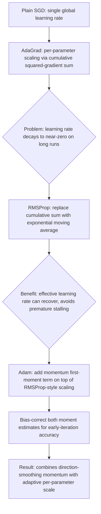

## Adam, RMSProp, and Adagrad Algorithms

### Overview

Adam, RMSProp, and AdaGrad form a closely related lineage of adaptive gradient methods, each building on and addressing a limitation of its predecessor. AdaGrad introduced the core idea of per-parameter adaptive scaling based on accumulated squared gradients; RMSProp modified this accumulation to fix AdaGrad's aggressive, irreversible learning-rate decay; and Adam extended RMSProp by adding momentum-style gradient averaging alongside the adaptive scaling. Understanding these three algorithms together — their shared mathematical structure, their specific differences, and the practical reasons each successive method was introduced — provides a coherent picture of how adaptive optimization evolved into its current standard form.

### AdaGrad: Detailed Formulation

AdaGrad (Duchi, Hazan, and Singer, 2011) maintains, for each parameter $j$, a running sum of squared gradients from the start of training:

$$G_{t,j} = \sum_{\tau=1}^{t} g_{\tau,j}^2, \qquad g_{\tau,j} = \frac{\partial f}{\partial w_j}(\mathbf{w}_\tau)$$

The parameter update is then:

$$w_{t+1,j} = w_{t,j} - \frac{\eta}{\sqrt{G_{t,j} + \epsilon}} \, g_{t,j}$$

Because $G_{t,j}$ only ever grows (it is a strict cumulative sum of non-negative terms), the effective per-parameter learning rate $\eta/\sqrt{G_{t,j}+\epsilon}$ is **monotonically non-increasing** over the entire course of training, for every parameter, regardless of how training progresses later on.

**Why this was originally attractive**: in problems with sparse features (a parameter's associated gradient is frequently exactly zero, e.g., word embeddings for rare vocabulary terms in early NLP applications), $G_{t,j}$ for such a parameter stays small for long stretches, so when a nonzero gradient does arrive, that parameter receives a comparatively large effective update — precisely the desired behavior for infrequently-updated parameters.

**Why this becomes a problem over long training runs**: for parameters that are updated frequently and have persistently large gradients, $G_{t,j}$ grows quickly and without bound, driving the effective learning rate toward zero. In deep learning training runs spanning many epochs, this frequently causes AdaGrad's learning rate to become impractically small well before the model has converged, effectively halting further learning. [Inference] This premature-stalling behavior is well documented as AdaGrad's principal practical limitation in the optimization literature and is the specific motivation cited for RMSProp's modification.

### RMSProp: Detailed Formulation

RMSProp replaces AdaGrad's cumulative sum with an **exponentially weighted moving average** of squared gradients:

$$v_{t,j} = \beta v_{t-1,j} + (1-\beta) g_{t,j}^2$$

$$w_{t+1,j} = w_{t,j} - \frac{\eta}{\sqrt{v_{t,j}+\epsilon}} \, g_{t,j}$$

with $\beta$ typically set around $0.9$ (Hinton's original lecture-note formulation) or sometimes $0.99. Because older squared-gradient contributions are exponentially discounted rather than permanently retained, $v_{t,j}
 reflects primarily *recent* gradient magnitude rather than the entire training history. This means the effective learning rate for a given parameter can recover (increase again) if that parameter's gradients shrink later in training — directly resolving AdaGrad's irreversible-decay problem, since $v_{t,j}$ is no longer forced to grow monotonically.

**Practical characterization**: RMSProp can be understood as AdaGrad with a "forgetting" mechanism, trading away some of AdaGrad's benefit for extremely sparse, rarely-updated parameters (since old rare-gradient history is discounted rather than fully retained) in exchange for sustained adaptability over long, non-sparse training runs — the latter being the dominant regime in most deep learning applications.

### Adam: Detailed Formulation

Adam (Kingma and Ba, 2014) adds a first-moment (momentum) term on top of RMSProp's second-moment adaptive scaling:

$$m_{t,j} = \beta_1 m_{t-1,j} + (1-\beta_1) g_{t,j}$$

$$v_{t,j} = \beta_2 v_{t-1,j} + (1-\beta_2) g_{t,j}^2$$

Both moment estimates are initialized at zero ($m_0 = v_0 = 0$), which biases them toward zero particularly in early iterations (since the exponential moving average has not yet accumulated much signal). Adam corrects this with explicit bias correction:

$$\hat{m}_{t,j} = \frac{m_{t,j}}{1-\beta_1^t}, \qquad \hat{v}_{t,j} = \frac{v_{t,j}}{1-\beta_2^t}$$

$$w_{t+1,j} = w_{t,j} - \frac{\eta}{\sqrt{\hat{v}_{t,j}}+\epsilon}\hat{m}_{t,j}$$

Original default hyperparameters: $\eta = 0.001$, $\beta_1 = 0.9$, $\beta_2 = 0.999$, $\epsilon = 10^{-8}$.

### Side-by-Side Update Rule Comparison

| Component | AdaGrad | RMSProp | Adam |
| --- | --- | --- | --- |
| Gradient accumulation (2nd moment) | Cumulative sum: $G_t = G_{t-1}+g_t^2$ | EMA: $v_t = \beta v_{t-1}+(1-\beta)g_t^2$ | EMA: $v_t = \beta_2 v_{t-1}+(1-\beta_2)g_t^2$ |
| Momentum (1st moment) | None (uses raw $g_t$) | None (uses raw $g_t$) | EMA: $m_t = \beta_1 m_{t-1}+(1-\beta_1)g_t$ |
| Bias correction | Not applicable | Not typically applied | Applied to both $m_t$ and $v_t$ |
| Effective LR trend | Monotonically decreasing | Can recover/fluctuate | Can recover/fluctuate |
| Typical $\eta$ default | 0.01 | 0.001 | 0.001 |
| Extra hyperparameters vs. plain SGD | None beyond $\epsilon$ | $\beta$, $\epsilon$ | $\beta_1$, $\beta_2$, $\epsilon$ |

### Algorithmic Evolution Diagram

### Worked Example: Same Gradient Sequence, Three Optimizers

Consider a single parameter $w$ receiving the gradient sequence $g_1=1.0, g_2=0.8, g_3=0.1, g_4=0.9$ over four steps (simulating a mostly-large-gradient parameter with one small-gradient step), with $\eta=0.1$ for all three methods, $\beta=0.9$ (RMSProp), $\beta_1=0.9,\beta_2=0.999$ (Adam), $\epsilon=10^{-8}$.

**AdaGrad**: $G_1 = 1.0$, effective rate $=0.1/\sqrt{1.0}=0.1$. $G_2 = 1.0+0.64=1.64$, effective rate $=0.1/\sqrt{1.64}\approx0.078$. $G_3=1.64+0.01=1.65$, effective rate $\approx0.078$ (barely changes despite tiny gradient, since $G_t$ already accumulated prior large gradients). $G_4=1.65+0.81=2.46$, effective rate $\approx0.064$ — the rate has now shrunk by more than a third from its starting value after just 4 steps and will continue shrinking for every future step regardless of gradient size.

**RMSProp**: $v_1=0.1(1.0)=0.1$, effective rate $=0.1/\sqrt{0.1}\approx0.316$. $v_2=0.9(0.1)+0.1(0.64)=0.154$, rate $\approx0.255$. $v_3=0.9(0.154)+0.1(0.01)=0.1396$, rate $\approx0.268$ — notice the rate *increased* slightly here in response to the small gradient $g_3$, unlike AdaGrad. $v_4=0.9(0.1396)+0.1(0.81)=0.2066$, rate $\approx0.220$.

**Adam** (showing the effective step magnitude $\eta\hat{m}_t/\sqrt{\hat{v}_t}$ rather than raw rate, since Adam's update depends on the direction-smoothed $\hat{m}_t$ rather than the instantaneous gradient): $m_1=0.1(1.0)=0.1$, $v_1=0.001(1.0)=0.001$; bias-corrected $\hat{m}_1=0.1/0.1=1.0$, $\hat{v}_1=0.001/0.001=1.0$; step $=0.1\times1.0/\sqrt{1.0}=0.1$. Subsequent steps blend in momentum from prior gradients, so the effective step at $t=3$ (small raw gradient) is smoothed by the accumulated momentum from $t=1,2$ rather than dropping sharply, illustrating momentum's smoothing effect distinct from the pure adaptive-scaling behavior of AdaGrad/RMSProp. [Inference] This four-step illustration is simplified for clarity of the mechanical differences; full trajectories over realistic training runs (hundreds to millions of steps) exhibit more complex interactions between the moment estimates.

### Effective Learning Rate Trajectory Illustration

<svg xmlns="http://www.w3.org/2000/svg" viewBox="0 0 700 400">
<text x="350" y="30" font-size="18" text-anchor="middle" fill="#222" font-weight="bold">Effective Learning Rate Over Training (svg_diagram)</text>
<line x1="70" y1="350" x2="650" y2="350" stroke="#333" stroke-width="2" />
<line x1="70" y1="350" x2="70" y2="60" stroke="#333" stroke-width="2" />
<text x="360" y="385" font-size="14" text-anchor="middle" fill="#333">Training step</text>
<text x="30" y="205" font-size="14" text-anchor="middle" fill="#333" transform="rotate(-90 30 205)">Effective learning rate</text>
<polyline points="90,100 150,180 210,230 270,265 330,290 390,308 450,320 510,330 570,336 610,340" fill="none" stroke="#c5221f" stroke-width="3" />
<text x="610" y="320" font-size="12" fill="#c5221f" text-anchor="middle">AdaGrad</text>
<polyline points="90,100 150,160 210,150 270,175 330,155 390,180 450,160 510,178 570,158 610,170" fill="none" stroke="#e8710a" stroke-width="2.5" />
<text x="610" y="150" font-size="12" fill="#e8710a" text-anchor="middle">RMSProp</text>
<polyline points="90,100 150,155 210,145 270,168 330,150 390,172 450,152 510,170 570,150 610,165" fill="none" stroke="#1a73e8" stroke-width="2" />
<text x="610" y="185" font-size="12" fill="#1a73e8" text-anchor="middle">Adam</text>
</svg>

AdaGrad's effective learning rate decays steadily toward zero and never recovers, while RMSProp and Adam fluctuate around a more sustained level, responding to changing gradient magnitudes throughout training rather than being dominated by early-training accumulation. [Inference] This is a qualitative, illustrative depiction of the well-documented general pattern rather than a plot of empirically measured rates on a specific task.

### When Each Method Is Preferred

- **AdaGrad**: well suited to convex problems and settings with genuinely sparse gradients where training runs are relatively short, or specifically where the theoretical convergence guarantees for convex online learning (AdaGrad's original motivating setting) are directly relevant. Less commonly used as a default for deep neural network training due to the premature-decay issue.
- **RMSProp**: a reasonable default for non-convex deep learning problems, especially recurrent neural network training historically, where it was an early popular choice before Adam's widespread adoption. [Inference] RMSProp remains used in specific contexts (e.g., some reinforcement learning implementations have historically favored RMSProp), though Adam and AdamW are more broadly dominant defaults in much of current general practice.
- **Adam / AdamW**: the most broadly used default across a wide range of current deep learning applications (computer vision, NLP, large language model pretraining, generative models), owing to its combination of momentum-smoothed direction and adaptive per-parameter scaling. AdamW (decoupled weight decay) is frequently preferred over plain Adam when regularization is used, per the reasoning covered under adaptive learning rate methods generally. [Inference] "Most broadly used default" reflects common practice patterns as widely reported in the deep learning literature and community; the appropriate choice for any specific task remains empirically determined rather than fixed, consistent with No Free Lunch considerations.

### Common Pitfalls

- **Reusing plain-SGD learning rates directly**: because AdaGrad, RMSProp, and Adam already perform adaptive rescaling, the "reasonable" global $\eta$ magnitude for these methods (e.g., $\eta\approx0.001$ for Adam) is typically much smaller than typical plain SGD learning rates (e.g., $\eta\approx0.01$ to $0.1$); using an SGD-scaled learning rate directly with Adam often causes instability.
- **Ignoring $\epsilon$ sensitivity in low-gradient regimes**: in settings with very small gradients throughout (e.g., certain late-training-phase or heavily regularized problems), the choice of $\epsilon$ can noticeably affect the effective step size, since it appears directly in the denominator alongside the (now small) accumulated second-moment term. [Speculation] The practical frequency with which this sensitivity meaningfully affects real training outcomes, versus being a minor edge case, is not something with a single settled answer across the diversity of practical training setups.
- **Assuming AdaGrad is simply "worse"**: AdaGrad's decay behavior is a poor fit for long, dense-gradient deep learning training but remains theoretically well-motivated and practically appropriate for its original convex, sparse-gradient online-learning setting; the choice among these three methods is properly a matter of matching the tool to the problem's structure rather than a strict quality ranking. [Inference] This point connects directly to No Free Lunch style reasoning: none of these three methods is unconditionally superior across all problem settings, though Adam has become the most common general-purpose default in contemporary deep learning practice specifically.

### Practical Implementation Notes

- All three optimizers are implemented as standard built-in options in major deep learning frameworks (e.g., PyTorch's `torch.optim.Adagrad`, `RMSprop`, `Adam`, `AdamW`; TensorFlow/Keras equivalents). [Inference] Exact default hyperparameter values, available flags (e.g., AMSGrad option within Adam implementations), and behavior can differ across framework versions, so current documentation should be consulted rather than assuming values stated here are unchanged in a specific library release.
- When switching from one adaptive method to another during experimentation, re-tuning the global learning rate $\eta$ is generally necessary rather than optional, since the three methods' effective step-size scales differ systematically as shown in the worked example above.
- For reproducibility and debugging, logging the per-parameter effective learning rate (or a summary statistic of it, such as its mean or a histogram) over training can help diagnose issues like AdaGrad-style premature stalling in custom or non-standard training setups.

**Related Topics**

- Adaptive learning rate methods
- Stochastic gradient descent fundamentals
- Momentum and Nesterov accelerated gradient
- Convergence analysis of stochastic gradient methods
- Weight decay and regularization in gradient-based optimization (AdamW)
- Learning rate scheduling and warm-up strategies
- Non-convex optimization and saddle-point escape in deep learning