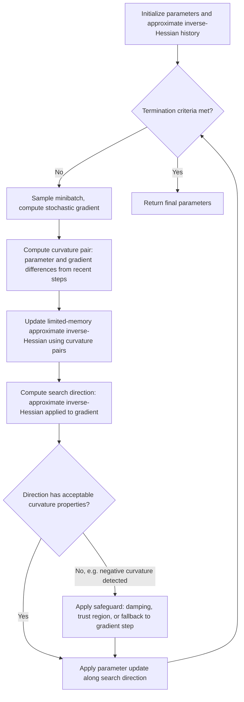

## Second-Order Stochastic Methods

### Overview

Second-order stochastic methods extend the first-order stochastic optimization framework (plain SGD, momentum, adaptive methods) by incorporating curvature information — typically approximations to the Hessian matrix or its inverse — into the update direction, computed from stochastic (subsampled) rather than exact full-batch estimates. Where first-order methods use only gradient information to determine step direction, second-order methods aim to additionally account for how the gradient itself is changing across the parameter space, which can in principle yield faster convergence, particularly on ill-conditioned objectives where first-order methods are known to struggle. The stochastic setting introduces substantial additional complexity relative to classical deterministic second-order optimization, since Hessian estimation from noisy subsampled data is itself a source of error requiring careful theoretical and practical treatment.

### Motivation: Why Curvature Information Helps

For a quadratic objective $f(\mathbf{w}) = \frac{1}{2}\mathbf{w}^\top H \mathbf{w} - \mathbf{b}^\top\mathbf{w}$ with Hessian $H$, Newton's method takes the update:

$$\mathbf{w}_{t+1} = \mathbf{w}_t - H^{-1}\nabla f(\mathbf{w}_t)$$

which converges to the exact optimum in a single step for a quadratic objective, regardless of the objective's conditioning (the ratio of largest to smallest eigenvalue of $H$), because the Hessian inverse exactly corrects for directional curvature differences. In contrast, first-order gradient descent's convergence rate degrades substantially as this condition number increases, producing the characteristic "zig-zagging" behavior on elongated, ill-conditioned loss surfaces discussed in the context of adaptive learning rate methods. Second-order methods aim to recover some of this curvature-correction benefit without paying the full $O(d^3)$ cost of computing and inverting an exact $d \times d$ Hessian, which is computationally prohibitive for the high-dimensional parameter spaces typical of modern machine learning models.

### Core Challenge in the Stochastic Setting

Unlike the deterministic case, where the exact Hessian is available, stochastic second-order methods must estimate curvature from minibatches, introducing several compounding difficulties:

- **Hessian estimation noise**: a minibatch-estimated Hessian $\hat{H}_t$ is itself a noisy, high-variance estimate, and errors in curvature estimation can propagate more severely into the update than equivalent gradient estimation errors, since the (approximate) Hessian inverse is applied multiplicatively to the gradient.
- **Positive-definiteness**: for non-convex objectives, the true Hessian can have negative eigenvalues (indicating saddle points or local maxima directions); naively inverting an indefinite Hessian estimate can produce updates that move in the *wrong* direction (toward increasing loss) along negative-curvature directions, requiring explicit safeguards (e.g., eigenvalue modification or trust-region constraints).
- **Computational and memory cost**: even avoiding a full explicit Hessian, most practical stochastic second-order methods still require meaningfully more computation and memory per step than first-order methods, motivating a range of approximation strategies discussed below.

### Newton and Quasi-Newton Foundations (Deterministic Baseline)

Before covering stochastic variants, the deterministic quasi-Newton family provides essential context, since most stochastic second-order methods are direct stochastic adaptations of these classical techniques:

- **Newton's method**: uses the exact Hessian inverse, $O(d^3)$ cost per step for inversion, impractical for large $d$.
- **BFGS**: a quasi-Newton method that builds an approximate Hessian inverse iteratively from successive gradient differences, without ever forming the exact Hessian, at $O(d^2)$ cost per step.
- **L-BFGS (Limited-memory BFGS)**: further approximates BFGS by storing only a limited history of recent gradient/parameter differences (rather than a full $d\times d$ approximate inverse Hessian matrix), reducing memory to $O(md)$ for a history length $m \ll d$, making it tractable for high-dimensional problems.

### Stochastic Quasi-Newton Methods

**Online L-BFGS / Stochastic L-BFGS**: adapts L-BFGS to the stochastic setting by computing gradient differences from minibatch gradients rather than full-batch gradients, and typically incorporating additional smoothing or averaging to control the noise in the resulting curvature-pair estimates. A common practical modification uses a separate, often larger, batch specifically for the curvature-pair (gradient difference) computation than for the standard gradient step, since curvature estimation tends to require lower noise to remain stable.

**oLBFGS (Schraudolph, Yu, Günter)**: an early influential stochastic L-BFGS variant that modifies the classical curvature-pair update to incorporate a regularization term, improving robustness to the gradient noise inherent in minibatch estimation, and uses a moving-average-style step to stabilize the approximate inverse-Hessian estimate across iterations.

### Stochastic Second-Order Update Flow (General Quasi-Newton Pattern)

### Hessian-Free (Truncated Newton) Optimization

Hessian-free optimization avoids ever forming the Hessian explicitly by exploiting the fact that **Hessian-vector products** $Hv$ can be computed efficiently (at roughly the cost of a gradient computation, via automatic differentiation techniques such as the Pearlmutter trick) without materializing the full Hessian matrix. This Hessian-vector product is then used within an inner **conjugate gradient (CG)** solver to approximately solve the Newton system $H\mathbf{d} = -\nabla f$ for the search direction $\mathbf{d}$, truncating the CG iterations early (hence "truncated Newton") to control computational cost per outer step. Martens (2010) popularized this approach for training deep neural networks, demonstrating it could successfully train certain deep architectures that were, at the time, difficult to train with then-standard first-order methods. [Inference] The relative practical importance of Hessian-free optimization has diminished somewhat in mainstream deep learning practice following the widespread adoption of well-tuned first-order adaptive methods and architectural innovations (e.g., improved initialization, normalization layers) that independently address some of the optimization difficulties Hessian-free methods were originally designed to overcome; it remains referenced in the optimization literature and used in specific specialized contexts.

### Natural Gradient Methods

**Natural gradient descent** (Amari) uses the **Fisher information matrix** $F$, rather than the Hessian directly, as the curvature-correction matrix:

$$\mathbf{w}_{t+1} = \mathbf{w}_t - \eta F^{-1}\nabla f(\mathbf{w}_t)$$

The Fisher information matrix has a natural statistical interpretation (it measures the local curvature of the model's output distribution with respect to parameters, in a sense invariant to reparameterization) and is guaranteed positive semi-definite, sidestepping the indefiniteness issue that plagues naive Hessian-based methods on non-convex objectives. Exact Fisher information computation is itself expensive for large models, leading to practical approximations:

- **K-FAC (Kronecker-Factored Approximate Curvature)**: approximates the Fisher information matrix for neural network layers using a Kronecker-product structure that is far cheaper to invert than the full matrix, while still capturing meaningful curvature information at the layer level.
- **Diagonal Fisher approximations**: further simplify by retaining only the diagonal of the Fisher matrix, which coincides closely with the AdaGrad/RMSProp/Adam-style per-parameter adaptive scaling described in the context of adaptive learning rate methods — providing a theoretical connection between adaptive first-order methods and an approximate form of natural gradient descent. [Inference] The precise theoretical relationship between diagonal-Fisher approximations and methods like Adam/RMSProp is a recognized connection discussed in parts of the optimization literature, though the two families were developed through largely independent lines of research and the connection is best understood as an approximate correspondence rather than strict mathematical equivalence.

### Second-Order Method Family Comparison

| Method | Curvature information used | Per-step cost (relative) | Handles non-convexity | Typical use context |
| --- | --- | --- | --- | --- |
| Exact Newton | Full Hessian inverse | Very high ($O(d^3)$) | Requires modification (indefinite Hessian) | Small-scale, well-conditioned problems |
| BFGS | Approximate Hessian inverse (full matrix) | High ($O(d^2)$) | Requires safeguards | Moderate-dimensional deterministic optimization |
| L-BFGS / stochastic L-BFGS | Limited-memory approximate inverse Hessian | Moderate ($O(md)$) | Requires safeguards | Larger-scale problems, some deep learning applications |
| Hessian-free (truncated Newton) | Implicit Hessian via Hessian-vector products + CG | Moderate-high (multiple gradient-scale computations per step) | Handled via CG truncation and damping | Specialized deep network training |
| K-FAC / natural gradient approximations | Approximate Fisher information matrix | Moderate (layer-wise Kronecker structure) | Naturally positive semi-definite | Specialized large-scale deep learning training |
| Diagonal adaptive methods (Adam, RMSProp) | Diagonal curvature proxy (squared gradients) | Low (comparable to first-order) | Implicitly handled (no explicit indefiniteness issue) | Standard deep learning default |

### Practical Trade-offs vs. First-Order Adaptive Methods

Second-order stochastic methods offer, in principle, faster convergence per iteration on ill-conditioned problems by more directly correcting for curvature, but this comes with substantially increased per-iteration cost and implementation complexity relative to first-order adaptive methods like Adam. The practical calculus for whether this trade-off is worthwhile depends heavily on:

- **Problem conditioning severity**: objectives with very poor conditioning benefit more from explicit curvature correction, while well-conditioned or already reasonably-scaled objectives may see limited additional benefit over well-tuned first-order adaptive methods.
- **Available computational budget per step vs. total steps**: second-order methods trade increased per-step cost for (hoped-for) fewer total steps to convergence; whether this trade nets out favorably in wall-clock time depends on the specific implementation efficiency and hardware.
- **Model scale**: for very large models (e.g., large language models with billions of parameters), even approximate second-order methods like K-FAC can impose memory and computational overhead that is difficult to justify relative to the strong empirical track record of well-tuned first-order adaptive methods at that scale. [Inference] This scale-dependent trade-off assessment reflects general patterns discussed in the optimization and deep learning systems literature; the specific threshold at which second-order methods become practically worthwhile is problem- and implementation-dependent rather than governed by a fixed rule.

### Convergence Rate Considerations

Under appropriate assumptions (e.g., smoothness, strong convexity, and sufficiently accurate curvature estimation), stochastic quasi-Newton and natural gradient methods can achieve improved constants in their convergence rate bounds relative to plain SGD — particularly benefiting the dependence on the objective's condition number — though the *asymptotic order* of the rate (e.g., $O(1/\sqrt{T})$ or $O(1/T)$ depending on convexity assumptions) is not always fundamentally improved beyond what well-tuned first-order methods already achieve in the general stochastic setting, since gradient noise (not just curvature mismatch) remains a limiting factor common to both families. [Inference] The precise conditions under which stochastic second-order methods provide a provable asymptotic (rather than merely constant-factor) improvement over first-order methods is a technically nuanced area of ongoing optimization theory research, and specific theoretical results depend on the exact assumptions of the method and analysis in question.

### Worked Example: Illustrating the Curvature-Correction Concept

Consider the earlier ill-conditioned quadratic $f(w_1,w_2)=w_1^2+100w_2^2$ used previously to illustrate adaptive scaling. The exact Hessian is $H = \text{diag}(2, 200)$, a diagonal matrix in this simple case. Applying an exact Newton step from $(1,1)$:

$$\mathbf{w}_1 = \mathbf{w}_0 - H^{-1}\nabla f(\mathbf{w}_0) = (1,1) - \text{diag}(1/2, 1/200)\cdot(2,200) = (1,1)-(1,1) = (0,0)$$

Newton's method reaches the exact optimum in a single step, since for this quadratic objective the Hessian inverse exactly cancels the curvature mismatch between the two directions. A diagonal-Fisher/adaptive first-order method (like Adam, as computed in the earlier worked example) approximates this correction using accumulated squared-gradient statistics rather than the exact Hessian, achieving equalized *effective step sizes* across directions but generally requiring multiple iterations (rather than one exact step) to reach the optimum on a general quadratic, since its curvature estimate is built up gradually from gradient history rather than computed exactly at each step. [Inference] This single-step exact convergence is specific to the idealized quadratic case with an exactly known, diagonal Hessian; for general non-quadratic or non-diagonal-Hessian objectives, even exact Newton's method does not converge in one step, and approximate/stochastic second-order methods converge more gradually still, with the specific rate depending on the approximation quality and problem structure.

### Practical Implementation Notes

- Stochastic second-order methods are less commonly available as simple built-in defaults in mainstream deep learning framework optimizer APIs compared to first-order methods (SGD, Adam variants); implementations such as K-FAC or Hessian-free optimization often require specialized libraries or custom implementation. [Inference] Availability and maintenance status of specific second-order optimizer implementations varies by framework and library ecosystem and should be checked against current documentation.
- When considering a second-order method, profiling actual wall-clock cost per step (not just theoretical iteration-count reduction) on the target hardware is important, since the practical benefit depends on whether the increased per-step cost is outweighed by genuinely fewer total steps needed on the specific problem.
- For most standard deep learning workloads, well-tuned first-order adaptive methods (Adam, AdamW) combined with appropriate learning rate scheduling remain the practical default, with second-order methods more commonly reserved for specialized research settings, specific architectures known to benefit substantially from curvature correction, or smaller-scale problems where the increased per-step cost is more affordable relative to the problem size. [Speculation] The extent to which broader adoption of second-order methods in mainstream large-scale deep learning practice will increase in the future is not something current evidence settles either way.

**Related Topics**

- Adaptive learning rate methods
- Adam, RMSProp, and Adagrad algorithms
- Convergence analysis of stochastic gradient methods
- Non-convex optimization and saddle-point escape in deep learning
- Natural gradient descent and information geometry
- Hybridizing metaheuristics with local search
- Variance reduction techniques