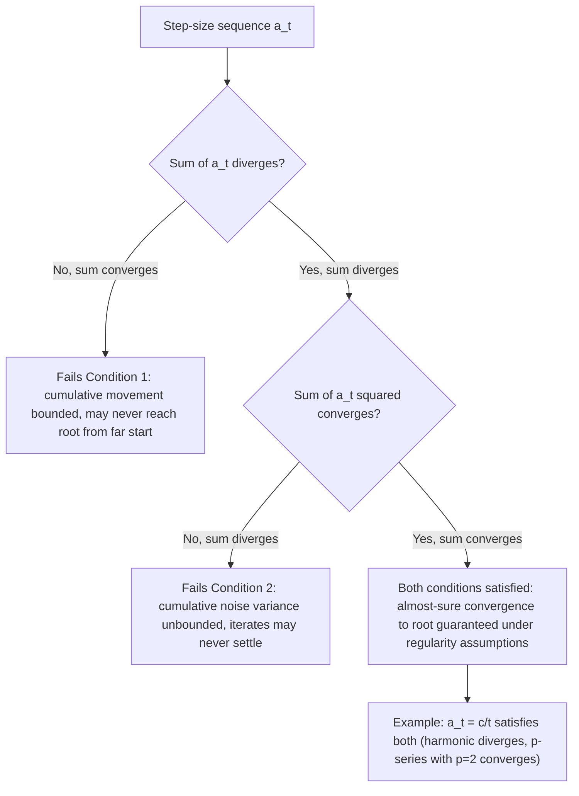

## Robbins-Monro Stochastic Approximation Theory

### Overview

Robbins-Monro stochastic approximation theory is the foundational mathematical framework, introduced by Herbert Robbins and Sutton Monro in 1951, for iteratively finding the root (zero) of a function that can only be observed through noisy measurements rather than evaluated exactly. This theory predates and directly underpins the theoretical justification for stochastic gradient descent and its many variants: SGD can be understood as a specific instance of Robbins-Monro stochastic approximation applied to the root-finding problem $\nabla f(\mathbf{w}) = 0$. The conditions Robbins and Monro derived for guaranteed convergence — most notably on the behavior required of the step-size (learning rate) sequence — remain the theoretical bedrock cited whenever step-size schedules for stochastic gradient methods are discussed.

### The Original Robbins-Monro Problem

Robbins and Monro considered the problem of finding a root $\theta^*$ of an unknown function $M(\theta)$, where $M(\theta)$ cannot be observed directly but only through noisy measurements $N(\theta)$ satisfying:

$$\mathbb{E}[N(\theta)] = M(\theta)$$

That is, $N(\theta)$ is an unbiased but noisy observation of $M(\theta)$ at any queried point $\theta$. The Robbins-Monro algorithm generates a sequence of iterates:

$$\theta_{t+1} = \theta_t - a_t N(\theta_t)$$

where $a_t > 0$ is a sequence of step sizes (gains), and the goal is for $\theta_t \to \theta^*$ as $t \to \infty$, despite each individual observation $N(\theta_t)$ being a noisy, imperfect measurement of the true function value $M(\theta_t)$.

### Connection to Stochastic Gradient Descent

The connection to SGD becomes direct by setting $M(\theta) = \nabla f(\theta)$ (the true gradient of an objective function) and $N(\theta) = \nabla f_i(\theta)$ (a single-sample or minibatch stochastic gradient estimate). Under this correspondence, finding a root of $M(\theta) = \nabla f(\theta) = 0$ is precisely the problem of finding a stationary point of $f$, and the Robbins-Monro update rule:

$$\theta_{t+1} = \theta_t - a_t \nabla f_{i_t}(\theta_t)$$

is exactly the SGD update rule with $a_t$ playing the role of the learning rate $\eta_t$. This means the classical convergence theory developed by Robbins and Monro for general stochastic root-finding applies directly to SGD as a special case, and the specific conditions Robbins and Monro identified as necessary for guaranteed convergence are the historical origin of the standard learning-rate-schedule requirements still cited in modern SGD convergence analysis.

### The Robbins-Monro Step-Size Conditions

The central theoretical contribution is a pair of conditions on the step-size sequence $\{a_t\}$ that are together sufficient (under additional regularity assumptions on $M$ and the noise) to guarantee almost-sure convergence of $\theta_t$ to the true root $\theta^*$:

$$\sum_{t=1}^{\infty} a_t = \infty \quad \text{(Condition 1: steps must not vanish too quickly)}$$

$$\sum_{t=1}^{\infty} a_t^2 < \infty \quad \text{(Condition 2: squared steps must be summable)}$$

**Intuition for Condition 1**: the step sizes must not shrink so fast that the algorithm's *cumulative* movement is bounded — if $\sum a_t$ converged to a finite value, the iterate could only ever move a finite total distance from its starting point, which would be insufficient to guarantee reaching $\theta^*$ from an arbitrary (possibly distant) starting point.

**Intuition for Condition 2**: the step sizes must shrink fast enough that the *cumulative variance* introduced by the noisy observations, which scales with $\sum a_t^2$ (since variance of a scaled random variable scales with the square of the scale factor), remains bounded — otherwise, accumulated noise could prevent the iterates from ever settling near $\theta^*$, even if the average direction of movement is correct.

### Canonical Step-Size Sequence Satisfying Both Conditions

The sequence $a_t = c/t$ for a constant $c > 0$ is the classical example satisfying both conditions:

$$\sum_{t=1}^{\infty} \frac{c}{t} = \infty \quad \text{(harmonic series diverges)}$$

$$\sum_{t=1}^{\infty} \frac{c^2}{t^2} = c^2 \cdot \frac{\pi^2}{6} < \infty \quad \text{(p-series with } p=2 \text{ converges)}$$

More generally, any sequence $a_t = c/t^p$ with $1/2 < p \leq 1$ satisfies both conditions, giving a family of valid schedules; $p=1$ recovers the classical $1/t$ schedule, while values of $p$ closer to $1/2$ decay more slowly (satisfying Condition 1 more comfortably) while still satisfying Condition 2 since $p>1/2$ ensures $\sum a_t^2 = \sum 1/t^{2p}$ converges.

### Step-Size Conditions Diagram

### Why Constant Step Sizes Fail the Conditions

A constant step size $a_t = a$ for all $t$ fails Condition 2, since $\sum_{t=1}^{\infty} a^2 = \infty$ for any fixed $a > 0$ — the sum of a constant sequence trivially diverges. This formally explains, from the Robbins-Monro perspective, the practically observed and previously discussed phenomenon that constant-step-size SGD converges only to a noise floor around the optimum rather than to the exact optimum: the theory predicts that Condition 2's failure permits a persistent noise-driven fluctuation that never vanishes, matching the linear-convergence-to-a-noise-floor behavior described in convergence analysis of stochastic gradient methods.

### Regularity Assumptions Beyond the Step-Size Conditions

The Robbins-Monro step-size conditions alone are not sufficient for convergence; the original theorem and its many subsequent refinements also require conditions on the function $M(\theta)$ and the noise structure, commonly including:

- **Boundedness/growth conditions on $M(\theta)$**: preventing $M$ from growing too explosively away from the root, which could otherwise cause instability.
- **A unique root with appropriate sign structure**: $M(\theta) < 0$ for $\theta < \theta^*$ and $M(\theta) > 0$ for $\theta > \theta^*$ (in the scalar case), ensuring the deterministic dynamics point consistently toward the root.
- **Bounded conditional variance of the noise**: $\mathbb{E}[(N(\theta)-M(\theta))^2] \leq \sigma^2$ for some finite $\sigma^2$, analogous to the bounded-variance assumption used in modern SGD convergence proofs.

[Inference] The precise regularity conditions vary somewhat across different published versions and extensions of the Robbins-Monro theorem (the original 1951 paper and numerous subsequent refinements by other authors use varying technical assumptions); the conditions summarized here reflect commonly cited versions of the result rather than a single universally standardized statement.

### Kiefer-Wolfowitz: A Related Extension

A closely related extension, the **Kiefer-Wolfowitz algorithm** (1952), addresses the related problem of finding the *maximum or minimum* of a noisily-observed function (rather than the root of a noisily-observed function directly), using finite-difference gradient approximations from noisy function-value observations:

$$\theta_{t+1} = \theta_t - a_t \frac{N(\theta_t+c_t)-N(\theta_t-c_t)}{2c_t}$$

where $c_t \to 0$ is an additional sequence controlling the finite-difference perturbation size, requiring its own convergence conditions (in addition to the Robbins-Monro conditions on $a_t$) to ensure the finite-difference approximation itself becomes asymptotically accurate. This is historically significant as an early precursor to gradient-free (zeroth-order) stochastic optimization methods, relevant to settings where only noisy function *values* — not gradients — are observable. [Inference] The Kiefer-Wolfowitz framework and its step-size/perturbation-size condition requirements are more technically involved than the basic Robbins-Monro setting due to the added finite-difference approximation error, and specific convergence rate results depend on the chosen decay rates of both $a_t$ and $c_t$.

### Polyak-Ruppert Averaging

A significant later refinement to Robbins-Monro-style stochastic approximation, developed by Polyak and Ruppert in the late 1980s/early 1990s, showed that using a *slower-decaying* step size (larger than the classical $1/t$ rate) combined with **averaging the iterates** — rather than using the final iterate directly — can achieve an improved, asymptotically optimal convergence rate:

$$\bar{\theta}_T = \frac{1}{T}\sum_{t=1}^{T} \theta_t$$

Under this scheme, using $a_t = O(t^{-p})$ for $p \in (1/2, 1)$ (a slower decay than the classical $p=1$ choice) and then averaging the resulting iterate sequence, the averaged estimator $\bar{\theta}_T$ can achieve the same asymptotically optimal variance as if a hypothetical optimal (but generally unknown in practice) fixed step size had been used throughout. [Inference] The Polyak-Ruppert averaging result is a well-established refinement within the stochastic approximation literature; its precise practical benefit in finite-sample (non-asymptotic) regimes, as opposed to the asymptotic regime the original theory addresses, can vary and is sometimes more modest than the asymptotic theory alone might suggest, a nuance noted in subsequent applied stochastic approximation literature.

### Convergence Mode: Almost Sure vs. In Probability vs. In Mean Square

Robbins-Monro-style convergence results are typically stated in terms of **almost sure convergence** ($\theta_t \to \theta^*$ with probability 1), which is a strong mode of convergence implying, but not implied by, the weaker modes of **convergence in probability** and **convergence in mean square** ($\mathbb{E}[(\theta_t-\theta^*)^2]\to 0$). Modern SGD convergence analyses (as covered in convergence analysis of stochastic gradient methods) more commonly state results in terms of expected function-value gaps or expected squared gradient norms — a different but related style of guarantee, generally easier to translate into finite-time (non-asymptotic) rate bounds than the classical almost-sure asymptotic convergence statements of the original Robbins-Monro theorem. [Inference] The relationship and relative strength between these different convergence-mode formulations is a standard but technical topic in probability theory as applied to stochastic approximation, and translating between an almost-sure asymptotic guarantee and a finite-time expected-rate guarantee generally requires additional assumptions or proof techniques beyond the original 1951 result.

### Illustrative Comparison of Step-Size Sequences

<svg xmlns="http://www.w3.org/2000/svg" viewBox="0 0 700 400">
<text x="350" y="30" font-size="18" text-anchor="middle" fill="#222" font-weight="bold">Step-Size Sequences and Robbins-Monro Conditions (svg_diagram)</text>
<line x1="70" y1="350" x2="650" y2="350" stroke="#333" stroke-width="2" />
<line x1="70" y1="350" x2="70" y2="60" stroke="#333" stroke-width="2" />
<text x="360" y="385" font-size="14" text-anchor="middle" fill="#333">Iteration t</text>
<text x="30" y="205" font-size="14" text-anchor="middle" fill="#333" transform="rotate(-90 30 205)">Step size a_t</text>
<line x1="90" y1="100" x2="610" y2="100" stroke="#c5221f" stroke-width="2.5" />
<text x="610" y="90" font-size="12" fill="#c5221f" text-anchor="middle">Constant: fails Cond. 2</text>
<path d="M 90,110 Q 200,200 350,260 T 610,300" fill="none" stroke="#1a73e8" stroke-width="3" />
<text x="610" y="320" font-size="12" fill="#1a73e8" text-anchor="middle">a_t = c/t: satisfies both</text>
<path d="M 90,110 Q 250,150 400,175 T 610,200" fill="none" stroke="#188038" stroke-width="2.5" stroke-dasharray="6,4" />
<text x="610" y="220" font-size="12" fill="#188038" text-anchor="middle">a_t = c/sqrt(t): fails Cond. 2</text>
</svg>

The constant step size never decays and thus fails Condition 2 (cumulative squared steps diverge), the $1/\sqrt{t}$ schedule decays too slowly to satisfy Condition 2 despite satisfying Condition 1, while $1/t$ decays at the classical rate satisfying both conditions simultaneously. [Inference] This is a qualitative, illustrative depiction of the relative decay shapes discussed in the theory; the diagram uses smooth representative curves rather than plotting exact functional values at scale.

### Practical Relevance to Modern Practice

- **Theoretical justification, not a direct recipe**: modern deep learning practice rarely uses a strict theoretically-conforming $1/t$ schedule directly; instead, empirically motivated schedules (step decay, cosine annealing, warm-up) are used, which do not always strictly satisfy the classical Robbins-Monro conditions in their exact practical implementation (e.g., schedules with a fixed finite horizon, or cyclical schedules that increase and decrease step size). [Inference] This gap between the classical theoretical conditions and commonly used practical schedules is a recognized feature of current deep learning optimization practice, reflecting that the asymptotic guarantees of Robbins-Monro theory are most directly relevant to convex or simple settings, while practical non-convex deep learning training is guided substantially by empirical tuning alongside, rather than as a strict application of, the classical theory.
- **Conceptual foundation remains influential**: even where exact schedules diverge from the classical conditions, the qualitative principle — that step sizes should generally decay over training to control noise-driven fluctuation, but not decay so fast as to halt progress prematurely — traces its conceptual and historical origin directly to the Robbins-Monro conditions, and this qualitative intuition continues to inform practical scheduling choices.
- **Broader applicability beyond gradient-based optimization**: the Robbins-Monro framework applies to general stochastic root-finding problems beyond gradient-based optimization specifically, including certain reinforcement learning algorithms (e.g., temporal-difference learning update rules have a direct Robbins-Monro-style structure and are commonly analyzed using extensions of this theory) and various statistical estimation and control-theoretic applications. [Inference] The breadth of Robbins-Monro theory's influence across these adjacent fields is well documented in the stochastic approximation literature, though the specific technical conditions required for convergence guarantees in each application area involve their own domain-specific extensions of the base theorem.

**Related Topics**

- Stochastic gradient descent fundamentals
- Convergence analysis of stochastic gradient methods
- Learning rate scheduling and warm-up strategies
- Kiefer-Wolfowitz and gradient-free stochastic approximation
- Polyak-Ruppert averaging
- Second-order stochastic methods
- Temporal-difference learning and stochastic approximation in reinforcement learning