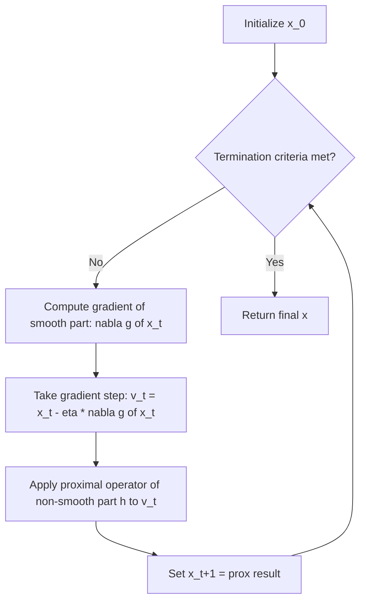

## Proximal Gradient Methods

### Overview

Proximal gradient methods are a class of first-order optimization algorithms designed for composite objective functions of the form $f(\mathbf{x}) = g(\mathbf{x}) + h(\mathbf{x})$, where $g$ is smooth (differentiable, typically with a Lipschitz-continuous gradient) but $h$ is non-smooth — such as an $L_1$ regularization penalty, an indicator function encoding a constraint set, or another non-differentiable regularizer. Standard gradient descent cannot be applied directly to $h$ at points of non-differentiability, and proximal gradient methods address this by replacing the non-smooth term's contribution with a specialized **proximal operator** step, alternating between a standard gradient step on the smooth part and a proximal step on the non-smooth part.

### Motivating Problem Class

Many important machine learning and statistics problems take exactly this composite form:

$$\min_{\mathbf{x}} \; g(\mathbf{x}) + h(\mathbf{x})$$

- **Lasso regression**: $g(\mathbf{x}) = \frac{1}{2}\|A\mathbf{x}-\mathbf{b}\|_2^2$ (smooth least-squares loss), $h(\mathbf{x}) = \lambda\|\mathbf{x}\|_1$ (non-smooth $L_1$ sparsity penalty).
- **Constrained optimization via indicator functions**: $h(\mathbf{x}) = \iota_C(\mathbf{x})$, the indicator function of a constraint set $C$ (zero if $\mathbf{x}\in C$, $+\infty$ otherwise), converting a constrained problem into an unconstrained composite one.
- **Group sparsity / structured sparsity problems**: $h(\mathbf{x})$ as a group-lasso penalty or nuclear-norm penalty (for low-rank matrix problems), each non-smooth but with a tractable proximal operator.

### The Proximal Operator

The **proximal operator** of a function $h$ with parameter $\eta > 0$ is defined as:

$$\text{prox}_{\eta h}(\mathbf{v}) = \arg\min_{\mathbf{x}} \left\{ h(\mathbf{x}) + \frac{1}{2\eta}\|\mathbf{x}-\mathbf{v}\|_2^2 \right\}$$

Intuitively, the proximal operator returns a point that balances two competing goals: staying close to $\mathbf{v}$ (the quadratic penalty term) while making $h(\mathbf{x})$ small. When $h=0$, $\text{prox}_{\eta h}(\mathbf{v}) = \mathbf{v}$ trivially; when $h$ is the indicator function of a convex set $C$, $\text{prox}_{\eta h}(\mathbf{v})$ reduces exactly to the Euclidean projection of $\mathbf{v}$ onto $C$, showing that projected gradient descent (a well-known constrained-optimization technique) is a special case of the proximal gradient framework.

### The Proximal Gradient Update Rule

Combining a standard gradient step on $g$ with a proximal step on $h$, the proximal gradient method iterates:

$$\mathbf{x}_{t+1} = \text{prox}_{\eta h}\left(\mathbf{x}_t - \eta \nabla g(\mathbf{x}_t)\right)$$

This can be understood as: first take an ordinary gradient descent step using only the smooth part's gradient, ignoring $h$ entirely (producing an intermediate point $\mathbf{x}_t - \eta\nabla g(\mathbf{x}_t)$); then "correct" this intermediate point by applying the proximal operator of $h$, which pulls it toward reducing $h$ while not straying too far from the gradient-step result.

### Proximal Gradient Algorithm Flow

### Worked Example: Proximal Gradient for Lasso (ISTA)

For Lasso regression, $g(\mathbf{x})=\frac{1}{2}\|A\mathbf{x}-\mathbf{b}\|_2^2$ with $\nabla g(\mathbf{x}) = A^\top(A\mathbf{x}-\mathbf{b})$, and $h(\mathbf{x})=\lambda\|\mathbf{x}\|_1$. The proximal operator of the $L_1$ norm has a simple closed-form solution known as the **soft-thresholding operator**:

$$\text{prox}_{\eta\lambda\|\cdot\|_1}(\mathbf{v})_j = \text{sign}(v_j)\max(|v_j|-\eta\lambda,\, 0)$$

applied element-wise. This algorithm, known as **ISTA (Iterative Shrinkage-Thresholding Algorithm)**, proceeds as follows for a toy problem with $\mathbf{x}\in\mathbb{R}^3$, $\eta=0.1$, $\lambda=0.5$:

1. Compute gradient step: suppose $\mathbf{x}_t - \eta\nabla g(\mathbf{x}_t) = (0.8, -0.03, 0.2)$.
2. Apply soft-thresholding with threshold $\eta\lambda = 0.1\times0.5=0.05$: for the first component, $\text{sign}(0.8)\max(0.8-0.05,0)=0.75$. For the second, $\text{sign}(-0.03)\max(0.03-0.05,0)=\text{sign}(-0.03)\times 0 = 0$ — this component is driven exactly to zero since its magnitude fell below the threshold. For the third, $\text{sign}(0.2)\max(0.2-0.05,0)=0.15$.
3. Result: $\mathbf{x}_{t+1}=(0.75, 0, 0.15)$ — notice the second coordinate has been set to exactly zero, illustrating how the proximal step directly induces the sparsity that motivates the $L_1$ penalty in the first place, a property that would not emerge naturally from applying ordinary (sub)gradient descent to a non-smooth penalty directly.

This soft-thresholding mechanism is the concrete reason ISTA/ proximal-gradient Lasso solvers are able to produce exactly sparse solutions (coefficients set precisely to zero) rather than merely small-magnitude coefficients, which is a key practical and interpretive advantage of $L_1$-regularized methods over, for instance, ridge ($L_2$) regression.

### Convergence Rate

Under standard assumptions ($g$ convex with $L$-Lipschitz gradient, $h$ convex, possibly non-smooth), proximal gradient descent with step size $\eta \leq 1/L$ achieves the same $O(1/T)$ convergence rate (in function-value gap) as standard gradient descent achieves on smooth convex problems — the non-smooth term $h$ does not degrade the achievable rate, provided its proximal operator can be computed exactly or with sufficient accuracy. For strongly convex $g$, linear (geometric) convergence is achieved, again matching the rate attainable for the purely smooth strongly-convex case. [Inference] These are standard rate results under specific, fairly common technical assumptions in the convex optimization literature; results can differ under weaker or different assumption sets (e.g., only weak convexity, or an inexactly computed proximal operator), and non-convex extensions (where $g$ or $h$ lack convexity) generally provide only stationary-point-type guarantees analogous to the non-convex SGD case discussed in convergence analysis of stochastic gradient methods.

### Accelerated Proximal Gradient (FISTA)

**FISTA (Fast Iterative Shrinkage-Thresholding Algorithm)**, developed by Beck and Teboulle, applies Nesterov-style momentum acceleration to the proximal gradient framework, using an extrapolated "look-ahead" point for the gradient step rather than the current iterate directly:

$$\mathbf{y}_t = \mathbf{x}_t + \frac{k_t-1}{k_{t+1}}(\mathbf{x}_t - \mathbf{x}_{t-1})$$

$$\mathbf{x}_{t+1} = \text{prox}_{\eta h}(\mathbf{y}_t - \eta\nabla g(\mathbf{y}_t))$$

with the momentum coefficient sequence $k_t$ chosen according to a specific recursive formula (originally $k_{t+1} = \frac{1+\sqrt{1+4k_t^2}}{2}$) designed to achieve an improved convergence rate. FISTA achieves an $O(1/T^2)$ convergence rate for the convex (non-strongly-convex) case, a quadratic improvement over plain proximal gradient's $O(1/T)$ rate, directly paralleling how Nesterov acceleration improves plain gradient descent's rate in the purely smooth setting.

### Proximal Gradient vs. Related Methods

| Aspect | Plain (sub)gradient descent on $g+h$ | Proximal gradient (ISTA-style) | FISTA (accelerated) |
| --- | --- | --- | --- |
| Handles non-smooth $h$ | Yes, via subgradients, but often slowly | Yes, via exact proximal step | Yes, via exact proximal step |
| Convergence rate (convex) | $O(1/\sqrt{T})$ (subgradient methods generally) | $O(1/T)$ | $O(1/T^2)$ |
| Exploits structure of $h$ | No (treats $h$ generically via subgradient) | Yes (uses closed-form or efficiently computable prox) | Yes |
| Produces exact sparsity (for $L_1$-type $h$) | Not reliably (subgradient steps rarely land exactly on zero) | Yes (soft-thresholding lands exactly at zero) | Yes |
| Per-step cost beyond $g$'s gradient | None extra | Cost of evaluating $\text{prox}_{\eta h}$ | Cost of evaluating $\text{prox}_{\eta h}$ plus momentum bookkeeping |

The key practical advantage of the proximal gradient framework over naive subgradient descent on the full non-smooth composite objective is that it exploits the specific structure of $h$ (via its proximal operator, often available in simple closed form for common regularizers) rather than treating the entire objective generically as merely non-smooth, which is what gives it the faster $O(1/T)$ or $O(1/T^2)$ rates rather than the slower $O(1/\sqrt{T})$ rate typical of generic subgradient methods.

### Common Proximal Operators (Closed-Form Examples)

| Non-smooth term $h(\mathbf{x})$ | Proximal operator $\text{prox}_{\eta h}(\mathbf{v})$ |
| --- | --- |
| $\lambda\|\mathbf{x}\|_1$ (Lasso / $L_1$) | Soft-thresholding: $\text{sign}(v_j)\max(\lvert v_j\rvert-\eta\lambda,0)$ element-wise |
| Indicator of convex set $C$ | Euclidean projection onto $C$ |
| $\frac{\lambda}{2}\|\mathbf{x}\|_2^2$ (ridge-style smooth term, technically usable here too) | $\frac{\mathbf{v}}{1+\eta\lambda}$ (shrinkage toward origin) |
| $\lambda\|\mathbf{x}\|_2$ (group lasso, single group) | Block soft-thresholding: $\max(1-\eta\lambda/\|\mathbf{v}\|_2, 0)\cdot\mathbf{v}$ |
| Nuclear norm $\lambda\|\mathbf{X}\|_*$ (matrix case, low-rank regularization) | Singular value soft-thresholding (apply scalar soft-thresholding to singular values) |

[Inference] This table lists commonly cited standard results found across the convex optimization and sparse-recovery literature; deriving or verifying the proximal operator for a novel or less standard regularizer generally requires problem-specific derivation, and not every non-smooth function admits a simple closed-form proximal operator, in which case the inner minimization defining the proximal step may itself need to be solved approximately via an auxiliary iterative method.

### Stochastic Proximal Gradient Methods

In large-scale settings, the smooth part's gradient $\nabla g(\mathbf{x}_t)$ can be replaced with a stochastic (minibatch) estimate, yielding **stochastic proximal gradient descent**:

$$\mathbf{x}_{t+1} = \text{prox}_{\eta_t h}\left(\mathbf{x}_t - \eta_t \nabla g_{i_t}(\mathbf{x}_t)\right)$$

combining the composite-objective handling of proximal methods with the per-step computational efficiency of stochastic gradient estimation. This connects proximal gradient methods directly to the broader stochastic optimization framework: the step-size conditions from Robbins-Monro stochastic approximation theory remain relevant for establishing convergence guarantees, and variance reduction techniques (SVRG, SAGA) have proximal-gradient analogues (e.g., Prox-SVRG) that combine variance-reduced gradient estimation for $g$ with an exact proximal step for $h$. [Inference] The specific convergence rate achievable by stochastic proximal gradient variants depends on which combination of stochastic gradient estimator (plain minibatch vs. variance-reduced) and step-size schedule is used, mirroring the analogous trade-offs already discussed for purely smooth stochastic optimization.

### Sparsity-Inducing Effect Illustration

<svg xmlns="http://www.w3.org/2000/svg" viewBox="0 0 700 400">
<text x="350" y="30" font-size="18" text-anchor="middle" fill="#222" font-weight="bold">Soft-Thresholding Operator (svg_diagram)</text>
<line x1="70" y1="205" x2="650" y2="205" stroke="#333" stroke-width="2" />
<line x1="360" y1="350" x2="360" y2="60" stroke="#333" stroke-width="2" />
<text x="640" y="225" font-size="14" fill="#333">v (input)</text>
<text x="330" y="75" font-size="14" fill="#333">prox output</text>
<line x1="360" y1="205" x2="230" y2="205" stroke="#1a73e8" stroke-width="3" />
<line x1="490" y1="205" x2="360" y2="205" stroke="#1a73e8" stroke-width="3" />
<line x1="490" y1="205" x2="610" y2="85" stroke="#1a73e8" stroke-width="3" />
<line x1="230" y1="205" x2="110" y2="325" stroke="#1a73e8" stroke-width="3" />
<circle cx="230" cy="205" r="4" fill="#c5221f" />
<circle cx="490" cy="205" r="4" fill="#c5221f" />
<text x="230" y="230" font-size="11" fill="#c5221f" text-anchor="middle">-threshold</text>
<text x="490" y="230" font-size="11" fill="#c5221f" text-anchor="middle">+threshold</text>
<text x="360" y="255" font-size="12" fill="#333" text-anchor="middle">flat zero region</text>
</svg>

The soft-thresholding function is flat at exactly zero for input values within the threshold band around the origin, and linear (with unit slope, offset by the threshold) outside that band — this flat zero region is precisely what allows proximal gradient methods to produce exactly sparse solutions for $L_1$-type penalties. [Inference] This is a standard depiction of the well-known soft-thresholding function shape found throughout the sparse-optimization literature; the illustration uses representative rather than data-derived coordinates.

### Practical Implementation Notes

- Proximal gradient methods (particularly FISTA) are implemented in numerous optimization libraries (e.g., scikit-learn's coordinate-descent-based Lasso solver uses a related but distinct algorithm; dedicated convex optimization libraries such as CVXPY or specialized sparse-recovery packages more directly expose proximal-gradient-style solvers). [Inference] The specific underlying algorithm used by a given library's regularized regression solver (coordinate descent, proximal gradient, or another method) varies by library and should be checked against current documentation rather than assumed.
- Step size selection (η) is commonly determined via a backtracking line search when the Lipschitz constant $L$ of $\nabla g$ is unknown or expensive to compute exactly, ensuring the theoretical step-size requirement $\eta \leq 1/L$ is satisfied adaptively.
- When the proximal operator of $h$ lacks a closed form, approximate or iterative computation of the proximal step is sometimes used, though this introduces additional inner-loop computational cost and can affect the outer algorithm's overall convergence guarantees depending on how accurately the inner proximal problem is solved. [Speculation] The practical impact of inexact proximal step computation on overall convergence speed is problem- and implementation-specific, and general guidance in the literature typically recommends solving the inner problem to a sufficiently tight (but not necessarily exact) tolerance rather than prescribing one universal precision target.

**Related Topics**

- Convex optimization fundamentals
- Momentum, Nesterov acceleration, and adaptive learning-rate methods (FISTA's connection to Nesterov acceleration)
- Variance reduction techniques (Prox-SVRG)
- Robbins-Monro stochastic approximation theory
- Sparse regression and regularization methods (Lasso, group lasso)
- Constrained optimization via projection methods
- Second-order stochastic methods