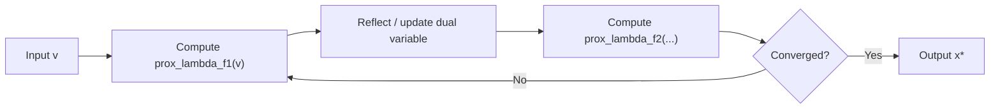

## Proximal Operator Computation and Properties

### Definition and Motivation

The proximal operator of a function $f: \mathbb{R}^n \to \mathbb{R} \cup \{+\infty\}$ with parameter $\lambda > 0$ is defined as:

$$\text{prox}_{\lambda f}(v) = \arg\min_{x} \left( f(x) + \frac{1}{2\lambda} \|x - v\|_2^2 \right)$$

This operator returns a point that balances two competing goals: minimizing $f$ while staying close to $v$. The parameter $\lambda$ controls the trade-off — larger $\lambda$ weights the minimization of $f$ more heavily, allowing $x$ to move further from $v$.

Proximal operators generalize projection. When $f$ is the indicator function of a convex set $C$:

$$f(x) = \iota_C(x) =
\begin{cases}
0 & x \in C \\
+\infty & x \notin C
\end{cases}$$

the proximal operator reduces exactly to Euclidean projection onto $C$:

$$\text{prox}_{\lambda \iota_C}(v) = \Pi_C(v) = \arg\min_{x \in C} \|x - v\|_2^2$$

This connection is why proximal methods are viewed as a generalization of projected gradient methods to nonsmooth functions beyond simple constraint sets.

### Why Proximal Operators Matter for Large-Scale Optimization

Many large-scale problems have the composite structure:

$$\min_x \; g(x) + f(x)$$

where $g$ is smooth (often large-sum or empirical-risk-type) and $f$ is nonsmooth but "simple" — meaning its proximal operator has a closed form or is cheap to compute. Algorithms like proximal gradient descent, ISTA, FISTA, ADMM, and proximal versions of stochastic and distributed methods all rely on being able to evaluate $\text{prox}_{\lambda f}$ efficiently at every iteration. In distributed settings, splitting a problem into per-node subproblems that each reduce to a proximal evaluation is a common strategy to decouple communication from local computation.

### Core Properties

**Key Points**

- **Existence and uniqueness**: If $f$ is closed, proper, and convex, $\text{prox}_{\lambda f}(v)$ exists and is unique for every $v$, because the objective $f(x) + \frac{1}{2\lambda}\|x-v\|_2^2$ is strongly convex (the quadratic term dominates) and coercive.
- **Nonexpansiveness (firm nonexpansiveness)**: For convex $f$, the proximal operator is firmly nonexpansive:

  $$\|\text{prox}_{\lambda f}(u) - \text{prox}_{\lambda f}(v)\|_2^2 \le \langle \text{prox}_{\lambda f}(u) - \text{prox}_{\lambda f}(v), \, u - v \rangle$$

  This implies ordinary nonexpansiveness, $\|\text{prox}_{\lambda f}(u) - \text{prox}_{\lambda f}(v)\| \le \|u - v\|$, which is essential for convergence guarantees in fixed-point iteration schemes.
- **Optimality (subgradient) characterization**: $x^\star = \text{prox}_{\lambda f}(v)$ if and only if

  $$\frac{v - x^\star}{\lambda} \in \partial f(x^\star)$$

  equivalently $v \in x^\star + \lambda \partial f(x^\star) = (I + \lambda \partial f)(x^\star)$, so $\text{prox}_{\lambda f} = (I + \lambda \partial f)^{-1}$, the resolvent of the subdifferential operator.
- **Moreau decomposition**: For any $v$ and $\lambda > 0$,

  $$v = \text{prox}_{\lambda f}(v) + \lambda \, \text{prox}_{f^*/\lambda}(v/\lambda)$$

  where $f^*$ is the convex conjugate of $f$. This lets a proximal operator be computed via its conjugate's proximal operator when the conjugate is easier to evaluate — a very useful identity in dual and primal-dual splitting methods.
- **Fixed points**: $x^\star$ minimizes $f$ if and only if $x^\star = \text{prox}_{\lambda f}(x^\star)$ for any $\lambda > 0$. This is the basis of proximal point algorithms and fixed-point iteration analysis.
- **Separability**: If $f(x) = \sum_i f_i(x_i)$ is separable across coordinates or blocks, then $\text{prox}_{\lambda f}(v)$ decomposes into independent per-coordinate or per-block proximal problems. This property is heavily exploited in distributed and parallel optimization, since each node/worker can compute its own block's proximal operator independently.
- **Scaling and translation rules**: For $g(x) = f(\alpha x + b)$ with $\alpha \ne 0$:

  $$\text{prox}_{\lambda g}(v) = \frac{1}{\alpha}\left( \text{prox}_{\alpha^2 \lambda f}(\alpha v + b) - b \right)$$

  Special cases (translation, scalar multiplication of the function, adding an affine term) all follow standard closed forms derivable from this general rule.

### Closed-Form Examples

**Example**

1. **$\ell_1$ norm (soft-thresholding)**: For $f(x) = \|x\|_1$,

   $$[\text{prox}_{\lambda f}(v)]_i = \text{sign}(v_i) \max(|v_i| - \lambda, 0)$$

   This is the soft-thresholding operator $S_\lambda(v)$, central to LASSO solvers, ISTA, and FISTA.
2. **Squared $\ell_2$ norm**: For $f(x) = \frac{\mu}{2}\|x\|_2^2$,

   $$\text{prox}_{\lambda f}(v) = \frac{v}{1 + \lambda \mu}$$

   a simple shrinkage toward the origin.
3. **Indicator of a box constraint** $C = \{x : l \le x \le u\}$:

   $$[\text{prox}_{\lambda \iota_C}(v)]_i = \min(\max(v_i, l_i), u_i)$$

   i.e., coordinate-wise clipping.
4. **Indicator of the nonnegative orthant** $C = \mathbb{R}^n_+$:

   $$\text{prox}_{\lambda \iota_C}(v) = \max(v, 0)$$
5. **Indicator of the $\ell_2$ ball** $C = \{x : \|x\|_2 \le r\}$:

   $$\text{prox}_{\lambda \iota_C}(v) = \begin{cases} v & \|v\|_2 \le r \\ r \, v / \|v\|_2 & \|v\|_2 > r \end{cases}$$
6. **Nuclear norm** (for matrices, $f(X) = \|X\|_*$, sum of singular values): computed via singular value soft-thresholding. If $X = U \Sigma V^T$ is the SVD, then

   $$\text{prox}_{\lambda \|\cdot\|_*}(V) = U \, S_\lambda(\Sigma) \, V^T$$

   where $S_\lambda$ applies soft-thresholding to the singular values. This is central to matrix completion and low-rank recovery problems.
7. **Group lasso / block $\ell_2$ norm**: For $f(x) = \sum_g \|x_g\|_2$ over disjoint groups $g$,

   $$[\text{prox}_{\lambda f}(v)]_g = \left(1 - \frac{\lambda}{\|v_g\|_2}\right)_+ v_g$$

   applied block-wise — a direct extension of soft-thresholding to grouped variables.
8. **Log-barrier / negative log function**: For $f(x) = -\mu \log(x)$ on $x > 0$, the proximal operator solves a scalar quadratic:

   $$\text{prox}_{\lambda f}(v) = \frac{v + \sqrt{v^2 + 4\lambda\mu}}{2}$$

   derived directly from the optimality condition $x - v - \lambda \mu / x = 0$.

### Computation When No Closed Form Exists

**Key Points**

- **Newton's method (scalar/separable case)**: When $f$ is separable and each 1-D subproblem is smooth, Newton's method on the scalar optimality equation converges quadratically and is often the practical default.
- **Dual/conjugate route**: If $f^*$ has an easier proximal operator, Moreau decomposition converts the primal proximal problem into a conjugate proximal evaluation.
- **Iterative/inner solvers**: For general convex $f$ without closed form, the proximal subproblem is itself a small convex optimization problem, solvable with a few iterations of Newton's method, bisection (for 1-D monotone equations), or a fast first-order method as an inner loop. In distributed settings, this inner solve happens locally per node without additional communication, which is why "simple" proximal operators (fast, low-iteration inner solves) matter more than closed-form availability per se.
- **Fixed-point / operator splitting decompositions**: For sums of multiple nonsmooth terms $f = f_1 + f_2$ where neither is separable but each admits an easy proximal operator, Douglas-Rachford splitting or ADMM avoid needing $\text{prox}_{\lambda(f_1+f_2)}$ directly, instead alternating between $\text{prox}_{\lambda f_1}$ and $\text{prox}_{\lambda f_2}$.

### Role in Distributed and Large-Scale Algorithms

**Key Points**

- **Proximal gradient / ISTA**: update rule $x^{k+1} = \text{prox}_{\lambda f}(x^k - \lambda \nabla g(x^k))$, combining a gradient step on the smooth part with a proximal step on the nonsmooth part.
- **ADMM**: each primal update in the alternating direction method of multipliers is exactly a proximal operator evaluation on the local objective plus a quadratic penalty term, making ADMM naturally decomposable across distributed agents, each solving their own proximal subproblem before a global consensus/dual update step.
- **Consensus optimization**: in distributed settings with $x = (x_1, \dots, x_N)$ split across $N$ nodes, separability of proximal operators (property above) allows each node to compute $\text:{prox}_{\lambda f_i}$ locally and independently, synchronizing only through shared consensus variables — minimizing communication overhead relative to gradient-only synchronization schemes.
- **Stochastic proximal methods**: proximal stochastic gradient methods replace the deterministic gradient of $g$ with a stochastic estimate while retaining an exact proximal step on $f$, preserving structure-inducing properties (e.g., exact sparsity from $\ell_1$) that stochastic subgradient methods on the combined nonsmooth objective would not guarantee.

### Illustration: Proximal Step as a Trade-off

<svg xmlns="http://www.w3.org/2000/svg" viewBox="0 0 640 400">
<text x="320" y="28" text-anchor="middle" font-size="16" font-weight="bold" fill="#222">Proximal Operator: Trade-off Geometry (svg_diagram)</text>

<line x1="60" y1="340" x2="580" y2="340" stroke="#555" stroke-width="1.5" />
<line x1="60" y1="340" x2="60" y2="60" stroke="#555" stroke-width="1.5" />
<text x="580" y="360" font-size="12" fill="#555">x</text>
<text x="45" y="60" font-size="12" fill="#555">f(x)</text>

<polyline points="100,120 300,300 500,120" fill="none" stroke="#2563eb" stroke-width="2.5" />
<text x="500" y="110" font-size="13" fill="#2563eb">f(x)</text>

<circle cx="420" cy="340" r="4" fill="#dc2626" />
<line x1="420" y1="340" x2="420" y2="150" stroke="#dc2626" stroke-width="1" stroke-dasharray="4,3" />
<text x="410" y="358" font-size="13" fill="#dc2626">v</text>

<polyline points="300,340 340,220 420,150 500,220 560,340" fill="none" stroke="#16a34a" stroke-width="2" stroke-dasharray="6,3" />
<text x="555" y="335" font-size="12" fill="#16a34a">(1/2λ)‖x−v‖²</text>

<circle cx="345" cy="215" r="5" fill="#111" />
<line x1="345" y1="340" x2="345" y2="215" stroke="#111" stroke-width="1" stroke-dasharray="2,2" />
<text x="352" y="358" font-size="13" fill="#111" font-weight="bold">prox(v)</text>

<text x="90" y="390" font-size="12" fill="#444">prox(v) balances minimizing f(x) against staying close to v.</text>

</svg>

### Fixed-Point View of Proximal Splitting

### Practical Considerations

- Computing $\text{prox}_{\lambda f}$ exactly at every iteration is not always necessary; many convergence proofs for proximal-gradient-type methods tolerate inexact proximal evaluations, provided the error is controlled (summable or diminishing across iterations). [Inference: the precise error tolerance required depends on the specific algorithm variant and its convergence proof, and can vary across implementations.]
- Choice of $\lambda$ (or per-block/per-node step sizes in distributed variants) affects both convergence speed and the conditioning of each proximal subproblem; excessively large $\lambda$ can make an otherwise well-conditioned subproblem harder to solve to high accuracy.
- When proximal operators are evaluated locally on distributed nodes with heterogeneous compute, load imbalance can arise even though each block's proximal problem is smaller than the full problem. [Inference: this is a practical systems concern, not a theoretical property of the operator itself.]

### Related Topics

- Moreau envelope and its smoothing/differentiability properties
- Proximal gradient descent, ISTA, and FISTA acceleration
- ADMM: derivation, scaled form, and convergence conditions
- Douglas-Rachford splitting and its equivalence to ADMM
- Operator splitting methods and monotone operator theory
- Dual proximal methods and Moreau decomposition in practice
- Distributed consensus ADMM and communication-efficient variants
- Proximal methods for matrix and tensor structured regularizers