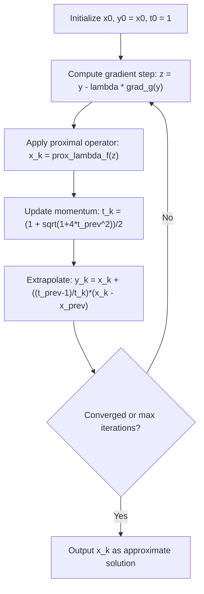

## Accelerated Proximal Gradient Methods

### Motivation and Background

Standard proximal gradient descent (ISTA-type methods) applied to composite problems

$$\min_x \; F(x) = g(x) + f(x)$$

with $g$ smooth convex ($L$-Lipschitz gradient) and $f$ nonsmooth convex, converges at rate $O(1/k)$ in objective value. Nesterov's acceleration technique, originally developed for smooth convex minimization, can be combined with proximal steps to improve this rate to $O(1/k^2)$ without increasing the per-iteration cost beyond one gradient evaluation and one proximal evaluation. This combination is the basis of accelerated proximal gradient (APG) methods, of which FISTA (Fast Iterative Shrinkage-Thresholding Algorithm) is the most widely used instance.

### Core Update Rules

**Key Points**

The general accelerated proximal gradient scheme maintains two sequences: the main iterate $x^k$ and an extrapolated (momentum) point $y^k$.

$$x^{k} = \text{prox}_{\lambda f}\left( y^{k-1} - \lambda \nabla g(y^{k-1}) \right)$$

$$t_{k} = \frac{1 + \sqrt{1 + 4t_{k-1}^2}}{2}$$

$$y^{k} = x^{k} + \left( \frac{t_{k-1} - 1}{t_{k}} \right) (x^{k} - x^{k-1})$$

with $t_0 = 1$, $y^0 = x^0$. The extrapolation step $y^k$ is a linear combination of the current and previous iterate — it is not itself guaranteed to be a descent point, which is why the algorithm is analyzed through a specially constructed Lyapunov (potential) function rather than monotonic objective decrease alone.

- $\lambda$ is a step size satisfying $\lambda \le 1/L$, where $L$ is the Lipschitz constant of $\nabla g$; a fixed step of $\lambda = 1/L$ is the standard choice when $L$ is known.
- The momentum coefficient $\theta_k = (t_{k-1}-1)/t_k$ approaches $1$ asymptotically and follows the classical Nesterov sequence, satisfying $t_k^2 - t_k \le t_{k-1}^2$, the algebraic relation used directly in the convergence proof.
- Unlike gradient descent, FISTA's objective value $F(x^k)$ is not guaranteed to decrease monotonically from iteration to iteration; a monotone variant (MFISTA) enforces $F(x^k) \le F(x^{k-1})$ explicitly by taking $x^k = \arg\min\{F(x^k_{\text{candidate}}), F(x^{k-1})\}$.

### Convergence Rate

**Key Points**

- For convex (not necessarily strongly convex) $g$, FISTA achieves

  $$F(x^k) - F(x^\star) \le \frac{2L\|x^0 - x^\star\|_2^2}{(k+1)^2}$$

  an $O(1/k^2)$ rate, which is the optimal rate achievable by any first-order method using only gradient/subgradient and proximal oracle information on this problem class (matching Nesterov's lower bound for smooth convex minimization).
- Ordinary (non-accelerated) proximal gradient descent achieves only $O(1/k)$ under the same assumptions, so acceleration provides a quadratic improvement in iteration complexity for a given target accuracy $\epsilon$: roughly $O(1/\sqrt{\epsilon})$ iterations versus $O(1/\epsilon)$.
- When $g$ is additionally $\mu$-strongly convex, restarting schemes or strongly-convex-aware momentum sequences (e.g., using $\theta_k = \sqrt{\mu/L}$ fixed ratios instead of the $t_k$ recursion) recover a linear convergence rate $O((1 - \sqrt{\mu/L})^k)$, again matching the optimal rate for this problem class.

### Restart Strategies

**Key Points**

- **Function-value restart**: Reset the momentum sequence ($t_k \leftarrow 1$, $y^k \leftarrow x^k$) whenever $F(x^k) > F(x^{k-1})$, which detects when momentum is driving the iterate away from a descent direction.
- **Gradient-mapping restart**: Reset when $\langle y^{k-1} - x^k, \, x^k - x^{k-1} \rangle > 0$, a criterion that can be checked without extra function evaluations and empirically improves practical convergence speed, particularly for problems with unknown or poorly estimated strong-convexity constants. [Inference: the degree of practical speedup from restart heuristics is problem-dependent and best confirmed empirically for a given application rather than assumed universally.]
- Restart schemes are primarily a practical acceleration heuristic; the $O(1/k^2)$ worst-case guarantee already holds without restarting, but restarting often improves observed convergence when local strong convexity or good conditioning is present near the solution.

### Backtracking Line Search Variant

When $L$ is unknown or a global Lipschitz constant is impractically loose, FISTA can use backtracking to adaptively estimate a local Lipschitz constant $L_k$:

- Starting from a lower estimate $L_k$, repeatedly increase $L_k$ (multiplying by a factor $\eta > 1$) until the sufficient decrease condition

  $$g(x^k) \le g(y^{k-1}) + \langle \nabla g(y^{k-1}), x^k - y^{k-1} \rangle + \frac{L_k}{2}\|x^k - y^{k-1}\|_2^2$$

  holds, where $x^k = \text{prox}_{f/L_k}(y^{k-1} - \nabla g(y^{k-1})/L_k)$.
- Backtracking preserves the $O(1/k^2)$ convergence guarantee (with the global $L$ replaced by the largest $L_k$ encountered) while avoiding the need to know $L$ in advance or to use an overly conservative fixed step size.

### Algorithm Summary

### Worked Example: Accelerated LASSO

**Example**

Consider $\min_x \frac{1}{2}\|Ax - b\|_2^2 + \lambda \|x\|_1$, the LASSO problem, with $g(x) = \frac{1}{2}\|Ax-b\|_2^2$ (smooth, $\nabla g(x) = A^T(Ax-b)$, Lipschitz constant $L = \|A^TA\|_2$, the largest eigenvalue of $A^TA$) and $f(x) = \lambda\|x\|_1$.

Each FISTA iteration performs:

1. Gradient step on the smooth quadratic term at the extrapolated point:

   $$z^k = y^{k-1} - \frac{1}{L} A^T(Ay^{k-1} - b)$$
2. Proximal step using the closed-form soft-thresholding operator:

   $$x^k = S_{\lambda/L}(z^k), \quad [S_\tau(z)]_i = \text{sign}(z_i)\max(|z_i| - \tau, 0)$$
3. Momentum update and extrapolation as given in the core update rules above.

Because the proximal operator here has an exact closed form (soft-thresholding), each FISTA iteration costs one matrix-vector product with $A$ and $A^T$ plus $O(n)$ work for thresholding — the same per-iteration cost as plain ISTA, but reaching a target accuracy in roughly the square root of the number of iterations.

### Comparison: ISTA vs. FISTA

| Property | ISTA | FISTA |
| --- | --- | --- |
| Update basis | Proximal gradient at $x^{k-1}$ | Proximal gradient at extrapolated $y^{k-1}$ |
| Convergence rate (convex) | $O(1/k)$ | $O(1/k^2)$ |
| Monotonic decrease | Yes | Not guaranteed (unless using monotone variant) |
| Extra memory | None beyond $x^k$ | Requires storing $x^{k-1}$ for extrapolation |
| Per-iteration cost | One gradient + one prox | One gradient + one prox (same order) |
| Strongly convex rate (with tuning) | Linear, rate depends on $L/\mu$ | Linear, improved constant via $\sqrt{L/\mu}$ |

### Extensions to Large-Scale and Distributed Settings

**Key Points**

- **Stochastic/mini-batch variants**: Replacing $\nabla g(y^{k-1})$ with a stochastic gradient estimate breaks the exact $O(1/k^2)$ guarantee in general; accelerated stochastic proximal methods instead target rates such as $O(1/k)$ or $O(1/k^2)$ only in expectation under variance-reduction schemes (e.g., combining acceleration with SVRG- or SAGA-type variance reduction). [Inference: exact achievable rates for accelerated stochastic proximal methods depend on the specific variance-reduction technique and problem assumptions used.]
- **Distributed/parallel implementations**: When $g(x) = \frac{1}{N}\sum_{i=1}^N g_i(x)$ is a sum over distributed data shards, the gradient step $\nabla g(y^{k-1})$ requires an aggregation (e.g., all-reduce) across nodes, while the proximal step on $f$ (if separable) can typically be computed locally without communication. Acceleration does not change this communication pattern — it still requires one gradient synchronization per iteration — but achieving the same accuracy in fewer iterations directly reduces the total number of synchronization rounds, which is often the binding cost in distributed settings.
- **Restart-aware distributed schemes**: Function-value restart requires evaluating and comparing $F(x^k)$ across nodes, adding a coordination step; gradient-mapping restart avoids this since it only needs locally available quantities. This makes gradient-mapping restart generally more communication-friendly in distributed acceleration. [Inference: the relative communication benefit depends on how function-value evaluation is implemented in a specific distributed system.]

### Practical Considerations

- Acceleration amplifies sensitivity to an inaccurate Lipschitz/step-size estimate: an overly large step size $\lambda > 1/L$ can cause oscillation or divergence more readily in accelerated schemes than in plain proximal gradient descent, making backtracking line search a common practical safeguard.
- Because $y^k$ is an extrapolated point rather than a true iterate, diagnostics and stopping criteria should typically be based on $x^k$ (or the gradient mapping at $x^k$), not on $F(y^k)$.
- Inexact proximal evaluations interact with acceleration differently than with plain proximal gradient descent: accumulated proximal error can compound through the momentum term, so error-tolerance conditions in accelerated inexact proximal methods are generally tighter than in their non-accelerated counterparts. [Inference: exact tolerance requirements are specific to the convergence analysis of each inexact-accelerated variant.]

### Related Topics

- Nesterov's optimal gradient method for smooth convex optimization
- Variance-reduced stochastic gradient methods (SVRG, SAGA, SARAH)
- Accelerated ADMM and primal-dual accelerated splitting
- Adaptive restart schemes and their theoretical guarantees
- Strongly convex acceleration and optimal momentum tuning
- Backtracking line search strategies for unknown Lipschitz constants
- Lower bounds for first-order convex optimization methods
- Communication-efficient distributed first-order methods