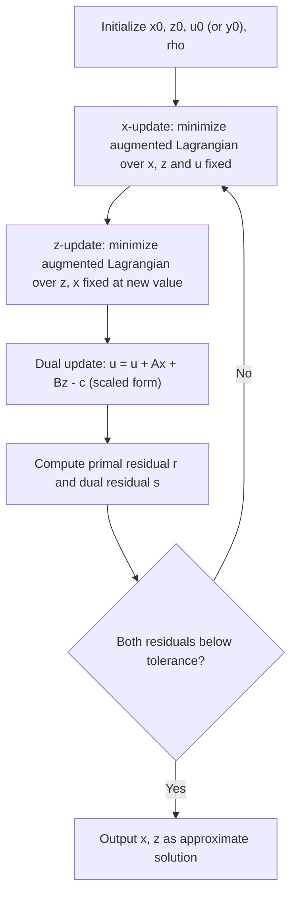

## Alternating Direction Method of Multipliers

### Motivation and Background

The Alternating Direction Method of Multipliers (ADMM) is a splitting method designed for problems with separable structure but coupled constraints. It combines the decomposability of dual ascent with the convergence robustness of the augmented Lagrangian method, making it well-suited to large-scale and distributed optimization where the objective naturally splits across blocks, agents, or data shards.

ADMM solves problems of the form:

$$\min_{x, z} \; f(x) + g(z) \quad \text{subject to} \quad Ax + Bz = c$$

where $f$ and $g$ can be nonsmooth (and even non-differentiable, as in regularized regression), $A \in \mathbb{R}^{p \times n}$, $B \in \mathbb{R}^{p \times m}$, and $c \in \mathbb{R}^p$. The key structural assumption is that $f$ and $g$ are separable in $x$ and $z$ respectively — coupling occurs only through the linear constraint.

### Augmented Lagrangian Foundation

The augmented Lagrangian for this problem is:

$$L_\rho(x, z, y) = f(x) + g(z) + y^T(Ax + Bz - c) + \frac{\rho}{2}\|Ax + Bz - c\|_2^2$$

where $y$ is the dual variable (Lagrange multiplier) and $\rho > 0$ is a penalty parameter. The quadratic penalty term improves robustness relative to plain dual ascent (allowing convergence under weaker conditions, without requiring strict convexity or finiteness of $f$ and $g$), but jointly minimizing $L_\rho$ over $(x, z)$ simultaneously would not exploit separability. ADMM's key idea is to minimize over $x$ and $z$ **alternately** rather than jointly, preserving the ability to solve each block's subproblem independently.

### Core Update Rules

**Key Points**

The standard (unscaled) ADMM iteration is:

$$x^{k+1} = \arg\min_x \; f(x) + \left(y^k\right)^T Ax + \frac{\rho}{2}\|Ax + Bz^k - c\|_2^2$$

$$z^{k+1} = \arg\min_z \; g(z) + \left(y^k\right)^T Bz + \frac{\rho}{2}\|Ax^{k+1} + Bz - c\|_2^2$$

$$y^{k+1} = y^k + \rho\left(Ax^{k+1} + Bz^{k+1} - c\right)$$

- The $x$-update and $z$-update are each a minimization of the augmented Lagrangian with the other block's variable held fixed at its most recent value — a Gauss-Seidel-style alternation, not a simultaneous (Jacobi-style) update.
- The dual update is a simple gradient ascent step on the dual function, with step size exactly equal to the penalty parameter $\rho$ — this specific step-size choice is what makes the convergence proof go through without a separate step-size tuning parameter for the dual update.
- Each of the $x$- and $z$-updates is itself a proximal-operator-type computation: for example, when $A = I$ and $B = -I$, $c = 0$ (the consensus/sharing form), the $x$-update reduces to evaluating $\text{prox}_{f/\rho}$ at a shifted point.

### Scaled Form

Introducing the scaled dual variable $u = y/\rho$ simplifies the notation and is the form most commonly used in implementations:

$$x^{k+1} = \arg\min_x \; f(x) + \frac{\rho}{2}\|Ax + Bz^k - c + u^k\|_2^2$$

$$z^{k+1} = \arg\min_z \; g(z) + \frac{\rho}{2}\|Ax^{k+1} + Bz - c + u^k\|_2^2$$

$$u^{k+1} = u^k + Ax^{k+1} + Bz^{k+1} - c$$

The scaled form removes the linear dual term in favor of a shifted quadratic penalty, which typically simplifies derivation of closed-form updates when $f$ or $g$ has a known proximal operator.

### Convergence Properties

**Key Points**

- Under mild conditions — $f$ and $g$ closed, proper, convex, and the unaugmented Lagrangian having a saddle point — ADMM converges: the objective value approaches the optimal value, the residual $Ax^k + Bz^k - c \to 0$, and the dual variable converges to a dual optimal solution.
- The standard convergence guarantee is $O(1/k)$ in an ergodic (running-average) sense for the objective suboptimality and feasibility residual; pointwise (non-ergodic) rates and stronger rates under additional assumptions (e.g., strong convexity of $f$ or $g$, or particular structure on $A$, $B$) have been established in more specialized analyses. [Inference: whether a specific problem instance achieves a faster-than-ergodic rate depends on structural assumptions not guaranteed to hold in general.]
- Global convergence does not require $f$ or $g$ to be differentiable, smooth, or finite-valued everywhere (indicator functions of constraint sets are permitted), which is what makes ADMM broadly applicable to constrained and nonsmooth composite problems.
- ADMM does not, in general, guarantee monotonic decrease of the objective or monotonic decrease of the residual at every single iteration; convergence statements are about the overall sequence behavior.

### Convergence Diagnostics: Primal and Dual Residuals

Two residuals are used jointly to monitor convergence and set stopping criteria:

$$r^{k} = Ax^{k} + Bz^{k} - c \quad \text{(primal residual)}$$

$$s^{k} = \rho A^T B (z^{k} - z^{k-1}) \quad \text{(dual residual)}$$

A standard stopping criterion terminates when both residual norms fall below tolerances that combine absolute and relative components, e.g., $\|r^k\|_2 \le \epsilon^{\text{abs}} + \epsilon^{\text{rel}} \max(\|Ax^k\|_2, \|Bz^k\|_2, \|c\|_2)$ and an analogous condition on $\|s^k\|_2$.

### Penalty Parameter Selection and Adaptive Schemes

**Key Points**

- ADMM converges for any fixed $\rho > 0$ under the stated convexity assumptions, but the practical convergence speed is sensitive to the choice of $\rho$: too small slows primal feasibility progress, too large slows dual progress and can cause the $x$- and $z$-subproblems to become numerically stiff.
- **Residual balancing** is a common adaptive heuristic: increase $\rho$ when the primal residual is much larger than the dual residual, decrease $\rho$ in the opposite case, typically by a fixed multiplicative factor, e.g.

  $$\rho^{k+1} =
  \begin{cases}
  \tau \rho^k & \text{if } \|r^k\|_2 > \mu \|s^k\|_2 \\
  \rho^k / \tau & \text{if } \|s^k\|_2 > \mu \|r^k\|_2 \\
  \rho^k & \text{otherwise}
  \end{cases}$$
- Varying $\rho$ across iterations is a heuristic that works well in practice for many problems, but formal convergence guarantees for adaptive-$\rho$ ADMM generally require the adaptation to stop (or the changes to become summable/vanishing) after finitely many iterations, since unrestricted continual adaptation is not covered by the standard fixed-$\rho$ convergence proof. [Inference: specific theoretical requirements vary by adaptive scheme and are addressed in the corresponding convergence analyses rather than universally.]

### Algorithm Summary

### Worked Example: Lasso via ADMM

**Example**

Consider $\min_x \frac{1}{2}\|Ax - b\|_2^2 + \lambda \|x\|_1$. Introduce a splitting variable $z = x$, giving the ADMM-compatible form $f(x) = \frac{1}{2}\|Ax-b\|_2^2$, $g(z) = \lambda\|z\|_1$, constraint $x - z = 0$ (so the constraint matrices are $A_{\text{ADMM}} = I$, $B_{\text{ADMM}} = -I$, $c = 0$).

The scaled-form updates become:

1. **$x$-update** (a ridge-regularized least squares problem with closed-form solution):

   $$x^{k+1} = (A^TA + \rho I)^{-1}\left(A^Tb + \rho(z^k - u^k)\right)$$
2. **$z$-update** (a proximal operator on the $\ell_1$ norm, i.e., soft-thresholding):

   $$z^{k+1} = S_{\lambda/\rho}(x^{k+1} + u^k)$$
3. **Dual update**:

   $$u^{k+1} = u^k + x^{k+1} - z^{k+1}$$

The $(A^TA + \rho I)$ matrix factorization (e.g., Cholesky) can be computed once and reused across iterations since $\rho$ is fixed, making each subsequent $x$-update cheap — a common pattern when ADMM is applied to problems with a fixed quadratic term.

### Distributed and Consensus Forms

**Key Points**

- **Global consensus ADMM**: For $\min_x \sum_{i=1}^N f_i(x)$ split across $N$ agents each holding $f_i$, introduce local copies $x_i$ and a global variable $z$, with constraint $x_i = z$ for all $i$. The resulting updates decompose into $N$ independent local $x_i$-updates (parallelizable across agents/nodes) followed by a $z$-update that is a simple averaging step:

  $$z^{k+1} = \frac{1}{N}\sum_{i=1}^N \left(x_i^{k+1} + u_i^k\right)$$

  This structure requires only one round of communication (gathering local $x_i + u_i$ values to compute the average, then broadcasting $z$ back) per iteration, making it a standard building block for distributed and federated-style optimization.
- **Sharing form**: A closely related variant handles problems where agents share a common resource or coupling constraint (e.g., $\sum_i A_i x_i = c$), useful in resource-allocation and network-flow-type distributed problems.
- **Communication cost**: Since each local $x_i$-update is solved independently given the current $z$ and $u_i$, the per-iteration communication cost in consensus ADMM does not grow with the complexity of each $f_i$, only with the dimension of the shared variable $z$ — this is a key reason ADMM is favored over methods requiring full gradient synchronization in some distributed settings. [Inference: relative communication efficiency compared to alternative distributed methods depends on the specific problem's dimension, network topology, and synchronization pattern.]

### Comparison: ADMM vs. Proximal Gradient Methods

| Property | Proximal Gradient / FISTA | ADMM |
| --- | --- | --- |
| Problem structure | $g(x) + f(x)$, $g$ smooth | $f(x) + g(z)$, coupled via linear constraint |
| Requires smoothness of one term | Yes ($g$ must have Lipschitz gradient) | No — both $f$, $g$ can be nonsmooth |
| Per-iteration cost | One gradient + one prox | Two subproblem solves + dual update |
| Convergence rate (convex) | $O(1/k^2)$ with acceleration | $O(1/k)$ ergodic (standard case) |
| Natural fit for constraint coupling | Limited (constraints folded into $f$) | Direct (constraints are the splitting mechanism) |
| Distributed decomposition | Via separability of $f$ | Via separability of $f$, $g$, and consensus constraints |

### Practical Considerations

- The subproblems in each ADMM update must themselves be tractable (closed-form or cheaply solvable); if the $x$- or $z$-update has no efficient solver, ADMM's practical advantage over other splitting methods diminishes. [Inference: relative practicality compared to alternative splitting schemes is problem-specific.]
- ADMM convergence can appear slow for high-accuracy solutions despite fast early progress toward moderate accuracy — a commonly observed behavioral pattern often attributed to its $O(1/k)$ ergodic guarantee, though actual behavior may vary by problem structure and parameter choices.
- Choice of splitting (i.e., how a problem is decomposed into $f$ and $g$ and what constraint links them) is not unique for a given problem, and different splittings can lead to substantially different subproblem tractability and convergence behavior in practice.

### Related Topics

- Douglas-Rachford splitting and its equivalence to ADMM
- Dual ascent and the augmented Lagrangian method
- Multi-block ADMM and convergence subtleties beyond two blocks
- Accelerated and over-relaxed ADMM variants
- Distributed consensus optimization and federated learning connections
- Proximal operator computation for common regularizers
- Stochastic and online ADMM variants
- Penalty parameter adaptation and preconditioned ADMM