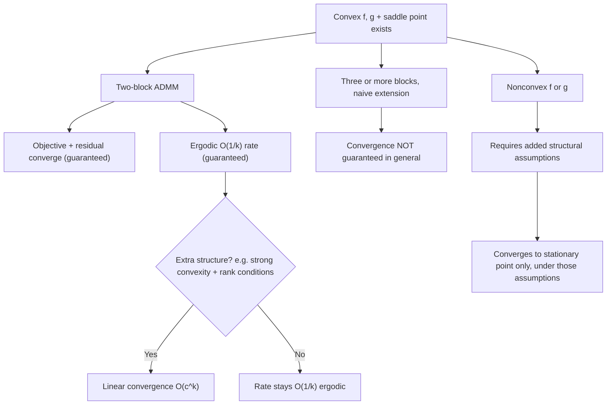

## ADMM Convergence Theory

### Scope and Framing

This topic develops the formal convergence theory underlying ADMM in more depth than a general overview would — the assumptions required, the proof mechanics (variational inequality and monotone operator formulations), the precise rate statements, and the boundary cases where standard guarantees break down. It builds directly on the update rules and augmented Lagrangian formulation introduced previously.

### Standing Assumptions

**Key Points**

Classical ADMM convergence theory for

$$\min_{x,z} \; f(x) + g(z) \quad \text{s.t.} \quad Ax + Bz = c$$

rests on two assumptions:

1. **Closedness, properness, and convexity**: $f: \mathbb{R}^n \to \mathbb{R} \cup \{+\infty\}$ and $g: \mathbb{R}^m \to \mathbb{R} \cup \{+\infty\}$ are closed, proper, and convex. This permits nonsmooth functions and indicator functions of convex sets, but excludes nonconvex objectives from the classical guarantees.
2. **Existence of a saddle point**: The unaugmented Lagrangian $L_0(x,z,y) = f(x) + g(z) + y^T(Ax+Bz-c)$ has at least one saddle point $(x^\star, z^\star, y^\star)$ — equivalently, strong duality holds and a dual optimal solution exists. This is typically ensured by a constraint qualification (e.g., relative interior conditions analogous to Slater's condition) rather than assumed directly in practice.

No assumption of strict convexity, differentiability, or finiteness of $f$ or $g$ is required for the basic convergence result — this is a notable strength of ADMM relative to methods requiring gradient Lipschitz continuity.

### What the Classical Theorem Guarantees

Under the standing assumptions, for any fixed penalty parameter $\rho > 0$, the ADMM iterates satisfy three convergence properties simultaneously:

$$Ax^k + Bz^k - c \to 0 \quad \text{(residual/feasibility convergence)}$$

$$f(x^k) + g(z^k) \to f(x^\star) + g(z^\star) \quad \text{(objective convergence)}$$

$$y^k \to y^\star \quad \text{(dual variable convergence, for some dual optimal } y^\star\text{)}$$

- Primal iterate convergence $x^k \to x^\star$, $z^k \to z^\star$ is **not** guaranteed in general under these minimal assumptions — only the objective value and the residual are guaranteed to converge; individual primal iterates can fail to converge to a specific point if the optimal solution set is not unique, though the objective at those iterates still converges to the optimal value. [Inference: whether primal iterate convergence itself holds depends on additional regularity conditions such as uniqueness of the minimizer, not guaranteed by the base theorem.]
- Dual variable convergence to a specific $y^\star$ does hold under the standing assumptions, a stronger statement than what is typically available for primal iterates.

### Proof Sketch via Monotone Operator Theory

**Key Points**

- ADMM can be derived as an instance of the **Douglas-Rachford splitting** algorithm applied to the sum of two maximal monotone operators — specifically, the subdifferentials $\partial f$ and $\partial g$ composed with the constraint structure — after a change of variables. This equivalence is the standard route to a rigorous convergence proof, since Douglas-Rachford splitting's convergence for maximal monotone operators is established independently via fixed-point iteration of an averaged nonexpansive operator.
- The core proof mechanism relies on showing that a specific combination of primal and dual variables forms a **Fejér-monotone sequence** with respect to the solution set — meaning the distance from the iterate sequence to the (nonempty, closed, convex) solution set is nonincreasing at every iteration. Fejér monotonicity plus a residual-vanishing argument is what yields convergence without requiring monotonic objective decrease.
- An alternative and commonly cited proof route treats the primal-dual pair as a **variational inequality (VI)** problem, showing that the ADMM update is a special case of a proximal point algorithm applied to the VI's monotone operator, inheriting its $O(1/k)$ ergodic convergence rate directly from proximal point algorithm theory.

### Rate of Convergence

**Key Points**

- **Ergodic $O(1/k)$ rate**: Define the running averages $\bar{x}^k = \frac{1}{k}\sum_{j=1}^k x^j$ and $\bar{z}^k = \frac{1}{k}\sum_{j=1}^k z^j$ (and similarly for the dual variable). Under the standing assumptions, both the objective suboptimality and the constraint violation at these averaged iterates satisfy

  $$f(\bar{x}^k) + g(\bar{z}^k) - \left(f(x^\star)+g(z^\star)\right) = O(1/k), \qquad \|A\bar{x}^k + B\bar{z}^k - c\|_2 = O(1/k)$$

  This is the standard, assumption-light rate result and holds without requiring strong convexity of $f$ or $g$.
- **Non-ergodic (pointwise) rates**: Establishing an $O(1/k)$ rate for the actual iterates $(x^k, z^k)$ rather than their averages requires additional structure; pointwise rate results in the literature typically rely on extra conditions on $A$, $B$, or strong convexity of at least one of $f$, $g$. [Inference: whether a pointwise (non-ergodic) rate holds for a specific problem depends on which additional structural assumptions the corresponding analysis imposes, and these vary across the literature rather than being a single universal result.]
- **Linear (geometric) convergence**: Under stronger conditions — commonly, strong convexity and Lipschitz-gradient smoothness of at least one of $f$ or $g$, together with full row/column rank conditions on $A$ or $B$ — ADMM converges linearly, i.e., at rate $O(c^k)$ for some $c \in (0,1)$ depending on the strong convexity and smoothness constants and on $\rho$. The precise conditions vary across published analyses. [Inference: the exact constant $c$ and the minimal sufficient conditions for linear convergence differ across specific theoretical treatments and are not a single agreed-upon universal statement.]

### Boundary Cases and Known Limitations

**Key Points**

- **Multi-block ADMM (three or more variables)**: Directly extending the two-block update-alternate-alternate pattern to three or more blocks — i.e., cyclically minimizing over $x_1, x_2, x_3, \ldots$ in the augmented Lagrangian for $\min \sum_i f_i(x_i)$ s.t. $\sum_i A_i x_i = c$ — is **not guaranteed to converge** in general, even under convexity of all $f_i$. This is a well-established negative result, not merely a slower rate: explicit convergent instances exist alongside explicit divergent counterexamples in the multi-block setting. Convergence is restored by modifications such as adding correction steps, using a Jacobi-style (parallel) update with under-relaxation, or regrouping variables back into two effective blocks.
- **Nonconvex $f$ or $g$**: The classical theory above assumes convexity; ADMM is nonetheless used empirically on nonconvex problems (e.g., certain matrix factorization and neural network training formulations). Convergence in the nonconvex setting has been established only under additional structural assumptions (e.g., a bounded, Lipschitz-differentiable coupling term, or Kurdyka-Łojasiewicz-type regularity), and typically guarantees convergence to a stationary point rather than a global optimum. [Inference: applicability of any specific nonconvex ADMM convergence result depends on which structural assumptions the target problem actually satisfies.]
- **Unbounded or empty solution sets**: If no saddle point exists (e.g., due to a duality gap or unbounded primal/dual problem), the standard convergence guarantees do not apply, and ADMM iterates may fail to converge or may diverge.

### Effect of the Penalty Parameter on Rate Constants

**Key Points**

- For the linear-convergence regime, the geometric rate constant is generally a function of $\rho$ that is minimized at some problem-dependent optimal value $\rho^\star$ — both very small and very large $\rho$ tend to worsen the rate constant, though the precise dependence differs by analysis. [Inference: closed-form expressions for $\rho^\star$ are available only under specific simplifying assumptions (e.g., quadratic $f$ and $g$) and do not generalize to arbitrary convex problems.]
- This is the theoretical underpinning for adaptive penalty parameter schemes (e.g., residual balancing): since the fixed-$\rho$ rate constant depends on $\rho$, adapting $\rho$ during the run is a heuristic attempt to track a better-conditioned regime, though as noted in the update-rule discussion, unrestricted continual adaptation falls outside the standard fixed-$\rho$ convergence proof.

### Convergence Landscape Overview

### Comparison: Convergence Guarantee Strength by Setting

| Setting | Feasibility/Objective Convergence | Rate | Primal Iterate Convergence |
| --- | --- | --- | --- |
| Two-block, convex, saddle point exists | Guaranteed | $O(1/k)$ ergodic | Not guaranteed in general |
| Two-block, convex + strong convexity/rank conditions | Guaranteed | Linear $O(c^k)$ | Guaranteed under those conditions |
| Multi-block (≥3), naive cyclic extension | Not guaranteed | N/A | Not guaranteed |
| Multi-block, corrected/regularized variants | Guaranteed (under variant-specific conditions) | Varies by variant | Varies by variant |
| Nonconvex, no extra structure | Not guaranteed | N/A | Not guaranteed |
| Nonconvex + KL-type regularity | Stationary-point convergence only | Problem-dependent | Problem-dependent |

### Practical Implications of the Theory

- The absence of a guaranteed pointwise (non-ergodic) rate under minimal assumptions is consistent with the commonly observed practical behavior of ADMM reaching moderate accuracy quickly but slowing markedly when high precision is required — behavior noted qualitatively in the general ADMM discussion and given a more precise theoretical basis here. [Inference: the specific numerical relationship between the ergodic-rate guarantee and observed iteration counts to reach a target tolerance is empirical and problem-dependent.]
- Because naive multi-block ADMM lacks a convergence guarantee, applying ADMM to problems with three or more naturally separable components requires deliberately selecting a variant known to be convergent (e.g., a corrected/proximal multi-block variant), rather than assuming the two-block proof extends automatically.
- Reported linear-convergence results typically require verifying problem-specific conditions (e.g., strong convexity constants, rank of $A$/$B$) before assuming a geometric rate applies to a given deployment. [Inference: whether a specific real-world problem instance satisfies the conditions needed for the linear-rate results is something to check per problem rather than assume by default.]

### Related Topics

- Douglas-Rachford splitting and monotone operator theory foundations
- Multi-block ADMM variants and convergence-restoring modifications
- Variational inequality formulations of primal-dual optimization
- Proximal point algorithm theory and its relation to ADMM
- Nonconvex ADMM and Kurdyka-Łojasiewicz-based analysis
- Penalty parameter selection and its effect on convergence constants
- Accelerated and linearized ADMM variants
- Duality theory, saddle points, and constraint qualifications